# Manual Configuración Restaurantes en Bringg 2021

## **1. Configuracion de usuario** 

### **Crear usuario.**

### - **En Users – Settings**

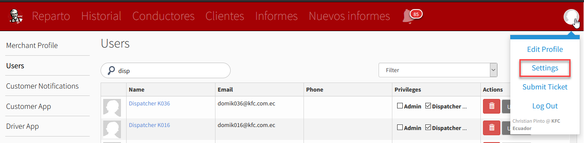

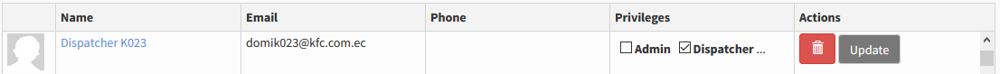

### - **Add New User**

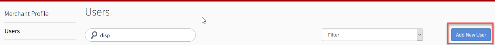

### - **Validar conductor por correo**

o Formato credenciales:

Usuario: domie005@kfc.com.ec 

.
Contraseña: e005d 

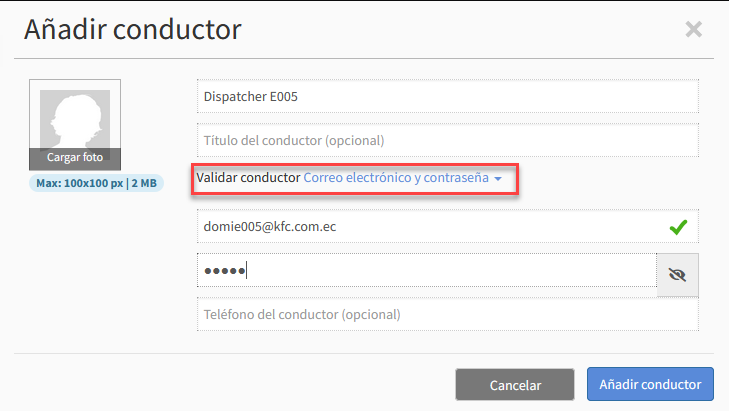

### - **Actualizar: perfil repartidor o dispatcher**

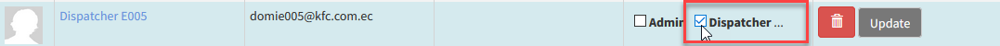

## **2. Configuración el equipo.**

### **Crear equipo.**

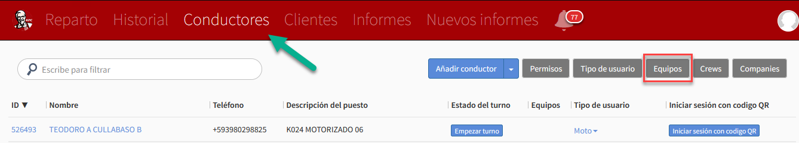

### **- Añadir Equipo**

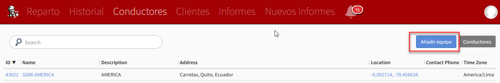

### **- Solicitar Latitud y Longitud**

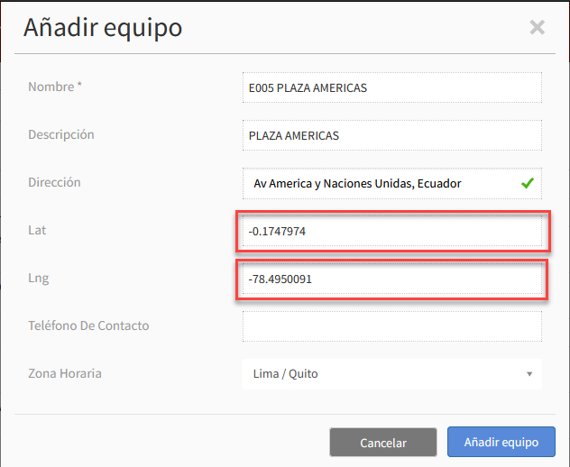

 - Luego de añadir el equipo actualizamos la página y buscamos el equipo creado e ingresamos:

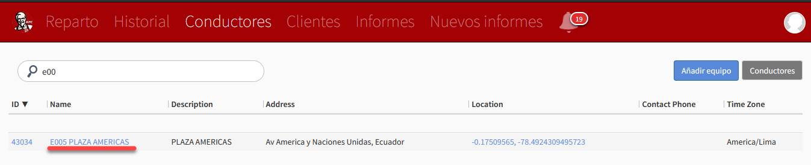

- Actualizar campo **ID externa** por el código de la tienda; en este caso **ID externa** = E005 

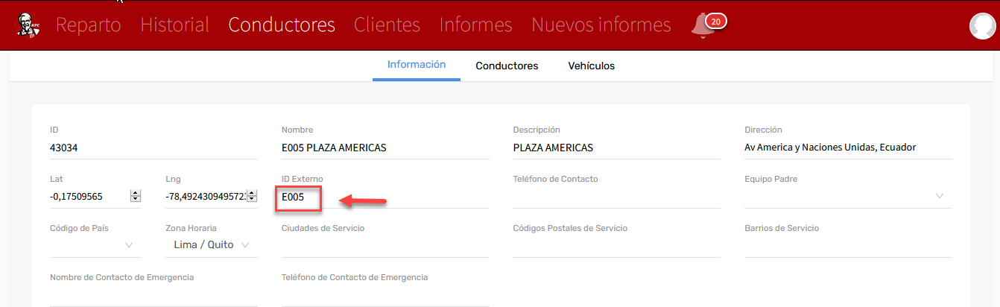

## **3. Configuración Usuario - Equipo**

### **Ir al usuario.**
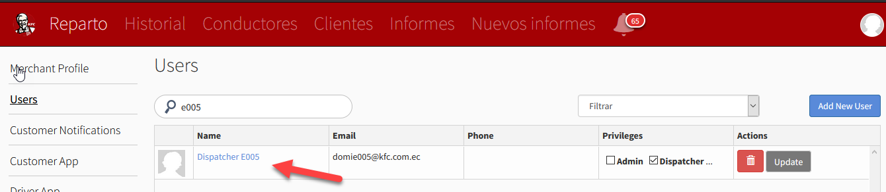

### **- Editar conductor**

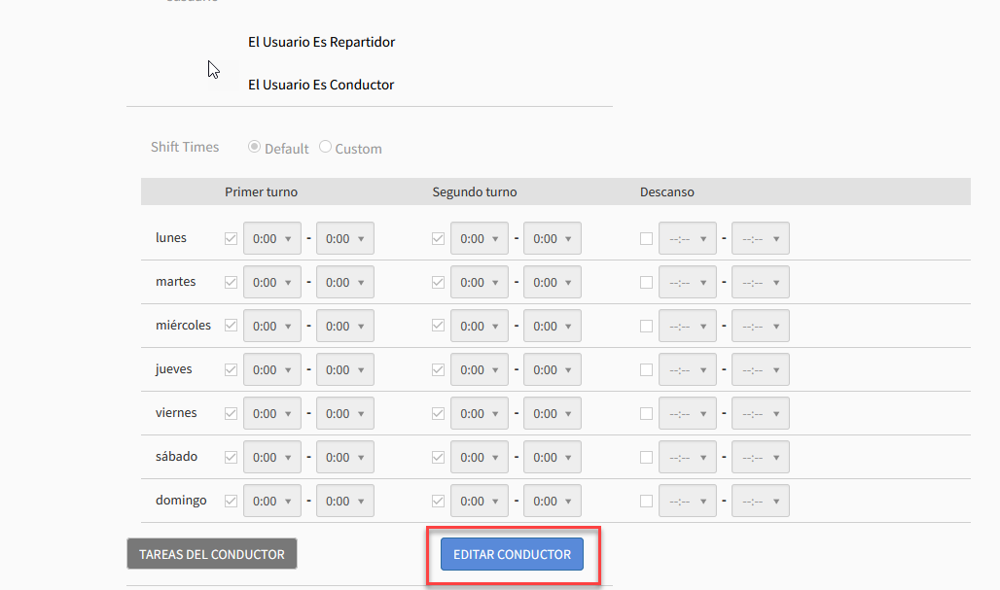

- Seleccionar en **Equipos del conductor** y atar al equipo que se creo

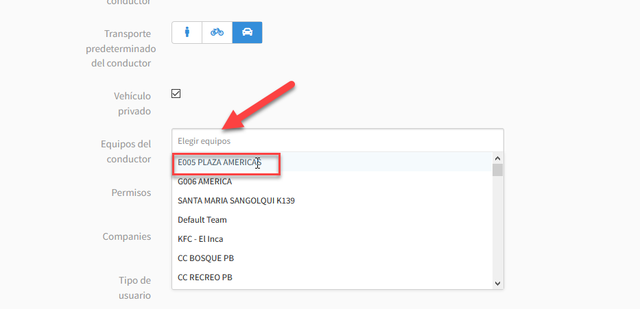

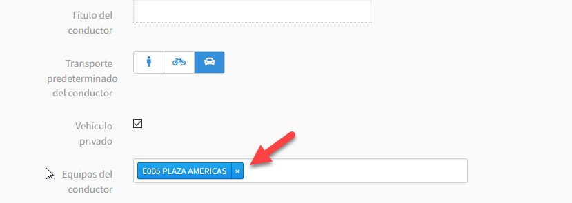

### **- Guardar**

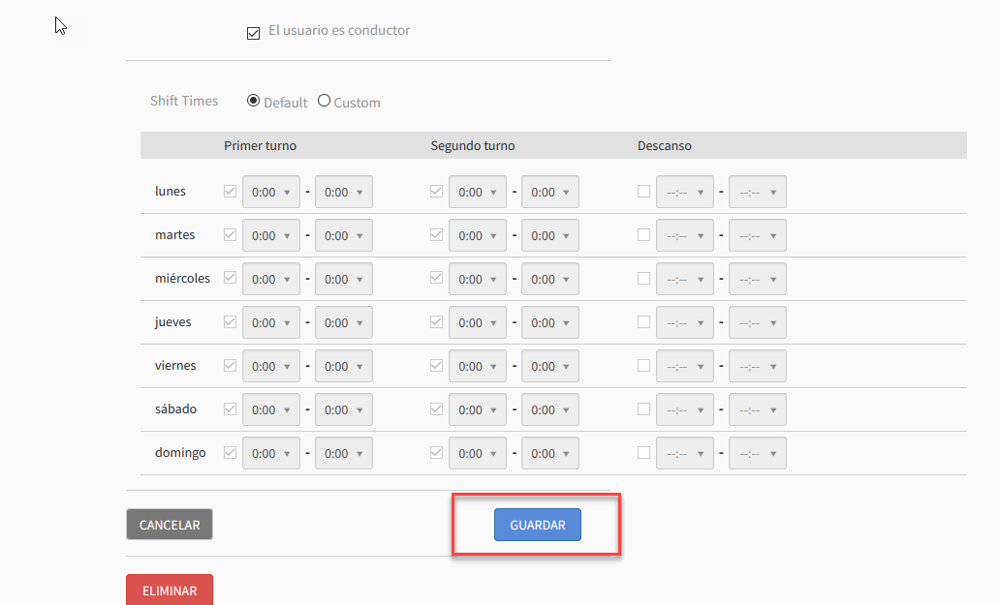

#### **COMENTARIO:**

Antes de proceder a crear el restaurante en Bringg verificar que no exista ya el local, porque si se crea 
nuevamente el local se perdería las configuraciones ya existentes como los motorizados y usuarios.