# Manual de Configuración politicas PEDIDOSYA

## 1 DESCRIPCIÓN 

Este manual se ha desarrollado para detallar el proceso de configuración respecto a las políticas 
de configuración necesarias para que funcione correctamente la función de creación de orden y 
asignación de motorizado de manera automatizada en Maxpoint.

## 2 PROCEDIMIENTO
Para ingresar a las configuraciones de políticas iniciamos sesión en el BackOffice de MAXPOINT

## 3 Configuración de políticas por cadena WS CONFIGURACIONES

**Nota:** Esta política ya existe (configuración web), en caso de que no exista se debe crear de la 
siguiente manera:

Nos dirigimos al módulo de SEGURIDADES y luego damos clic en la opción de POLÍTICAS.

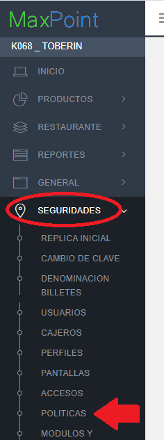

Damos clic en “Ir a Administración Políticas”.
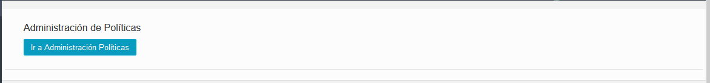

Nos ubicamos en las políticas por “**Cadena**”, y damos clic en botón “**Nueva Colección**”.
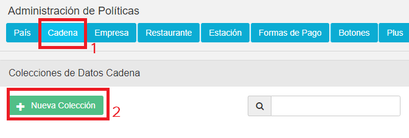

En descripción colocamos “WS CONFIGURACIONES”,o verificamos si ya existe.  
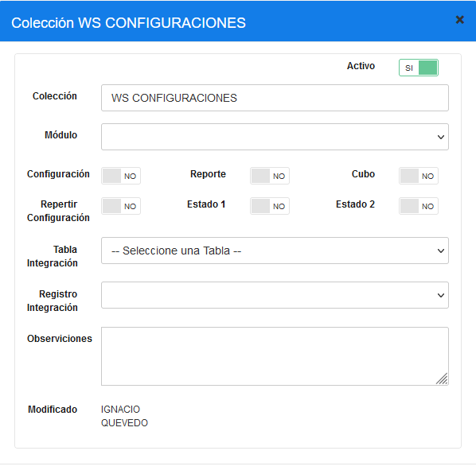 

La política creada se muestra de la siguiente manera, o en caso de EXISTIR solo verificarla que 
conste en el listado.

Otra de las políticas a ser creadas o validar si ya existen es la siguiente:
En descripción colocamos “**WS RUTA SERVICIO**”, o verificamos si ya existe

La política creada se muestra de la siguiente manera

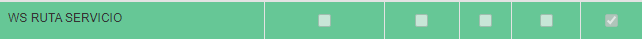

### 3.1.1 Parámetros de la política WS CONFIGURACIONES

Se deberá añadir este nuevo parámetro dentro de la política creada/verificada anteriormentes.
| **Nombre del parámatro**  | **Esp.Valor** | **Obligatario** | **Tipo de dato** | Valor por configurar                                                                                  |
|---------------------------|---------------|-----------------|------------------|-------------------------------------------------------------------------------------------------------|
| PEDIDOSYA - PRUEBA        | SI            | SI              | Selección        | NO                                                                                                    |
| PEDIDOSYA - TOKEN         | SI            | SI              | Caracter         | Debe contentener el token generado en la página de pedidos ya, este tiene el **formato detallado**.   |

EJEMPLO DE TOKEN: 5108-012109-22b887e9-b7f0-44c5-4309-23fe018a6d1e

NOTA: EL TOKEN SE DEBE GENERAR EN LA PLATAFORMA DE PEDIDOSYA. 
### 3.1.2 Explicación parámetros de la política WS CONFIGURACIONES

| **Nombre del parámetro**  | **Campo**  | **Descripción**                                                                                                                      |
|---------------------------|------------|--------------------------------------------------------------------------------------------------------------------------------------|
| PEDIDOSYA - PRUEBA        | Selección  | Indica si la política de pruebas esta activa o No.                                                                                   |
| PEDIDOSYA - TOKEN PRUEBA  | Caracter   | Politicás que proporciona las credenciles para el acceso  al servicio  de Pedidos Ya, se deben generar en el portal de  Pedidos Ya.  |

La política con el nuevo parámetro “PEDIDOSYA - PRUEBA” bien configurada deberá quedar de 
la siguiente manera:
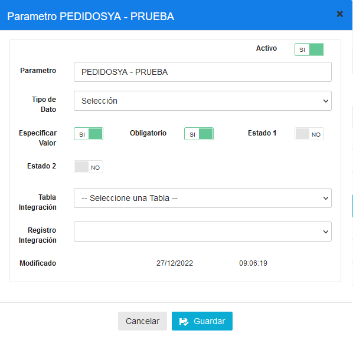

La política con el nuevo parámetro “PEDIDOSYA - TOKEN CODE” bien configurada deberá 
quedar de la siguiente manera:
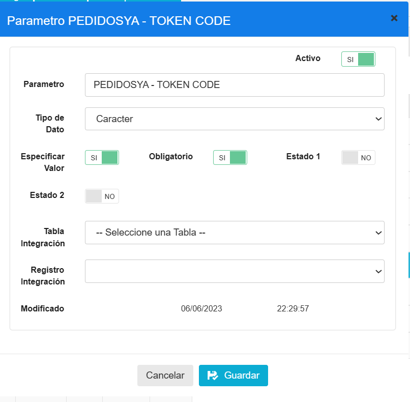

### 3.1.3 Parámetros de la política WS RUTA SERVICIO 

Se deberá añadir este nuevo parámetro dentro de la política creada/verificada anteriormente

| **Nombre del parámetro**      | **Esp.Valor**  | **Tipo de dato**  | **Valor por configurar**                       |
|-------------------------------|----------------|-------------------|------------------------------------------------|
| PEDIDIOSYA V3 CREAR           | SI             | Carácter          | /v3/shippings                                  |
| PEDIDOSYA CREAR CALLBACK      | SI             | Carácter          | /v3/webhooks-configuration                     |
| **PEDIDOSYA API CREAR ORDEN** | SI             | Carácter          | /api/cambio_estados/ApiControllerIntegrationv3 |

VERIFICAR SI YA EXISTE:  PEDIDOSYA API CREAR ORDEN.

### 3.1.4 Explicación parámetros de la política WS RUTA SERVICIO

| **Nombre del parámetro**      | **Campo**  | **Descripción**                                                                        |
|-------------------------------|------------|----------------------------------------------------------------------------------------|
| PEDIDIOSYA CREAR ORDEN        | Carácter   | Ruta que permite crear la orden en pedidosya.                                          |
| PEDIDOSYA CREAR CALLBACK      | Carácter   | Ruta que permite crear la ruta de respuesta  de cambios de estado de forma automática. |
| **PEDIDOSYA API CREAR ORDEN** | Carácter   | Ruta del api webhook agregadores que permite  crear la orden.                          |

VALIDAR SI YA EXISTE:  PEDIDOSYA API CREAR ORDEN.

### 3.1.5 Parámetros de la política WS SERVIDOR

Se deberá añadir o VALIDAR SI YA EXISTE: este parámetro dentro de la política creada/verificada 
anteriormente.

| **Nombre del parámetro**  | **Esp.Valor**  | **Tipo de dato** | **Valor por configurar **         |
|---------------------------|----------------|------------------|-----------------------------------|
| PEDIDIOSYA PRODUCCION     | SI             | Carácter         | https://courier-api.pedidosya.com |
| PEDIDOSYA PRUEBAS         | SI             | Carácter         | https://courier-api.pedidosya.com |
| PEDIDOSYA API PRODUCCION  | SI             | Carácter         | 20.94.29.93                       |
| PEDIDOSYA API PRUEBAS     | SI             | Carácter         | 20.94.29.93                       |

### 3.1.6 Explicación parámetros de la política WS SERVIDOR

| **Nombre del parámetro**  | **Dato** | **Descripción**                                                   |
|---------------------------|----------|-------------------------------------------------------------------|
| PEDIDIOSYA PRODUCCION     | Carácter | Host de conexión a pedidosya para manejar pedidos produccion      |
| PEDIDOSYA PRUEBAS         | Carácter | Host de conexión a pedidosya para manejar pedidios de prueba      |
| PEDIDOSYA API PRODUCCION  | Carácter | Host de api webhook agregadores para manejar pedidos producion    |
| PEDIDOSYA API PRUEBAS     | Carácter | Host de api webhook agregadores para manejat pedidos para prueba  |

## 4 Configuración de política lista medio

**Nota:** Esta política ya existe, a nivel de restaurante por lo que vamos a ir a modificar la política 
a nivel de restaurante, esto lo hacemos en el MEDIO que se requiera contar con el proveedor 
PEDIDOSYA. 

 PARA ESTE PILOTO, CONFIGURAR EL MEDIO WEB 

Nos dirigimos al módulo de **RESTAURANTE** y luego damos clic en la opción de RESTAURANTE.

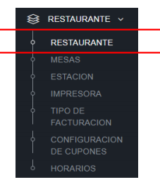

Entramos a las configuraciones del restaurante que se desea configurar y aquí dentro buscamos 
la política llamada “LISTA MEDIO”, vamos a encontrar varios medios, ubicamos el medio que se 
desea modificar, para este caso tendremos de ejemplo: “LISTA MEDIO WEB” y “LISTA MEDIO 
CALL CENTER”, y de la lista que aparece modificamos el que se denomina “CAMBIO ESTADOS 
AUTOMÁTICO”.

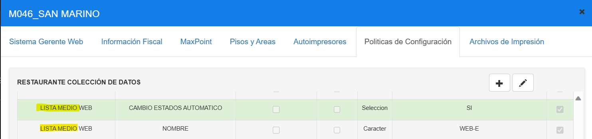

Una vez que le damos clic al botón editar, nos aparece un solo proveedor, este lo modificamos 
y le asignamos el proveedor “PEDIDOSYA” en **mayúscula**, quedando de la siguiente forma:

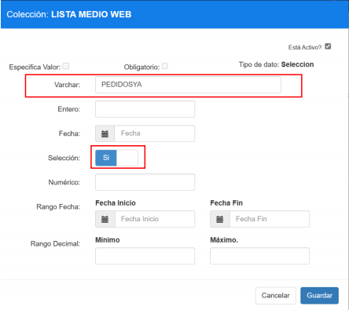

 HASTA AQUÍ ES LO QUE HAY QUE CONFIGURAR PARA ESTE PILOTO. 

**EN CASO QUE SENECESITE CONFIGURAR MAS DE 1 PROVEEDOR.**

Así mismo se puede configurar más de un proveedor, esto permite tener dos o más proveedores, 
en el caso de ser necesario debe ponerse los proveedores separados por “,”, quedando de la 
siguiente forma “PEDIDOSYA, BRINGG”, como en el ejemplo a continuación, para este piloto no se usan varios proveedores:

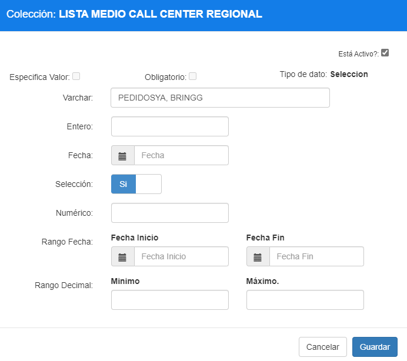

**NOTA IMPORTANTE:** LA POLÍTICA ES DE TIPO SELECCIÓN, PERO TAMBIEN SE CONSIDERA SU 
VALOR DE VARCHAR, POR LO CUAL DEBE QUEDAR CONFIGURADO EN “SI”, Y EN VARCHAR EL 
VALOR DEL PROVEDOR O LOS PROVEEDORES SEPARADOS POR COMA “,”. 