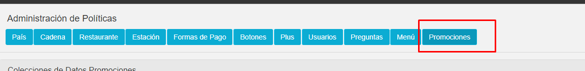
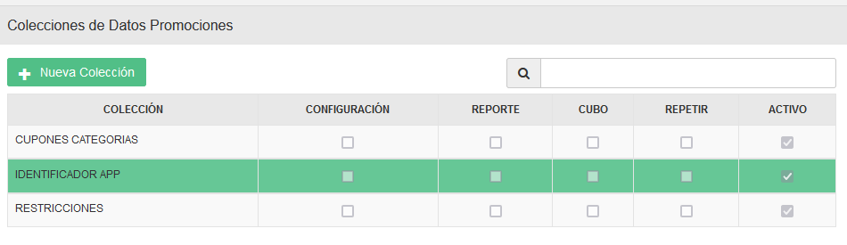
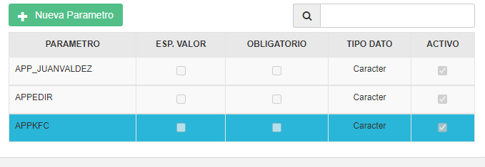

#  Manual - Politicas Identificador Cupones

### Creación de parametros a politica para Identificadores app

### - Paso 1

En el apartado de políticas a nivel de Promociones seleccionamos la política IDENTIFICADOR APP

Plus:

Política: IDENTIFICADOR APP

### - Paso 2 

En esta política añadimos los siguientes parámetros de tipo carácter, con esto ya podemos hacer uso de los identificadores.

Parámetros:

- APP_JUANVALDEZ
- APPEDIR
- APPKFC

Tipo de dato:

-Carácter 

