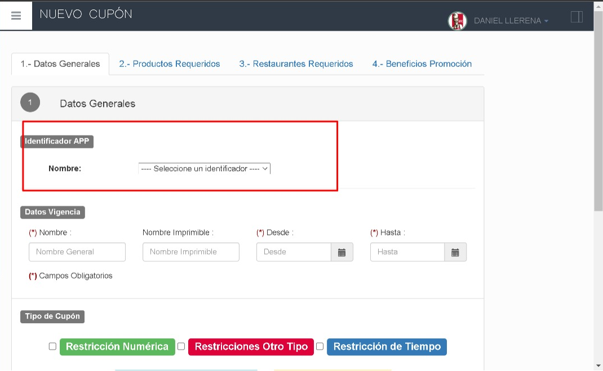
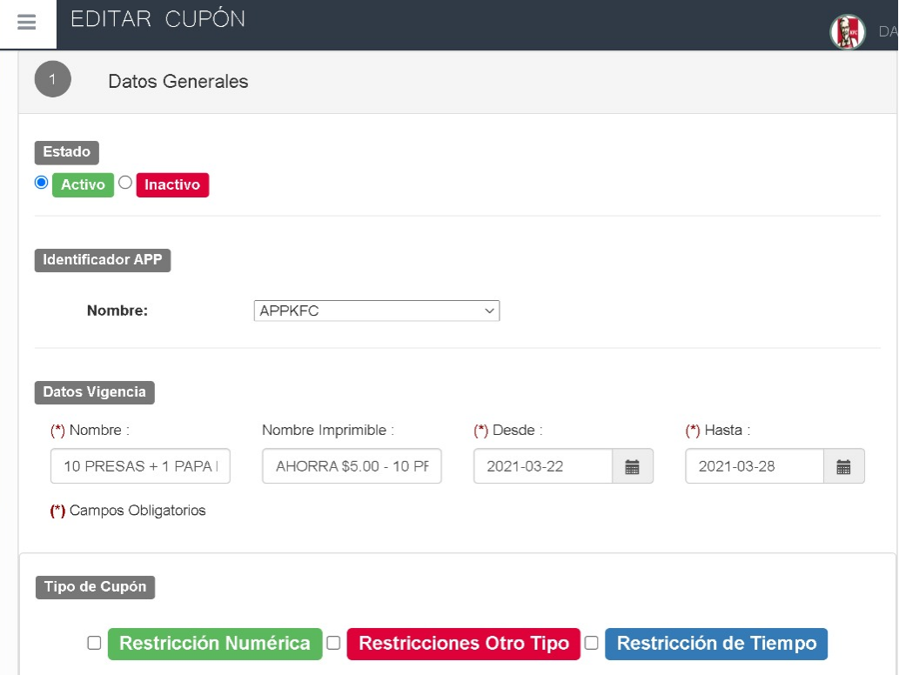
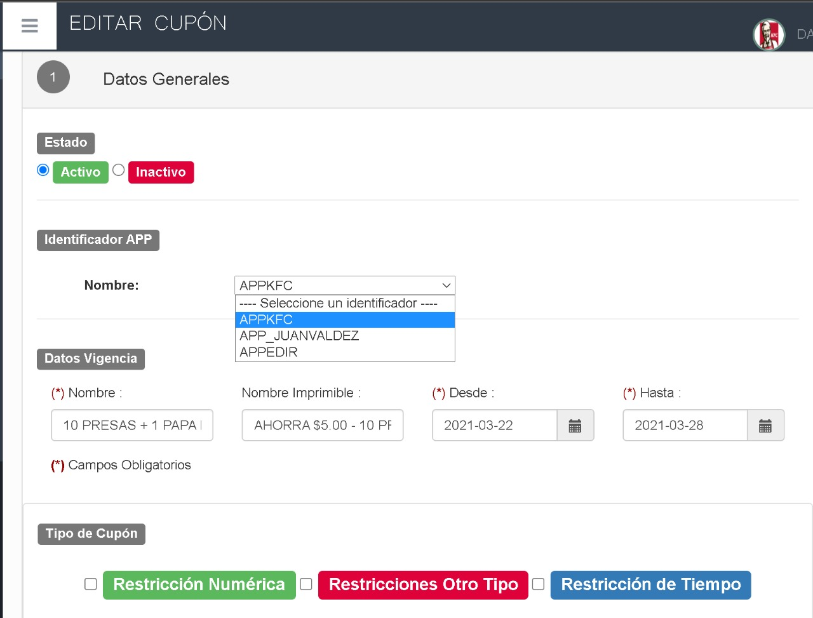

# Manual - Identificador Cupones QR

### AGREGAR CAMPO IDENTIFICADOR Y CONTROL DE ESTADO

## 1 ANTECEDENTES

Actualmente se requiere agregar el campo Identificador en la pantalla de Promociones y controlarlas por su estado ya sea Activo o Inactivo.

## 2 OBJETIVOS

- Permitir que se seleccione el tipo de identificador que va a tener cada promoción.
- Permitir controlar las Promociones por su estado Activo o Inactivo.

## 3 Datos Generales

En este manual se detalla cómo se selecciona el nuevo campo de identificador en las promocione y se indicará el funcionamiento del campo Activo e Inactivo.

## 4 Inició de Sesión

Ingresar al sistema de administración MaxPoint con sus respectivas credenciales, seleccionar en el menú de la izquierda el apartado de Promociones y dentro seleccionar Crear Promoción.

## 5 Promociones – Crear Promoción

Al seleccionar en Crear Promoción nos aparecerá la pantalla para llenar los datos necesarios, esta vez incluido el apartado de Identificador como se muestra en la siguiente imagen.

### 5.1 Pantalla – Categoría

Para el uso de este nuevo campo se debe tener en cuenta lo siguiente:

- Al seleccionar la opción Crear Nueva Promoción se mostrará la pantalla con el nuevo campo de identificador incluido lo único que se debe hacer es desplegar la lista de identificadores disponibles y seleccionar el indicado.

- Para MODIFICAR una Promoción lo que se debe hacer es seleccionar el apartado de Promociones y seleccionar en VER PROMOCIONES y dentro de la lista de promociones que se mostraran hacer doble clic sobre la que se desee modificar, en ese momento se mostrará la pantalla con los datos de la promoción precargados y en este paso ya tendremos disponible la opción de editar el campo ya sea activo o inactivo y de igual forma se podrá modificar cualquiera de los demás campos que contiene una Promoción.

6 Ejemplo.

**Opción: Nuevo**

Dentro de la opción Nuevo, el único paso adicional que se debe hacer es el de seleccionar el Identificador según sea el caso de la promoción; y luego continuar con el proceso habitual de crear una promoción.

**Opción: Modificar**

Luego de seleccionar la Promoción que se desea modificar se nos cargará la apantalla de la Promoción con los datos que esta contiene; en este punto ya tenemos disponible la opción de cambiar el estado de la Promoción de ser necesario a Activo o Inactivo, y dentro del apartado de Identificador App se nos mostrará en que seleccionamos para la Promoción y de ser necesario también podemos cambiarlo si necesitamos cambiar el Identificador App de la Promoción solo debemos desplegar la lista de Identificadores disponibles y seleccionar el que necesitemos.

