# Manual Notas de Crédito

NOTAS DE CRÉDITO

## 1 ANTECEDENTES

Actualmente en el sistema MaxPoint punto de venta; se puede realizar notas de crédito a 
facturas aplicadas como consumidor final, por lo tanto, la anulación se la realiza con el 
mismo cliente, es decir, consumidor final. En Ecuador con la nueva disposición del SRI ya 
no se puede realizar notas de crédito como consumidor final.

## 2 OBJETIVO GENERAL

Generar notas de crédito con o sin datos de cliente, dependiendo de la configuración del 
país.

### 2.1 Objetivos específicos

- Crear una política a nivel de país que valide si aplica o no la regla de generar notas 
de crédito como consumidor final.

- Crear una política de información del SRI y que sea visible en la pantalla de clientes
(solo en cambio de datos y notas de crédito).

- Solicitar datos de cliente antes de crear una nota de crédito.

- Crear la nota de crédito con los datos del cliente que solicita la anulación.

- No se deben crear notas de crédito como consumidor final.

## 3 POLÍTICAS DE CONFIGURACIÓN

### 3.1 Datos Generales

En este manual se detalla cómo realizar la configuración de políticas a nivel de país y
cadena que permitirán generar las notas de crédito.

### 3.2 Pantalla de Políticas

Ingresar al sistema MP backoffice con credenciales de administrador sistemas y seleccionar 
la cadena a la cual se realizará las configuraciones.

En el menú que se encuentra en la parte izquierda no dirigimos a la opción 
**SEGURIDADES** y seleccionamos **POLÍTICAS**, seguidamente presionamos sobre el 
botón **Ir a Administración Políticas** en el cual abrirá una nueva pestaña en el navegador.

### 3.3 País

### 3.3.1 Colección País

Antes de crear las políticas de configuración; como primer paso se debe verificar que no se encuentren creadas, de ser el caso validar que cada colección contenga los parámetros 
establecidos en este manual.

En la opción **País** presionar sobre el botón **Nueva Colección**, se abrirá una modal para su 
creación ingresando los siguientes datos:

Tabla 1. Datos Colección País

| **N°** |            **Colección**           |                                             **Descripción**                                            |
|--------|:----------------------------------:|:------------------------------------------------------------------------------------------------------:|
| 1      | NOTAS DE CREDITO SIN CONSUMO FINAL | Colección que permite establecer si el pais aplica generar notas de credito con o sin consumido final. |

 **Nota:** NO puede contener espacios en blanco al inicio y final del nombre de la colección; debe ser escrita tal y como se especifica en la tabla 1. 

**Colección:** Nombre de la colección que se especifica en la tabla 1.

**Módulo:** No aplica.

**Observaciones:** Una descripción de la función que realizara dicha colección.

Una vez que se haya ingresado y seleccionado la información establecida procedemos a

**Guardar.**

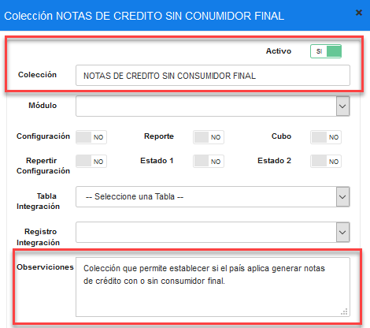

### 3.3.2 Parámetro de Colección País

Antes de agregar los parámetros de configuración, como primer paso se debe verificar que 
no se encuentren creados, de ser el caso validar que cada parámetro contenga los valores 
establecidos en este manual.

Una vez creada la colección se debe proceder a crear los parámetros de configuración y 
para ello seleccionamos la colección y presionamos sobre el botón **Nuevo Parámetro** en la cual se abrirá una modal para su creación e ingresamos los siguientes datos:

Tabla 2. Datos Parámetros de Colección País

| **N°** |             **Colección**             | **Parámetro** | Esp. Valor | Obligatorio | Tipo Dato |
|--------|:-------------------------------------:|:-------------:|------------|-------------|-----------|
| 1      | NOTAS DE CREDITO SIN CONSUMIDOR FINAL | ¿APLICA?      |     SI     |      SI     | Selección |

 **Nota:** NO puede contener espacios en blanco al inicio y final del parámetro; deben ser escritos tal y como se especifica en la tabla 2. 

Parámetro: Nombre del parámetro que se especifica en la tabla 2.

Tipo de Dato: Se especifica en la tabla 2.

Especifica Valor: Se especifica en la tabla 2.

Obligatorio: Se especifica en la tabla 2.

Una vez que se haya ingresado y seleccionado la información establecida procedemos a 

**Guardar.**

Se deben crear todos los parámetros de configuración establecidos en la tabla 2 y se debe 
tener lo siguiente:

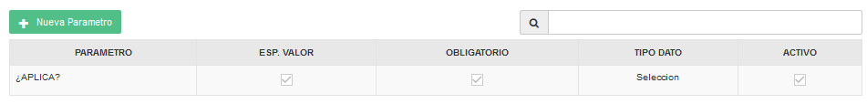

### 3.4 Cadena

### 3.4.1 Colección Cadena

Antes de crear las políticas de configuración debemos verificar que no se encuentren 
creadas, de ser el caso validar que cada colección contenga los parámetros establecidos en 
este manual.

En la opción **Cadena** presionar sobre el botón **Nueva Colección**, se abrirá una modal para 
su creación ingresando los siguientes datos:

Tabla 3. Datos Colección Cadena

| **N°** |  **Colección**  |                                                                 **Descripción**                                                                 |
|--------|:---------------:|:-----------------------------------------------------------------------------------------------------------------------------------------------:|
| 1      | INFORMACION SRI | Colección que permite establecer la información que sera visible en MXP  sobre la nueva regla emitida por el SRI para generar notas de credito. |

 **Nota:**  NO puede contener espacios en blanco al inicio y final del nombre de la colección; debe ser escrita tal y como se especifica en la tabla 3.

**Colección:** Nombre de la colección que se especifica en la tabla 3.

**Módulo:** No aplica.

**Observaciones:** Una descripción de la función que realizara dicha colección.

Una vez que se haya ingresado y seleccionado la información establecida procedemos a 

**Guardar.**

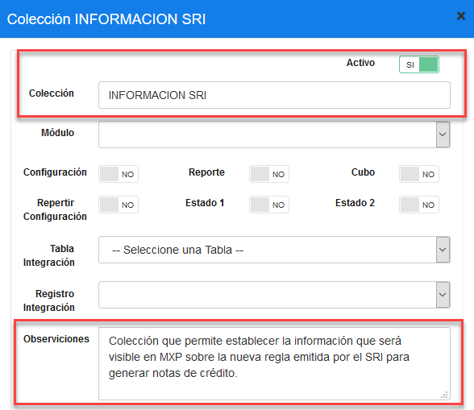

### 3.4.2 Parámetro de Colección 

Antes de agregar los parámetros de configuración, como primer paso se debe verificar que 
no se encuentren creados, de ser el caso validar que cada parámetro contenga los valores 
establecidos en este manual.

Una vez creada la colección se debe proceder a crear los parámetros de configuración y 
para ello seleccionamos la colección y presionamos sobre el botón **Nuevo Parámetro** en la cual se abrirá una modal para su creación e ingresamos los siguientes datos:

Tabla 4. Datos Parámetros de Colección Cadena

|No.|Colección|Parámetro|Esp. Valor|Obligatorio|Tipo Dato|
|:----|:----|:----|:----|:----|:----|
|1|INFORMACION SRI|¿VER INFORMACION?|SI|SI|Selección|
|2|INFORMACION SRI|TITULO|SI|SI|Carácter|
|3|INFORMACION SRI|ARTICULO|SI|SI|Carácter|
|4|INFORMACION SRI|NOTA|SI|SI|Carácter|
|5|INFORMACION SRI|INFO 1|SI|SI|Carácter|
|6|INFORMACION SRI|INFO 2|SI|SI|Carácter|

 **Nota:**  Nota: NO puede contener espacios en blanco al inicio y final del parámetro; deben ser escritos tal y como se especifica en la tabla 4.
Sí, a futuro se integra una nueva información, está debe ser creada en secuencia. Ejemplo: 
INFO 3, INFO 4, etc.

**Parámetro:** Nombre del parámetro que se especifica en la tabla 4.

**Tipo de Dato:** Se especifica en la tabla 4.

**Especifica Valor:** Se especifica en la tabla 4.

**Obligatorio:** Se especifica en la tabla 4.

Una vez que se haya ingresado y seleccionado la información establecida procedemos a

**Guardar.**

Se deben crear todos los parámetros de configuración establecidos en la tabla 4 y se debe 
tener lo siguiente:

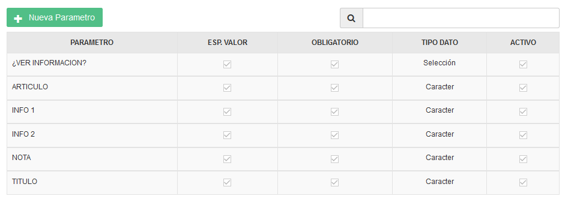

### 3.5 País Colección de Datos
En el menú nos dirigimos a PAÍS y seleccionamos la opción PAÍS, en la parte izquierda se 
cargará una pantalla con el nombre del país.

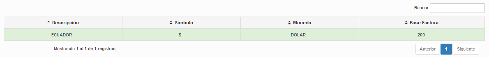

Realizamos un doble click sobre el país a configurar, y se visualizara una ventana en donde seleccionaremos **Políticas.**

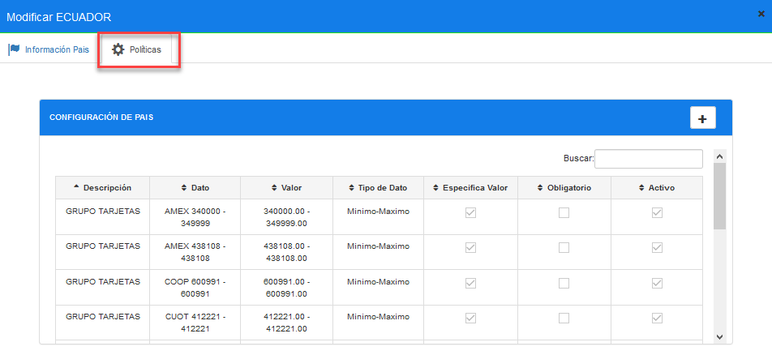

Para la configuración se debe presionar sobre el botón agregar “+”; el cual abrirá una 
modal, seguidamente buscaremos la colección creada y agregamos el valor con el
parametro solicitado.

En la tabla 5, se especifica los valores que deben ser configurados en cada parámetro.

Tabla 5. Valores de los parámetros de colección país
|Colección: NOTAS DE CREDITO SIN CONSUMIDOR FINAL|
|:----|

|N°|Parámetro|Tipo Dato|Valor a ingresar|
|:----|:----|:----|:----|
|1|¿APLICAR?|Selección|SI o NO (dependiendo del pais)|

Al realizar la configuración de todos los parámetros se debe tener lo siguiente:
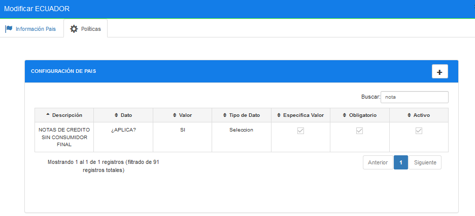

3.6 Cadena Colección de Datos

En el menú nos dirigimos a **CADENA** y seleccionamos la opción **CADENA**, en la parte 
izquierda se cargará una pantalla y seguidamente seleccionamos la pestaña **Políticas de 
configuración.**

Para realizar la configuración se debe presionar sobre la pestaña Políticas de Configuración.

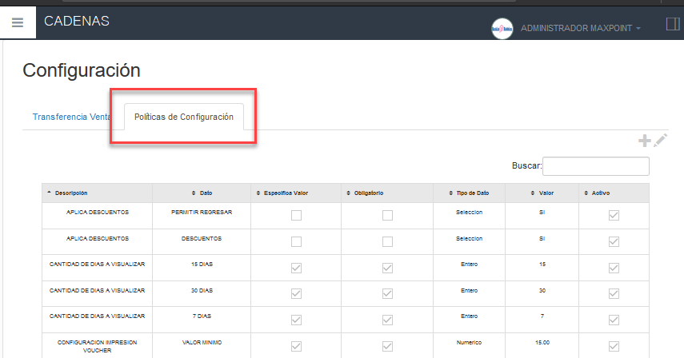

Para la configuración se debe presionar sobre el botón agregar “+”; el cual abrirá una 
modal, seguidamente buscaremos la colección creada y agregamos el valor en los 
parametros solicitados.

En la tabla 6, se especifica los valores que deben ser configurados en cada parámetro.

Tabla 6. Valores de los parámetros de colección Información SRI

# INFORMACION SRI

| No. | Parámetro | Tipo de dato | Valor a ingresar |
|---|---|---|---|
| 1 | ¿Ver información? | Selección | SI (Configuración para validar que sea visible o no la información) |
| 2 | Título | Caracter | REGLAMENTO DE COMPROBANTES DE VENTA, RETENCIÓN Y COMPLEMENTARIOS |
| 3 | Artículo | Caracter | Art. 25.- Requisitos de llenado para notas de crédito y notas de débito. |
| 4 | Nota | Caracter | Las notas de crédito y de débito contendrán la siguiente información no pre impresa: |
| 5 | Info 1 | Caracter | 1. Apellidos y nombres, denominación o razón social del adquirente. |
| 6 | Info 2 | Caracter | 2. Número del registro único de contribuyentes o cédula de identidad o pasaporte del adquirente. |

Al realizar la configuración de todos los parámetros se debe tener lo siguiente:

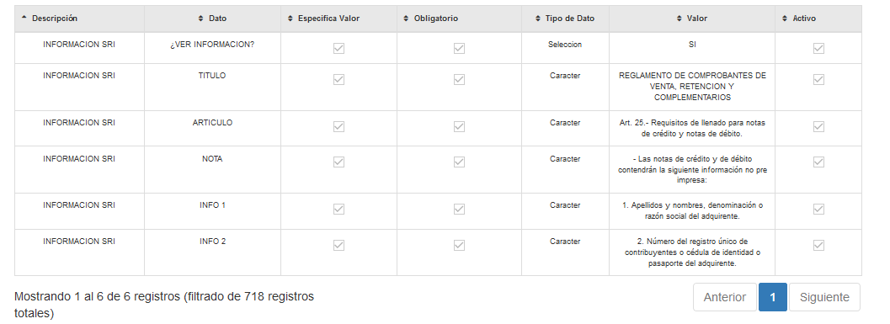

Nota: La información del SRI que será visible en MXP, es enviada por el departamento de 
Contabilidad, y ellos serán quienes notifiquen algun cambio en la información.

## 4 REPLICAR

Como siguiente paso se debe realizar las respectiva replica de todas las configuraciones 
hacia la tienda.

## 5 PUNTO DE VENTA FACTURACIÓN

Una vez aplicadas las configuraciones en la tienda, procedemos a realizar la verificación.

1. Realizamos pedidos como ejemplo y pasamos a la pantalla de facturación.
2. Cerramos las facturas como consumidor final.

## 6 FUNCIONES GERENTE – TRANSACCIONES

1. Ingresar a MXP como administrador.
2. Seleccionar la opción Transacciones.

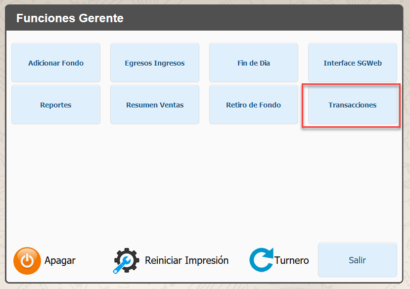

3. Si no existen cuantas abiertas aparecerá el mensaje “No existen cuantas abiertas”, 
caso contrario se cargarán las transacciones en estado pendiente. 

4. En el botón menú de la parte inferior derecha seleccionar la opción “Cuentas 
Cerradas” y se cargaran todas las transacciones realizadas en esa estación.

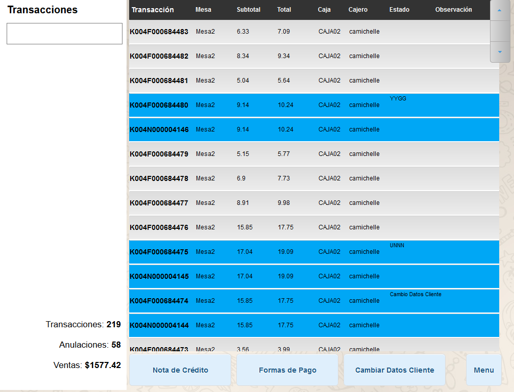

### 6.1 Cambio de Datos Cliente

1. Seleccionar una factura y presionar el botón “Cambiar Datos Cliente”.

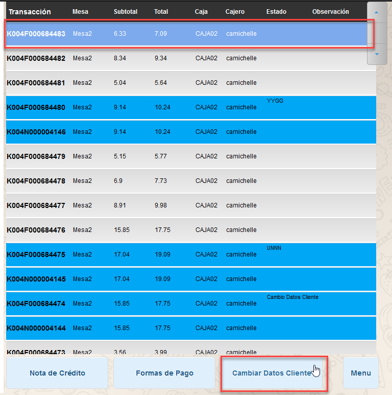

2. Al presionar cambiar datos clientes, el sistema solicitara credenciales de 
administrador y las ingresamos.

3. Después de ingresar las credenciales; se visualizará una modal con los datos del 
cliente que fue cerrada la factura, en este caso es consumidor final, y a su vez se 
visualiza la información del SRI configurada por política.

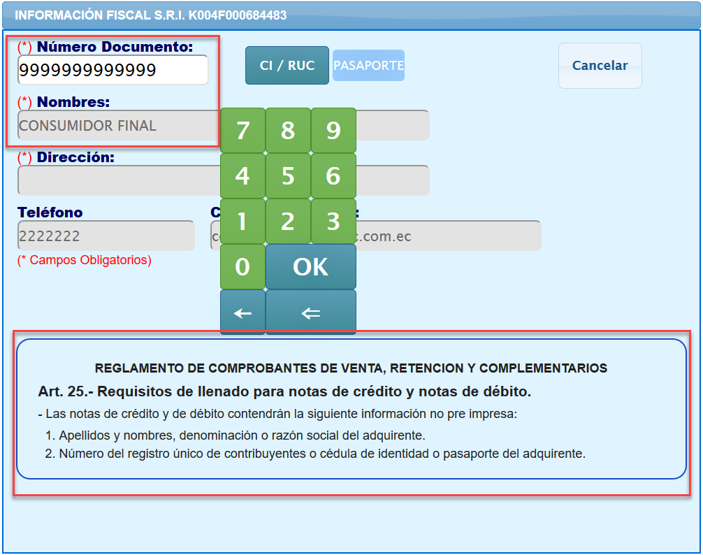

4. Con el teclado virtual ingresar el documento de identificación del cliente y presionar 
OK, sí el cliente es extranjero seleccionar el botón pasaporte y se debe ingresar 
credenciales de administrador.

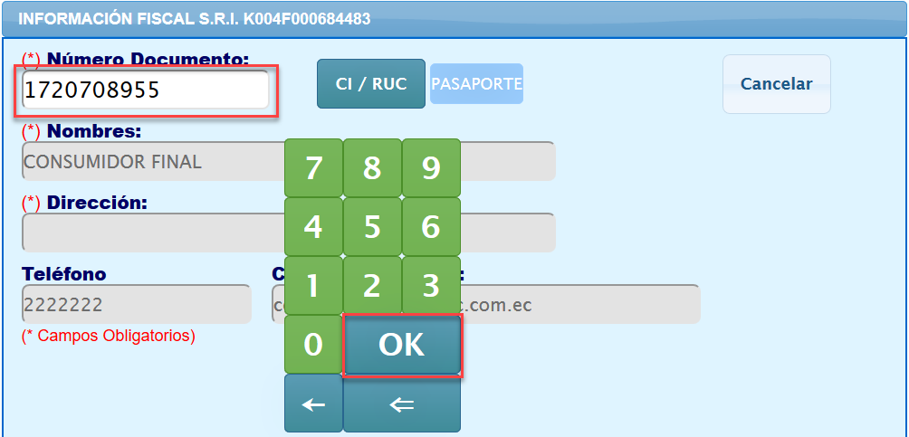

5. Al presionar Ok, sí el cliente ya se encuentra registrado se cargarán sus datos caso 
contrario se los debe ingresar.

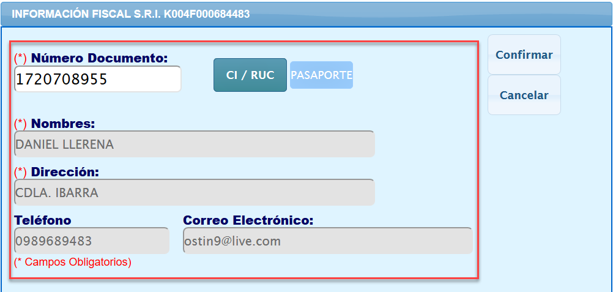

6. Al presionar el botón confirmar (Derecha superior), nos pedirá confirmar si los 
datos del cliente son correctos.

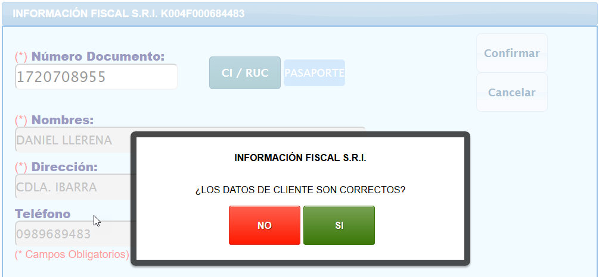

7. Si presionamos que los datos son correctos “SI”, se realizara el cambio con los 
datos del cliente ingresado.
8. Si presionamos que los datos no son correctos “NO”, se habilitaran los campos para 
modificar los datos y finalizar el cambio.
9. Al finalizar el cambio de datos cliente debe aparecer el siguiente mensaje.

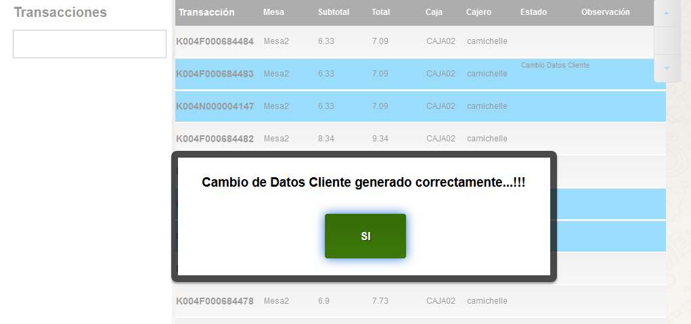

**Información adicional**

Al realizar un cambio de datos cliente en una factura aplicada como consumidor final o con 
datos el proceso de MXP es el siguiente:

1. MXP crea una nueva factura con los datos del cliente que solicita el cambio, con el 
mismo detalle de orden pedido y formas de pago que la factura original.

2. MXP anula la factura original y se genera su nota de crédito; y es compensada con 
la nueva factura.

3. Se crea la nota de crédito de la factura original con los datos del cliente que solicita 
el cambio.

4. Los datos de cliente de la factura original no son afectados.

5. MXP imprime la nota de crédito de la factura original y la nueva factura

**Ejemplo de comprobantes:**

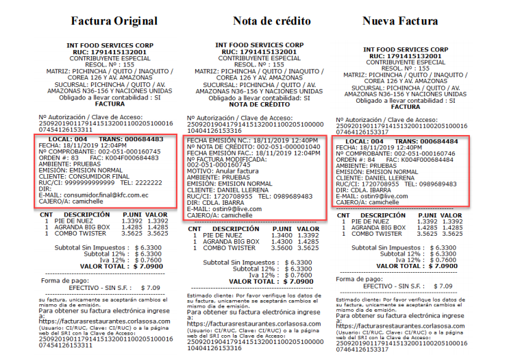

### 6.2 Nota de Crédito

1. Seleccionar una factura y presionar el botón “Nota de Crédito”

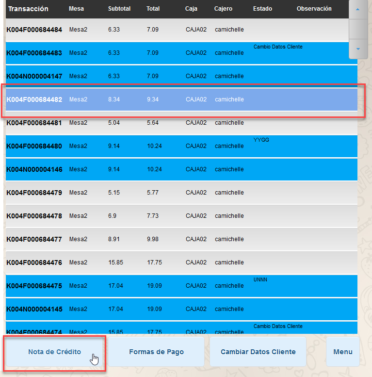

2. Al presionar el botón, el sistema solicitara credenciales de administrador y las 
ingresamos.
3. Después de ingresar las credenciales; se visualizará una modal para seleccionar el 
motivo de anulación e ingresar un comentario, seguidamente presionamos Ok.

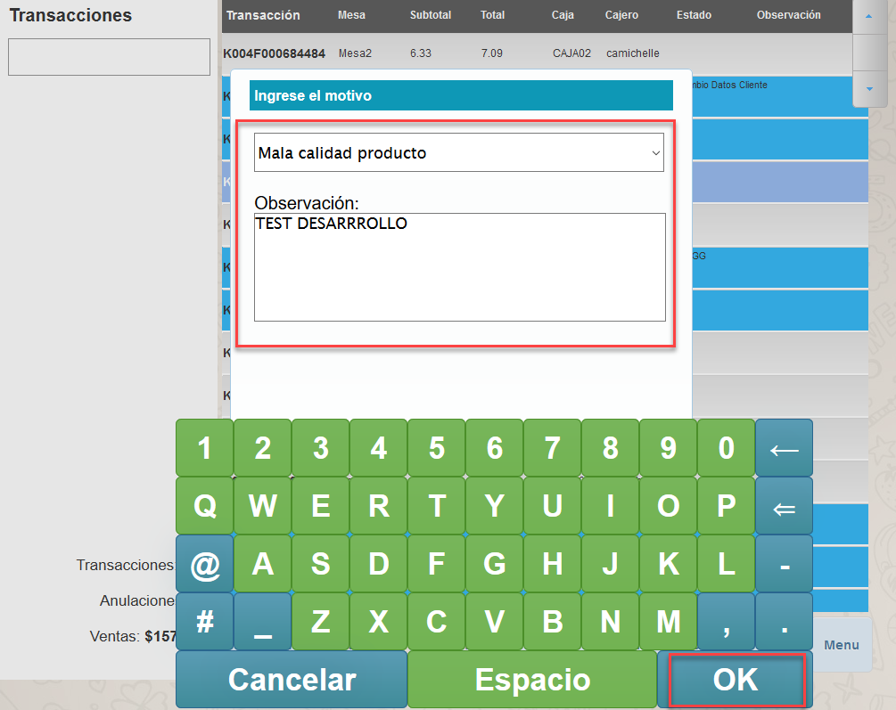

4. Al presionar Ok; se visualizará una modal con los datos del cliente que fue cerrada 
la factura, en este caso es consumidor final, y a su vez se visualiza la información 
del SRI configurada por política.

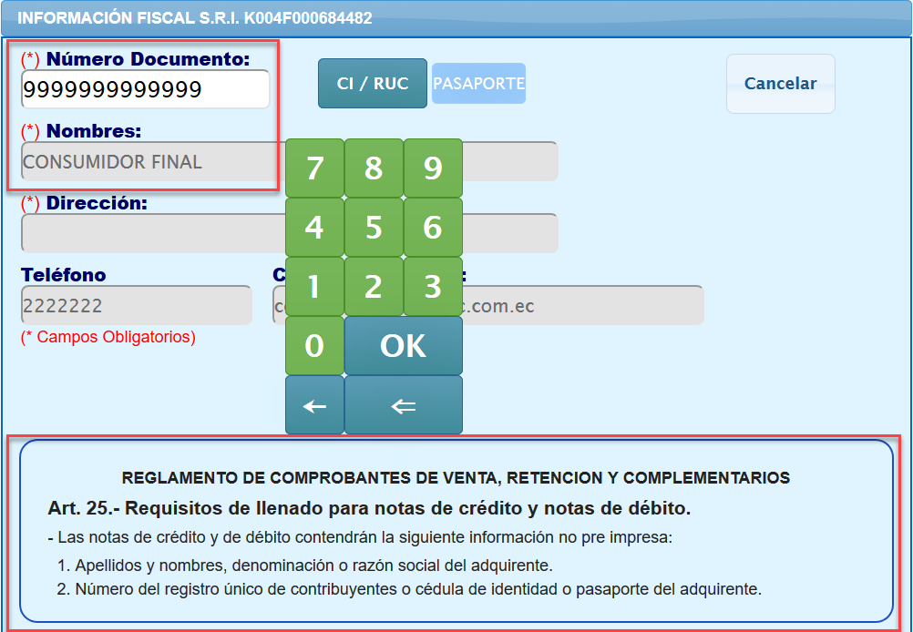

5. Con el teclado virtual ingresar el documento de identificación del cliente y presionar 
OK, sí el cliente es extranjero seleccionar el botón pasaporte y se debe ingresar 
credenciales de administrador.

6. Al presionar Ok, sí el cliente ya se encuentra registrado se cargarán sus datos caso 
contrario se los debe ingresar, en este caso el cliente no existe.

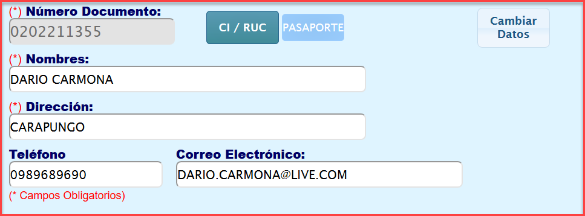

7. Seguidamente presionamos el botón Cambiar Datos, y aparecerá una modal con las 
formas de pago aplicadas a la factura la seleccionamos para proceder con la 
anulación.

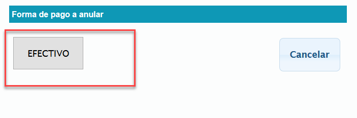

8. Al finalizar la anulación debe aparecer el siguiente mensaje.

**Información adicional**

Al realizar una nota de crédito en una factura aplicada como consumidor final o con datos 
el proceso de MXP es el siguiente:

 1. Se crea la nota de crédito de la factura con los datos del cliente ingresados. 
.
.
.
.
.
.
.
.
.
.

        2. Los datos de cliente de la factura original no son afectados.  

3. MXP imprime la nota de crédito.

 4. Sí, el país no aplica la política “NOTAS DE CREDITO SIN CONSUMIDOR 
FINAL”; el sistema permitirá generar notas de crédito a facturas aplicadas como 
consumidor final con toda normalidad.  

**Ejemplo de comprobantes:**

