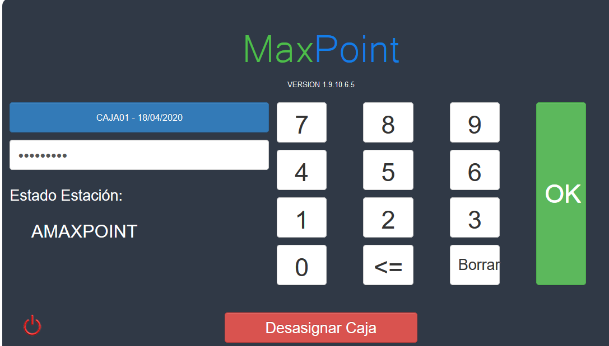
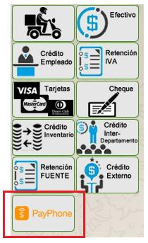
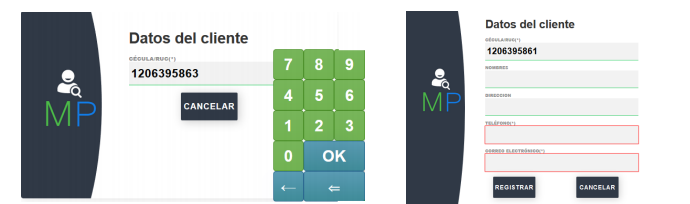
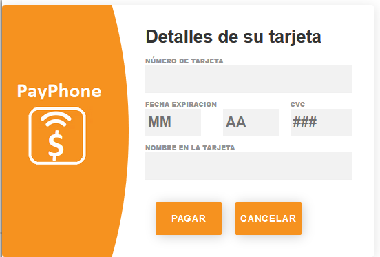
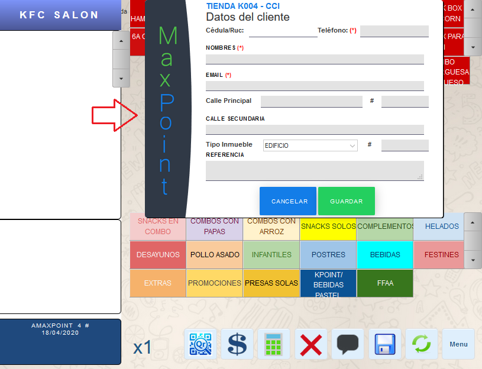
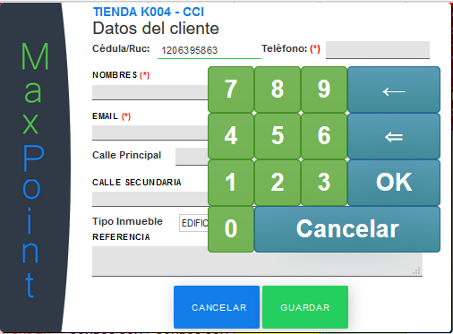
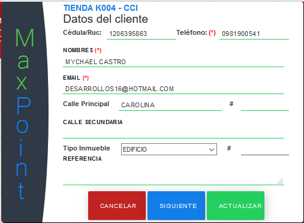

# Manual de usuario PayPhone

## 1 DESCRIPCIÓN 

Este manual de usuario para realizar cobros mediante el botón de pagos PayPhone en MaxPoint.

## 2 RECOMENDACIONES 

El botón de pagos PayPhone en su primera etapa no admite valores de pago mixtos.

## 3 PROCEDIMIENTO 

Ingresamos con un usuario a MaxPoint

El flujo de este proceso varia en base a si la política “SOLICITAR DATOS CLIENTE ORDEN PEDIDO” ya que, si esta esta activada solicitara datos del cliente en el orden pedido, y en caso de que no solicitará los datos cuando se seleccione la forma de pago PayPhone.

### 3.1 Cobro con botón de pagos PayPhone 

Luego de que el cajero digite la orden y pase a la pantalla de facturación hará uso del botón de pagos PayPhone ubicado en las formas de pago disponible en la parte superior derecha.

Una vez seleccionada la forma de pago se mostrará una ventana modal donde se deberá buscar 
o registra un cliente el cual realizará el pedido.

Luego de buscar o registrar el cliente, se procederá a digitar los datos de tarjeta como el número de tarjeta, Fecha y Año de expiración, código de seguridad de la tarjeta y el nombre del Tarjetahabiente. Y clic en Pagar para enviar la transacción

**Nota: Payphone solo admite tarjetas Visa y Master Card.**

### 3.2 Cobro con botón de pagos PayPhone con solicitud de datos de cliente en orden pedido.

Si esta activa la política de solicitud de datos en orden pedido al cajero se le mostrara la siguiente venta en la pantalla de orden pedido.

En esta pantalla se realiza el mismo proceso explicado anteriormente solo que para este se 
incluyen mas datos de informacion para la entrega en el domicilio.

En esta pantalla ambien se puede actualizar los datos del cliente.

Para aceptar la busqueda y que el sistema guarde los datos del cliente al que se le va a realizar el pedido en la base de datos se le puede dar clic en los botones aceptar/Siguiente y actualizar.

Posterior el cajero tomara la orden y cuando se encuentre en la pantalla de facturacion y 
seleccione la forma de pago PayPhone ya no le solicitara los datos del cliente y pasara a la toma de los datos de tarjeta directamente.
