# Manual para Configurar politicas PayPhone

## 1 DESCRIPCIÓN 

Este manual es para ayudar al equipo de soporte con las configuraciones necesarias para que 
funcione el botón de pagos de PayPhone en Maxpoint a partir de la versión 1.9.10.6 en adelante. 

## 2 RECOMENDACIONES 

### 2.1 Seguimiento de pasos 

Antes de proceder con estas configuraciones, se debe verificar si los códigos de las tiendas están creados por parte del equipo de Payphone. 

## 3 PROCEDIMIENTO 

Creación de políticas.

### 3.1 Políticas a nivel de Cadena 

Para el envió de transacciones (Cobros, reversos, anulaciones) Payphone requiere que los datos del tarjetahabiente estén cifrados, para lo cual ellos proporcionan una contraseña y token para codificar los datos de tarjeta, PARA ello configuramos a nivel de cadena la siguiente política. 

Nos ubicamos en la pantalla de políticas en el back office de MaxPoint.

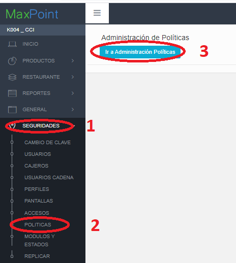

Seleccionamos Cadena y damos clic en Nueva colección.

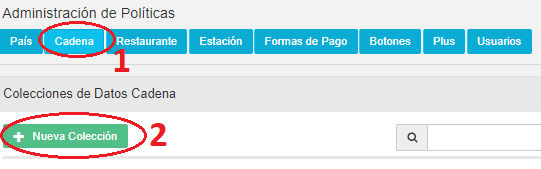

Luego en la ventana modal colocamos en colección **CONFIGURACION DE SEGURIDAD** 
**PYPHONE**” 

Y en observaciones “**V 1.9.10.6+**

**Dentro de esta configuración se debe especificar un token con el que podrás identificarte 
ante los servicios de PayPhone y añadir la seguridad respectiva al proceso**

**Ejemplo: tp5B2ZIQjxdoH-7A5hpj5Be3MlSr7sNaF_S78EHE==**

**Además, se debe especificar de igual forma una contraseña de codificación para con ello 
cifrar datos de la tarjeta.** 

**Ejemplo:**

**Estos datos se encuentran disponibles en el panel de administración de PayPhone ingresando con el usuario desarrollador.”**

Debe quedar de la siguiente manera.

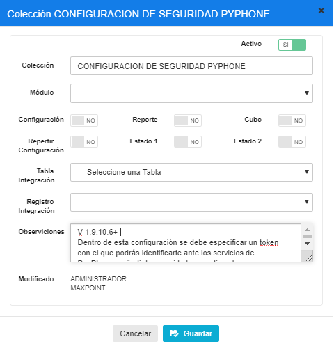

Luego seleccionamos la política creada y procedemos a crear los parámetros

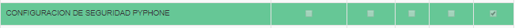

Configuramos los parámetros.

|Parámetro|Tipo de dato|Especificar|Obligatorio|Valor a configurar|
|:----|:----|:----|:----|:----|
|CONTRASEÑA DE CODIFICACIÓN|Caracter|Si|Si|bb9bbd3e6e0542c0981239706440af87|
|TOKEN DE APLICACIÓN|Caracter|Si |Si|yifHtp5B2ZIQjxdoHA5hpj5Be3MISr7sNaF_WK6g-|

**Nota:** la **contraseña de codificación**y **Token de aplicación** se explica al final del documento 
como obtener ya que estos datos son generados según la tienda. 

**POLITICA 2**
Creamos otra política a nivel de cadena con los siguientes datos:

**Nombre política:** TIPO INMUEBLES

**Descripción:** 1.9.10.6+

Indica si el tipo de inmueble para pedidos domicilio ejemplo Edificio, Casa, etc.

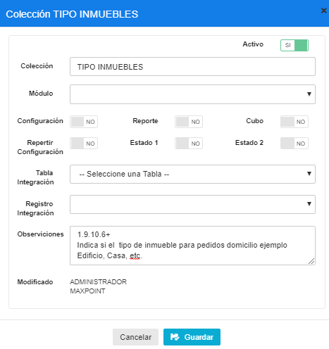

|Parámetro|Tipo de dato|EspecificarValor|Obligatorio|Valor a configurar|
|:----|:----|:----|:----|:----|
|CASA|Caracter|Si|Si| |
|EDIFICIO|Caracter|Si|Si| |

### 3.2 Políticas a nivel de Restaurante 

Creamos a nivel de restaurante la política “CONFIGURACION DESEGURIDAD TIENDA PYPHONE"

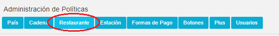
Y colocamos como descripción: V 1.9.10.6+

*Es un clave que provee PayPhone en su panel de administración para con el cifrar los datos de la tarjeta que serán usados en una transacción, La longitud de la clave secreta debe ser 32 para un tamaño de clave de 256 bits*

Ejemplo:

FF9bbd3e6e0542c0981239706440af66

Quedaría de la siguiente manera.

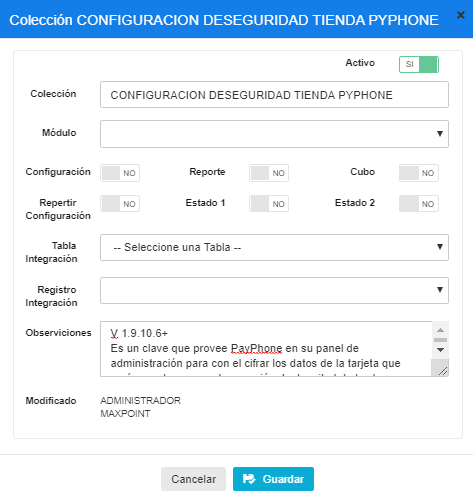

Esta política tiene un parámetro.

|Parámetro|Tipo de dato|Especificar|Obligatorio|Valor a configurar|
|:----|:----|:----|:----|:----|
|STORE ID|Carácter|Si|Si|a94829b1-d487-4308-858d-6146e1a3684c|

Nota: El **STORE ID** se explica al final del documento como obtenerla.

Política para activar pantalla de solicitar datos del cliente para pedidos de domicilio se debe 
configurar la política: "**SOLICITAR DATOS CLIENTE ORDEN PEDIDO**” con la siguiente 
descripción: V 1.9.10.6+

*Permite habilitar el formulario para solicitar los datos del cliente para pedidos de domicilio y pago con PayPhone* 

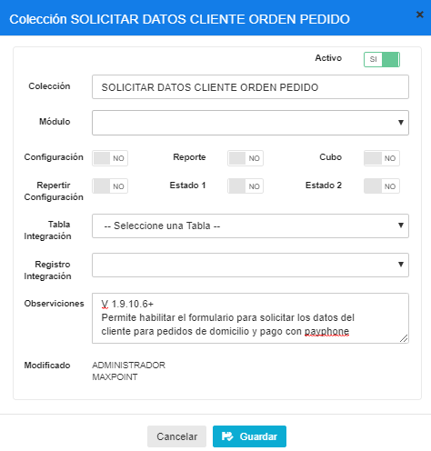

y esta lleva un parámetro.

|Parámetro|Tipo de dato|Especificar|Obligatorio|Valor a configurar|
|:----|:----|:----|:----|:----|
|HABILITADO|Selección|Si|Si|Activado|

### 3.3 Políticas a nivel de Usuario 

Para activar/desactivar la pantalla que solicita los datos del cliente a nivel de usuario debemos configurar la siguiente política **ACCESO A PANTALLA DATOS CLIENTE DOMICILIO**

con la siguiente descripción: V 1.9.10.6+

*Permite habilitar el formulario para solicitar los datos del cliente para pedidos de domicilio y pago con PayPhone a nivel de usuario.*

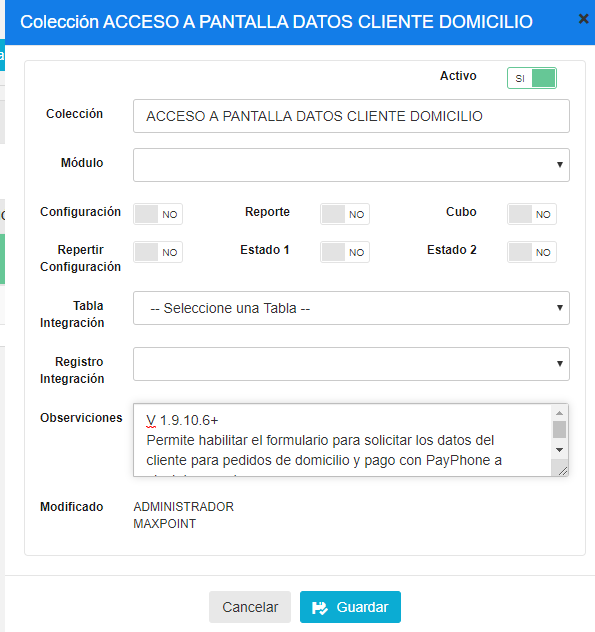

y esta lleva un parámetro.

|Parámetro|Tipo de dato|Especificar|Obligatorio|Valor a configurar|
|:----|:----|:----|:----|:----|
|HABILITADO|Selección|Si|Si|Activado|

**IMPORTANTE: En cuanto a las configuraciones entre esta política y la de restaurante tenga 
en cuenta que.**

**SI SE MUESTRA EL FORMULARIO CUANDO**

- Si el restaurante está activo y el usuario tiene política 1 SI se muestra el Formulario
- Si el restaurante está activo y el usuario tiene '' o NULL SI se muestra el Formulario
- Si el restaurante está Inactivo y el usuario tiene política 1 SI se muestra el Formulario

**NO SE MUESTRA EL FORMULARIO CUANDO**

- Si el restaurante está activo y el usuario tiene política 0 NO se muestra el Formulario
- Si el restaurante está Inactivo y el usuario no tiene política es decir esta '' o NLL NO se muestra el Formulario.

- Si el restaurante está Inactivo y el usuario tiene política 0 NO se muestra el Formulario

### 3.4 Configuración para los Servicios web. 

### 3.4.1 Configuración WS SERVIDOR

En las políticas a nivel de cadena buscamos la política ya creada de nombre WS SERVIDOR y le añadimos los parámetros:

|Parámetro|Tipo de dato|Especificar|Obligatorio|Valor a configurar|
|:----|:----|:----|:----|:----|
|PAYPHONEPRUEBAS|Carácter|Si|Si|https://pay.payphonetodoesposible.com/api|
|PAYPHONEPRODUCCION|Carácter|Si|Si|https://pay.payphonetodoesposible.com/api|

### 3.4.2 Configuración WS SERVIDOR

En las políticas a nivel de cadena buscamos la política ya creada de nombre **WS RUTA 
SERVICIO**

y le añadimos los parámetros:

|Parámetro|Tipo de dato|Especificar|Obligatorio|Valor a configurar|
|:----|:----|:----|:----|:----|
|PAYPHONE CREARTRANSACCION|Caracter|Si|Si|/v2/transaction/create|
|PAYPHONE OBTENERTRANSACCION|Caracter|Si|Si|/Sale/|
|PAYPHONE REVERSARTRANSACCION|Carácter|Si|Si|/Reverse|
|PAYPHONE REVERSARCLIENTE ID TRANSACCION|Carácter|Si|Si|/Reverse/Client|

### 3.5 OBTENER STORE ID, TOKEN Y CONTRASEÑA DE APLICACIÓN PARA UNA TIENDA

Para obtener estos datos de PayPhone ingresamos a su página web 
“https://appdeveloper.payphonetodoesposible.com/login” e iniciamos sesión con las siguientes 
credenciales

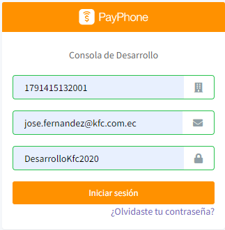

Luego seleccionamos el nombre de la aplicación en la parte superior o centro de la pantalla.

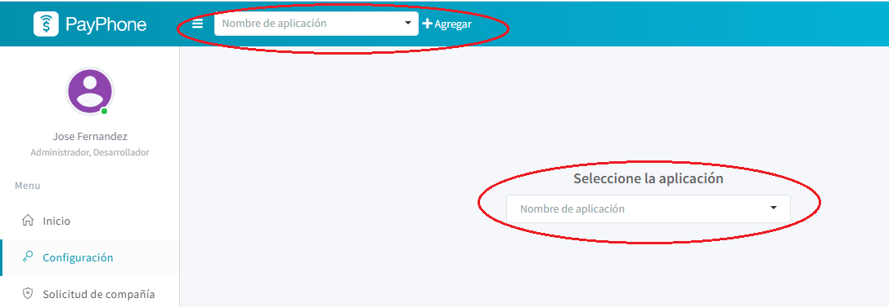

Para este caso se selecciona MAXPOINT, debido a que dentro de esta se encuentran las tiendas 
para KFC.

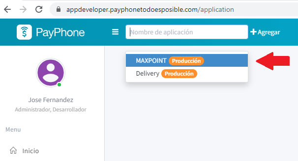

### 3.5.1 Contraseña de aplicación 

La contraseña de aplicación la encontramos en el menú **configuración > Detalles**

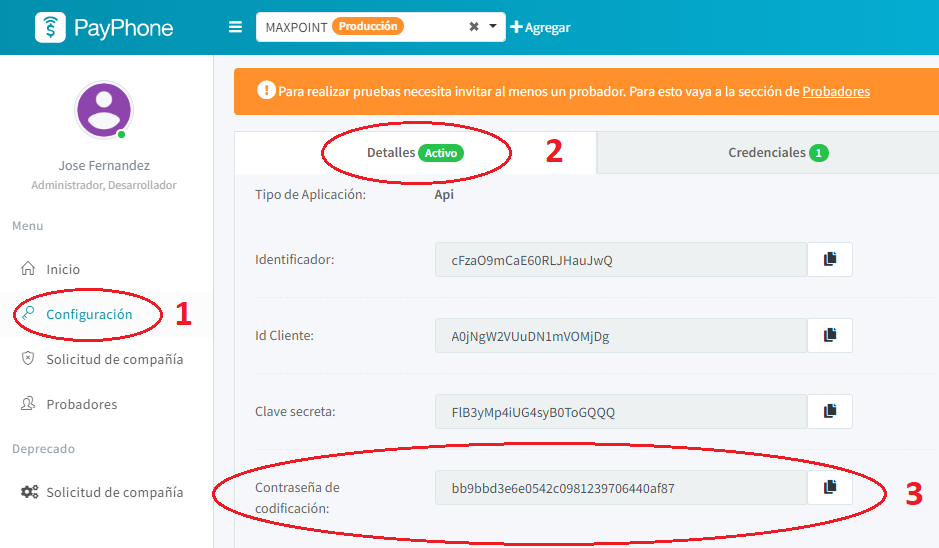

Ahí podemos copiar este dato y configurarlo en las políticas de MaxPoint. 
Nota: Por aplicación es una sola contraseña de codificación y una aplicación puede tener N 
tiendas. 

### 3.5.2 Token 

EL token de aplicación la encontramos en el menú **configuración > Credenciales**

Nota: Por aplicación es un solo Token de aplicación y una aplicación puede tener N tiendas.

### 3.5.3 STORE ID 
El Store Id es un Identificador que permitirá que PayPhone identifique que tienda realiza una transacción, esta eta contenida en una aplicación. 

Para obtener este dato ingresamos al menú **Solicitud de compañía** donde nos mostrara en una 
tabla nuestra compañía.

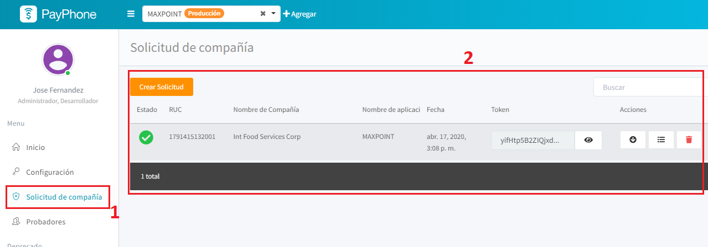

Dentro de la tabla tenemos la opción para ver las tiendas configuradas (Estas tiendas las 
configura PayPhone)

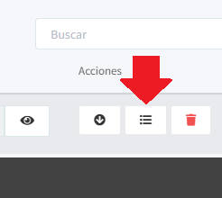

Nos abrirá una venta modal con las tiendas y en ella se visualiza el Store Id de una tienda en especifica.

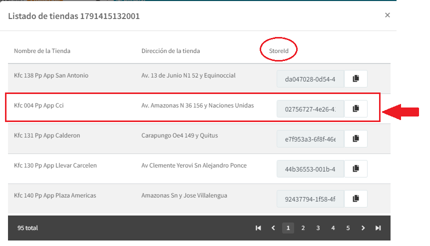

## 4 Activar botón de Pagos PayPhone

Ingresamos al Back Office de Maxpoint e ingresamos en el menú **GENERAL > FORMAS DE 
PAGO > DEFINICION** Y en el listado de formas de pago buscamos **PAYPHONE** y damos doble 
clic sobre esa forma de pago.

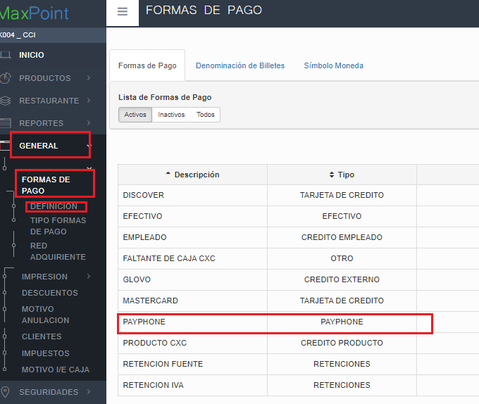

Configuramos la tienda a aplicar.

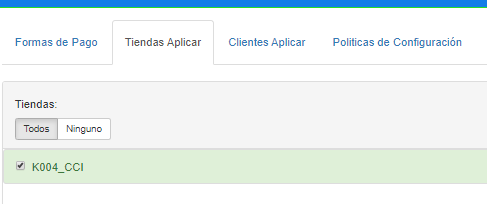

**Y las políticas que se muestran en la siguiente imagen**

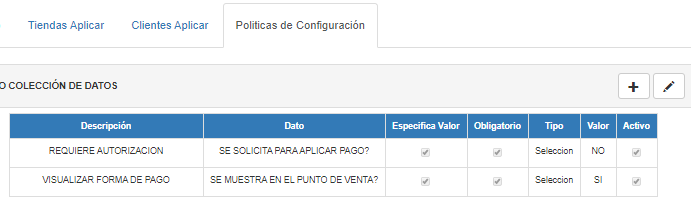

## 5 CONFIGURAR SERVIDOR PARA ACEPTAR SOLICITUDES HTTPS

Para que Maxpoint acepte peticiones https se debe activar el modo mod_ssl en Apache y el 
**php_openssl.dll** dentro del archivo php.ini 

Ubicar el archivo php.ini en la ruta del servidor “C:\xampp\php\php.ini” y realizar el siguiente cambio (quitar el ;)

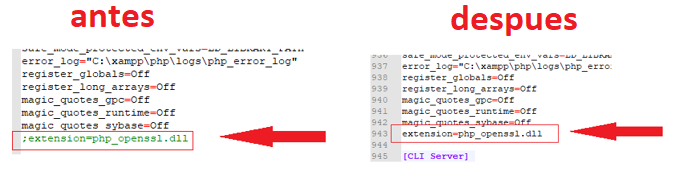

Y agregar las siguientes líneas al final
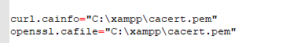

*curl.cainfo="C:\xampp\cacert.pem"*
*openssl.cafile="C:\xampp\cacert.pem"*

Estas líneas hacen referencia a este archivo.

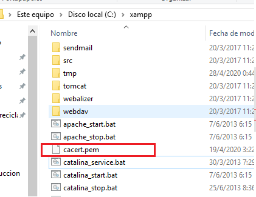

Que se puede descargar de la siguiente página.

https://curl.haxx.se/docs/caextract.html

O en la siguiente ruta de la .249 

\\192.168.101.249\soporte\CONFIGURACION XAMPP

**Finalmente reiniciamos xampp para que se actualicen los cambios Y actualizar el navegador 
de las cajas del local.**