# Manual de Usuario politicas

**Manual para LA CONFIGURACIÓN DEl panel replicacion DESDE MAXPOINT HACIA api panel replicacion**

## INTRODUCCION

CONFIGURACIÓN DEL PANEL REPLICACION DESDE MAXPOINT HACIA API PANEL REPLICACION

**Introducción** - En este manual se detalla la creación y configuración de políticas, procedimientos y funciones para la configuración de “PANEL REPLICACION DESDE MAXPOINT HACIA API PANEL REPLICACION “

## 1.CONFIGURACION DE POLÍTICAS

1. Para ingresar al módulo de “Administración De Políticas”, debe dar clic en la opción “Seguridades” y en el módulo de “Políticas”

2. Al dar clic en la opción de  , se desplegará la siguiente pestaña

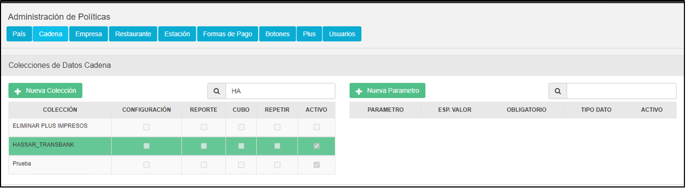

### 1.2 POLÍTICAS DE CADENA (Selección y Creación de Nueva Colección)

### 1.2.1 Selección de la Coleccion

1. En la tabla izquierda de Colecciones buscar la colección llamada “**WS SERVIDOR**”  y la seleccionamos

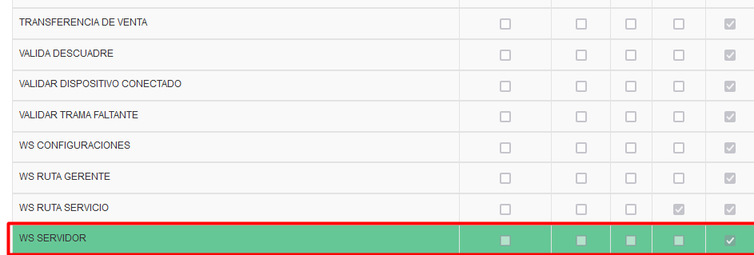

### 1.2.2. Creación de los Parámetros

Al dar click sobre el icono  , se desplegará una pantalla emergente para crear el parámetro mencionado. Ahora se detallará las configuraciones de los nuevos parametros.

1. PARAMETRO: API PANEL REPLICACION

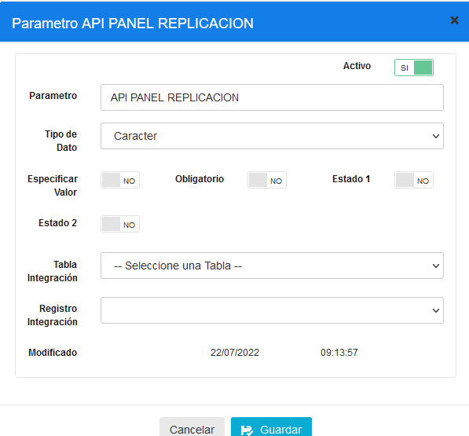

|PARAMETRO|TIPO DATO|ESP.VALOR|OBLIGATORIO|
|:----|:----|:----|:----|
|API PANEL REPLICACION|CARACTER|NO|NO| |

Luego de creado este parametro repetimos es paso de selección de colección 

En la tabla izquierda de Colecciones buscar la colección llamada “**WS RUTA SERVICIO**”  y la seleccionamos

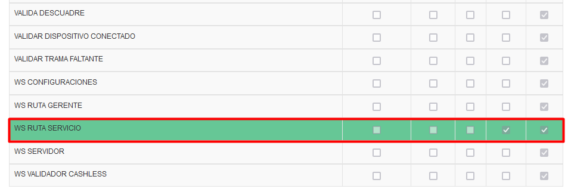

2. PARAMETRO: API PANEL TRAMAS

|PARAMETRO|TIPO DATO|ESP.VALOR|OBLIGATORIO|
|:----|:----|:----|:----|
|API PANEL TRAMAS|Caracter|NO|NO| |

3. PARAMETRO: API PANEL INCIDENCIAS

|Parámetro|Tipo de dato|ESP. VALOR|Obligatorio|
|:----|:----|:----|:----|
|API PANEL INCIDENCIAS|Caracter|No|No|

4. PARAMETRO: API PANEL REPLICAR TRAMAS

|Parámetro|Tipo de dato|ESP. VALOR|Obligatorio|
|:----|:----|:----|:----|
|API PANEL REPLICAR TRAMAS|Caracter|No|No|

5. PARAMETRO: API PANEL REPLICADORES

|Parámetro|Tipo de dato|ESP. VALOR|Obligatorio|
|:----|:----|:----|:----|
|API PANEL REPLICADORES|Caracter|No|No|

6. PARAMETRO: API PANEL MODIFICAR REPLICADORES

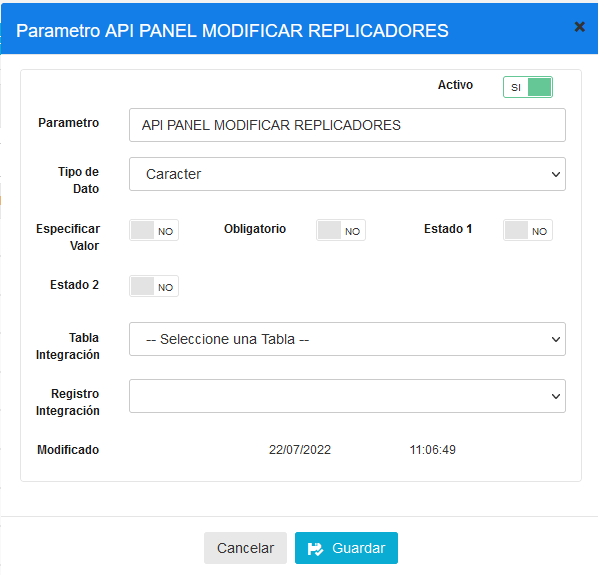

|Parámetro|Tipo de dato|ESP. VALOR|Obligatorio|
|:----|:----|:----|:----|
|API PANEL MODIFICAR REPLICADORES|Caracter|No|No|

7. PARAMETRO: API PANEL MODULOS

|Parámetro|Tipo de dato|ESP. VALOR|Obligatorio|
|:----|:----|:----|:----|
|API PANEL MODULOS|Caracter|No|No|

8. PARAMETRO: API PANEL MODIFICAR MODULOS

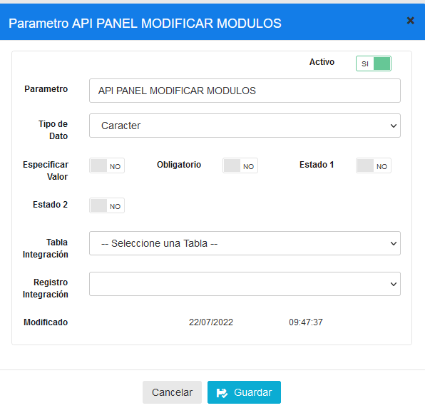

|Parámetro|Tipo de dato|ESP. VALOR|Obligatorio|
|:----|:----|:----|:----|
|API PANEL MODIFICAR MODULOS|Caracter|No|No|

9. PARAMETRO: API PANEL DASHBOARD

|Parámetro|Tipo de dato|ESP. VALOR|Obligatorio|
|:----|:----|:----|:----|
|API PANEL DASHBOARD|Caracter|No|No|

10. PARAMETRO: API PANEL TRAMAS PROGRAMADAS

|Parámetro|Tipo de dato|ESP. VALOR|Obligatorio|
|:----|:----|:----|:----|
|API PANEL TRAMAS PROGRAMADAS|Caracter|No|No|

11. PARAMETRO: API PANEL PROGRAMAR TRAMAS

|Parámetro|Tipo de dato|ESP. VALOR|Obligatorio|
|:----|:----|:----|:----|
|API PANEL PROGRAMAR TRAMAS|Caracter|No|No|

12. PARAMETRO: API PANEL RUTAS

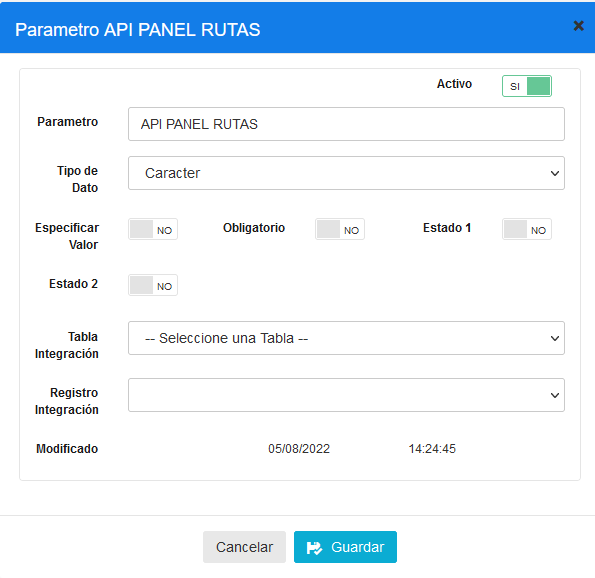

|Parámetro|Tipo de dato|ESP. VALOR|Obligatorio|
|:----|:----|:----|:----|
|API PANEL RUTAS|Caracter|No|No|

13. AMETRO: API PANEL TRAMAS VERIFICAR

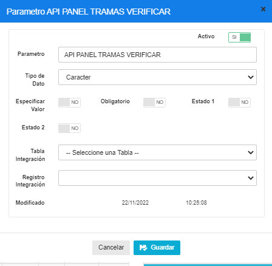

|Parámetro|Tipo de dato|ESP. VALOR|Obligatorio|
|:----|:----|:----|:----|
|API PANEL TRAMAS VERIFICAR|Caracter|No|No|

14. PARAMETRO: API PANEL RUTAS VERIFICAR

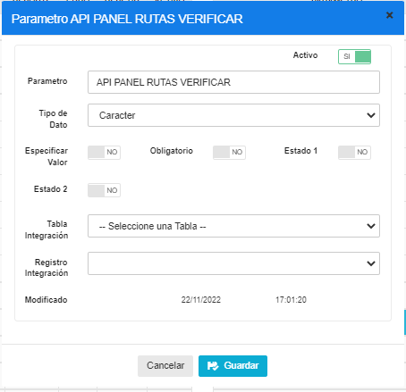

|Parámetro|Tipo de dato|ESP. VALOR|Obligatorio|
|:----|:----|:----|:----|
|API PANEL RUTAS VERIFICAR|Caracter|No|No|

15. PARAMETRO: API PANEL REACTIVAR TRAMAS

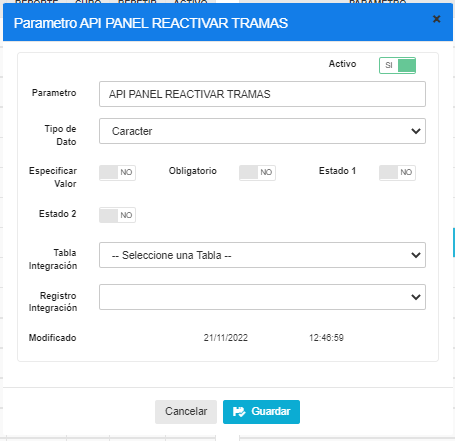

|Parámetro|Tipo de dato|ESP. VALOR|Obligatorio|
|:----|:----|:----|:----|
|API PANEL REACTIVAR TRAMAS|Caracter|No|No|

16. PARAMETRO: API PANEL INACTIVAR TRAMAS

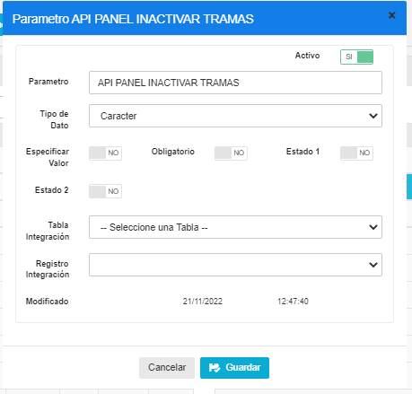

|Parámetro|Tipo de dato|ESP. VALOR|Obligatorio|
|:----|:----|:----|:----|
|API PANEL INACTIVAR TRAMAS|Caracter|No|No|

### Politicas Completas

|PARAMETRO|TIPO DATO|ESP. VALOR|OBLIGATORIO|
|:----|:----|:----|:----|
|API PANEL TRAMAS VERIFICAR|Caracter|NO|NO|
|API PANEL TRAMAS PROGRAMADAS|Caracter|NO|NO|
|API PANEL TRAMAS|Caracter|NO|NO|
|API PANEL RUTAS VERIFICAR|Caracter|NO|NO|
|API PANEL RUTAS|Caracter|NO|NO|
|API PANEL REPLICAR TRAMAS|Caracter|NO|NO|
|API PANEL REPLICADORES|Caracter|NO|NO|
|API PANEL REACTIVAR TRAMAS|Caracter|NO|NO|
|APIPANEL PROGRAMAR TRAMAS|Caracter|NO|NO|
|API PANEL MODULOS|Caracter|NO|NO|
|API PANEL MODIFICAR REPLICADORES|Caracter|NO|NO|
|API PANEL MODIFICAR MODULOS|Caracter|NO|NO|
|API PANEL INCIDENCIAS|Caracter|NO|NO|
|API PANEL INACTIVAR TRAMAS|Caracter|NO|NO|
|API PANEL DASHBOARD|Caracter|NO|NO|

## 2. ACTIVACIÓN DE POLÍTICAS

### 2.1 ACTIVACIÓN DE POLITICAS DE CONFIGURACION POR CADENA

1. Para configurar una política de cadena es necesario ingresar a la opción Cadena/Cadena, y en esta pantalla a la opción **Políticas de Configuración**

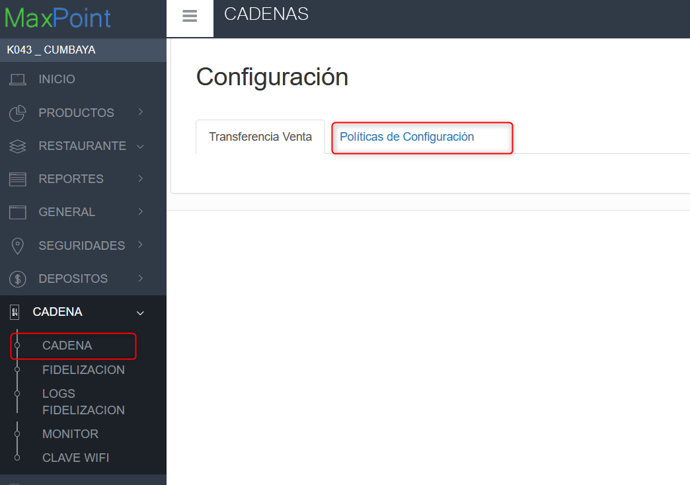

2. Una vez ubicado en la pestaña Políticas de Configuración dar click en el botón “+” en la parte superior derecha de la tabla para añadir los parámetros, IMPORTANTE: repetir este proceso para la COLECCIÓN y sus PARÁMETROS

## 3. Elegir la Colección “**WS SERVIDOR**”

### 3.1  Elegir el Parámetro “**API PANEL REPLICACION**”

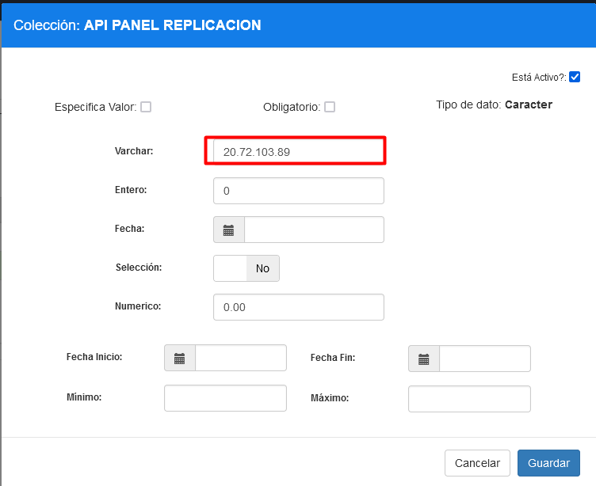

|Parámetro|Tipo de dato|Seleccion|
|:----|:----|:----|
|API PANEL REPLICACION|Caracter|No|

20.72.109.149

**NOTA: Este parámetro corresponde a la ip del api de panel**

## 4. Elegir la colección WS RUTA SERVICIO

### 4.1 Elegir el parámetro API PANEL TRAMAS

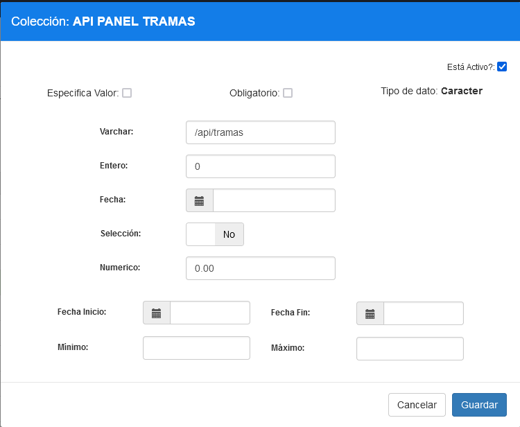

|Parámetro|Tipo de dato|Varchar|
|:----|:----|:----|
|API PANEL TRAMAS|Caracter|/api/tramas|

### 4.2 Elegir el parámetro API PANEL INCIDENCIAS

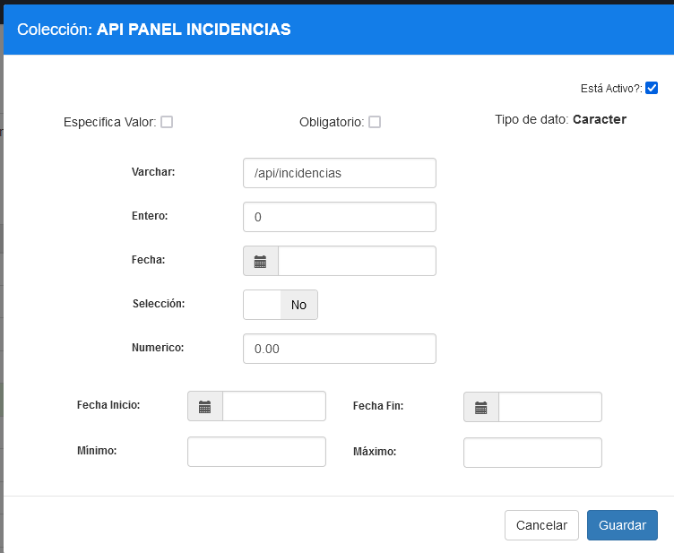

|Parámetro|Tipo de dato|Varchar|
|:----|:----|:----|
|API PANEL INCIDENCIAS|Caracter|/api/incidencias|

### 4.3 Elegir el parámetro API PANEL RUTAS

|Parámetro|Tipo de dato|Varchar|
|:----|:----|:----|
|API PANEL RUTAS|Caracter|/api/rutas|

### 4.4 Elegir el parámetro API PANEL REPLICAR TRAMAS

|Parámetro|Tipo de dato|Varchar|
|:----|:----|:----|
|API PANEL REPLICAR TRAMAS|Caracter|/api/replicar|

### 4.5 Elegir el parámetro API PANEL REPLICADORES

|Parámetro|Tipo de dato|Varchar|
|:----|:----|:----|
|API PANEL REPLICADORES|Caracter|/api/replicadores|

### 4.6 Elegir el parámetro API PANEL MODIFICAR REPLICADORES

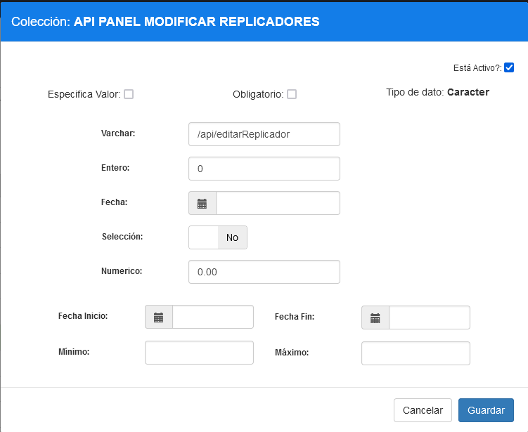

|Parámetro|Tipo de dato|Varchar|
|:----|:----|:----|
|API PANEL MODIFICAR REPLICADORES|Caracter|/api/editarReplicador|

### 4.7 Elegir el parámetro API PANEL MODULOS

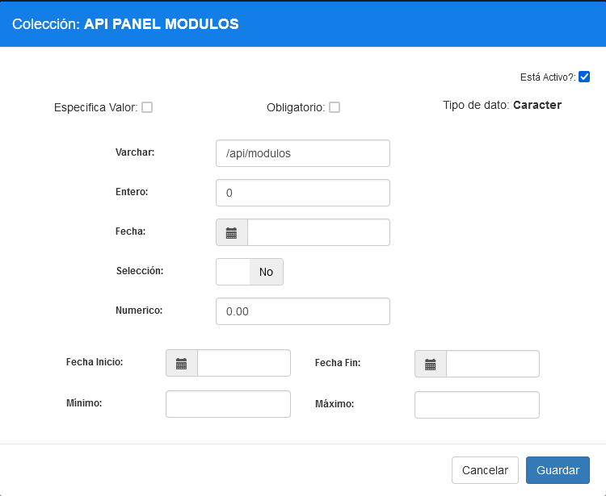

Parámetro	Tipo de dato	Varchar
API PANEL MODULOS	Caracter	/api/modulos

### 4.8 Elegir el parámetro API PANEL MODIFICAR MODULOS

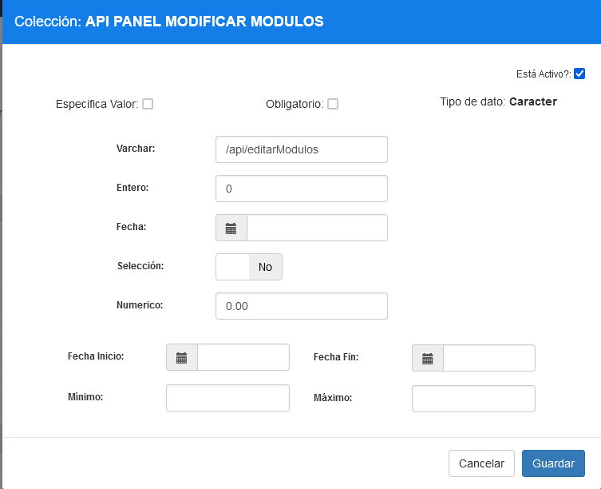

|Parámetro|Tipo de dato|Varchar|
|:----|:----|:----|
|API PANEL MODIFICAR MODULOS|Caracter|/api/editarModulos|

### 4.9 Elegir el parámetro API PANEL DASHBOARD

|Parámetro|Tipo de dato|Varchar|
|:----|:----|:----|
|API PANEL DASHBOARD|Caracter|/api/graficos|

### 4.10 Elegir el parámetro API PANEL TRAMAS PROGRAMADAS

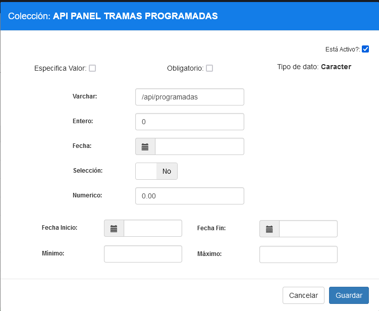

|Parámetro|Tipo de dato|Varchar|
|:----|:----|:----|
|API PANEL TRAMAS PROGRAMADAS|Caracter|/api/programadas|

### 4.11 Elegir el parámetro API PANEL PROGRAMAR TRAMAS

|Parámetro|Tipo de dato|Varchar|
|:----|:----|:----|
|API PANEL PROGRAMAR TRAMAS|Caracter|/api/programarTramas|

### 4.12 Elegir el parámetro API PANEL TRAMAS VERIFICAR 

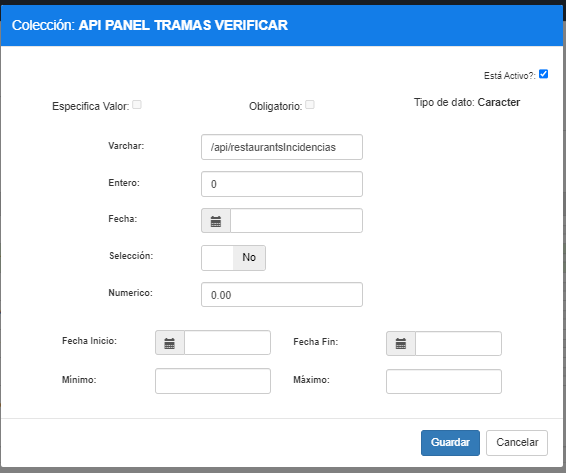

|Parámetro|Tipo de dato|Varchar|
|:----|:----|:----|
|API PANEL TRAMAS VERIFICAR|Caracter|/api/restaurantsIncidencias|

### 4.13 Elegir el parámetro API PANEL RUTAS VERIFICAR

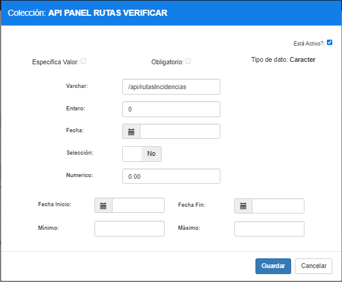

|Parámetro|Tipo de dato|Varchar|
|:----|:----|:----|
|API PANEL RUTAS VERIFICAR|Caracter|/api/rutasIncidencias|

### 4.14 Elegir el parámetro API PANEL REACTIVAR TRAMAS

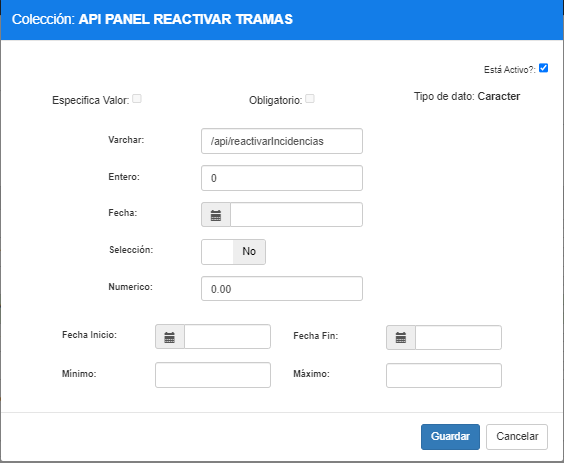

|Parámetro|Tipo de dato|Varchar|
|:----|:----|:----|
|API PANEL REACTIVAR TRAMAS|Caracter|/api/reactivarIncidencias|

### 4.15 Elegir el parámetro API PANEL INACTIVAR TRAMAS

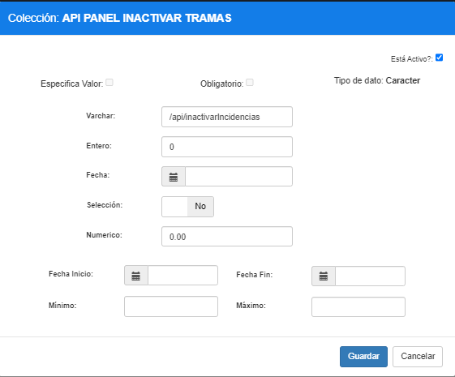

|Parámetro|Tipo de dato|Varchar|
|:----|:----|:----|
|API PANEL INACTIVAR TRAMAS|Caracter|/api/inactivarIncidencias|
