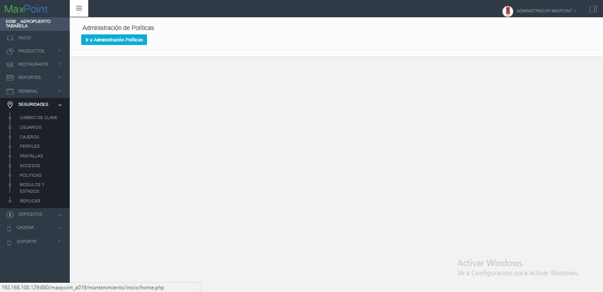
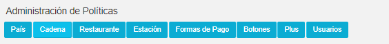
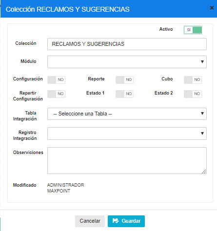
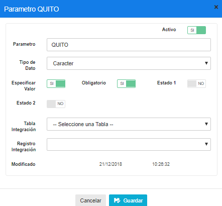
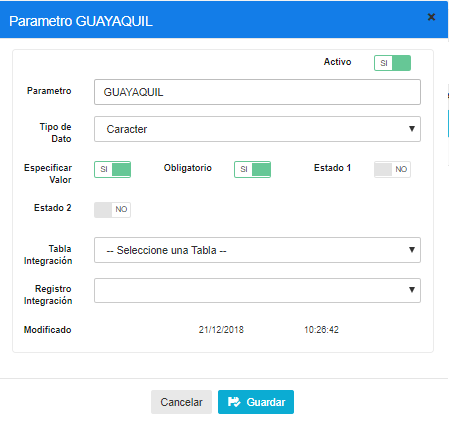
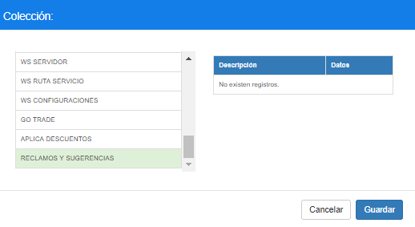
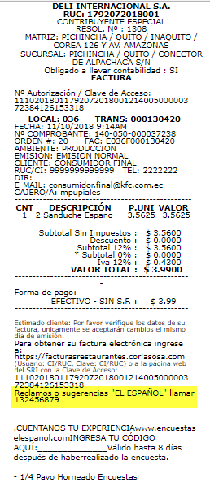

# Manual de creacion de leyenda reclamos o sugerencias

**LEYENDA RECLAMOS O SUGERENCIAS**

## 1 OBJETIVOS

- Conocer sobre el uso de la configuración de la leyenda sugerencias y reclamos en la factura.

## 2 PANTALLA BASES REPLICACION 

### 2.1 Datos Generales

En este manual se detalla el procedimiento de configuración de la leyenda reclamos y sugerencias a visualizarse en la factura. 

### 2.2 CREACION DE POLITICA

Ingresar al sistema MP backoffice con credenciales de administrador sistemas y seleccionar la cadena a la cual pertenece el restaurante a configurar.
Ir al menú de Seguridades opción Políticas y dar clic en administración de políticas

  

Seleccionar la pestaña Cadena.

  

Creamos una política a nivel de cadena, llamada RECLAMOS o SUGERENCIAS de la siguiente manera:

A continuación, creamos dos reglas llamadas QUITO y GUAYAQUIL, de la siguiente manera

A continuación, nos vamos al menú de Cadena y seleccionamos la pestaña de políticas de configuración.
Y creamos una nueva regla de la política de RECLAMOS y SUGERENCIAS

De esta manera se visualizará dependiendo de la localización la leyenda ingresada en la política en la factura.

