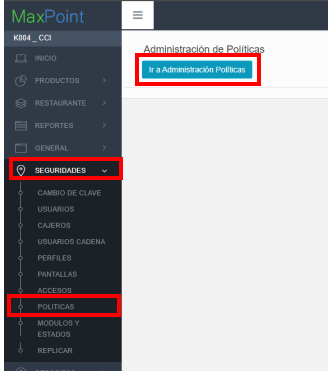
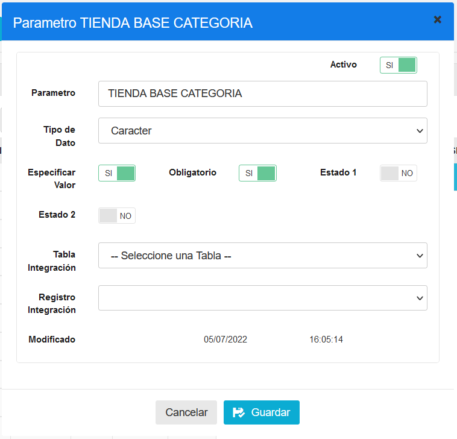
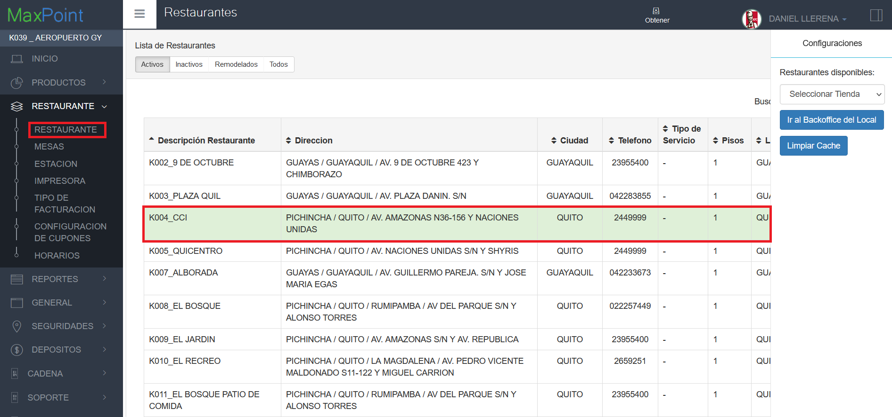
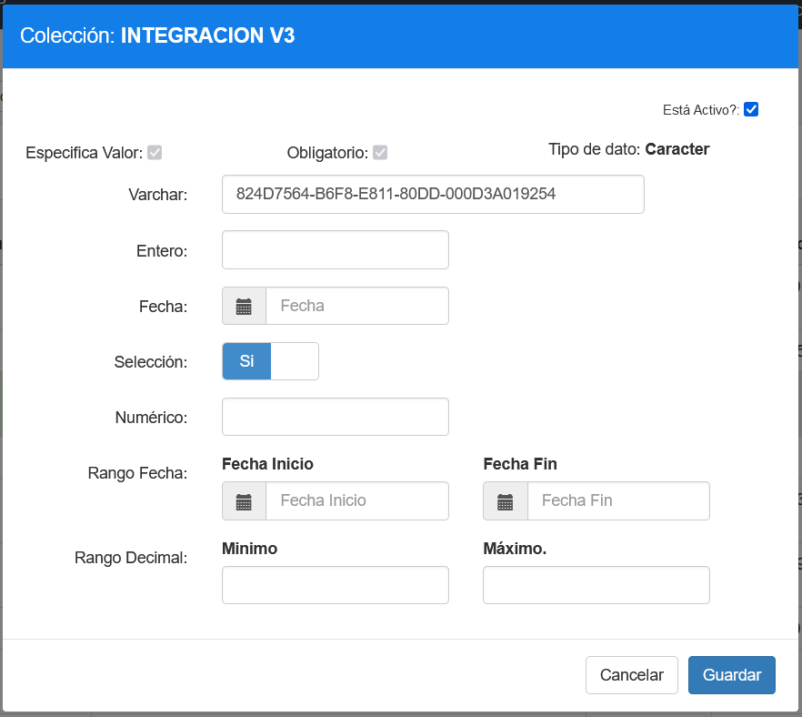

# Manual de politicas - RIA CONTROL V3

## 1 ANTECEDENTES

En el sistema Back office de MaxPoint se necesita crear una política para optimizar la sincronización de Jobs de la API V3, obtener la (tienda base categoría), parámetros que son necesarios para el correcto funcionamiento de la sincronización de tareas.

## 2 OBJETIVO GENERAL

Crear y configurar las políticas y parámetros para realizar la sincronización de Jobs de la API V3.

### 2.1 Objetivos específicos

- Crear las políticas y parámetros a nivel de Restaurantes
- Configurar los parámetros de las políticas creadas

## 3 POLÍTICAS DE CONFIGURACIÓN

### 3.1 Datos Generales

En este manual se detalla cómo crear la política correspondiente a la función para los parámetros de RIA CONTROL V3.

### 3.2 Pantalla de Políticas

Ingresar al sistema MaxPoint BackOffice con credenciales de administrador sistemas.
En el menú que se encuentra en la parte izquierda no dirigimos a la opción **SEGURIDADES** y seleccionamos **POLÍTICAS**, seguidamente presionamos sobre el botón **Ir a Administración Políticas** en el cual abrirá una nueva pestaña en el navegador.

### 3.3 Restaurante

### 3.3.1Colección restaurante

**Se debe crear la política:**

|N°|Colección|Parámetro|Tipo Dato|Esp. Valor|Obligatorio|Estado 1|Estado 2|
|:----|:----|:----|:----|:----|:----|:----|:----|
|1|INTEGRACION V3|TIENDA BASE CATEGORIA|Caracter|Si|Si|No|No|

|Parámetro|Tipo Dato|Esp. Valor|Obligatorio|VALOR A CONFIGURAR|
|:----|:----|:----|:----|:----|
|TIENDA BASE CATEGORIA|Caracter|Si|Si|No|

### 3.3.2 Valores parámetros de políticas

Ingresamos al menú de restaurante y uno de ellos.

Luego, ingresamos en la opción de políticas de configuración y agregamos la política.

Ejemplos de configuracion:

Para la politica de **INTEGRACION V3** podemos configurar 1 de los parametros por restaurante.

Por ejemplo: podemos configurar en el campo **varchar** para el parametro **TIENDA BASE** **CATEGORIA** el valor de 824D7564-B6F8-E811-80DD-000D3A019254
