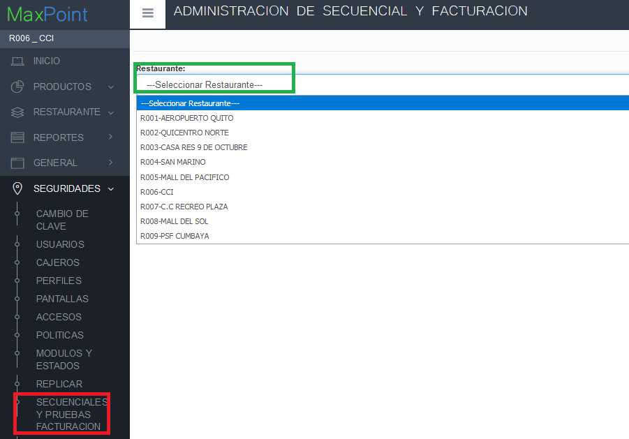
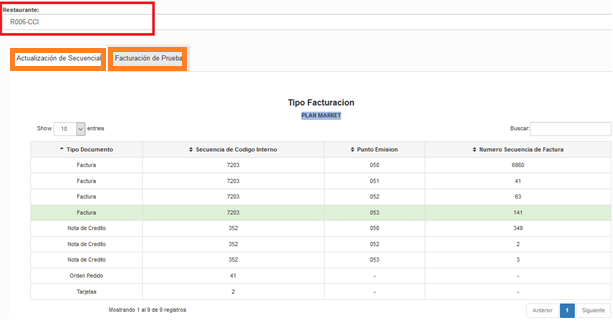
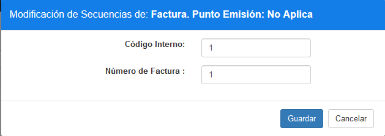
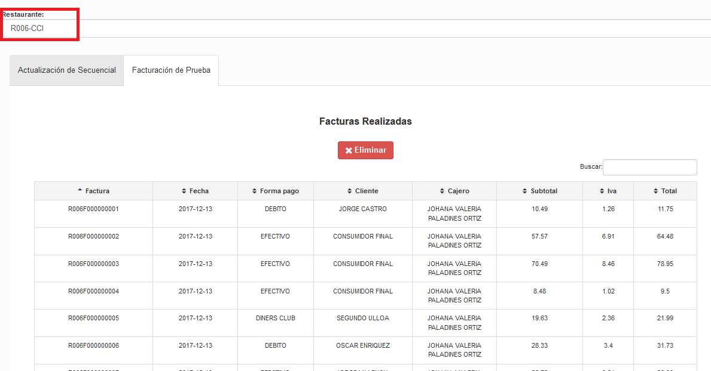

# Manual Secuenciales y Ventas

**PANTALLA Administracion SEcuenciales y ventas.**

## 1 OBJETIVOS

- Conocer sobre el uso de la nueva pantalla de administración de secuenciales y borrado de ventas de prueba.

## 2 PANTALLA ADMINISTRACION DE SECUENCIALES Y VENTAS

### 2.1 Datos Generales

En este manual se detalla el manejo de pantalla de modificación de secuenciales y eliminación de venta con el objetivo de que todos los usuarios conozcan sobre el uso, esto permitirá tener una mejor administración sobre el proceso de facturación de pruebas en el sistema.

Para la administración sobre esta pantalla, se debe tener los siguientes aspectos:

- La eliminación de venta se realizará solo si el local tiene menos de cuatro periodos cerrados.
- La administración sobre esta pantalla será a nivel de cadena por restaurante.

### 2.2 MODIFICACION DE SECUENCIALES

Ingresar al sistema MP backoffice con credenciales de administrador sistemas y seleccionar la cadena a la cual pertenece el restaurante a configurar.

Lo primero que debemos realizar es ubicarnos en el menú, en la opción **SEGURIDADES** y seleccionamos **SECUENCIALES Y PRUEBAS DE FACTURACION**, seguidamente observaremos una pantalla que nos despliega un ítem de selección, en el cual escogeremos el local que deseemos realizar la administración. (Los locales se cargan de acuerdo a la cadena.).

Al seleccionar el restaurante, se despliega la información de secuenciales del local y las facturas realizadas hasta el momento, cada una de estas características se muestra en cada pestaña.

Si se desea actualizar algún Secuencial del local, se debe dar doble clic sobre la opción que se desee modificar. Aparecerá una pantalla como la siguiente, en la cual, el usuario podrá ingresar la información que desee y pulsar sobre el botón guardar para modificar los secuenciales.

### 2.3 ELIMINACION DE VENTAS DE PRUEBA

En la pestaña de Facturación de Prueba se podrá eliminar las facturas que tengan menos de cuatro periodos cerrados, si pasan de tres periodos cerrados el sistema no me permitirá eliminar. Para realizar este proceso, antes debimos seleccionar el restaurante y dar clic sobre la pestaña **Facturación de Prueba**, el sistema muestra la información de Facturas realizadas en una tabla, si la tabla contiene información aparecerá un botón el cual me permitirá eliminar.

**Nota: Una vez eliminada las ventas de prueba, se debe iniciar periodo nuevamente y modificar los secuenciales a los que el usuario necesite.**