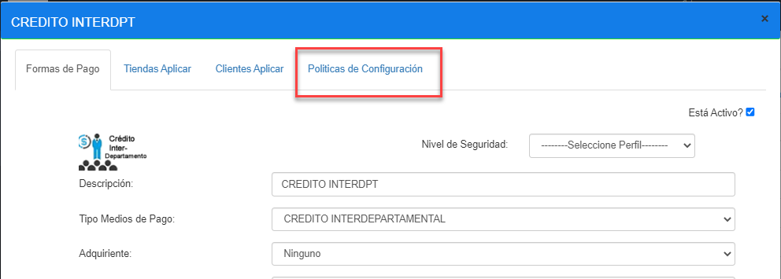
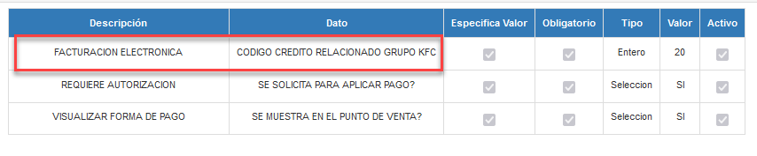
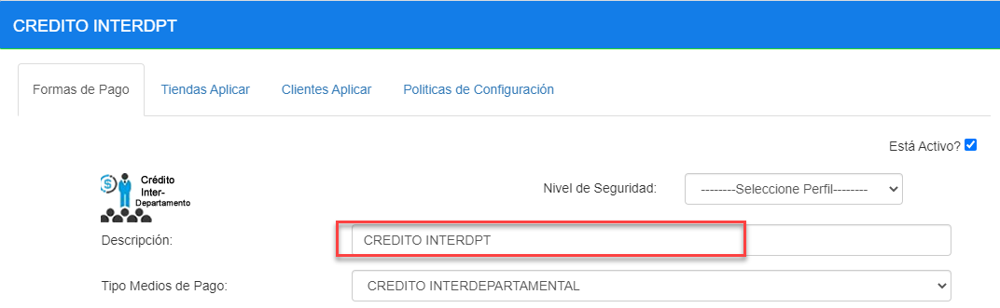
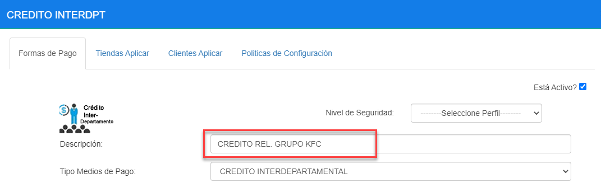
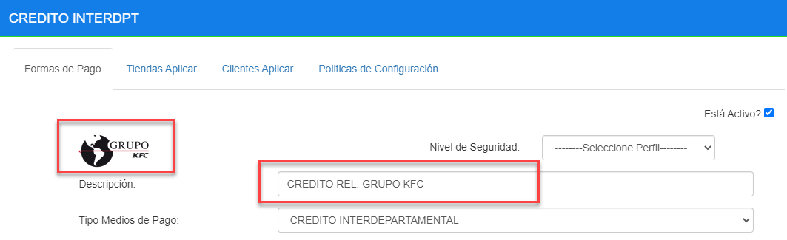
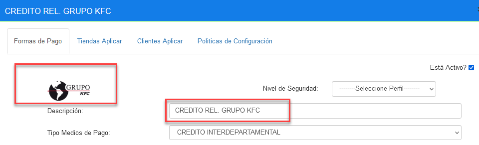
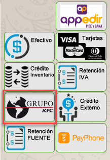
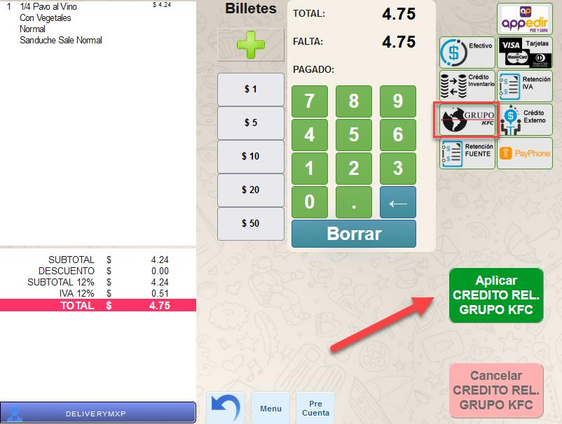

# Manual - Configuración Forma Pago Crédito Relacionado

**CONFIGURACIÓN FORMA PAGO – CRÉDITO RELACIONADO**

## 1 ANTECEDENTES

Actualmente en el sistema MaxPoint existe la forma pago llama CREDITO INTERDPT, se 
tiene la necesidad de realizar un cambio de nombre a esta forma de pago por CREDITO 
RELACIONDO GRUPO KFC.

## 2 OBJETIVO GENERAL

Modificar el nombre de la forma de pago CREDITO INTERDPT

### 2.1 Objetivos específicos

- Modificar el nombre de la política a nivel de formas pago para facturación 
electrónica

- Agregar una nueva imagen a la forma de pago

## 3 POLÍTICAS DE CONFIGURACIÓN

### 3.1 Datos Generales

En este manual se detalla cómo realizar el cambio del nuevo nombre de la forma de pago,
así como también su política de facturación electrónica y su correspondiente imagen.

### 3.2 Pantalla de Políticas

En Azure ingresar al sistema MXP backoffice con credenciales de administrador sistemas y 
seleccionar la cadena a la cual se realizará las configuraciones.

En el menú que se encuentra en la parte izquierda no dirigimos a la opción 
**SEGURIDADES** y seleccionamos **POLÍTICAS**, seguidamente presionamos sobre el 
botón **Ir a Administración Políticas** en el cual abrirá una nueva pestaña en el navegador.

Formas de Pago

### 3.3.1 Colección Formas de Pago

Antes de modificar la política de configuración; como primer paso se debe verificar que se 
encuentre creada.

Tabla 1. Colección Formas de Pago

|N°|Colección|Descripción|
|:----|:----|:----|
|1|FACTURACION ELECTRONICA|Colección que permite establecer las configuraciones necesarias parael envió de la forma de pago a Facturación electrónica .|

### 3.3.2 Colección de Datos Formas de Pago

Antes de modificar los parámetros de configuración, como primer paso se debe verificar 
que se encuentre creado.

**Antes de la modificación**

Tabla 2. Colección de Formas de Pago

|N°|Colección|Parámetro|Esp. Valor|Obligatorio|Tipo Dato|
|:----|:----|:----|:----|:----|:----|
|1|FACTURACION ELECTRONICA|CODIGO CREDITO INTERDPT|Si|Si|Entero|

**Después de la modificación**

Tabla 3. Colección de Formas de Pago

|N°|Colección|Parámetro|Esp. Valor|Obligatorio|Tipo Dato|
|:----|:----|:----|:----|:----|:----|
|1|FACTURACION ELECTRONICA|CODIGO CREDITO RELACIONADO GRUPO KFC|Si|Si|Entero|

### 3.3.3 Formas de Pago Colección de Datos

En el menú nos dirigimos a **GENERAL/FORMAS DE PAGO** y seleccionamos la opción 
**DEFINICIÓN**, buscamos y con doble click seleccionamos la forma de pago CREDITO 
INTERDPT; seguidamente seleccionamos la pestaña **Políticas de configuración.**

Como siguiente paso, verificar que ahora en la descripcion de la colección aparezca como:
CODIGO CREDITO RELACIONADO GRUPO KFC

### 3.4 Descripción forma pago

En el menú nos dirigimos a **GENERAL/FORMAS DE PAGO** y seleccionamos la opción 
**DEFINICIÓN**, buscamos y con doble click seleccionamos la forma de pago CREDITO 
INTERDPT.

En el campo descripción se debe realizar el cambio de nombre de la forma de pago por:

- CREDITO REL. GRUPO KFC

### 3.5 Imagen forma de pago

Dentro de la misma forma de pago, se debe actualizar la nueva imagen.
Nota: La imagen será adjunta al correo electrónico.

### 3.6 Forma de pago actualizada

Una vez actualizada la descripción e imagen de la forma de pago, debe quedar de la 
siguiente forma:

### 3.7 Punto de venta.

Una vez que el cambio a sido replicado hacia la tienda, en la pantalla de facturación se debe visualizar la actualización de la forma de pago

