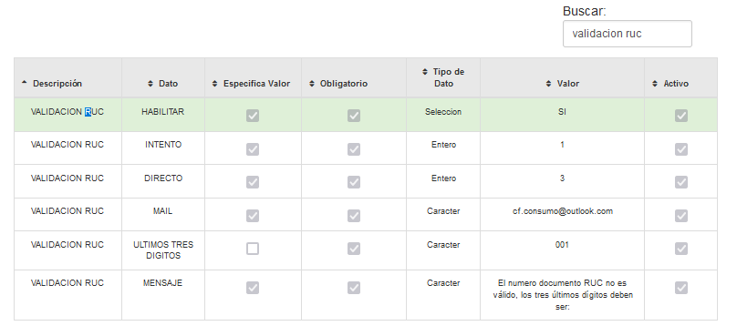
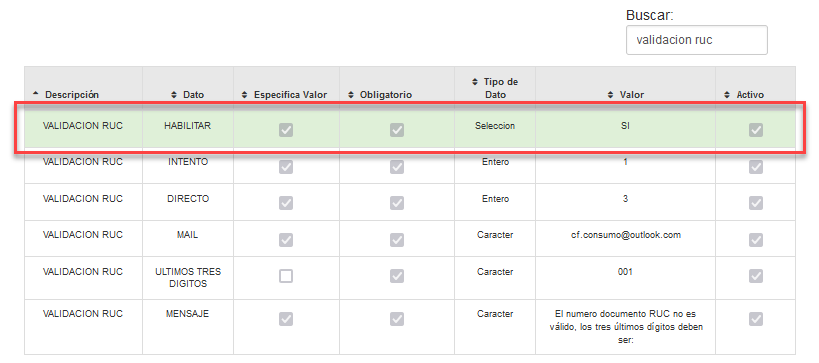
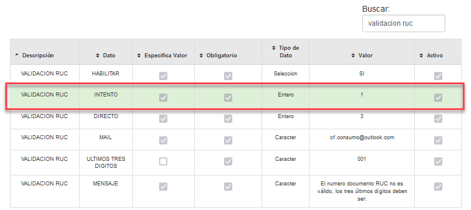
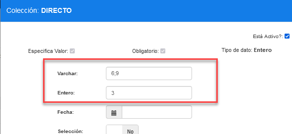
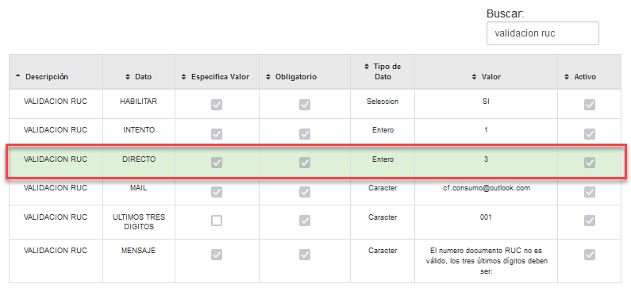
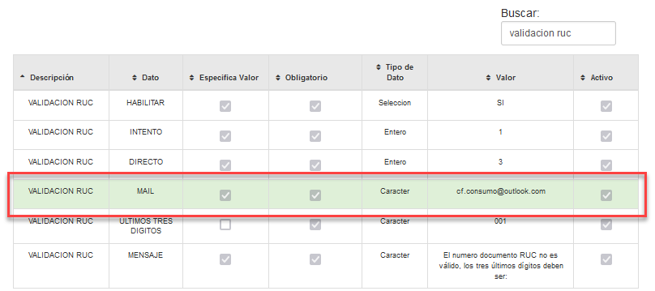
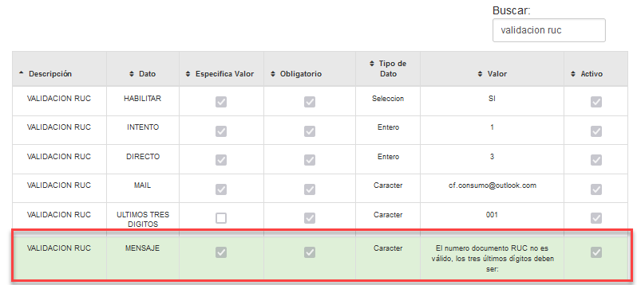

# Manual - Configuración Políticas Validacion RUC

**VALIDACIÓN RUC**

## 1 ANTECEDENTES
Actualmente en el sistema MaxPoint, se tiene la necesidad de realizar una configuración de 
políticas a nivel cadena que permita establecer cuál es el valor permitido para validar los 
documentos de clientes cuando es un RUC.

## 2 OBJETIVO GENERAL

Crear y configurar la política de cadena para establecer las validaciones de RUC

### 2.1 Objetivos específicos

- Configurar la política y parámetros a nivel de cadena “HABILITAR”
- Configurar la política y parámetros a nivel de cadena “INTENTO”
- Configurar la política y parámetros a nivel de cadena “DIRECTO”
- Configurar la política y parámetros a nivel de cadena “MAIL”
- Configurar la política y parámetros a nivel de cadena “ULTIMOS TRES DIGITOS”
- Configurar la política y parámetros a nivel de cadena “MENSAJE”

## 3 POLÍTICAS DE CONFIGURACIÓN

### 3.1 Datos Generales

En este manual se detalla cómo realizar la configuración de políticas que permitirán 
establecer los parámetros a ser utilizados para la factura y Nota Crédito.

A considerar:

- **HABILITAR**, Nos indicara si se habilitara las reglas o no las reglas de la 
validación de RUC 

- **INTENTO**, la cantidad de veces que se va a validar si está correctamente sin tener 
que pasar sin tener que ingresar las claves de Administrador.

- **DIRECTO**, Con esta regla podremos indicar desde cuando validamos el tercer 
digito y que dígitos son permitidos para pasar sin tener que pasar por el ingreso de 
la clave de administrador.

- **MAIL**, Correo por defecto para los clientes.

- **ULTIMOS TRES DIGITOS**, a través de esta política se especificará cual es el 
valor aceptado de los últimos tres dígitos del RUC.

- **MENSAJE**, será la descripción configurada que se visualizará en MXP cuando los 
tres últimos dígitos no cuadren con lo configurado.

### 3.2 Pantalla de Políticas

Se ingresará en sistema MXP backoffice con credenciales de administrador sistemas y 
seleccionar la cadena a la cual se realizará las configuraciones.

En el menú que se encuentra en la parte izquierda no dirigimos a la opción 
**SEGURIDADES** y seleccionamos **POLÍTICAS**, seguidamente presionamos sobre el 
botón **Ir a Administración Políticas** en el cual abrirá una nueva pestaña en el navegador.

### 3.3 Cadena

### 3.3.1 Colección Cadena

Antes de crear las políticas de configuración; como primer paso se debe verificar que no se 
encuentren creadas, de ser el caso validar que cada colección contenga los parámetros 
establecidos en este manual.

En la opción **Cadena** presionar sobre el botón **Nueva Colección**, se abrirá una modal para su creación ingresando los siguientes datos:

Tabla 1. Colección Cadena

|N°|Colección|Descripción|
|:----|:----|:----|
|1|VALIDACION RUC|Colección que permite establecer las configuraciones necesariascuando se ingresa un RUC.|

**Nota:** NO puede contener espacios en blanco al inicio y final del nombre de la colección; debe ser escrita tal y como se especifica en la tabla 1. 

**Colección:** Nombre de la colección que se especifica en la tabla 1.

**Módulo:** Menú.

**Observaciones:** Una descripción de la función que realizara dicha colección.

Una vez que se haya ingresado y seleccionado la información establecida procedemos a 

**Guardar.**

### 3.3.2 Colección de Datos Cadena

Antes de agregar los parámetros de configuración, como primer paso se debe verificar que 
no se encuentren creados, de ser el caso validar que cada parámetro contenga los valores 
establecidos en este manual.

Una vez creada la colección se debe proceder a crear los parámetros de configuración y 
para ello seleccionamos la colección y presionamos sobre el botón **Nuevo Parámetro** en la 
cual se abrirá una venta para su creación e ingresamos los siguientes datos:

Tabla 2. Colección de Datos Cadena

|Nº|Colección|Parámetro|Eso. Valor|Obligatorio|Ti po Dato|
|:----|:----|:----|:----|:----|:----|
|l|VALIDACION RUC|HABILITAR|SI|SI|Selección|
|2|VALIDACION RUC|INTENTO|SI|SI|Entero|
|3|VALIDACION RUC|DIRECTO|SI|SI|Entero|
|4|VALIDACION RUC|MAIL|SI|SI|Caracter|
|5|VALIDACION RUC|ULTIMOS TRES DIGITOS |SI|SI|Caracter|
|6|VALIDACION RUC|MENSAJE|SI|SI|Caracter|

**Nota:** NO puede contener espacios en blanco al inicio y final del parámetro; deben ser escritos tal y como se especifica en la tabla 2. 

**Parámetro:** Nombre del parámetro que se especifica en la tabla 2.

**Tipo de Dato:** Se especifica en la tabla 2.

**Especifica Valor:** Se especifica en la tabla 2

**Obligatorio:** Se especifica en la tabla 2.

Una vez que se haya ingresado y seleccionado la información establecida procedemos a 

**Guardar.**

### 3.3.3 Cadena Colección de Datos

En el menú nos dirigimos a **Cadena** y seleccionamos la opción **Cadena**, buscamos el o los 
menús a ser configurados y seguidamente seleccionamos la pestaña **Políticas de configuración.**

Para la configuración se debe presionar sobre el botón agregar “+”; el cual abrirá una 
ventana, seguidamente buscaremos la colección creada y agregamos el valor en los 
parámetros solicitados.

### 3.3.4 HABILITAR

En la tabla 3, se especifica los valores que deben ser configurados por cada parámetro 
colección.

Tabla 3. Valores de los parámetros de colección

|Colección: DESCUADRE DE PRECIOS|
|:----|

|Nº|Parámetro|Tipo Dato|Valor a ingresar|Descripción|
|:----|:----|:----|:----|:----|
|1|HABILITAR|Selección|SI|Para que se activen o desactiven las validaciones que se hacen en el RUC.|

Al realizar la configuración de todos los parámetros se debe tener lo siguiente:

### 3.3.5 INTENTO

En la tabla 4, se especifica los valores que deben ser configurados por cada parámetro 
colección.

Tabla 4. Valores de los parámetros de colección

|Colección: DESCUADRE DE PRECIOS|
|:----|

|Nº|Parámetro|Tipo Dato|Valor a ingresar|Descripción|
|:----|:----|:----|:----|:----|
|1|INTENTO|Entero|1|La cantidad de intentos hacer antes de salir el mensaje pidiendo autorización al administrador|

Al realizar la configuración de todos los parámetros se debe tener lo siguiente:

### 3.3.6 DIRECTO

En la tabla 4, se especifica los valores que deben ser configurados por cada parámetro 
colección.

Tabla 4. Valores de los parámetros de colección

|Nº|Parámetro|Tipo Dato|Valor a ingresar|Descripción|
|:----|:----|:----|:----|:----|
|l|DIRECTO|Entero|3|La cantidad de veces que esperara hasta validar el tercer digito,|
|2|DIRECTO|Varchar|6;9|Para pasar directamente sin pedir credenciales de administrador, los dígitos avalidar deben ser ingresadosen el campo Varchar y  separados por ;|

Al realizar la configuración de todos los parámetros se debe tener lo siguiente:

### 3.3.7 MAIL

En la tabla 4, se especifica los valores que deben ser configurados por cada parámetro 
colección.

Tabla 4. Valores de los parámetros de colección

|Colección: DESCUADRE DE PRECIOS|
|:----|

|Nº|Parámetro|Tipo Dato|Valor a ingresar|Descripción|
|:----|:----|:----|:----|:----|
|1|MAIL|CARACTER|cf.consumo@outlook.com|El correo es definido por contabilidad|

Al realizar la configuración de todos los parámetros se debe tener lo siguiente:

### 1.1.1 ULTIMOS TRES DIGITOS

En la tabla 5, se especifica los valores que deben ser configurados por cada parámetro 
colección.

Tabla 5. Valores de los parámetros de colección

|Nº|Parámetro|Tipo Dato|Valor a ingresar|Descripción|
|:----|:----|:----|:----|:----|
|1|ULTIMOS TRES DIGITOS|Varchar|001|Dígitos para validar un RUC|

Al realizar la configuración de todos los parámetros se debe tener lo siguiente:

### 1.1.2 MENSAJE

En la tabla 4, se especifica los valores que deben ser configurados por cada parámetro 
colección.

Tabla 4. Valores de los parámetros de colección

|Colección: DESCUADRE DE PRECIOS|
|:----|

|N°|Parámetro|Tipo Dato|Valor a ingresar|
|:----|:----|:----|:----|
|1|MENSAJE|Carácter|"El numero documento RUC no es válido, los tres últimos dígitos deben ser:|

Al realizar la configuración de todos los parámetros se debe tener lo siguiente:

