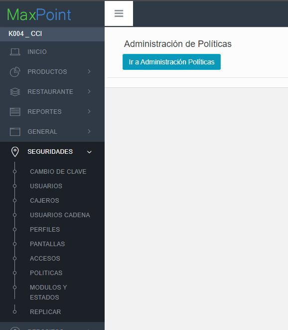
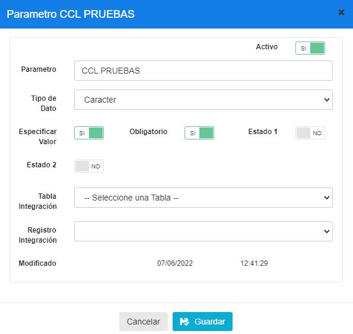
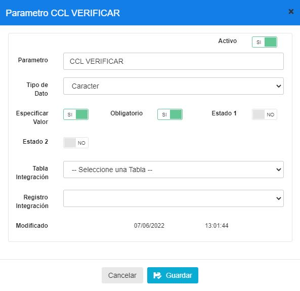
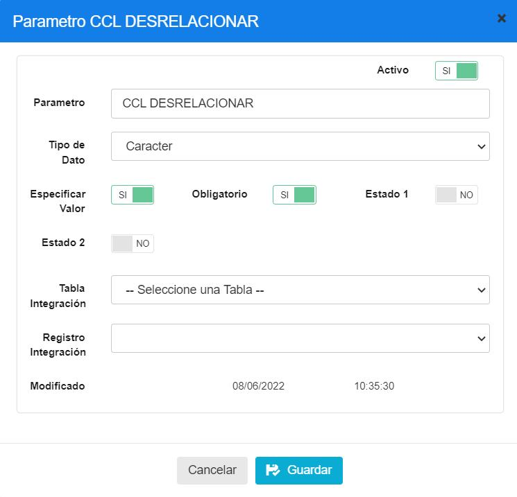
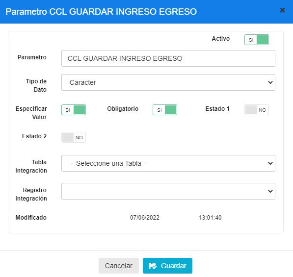
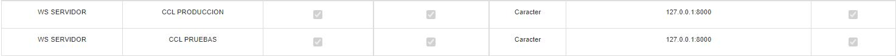
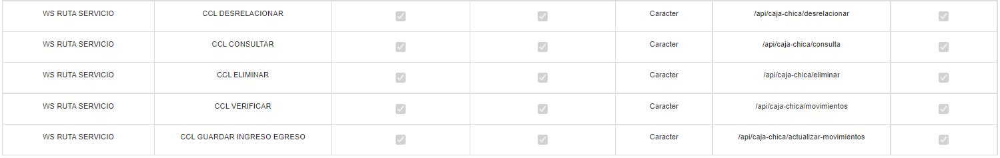

# Manual de politicas - CajaChica

**CONFIGURACIÓN POLÍTICA CAJA CHICA.**

## 1 ANTECEDENTES

El sistema Back office de MaxPoint recibirá una nueva funcionalidad que le permitirá ejecutar el proceso de caja chica. Para este efecto, será necesario crear y configurar las políticas correspondientes en el sistema.

## 2 OBJETIVO GENERAL

Crear y configurar las políticas y parámetros para la integración con la funcionalidad

### 2.1 Objetivos específicos

-Crear las políticas y parámetros a nivel de Cadena
-Configurar los parámetros de las políticas creadas

## 3 POLÍTICAS DE CONFIGURACIÓN

### 3.1 Datos Generales

En este manual se detalla cómo crear las políticas y parámetros de estas a nivel de cadena, que permitirán integrarse con la funcionalidad.

### 3.2 Pantalla de Políticas

Ingresar al sistema MaxPoint BackOffice con credenciales de administrador sistemas.
En el menú que se encuentra en la parte izquierda no dirigimos a la opción **SEGURIDADES** y seleccionamos **POLÍTICAS**, seguidamente presionamos sobre el botón **Ir a Administración Políticas** en el cual abrirá una nueva pestaña en el navegador.

3.3 Cadena 

3.3.1 Parámetro de Colección

Antes de agregar los parámetros de configuración mostrados en la tabla 3, se debe verificar
si ya encuentren creados. De ser el caso validar que cada parámetro contenga los valores
establecidos en este manual.

 Si alguno de los parámetros NO existe dentro de la **Colección** especificada en la Tabla 3, sedebe crearla así:

Seleccionamos la colección y presionamos sobre el botón **Nuevo Parámetro** en la cual se
abrirá una venta para su creación y para cada Parámetro ingresamos los siguientes datos:
Tabla 3. Datos Parámetros de Colección de Datos Cadena

| Colección | Parámetro | Tipo Dato | Esp.Valor | Obligatorio | Estado 1 | Estado 2 |
|---|---|---|---|---|---|---|
| WS SERVIDOR | CCL PRODUCCION | Caracter | SI |   SI | NO | NO |
| WS SERVIDOR | CCL PRUEBAS | Caracter | SI |   SI | NO | NO |
| WS RUTA SERVICIO | CCL VERIFICAR | Caracter |   SI | SI | NO | NO |
| WS RUTA SERVICIO | CCL GUARDAR INGRESO EGRESO | Caracter |   SI | SI | NO | NO |
| WS RUTA SERVICIO | CCL DESRELACIONAR | Caracter | SI |   SI | NO | NO |
| WS RUTA SERVICIO | CCL CONSULTAR | Caracter | SI |   SI | NO | NO |
| WS RUTA SERVICIO | CCL ELIMINAR | Caracter | SI |   SI | NO | NO |

**Nota:** NO puede contener espacios en blanco al inicio y final del parámetro; deben ser
escritos tal y como se especifica en la tabla 3. 

**Parámetro:** Nombre del parámetro que se especifica en la tabla 3.

 **Tipo de Dato:** Se especifica en la tabla 3. 
 
 **Especificar Valor:** Se especifica en la tabla 3.
 
  **Obligatorio:** Se especifica en la tabla 3.
  
   **Estado 1:** Se especifica en la tabla 3. 
   
   **Estado 2:** Se especifica en la tabla 3. Una vez que se haya ingresado y seleccionado la información establecida procedemos a

**Guardar.** 

Se deben crear todos los parámetros de configuración establecidos en la tabla 3. Se
presentan los modales de configuración de cada parámetro a continuación:

### 3.3.2 Cadena Colección de Datos

En el menú principal del BackOffice de MaxpOint, nos dirigimos a **Cadena** y
seleccionamos la opción **CADENA**, seguidamente seleccionamos la pestaña **Políticas de configuración.**

Para la configuración se debe presionar sobre el botón agregar “+”; el cual abrirá una
ventana, seguidamente buscaremos la colección creada y agregamos el valor en los
parametros solicitados. Para cada uno de los parametros

‘CCL PRODUCCION’

‘CCL PRUEBAS’

‘CCL VERIFICAR’

‘CCL GUARDAR INGRESO EGRESO’

‘CCL DESRELACIONAR’

‘CCL CONSULTAR’ 10

‘CCL ELIMINAR’ 

crearlos y llenar sus valores como se muestra en la tabla a continuación:

Tabla 4. Parámetros de la colección

|Nº|Dato|Valor|
|:----|:----|:----|
|1|CCL PRODUCCION|sirintegration.azurevebsites.net|
|2|CCL PRUEBAS|sirintegrationpaises-dev.azure\ve bsites.net|
|3|CCL DESRELACIONAR|/api/caja -chica/desrelacionar|
|4|CCL CONSULTAR|/api/caja-chica/consulta|
|4|CCL ELIMINAR|/api/caja-chica/eliminar|
|4|CCL VERIFICAR|/api/caja-chica/movimientos|
|4|CCL GUARDAR  INGRESO EGRESO|/api/caja-chica/actualizar-movimientos|

Si se ha realizado correctamente, se debe mostrar así:

### 3.3.3 Puntos a considerar

1. Cada uno de los parámetros deben configurarse (escribirse) exactamente como está
en este manual, respetando mayúsculas y minúsculas.