# Manual de Configuración politicas UBER

**Manual DE CONFIGURACION de Integracion con UBER**

## 1 DESCRIPCIÓN

Este manual se ha desarrollado para detallar el proceso de configuración respecto a las políticas de configuración necesarias para que funcione correctamente la función de creación de orden y asignación de motorizado de manera automatizada en Maxpoint.

## 2 PROCEDIMIENTO

Para ingresar a las configuraciones de políticas iniciamos sesión en el BackOffice de MAXPOINT  

## 3 Configuración de políticas por cadena WS CONFIGURACIONES

**Nota: Esta política ya existe (configuración web), en caso de que no exista se debe crear de la siguiente manera:**

Nos dirigimos al módulo de SEGURIDADES y luego damos clic en la opción de POLÍTICAS.

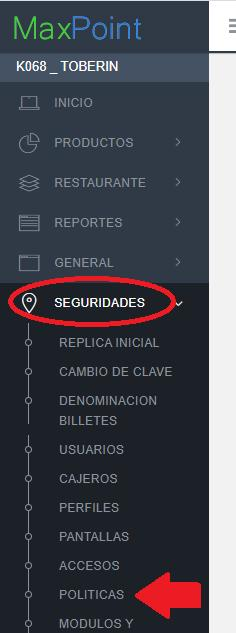

Damos clic en “Ir a Administración Políticas”.

Nos ubicamos en las políticas por “Cadena”, y damos clic en botón “Nueva Colección”.

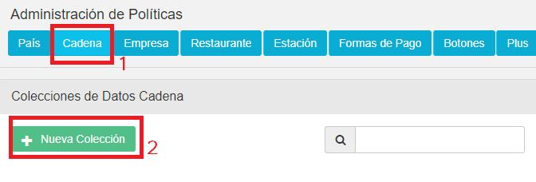

En descripción colocamos “**WS CONFIGURACIONES**”, **o verificamos si ya existe.**

La política creada se muestra de la siguiente manera, o en caso de EXISTIR solo verificarla que conste en el listado.

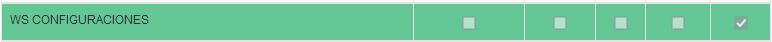

Otra de las políticas a ser creadas o validar si ya existen es la siguiente:
En descripción colocamos “**WS RUTA SERVICIO**”, o verificamos si ya existe.

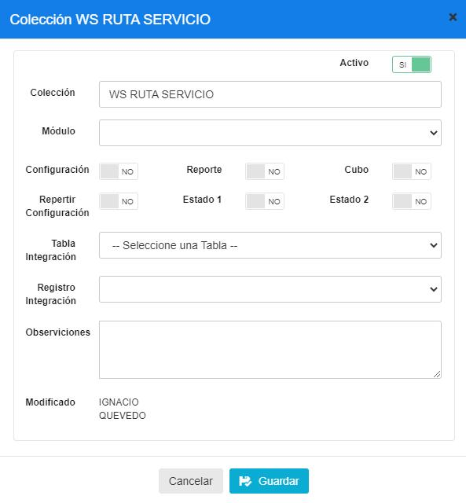

La política creada se muestra de la siguiente manera.

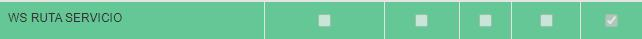

Otra de las políticas a ser creadas o validar si ya existen es la siguiente:
En descripción colocamos “**WS SERVIDOR**”, o verificamos si ya existe.

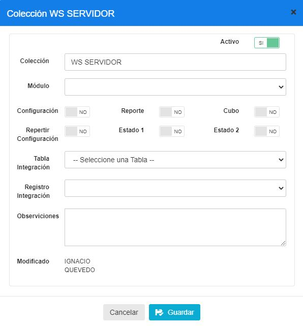

La política creada se muestra de la siguiente manera.

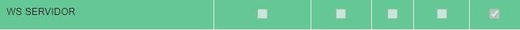

### 3.1.1 Parámetros de la política WS CONFIGURACIONES

Se deberá añadir este nuevo parámetro dentro de la política creada/verificada anteriormente.

| | | | | |
|-|-|-|-|-|
|**Nombre del parametro**|**Esp. Valor**|**Obligatorio**|**Tipo Dato**|**Valor por configurar**|
|UBER - TOKEN CREDENTIALS|SI|SI|Caracter|Debe contener las credenciales generadas en la pagina de UBER, este tiene el  formato detallado |
|UBER - TOKEN EXPIRACION|SI|SI|Entero|43200|
|UBER - CUSTOMER ID|SI|SI|Caracter|Debe contener el customer id generado en la pagina de UBER, este tiene el  formato detallado .|
|UBER - TIEMPO PREPARACION|SI|SI|Entero|10|
|UBER - TIEMPO ENTREGA|SI|SI|Entero|50|
|UBER - MEDIDA|SI|SI|Caracter|small|

 EJEMPLO DE TOKEN CREDENTIALS:

"client_id":"BBH5Y2QQwI0ogPowfeD2d3XKCXKdeN5T","client_secret":"rT- Z7Q178qBgmMnAubI_8BQeOuoMM3GnhhSKRR5M","grant_type":"client_credentials","scope": "eats.deliveries"

**NOTA:** ESTO SE DEBE GENERAR EN LA 

b40acaa2-f3db-5e17-aaf4-1e7c2e842d45

### 3.1.2 Explicación parámetros de la política WS CONFIGURACIONES

|Nombre del parámetro|Campo|Descripción|
|:----|:----|:----|
|UBER - TOKEN CREDENTIALS|Caracter|Política que proporciona las credenciales para el acceso al servicio de UBER,se deben generar en el portal de UBER.| |
|UBER - TOKEN EXPIRACION|Entero|Indica el tiempo en minutos en el que expira eltoken obtenido con las credenciales.| |
|UBER - CUSTOMER ID|Caracter|Política que proporciona el CUSTOM ER ID para el acceso al servicio de UBER,se deben generar en el portal de UBER.| |
|UBER - TIEMPO PREPARACION|Entero|Indica el tiempo en minutos en el que se prepara el pedido en la cocina.| |
|UBER - TIEMPO ENT REGA|Entero|Indica el tiempo en minutos en el que debe ser ent regado el pedido alcliente.| |
|UBER - MEDIDA|Caracter|Indica el tamaño del paquete a ser entregado por el delivery: small,médium, large,x la rge|
| | |

La política con el nuevo parámetro “UBER - TOKEN CREDENTIALS” bien configurada deberá
quedar de la siguiente manera:

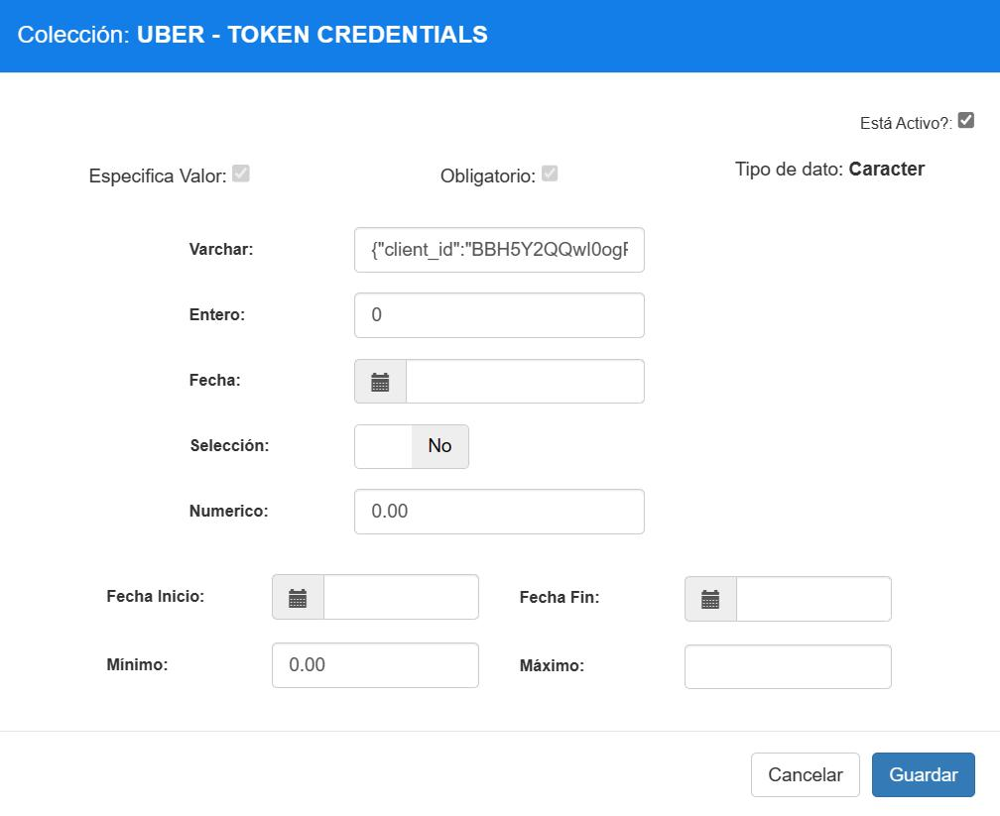

La política con el nuevo parámetro “UBER - TOKEN EXPIRACION” bien configurada deberá
quedar de la siguiente manera:

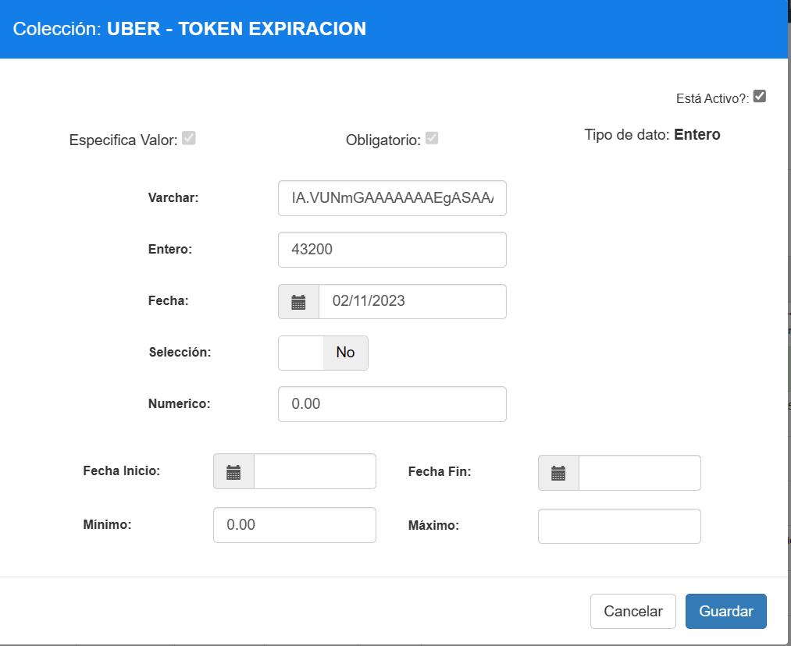

La política con el nuevo parámetro “UBER - CUSTOMER ID” bien configurada deberá quedar de
la siguiente manera:

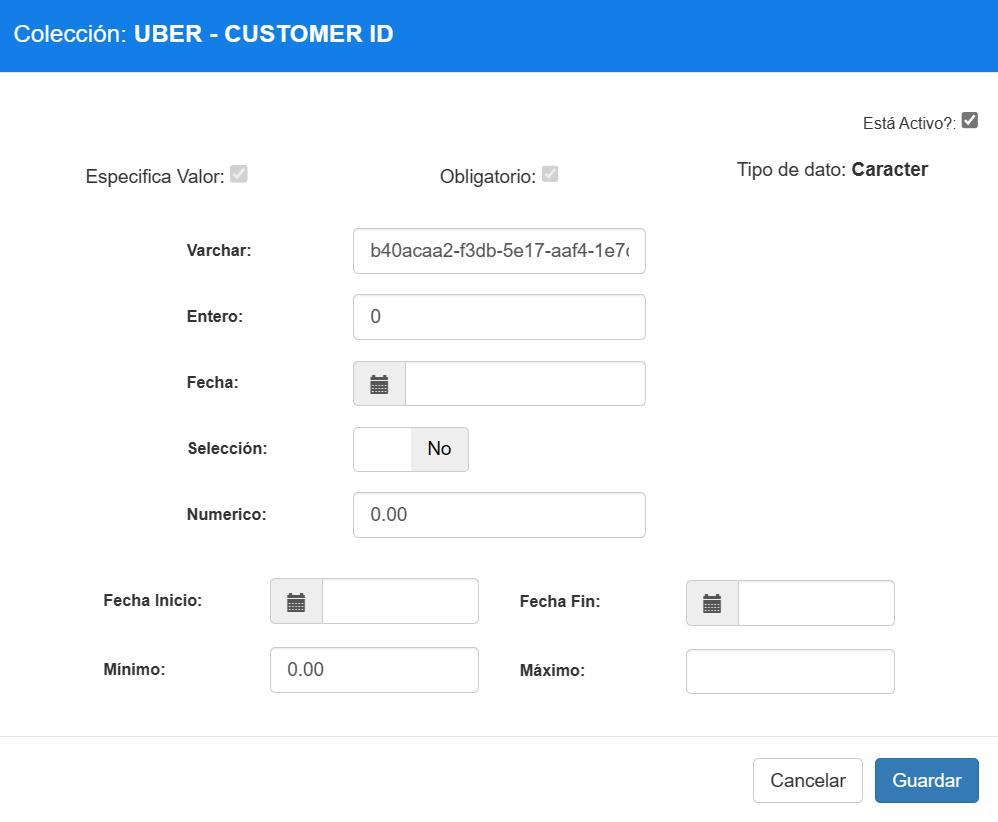

### 3.1.3 Parámetros de la política WS RUTA SERVICIO

Se deberá añadir este nuevo parámetro dentro de la política creada/verificada anteriormente.

|Nombre del parámetro|Esp. Valor|Obligatorio|Tipo Dato|Valor por configurar|
|:----|:----|:----|:----|:----|
|UBER AUTH TOKEN|SI|SI|Carácter|/oaut h/v2/token|
|UBER CREAR ORDEN|SI|SI|Carácter|/vl/customers/id/deliveries|
|UBER API CREAR ORDEN|SI|SI|Carácter|/api/cambio_estados/ApiControllerlntegration|

### 3.1.4 Explicación parámetros de la política WS RUTA SERVICIO

|Nombre del parámetro|Campo|Descripción|
|:----|:----|:----|
|UBER AUTH TOKEN|Carácter|Ruta que permite autenticarnos con las credenciales en UBER.|
|UBER CREAR ORDEN|Carácter|Ruta que permite crear la orden en UBER.|
|UBER API CREAR ORDEN|Carácter|Ruta del api webhook agregadores que permite crear la orden.|

### 3.1.5 Parámetros de la política WS SERVIDOR

Se deberá añadir este parámetro dentro de la política creada/verificada anteriormente.

|Nombre del parámetro|Valor|Obligatorio|Tipo Dato|Valor por configurar|
|:----|:----|:----|:----|:----|
|UBER PRODUCCION|SI|SI|Carácter|https://api.uber.com|
|UBER  PRUEBAS|SI|SI|Carácter|https://api.uber.com|
|UBER AUTH PRODUCCION|SI|SI|Carácter|https://login.uber.com|
|UBER AUTH PRUEBAS|SI|SI|Carácter|https://login.uber.com|
|UBER API PRODUCCION|SI|SI|Carácter|20.75.65.80|
|UBER   API PRUEBAS|SI|SI|Carácter|20.75.65.80|

### 3.1.6 Explicación parámetros de la política WS SERVIDOR

|Nombre del parámetro|Campo|Descripción| |
|:----|:----|:----|:----|
|UBER PRODUCCION|Carácter|Host de conexión a UBER para manejar  pedidos  producción| |
|UBER PRUEBAS|Carácter|Host de conexión a UBER para manejar  pedidos para prueba| |
|UBER AUTH PRODUCCION|Carácter|Host de conexión a UBER para manejar                         producción| |
|UBER AUTH PRUEBAS|Carácter|Host de conexión a UBER para manejar autenticación para prueba| |
|UBER API PRODUCC ION|Carácter|Host de api webhook agregadores para manejar pedidos producción| |
|UBER API PRUEBAS|Carácter|Host de api webhook agregadores para manejar pedidos para prueba| |

## 4 Configuración de políticas por restaurante CONFIGURACION DELIVERY

Nos dirigimos al módulo de SEGURIDADES y luego damos clic en la opción de POLÍTICAS.

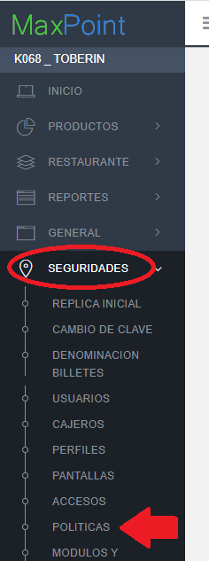

Damos clic en “Ir a Administración Políticas”.

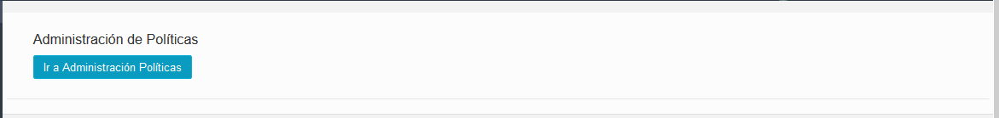

Nos ubicamos en las políticas por “**Restaurante**”, y damos clic en botón “**Nueva Colección**”.

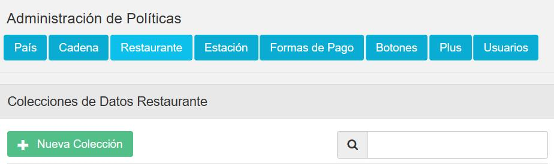

En descripción colocamos “**CONFIGURACION DELIVERY**”.

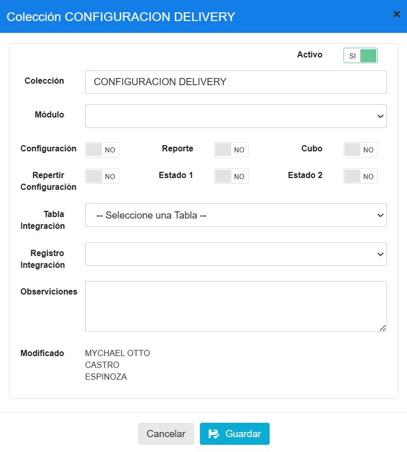

La política creada se muestra de la siguiente manera:

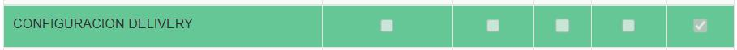

### 4.1.1 Parámetros de la política CONFIGURACION DELIVERY

Se deberá añadir este nuevo parámetro dentro de la política creada/verificada anteriormente.

|Nombre del parámetro|Esp.Valor|Obligatorio|Tipo Dato|Valor por configurar|
|:----|:----|:----|:----|:----|
|ENVIO INMEDIATO|SI|SI|Selección|NO|

### 4.1.2 Explicación parámetros de la política WS CONFIGURACIONES

|Nombre del parámetro|Campo|Descripción|
|:----|:----|:----|
|ENVIO INMEDIATO|Selección|Especifica si el pedido que ingresa al sistema debe asignar el motorizado con el proveedor de forma inmediata sin necesidad de facturar.|

## 5 Configuración de política lista medio

 Nota: Esta política ya existe, a nivel de restaurante por lo que vamos a ir a modificar la política a nivel de restaurante, esto lo hacemos en el MEDIO que se requiera contar con el proveedor UBER. 

 PARA ESTE PILOTO, CONFIGURAR EL MEDIO WEB. 

 Nos dirigimos al módulo de RESTAURANTE y luego damos clic en la opción de RESTAURANTE.

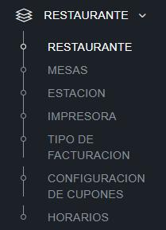

 Entramos a las configuraciones del restaurante que se desea configurar y aquí dentro
buscamos la política llamada “LISTA MEDIO”, vamos a encontrar varios medios, ubicamos el
medio que se desea modificar, para este caso tendremos de ejemplo: “LISTA MEDIO WEB” y
“LISTA MEDIO CALL CENTER”, y de la lista que aparece modificamos el que se denomina
“CAMBIO ESTADOS AUTOMÁTICO”.

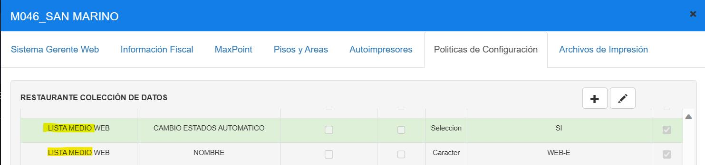

Una vez que le damos clic al botón editar, nos aparece un solo proveedor, este lo modificamos
y le asignamos el proveedor “UBER” en **mayúscula**, quedando de la siguiente forma:

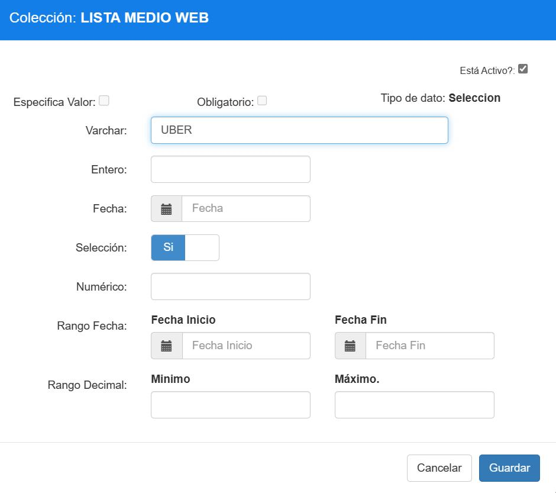

 HASTA AQUÍ ES LO QUE HAY QUE CONFIGURAR PARA ESTE PILOTO. 

**EN CASO QUE SENECESITE CONFIGURAR MAS DE 1 PROVEEDOR.**

 NOTA: ESTAS CONFIGURACIONES NO SE DEBEN APLICAR, SOLO SI SE SOLICITA POR EL ADMINISTRADOR DE LA TIENDA. 

Así mismo se puede configurar más de un proveedor, esto permite tener dos o más
proveedores, en el caso de ser necesario debe ponerse los proveedores separados por “,”, quedando de la siguiente forma “PEDIDOSYA, UBER”, como en el ejemplo a continuación, para este piloto no se usan varios proveedores:

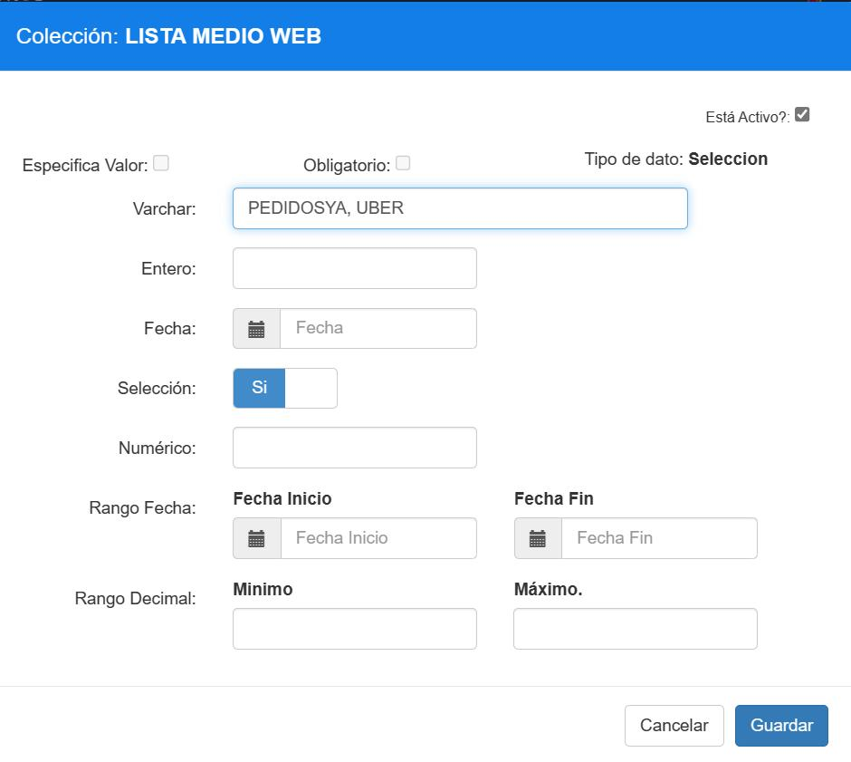

NOTA IMPORTANTE: LA POLÍTICA ES DE TIPO SELECCIÓN, PERO TAMBIEN SE CONSIDERA SU VALOR DE VARCHAR, POR LO CUAL DEBE QUEDAR CONFIGURADO EN “SI”, Y EN VARCHAR EL
VALOR DEL PROVEDOR O LOS PROVEEDORES SEPARADOS POR COMA “,”.

