# Manual voucher aerolineas

**CONFIGURACIÓN VOUCHER AEROLINEAS**

## 1 Configuración Voucher Aerolineas

## 1.1 Configuración BackOffice

Para configurar voucher debemos ir al menú cadena

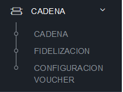

### 1.2 Agregar nuevo cliente

En la barra superior presionamos nuevo

Se desplegará un formulario modal para poder buscar los clientes mediante web services a la 
master data clientes. Existen dos opciones cliente externo y relacionado

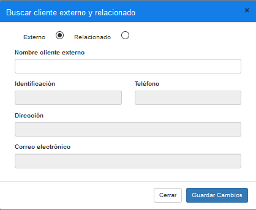

Al buscar el nombre se desplegará una lista de clientes y elegimos uno

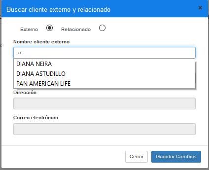
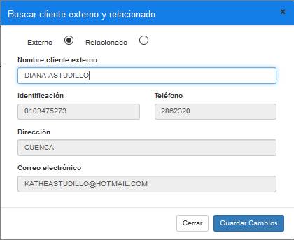

Guardamos los cambios y los clientes se visualiza en la tabla de clientes externos

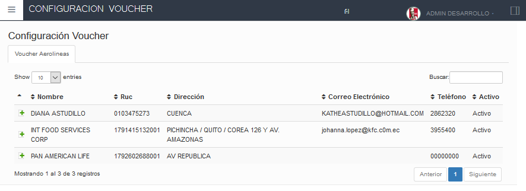

### 1.3 Guardar monto del voucher

Damos click en expandir los datos de voucher

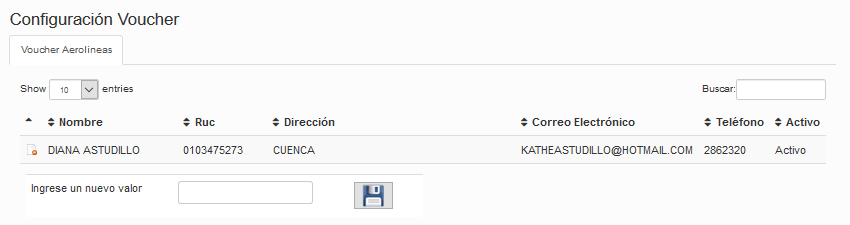

Ingresamos un valor del voucher y guardamos

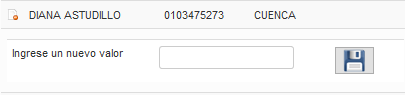
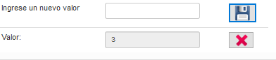

### 1.4 Eliminar monto voucher

## 2 Configuración de políticas

2.1 Configuración de política visualiza botón

La siguiente política de restaurante tiene como finalidad, la visualización del botón voucher.

Colección de datos restaurante

Colección: CONFIGURACION AEROLINEAS

Parámetro: VISUALIZA BOTON

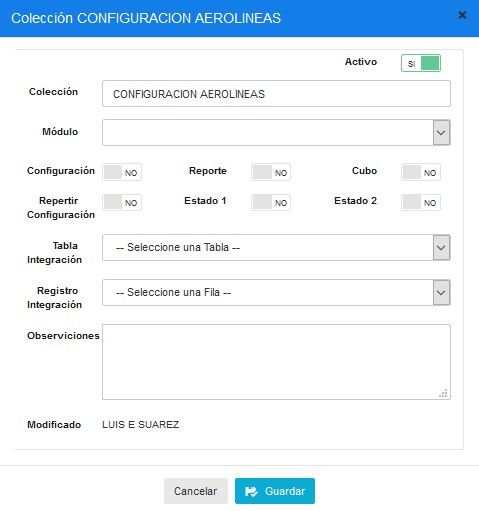
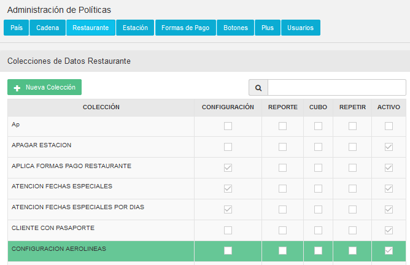
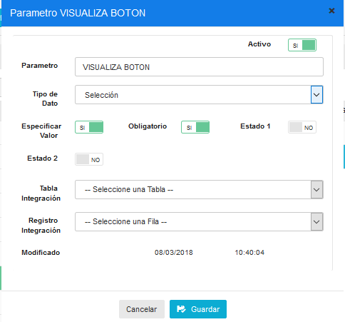
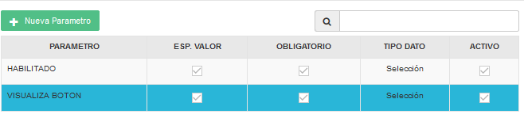

En la política de restaurante vamos a configurar los siguiente si deseamos que se visualice el botón en el sitio POS.

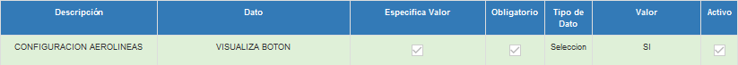

2.2 Configuración de política (separar cuenta al exceder voucher)
La siguiente funcionalidad de la política de restaurante es separar cuenta siempre y cuanto 
excede el monto total del voucher configurado.

Colección de datos restaurante

Colección: SEPARAR CUENTAS AL EXCEDER VOUCHER

Parámetro: HABILITADO

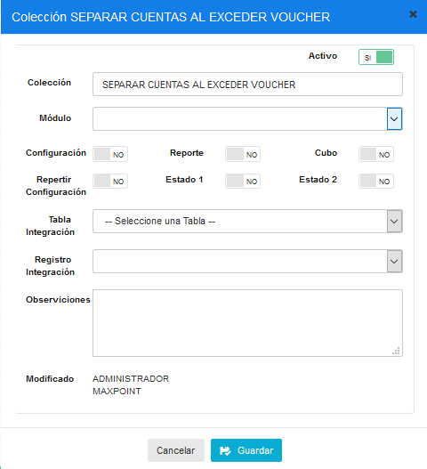
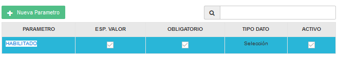
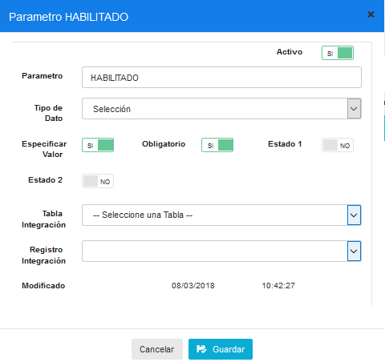

El siguiente mensaje confirma si se desea hacer separar cuentas. Siempre y cuando la política este activada

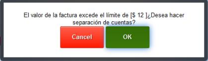