# Manual Configuracion Vitality

**MANUAL DE CONFIGURACION PROCESO VITALITY**

## 1 OBJETIVOS

- Conocer sobre las diferentes configuraciones que se deben realizar antes de 
poner en producción el desarrollo de vitality para evitar inconvenientes en el 
proceso.

## 2 MANUAL CONFIGURACION PROCESO VITALITY. 

### 2.1 DATOS GENERALES

En este manual se detalla las configuraciones que deben hacerse en el backoffice de 
Maxpoint para que el proceso vitality funcione de la mejor manera correcta.

### 2.2 CONFIGURACION DE POLITICAS BACKEND MAXPOINT

Para poder configurar las políticas de Maxpoint como primer punto debemos ingresar al 
backend. Para ello ingresamos al mantenimiento de MaxPoint con las credenciales y 
seleccionamos la cadena a la cual vamos a configurar. Una vez ingresada en a la cadena 
nos vamos a la opción SEGURIDADES y luego a la pestaña políticas.

### 2.2.1 CONFIGURACION POLITICAS CADENA – WS SERVIDOR VITALITY

Dentro de la pestaña políticas seleccionamos la opción cadena, buscaremos la opción **WS SERVIDOR** como muestra las imágenes a continuación.

**Configuración de Servidor:**

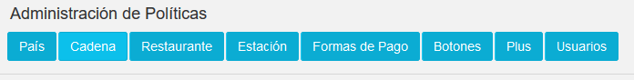

**Menú Pantalla de Políticas en Seguridades.**

Encontrada la colección, debemos dar clic sobre ella y se desplegará todos los 
parámetros disponibles.

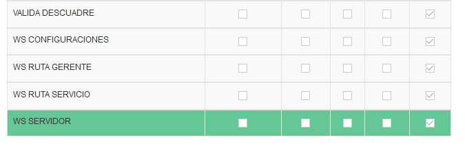

**Colecciones de Datos Pantalla de Políticas en Seguridades – Cadena.**/

Debemos crear un nuevo parámetro pulsando sobre la opción 
y configuraremos de la siguiente manera:

 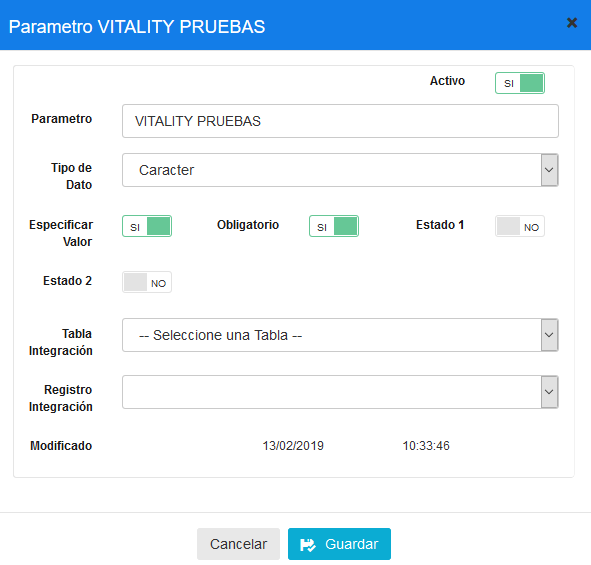

 **Configuración del Parámetro Vitality en WS Servidor.**

Terminado el proceso anterior debe aparecer de la siguiente forma los parámetros 
configurados.

 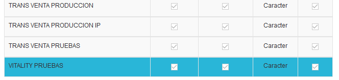

**Configuración del Parámetro Vitality en WS Servidor.**

### 2.2.2 CONFIGURACION POLITICAS CADENA – WS RUTA SERVICIO VITALITY

Dentro de la pestaña políticas seleccionamos la opción cadena, buscaremos la opción **WS 
RUTA SERVICIO** como muestra las imágenes a continuación.

*Configuración de Rutas de Servicio Vitality*

 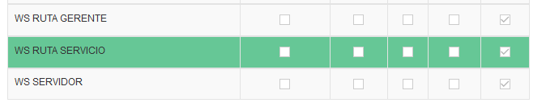

Encontrada la colección, debemos dar clic sobre ella y se desplegará todos los 
parámetros disponibles. 

Se crearán varios parámetros que servirán para consumir los datos de TRADE. Los 
parámetros mencionados serán los siguientes:

1. **VITALITY CANJE**

2. **VITALITY SEGURIDAD**

3. **VITALITY TRANSACCIONES**

4. **VITALITY TRANSACCIONES LOG**

Cada uno de estos parámetros nombrados se crearán de la siguiente manera:

Dar clic sobre la opción    y configuraremos de la siguiente 
manera:

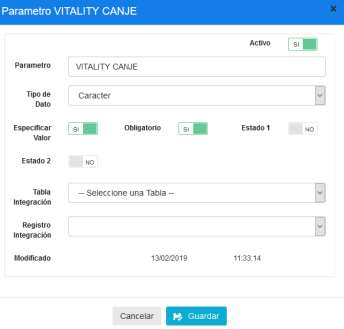 

**Configuración del Parámetro Vitality en WS Ruta Servicio-Vitality Canje.**

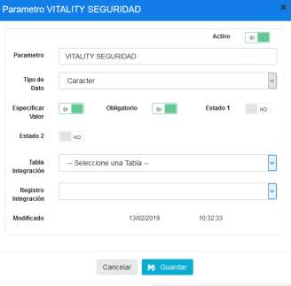

**Configuración del Parámetro Vitality en WS Ruta Servicio-Vitality Seguridad**

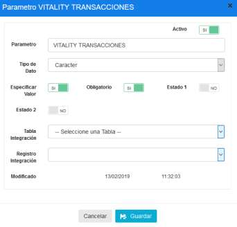

**Configuración del Parámetro Vitality en WS Ruta Servicio--Vitality Transacciones.**

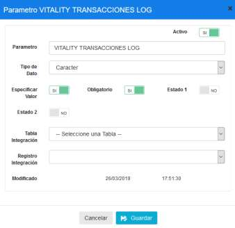

**Configuración del Parámetro Vitality en WS Ruta Servicio-Vitality Transacciones Log.**

Terminado el proceso anterior debe aparecer de la siguiente forma los parámetros 
configurados.

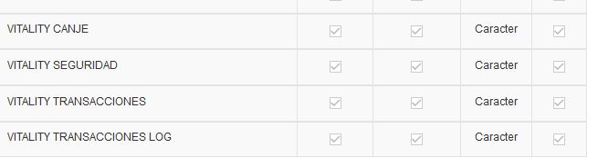

**Configuración del Parámetro Vitality en WS Ruta Servicio.**

### 2.2.3 CONFIGURACION POLITICAS CADENA – CONFIGURACION VITALITY

La siguiente política de colección de cadena no existe por lo cual debemos pulsar sobre 
la opción   y llenar la siguiente pantalla con la información 
mostrada en la imagen:

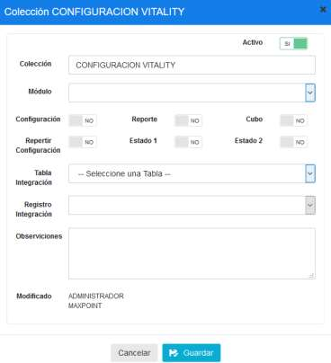 

**Configuración de la colección Configuración Vitality.**

Realizado este paso se debería visualizar de la siguiente manera:

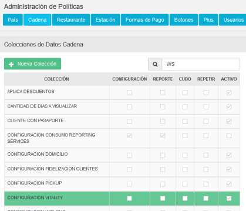 

Como siguiente paso daremos clic sobre nuestra colección creada y pulsaremos sobre la 
opción   y configuraremos de la siguiente forma:

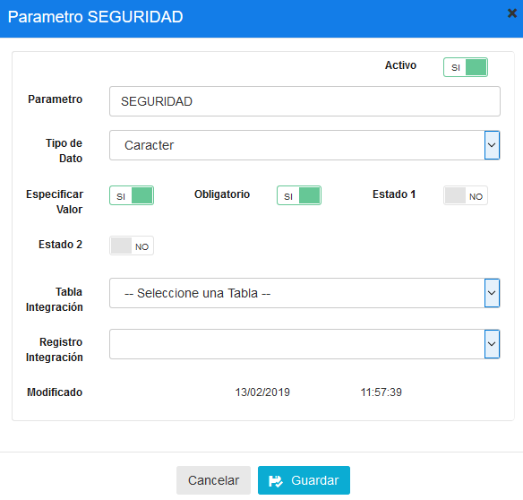 

**Configuración del Parámetro Configuración Vitality- Seguridad.**

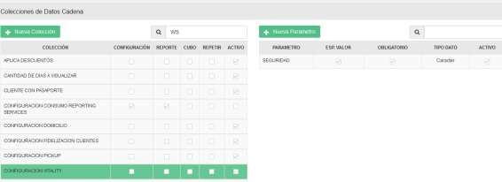 

**Resultado de Configuraciones nombradas anteriormente**

### 2.3 CONFIGURACION DE POLITICAS OPCION CADENA –CADENA 

Como ya hemos acabado de configurar las políticas, es momento de darles un valor a 
las mismas para ello nos dirigimos a la pesta;a cadena dentro del backoffice y 
seleccionaremos CADENA. Luego daremos clic sobre las políticas de configuración y 
pulsaremos sobre la opción  

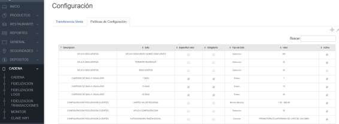

**Configuración de Cadena –Políticas de Configuración.**

Una vez pulsado el botón llenaremos todas las políticas creadas con la siguiente 
información:

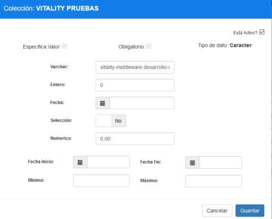

**Configuración de Política Vitality – Valor Servidor.**

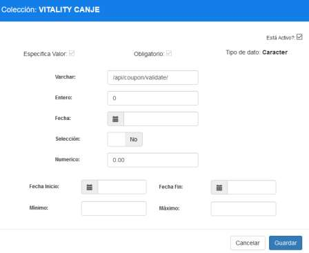

**Configuración de Política Vitality – Valor Ruta Canjes.**

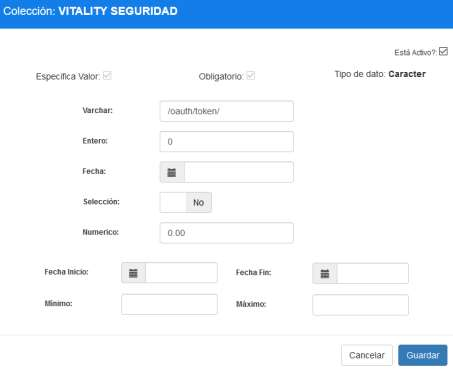

**Configuración de Política Vitality – Valor Ruta Seguridad.**

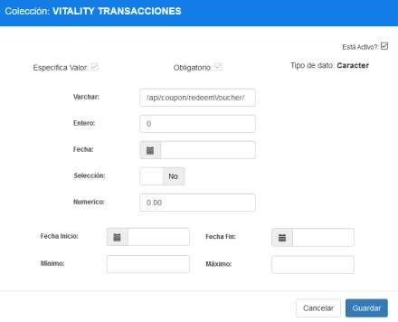

**Configuración de Política Vitality – Valor Ruta Transacciones.**

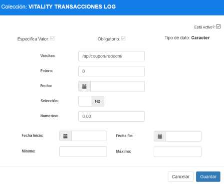

**Configuración de Política Vitality – Valor Ruta Transacciones Log.**

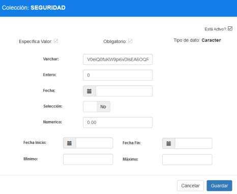

**Configuración de Política Vitality – Valor Ruta Seguridad Token.**

Una vez terminada la configuración de todas las políticas creadas anteriormente se debe 
visualizar de la siguiente forma:

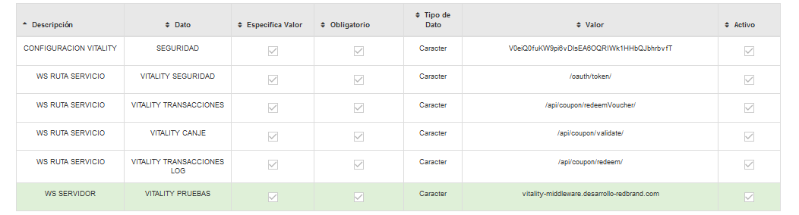

### 2.4 CONFIGURACION DE MENU VITALITY

La configuración de menú vitality es muy sencilla, siguiendo los pasos a continuación:

1. Ingresar a la pestaña **PRODUCTOS.**

2. Seleccionar **PAGINA DE MENU.**

3. Se visualizará la Página de menú de la siguiente manera.

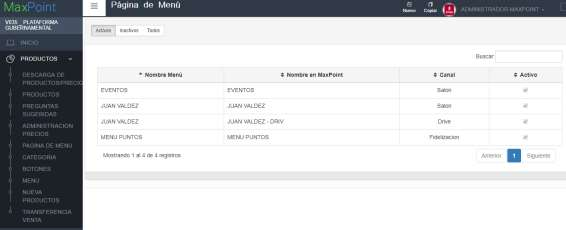

4. Dar clic sobre la opción **Nuevo** en el menú superior.

5. Agregar la siguiente información a la pantalla que se mostrará.

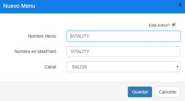

6. Guardamos el menú creado anteriormente.

7. Dar clic en opción Menú en la pestaña de productos.

8. En el menú desplegable seleccionaremos el menú creado y arrastraremos las 

categorías y productos correspondientes.

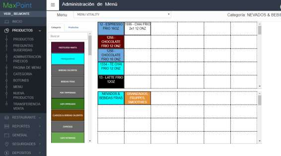

### 2.5 CONFIGURACION DE FORMA DE PAGO 

Para configurar la forma de pago vitality debemos seguir los siguientes pasos:

1. Ingresas en el BackOffice de MaxPoint(mantenimiento)

2. Escoger la cadena a configurar.

3. Acceder a la pestaña **GENERAL**, luego al submenú **FORMAS DE PAGO** e ingresar a la 
pantalla de **DEFINICION**.

4. Agregar una nueva forma de pago en la opción  .

5. Configurar la forma de pago VITALITY (Forma de Pago crédito externo) como la 
siguiente imagen:

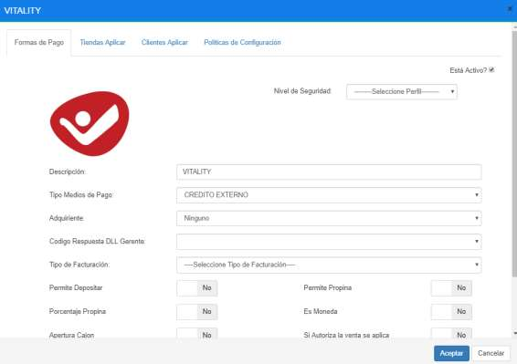

6. Al crear la forma de pago se agregan de manera automática dos políticas de 
configuración.

a. Requiere autorización – Se solicita para aplicar forma de Pago

b. Visualizar forma de pago-se muestra en el punto de venta.

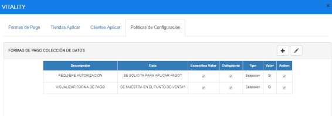

**Nota:** 

i. Si no se agregan de manera automática, debemos añadirlas.

ii. Al terminar la configuración se debe verificar que la forma de pago se 
vea de la siguiente manera:

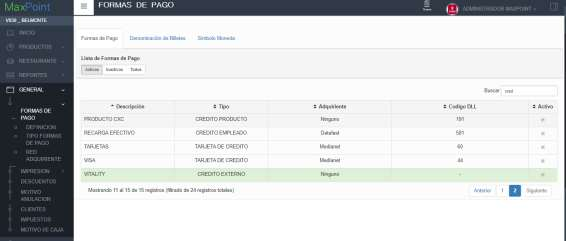

### 2.6 CONFIGURACION DE ESTACION

Para configurar la Estación que deseemos tener vitality debemos seguir los siguientes pasos:

1. Ingresas en el BackOffice de MaxPoint(mantenimiento).

2. Escoger la cadena a configurar.

3. Acceder a la pestaña **RESTAURANTE**, luego al submenú **ESTACION**.

4. En el menú desplegable seleccionamos el restaurante. El sistema mostrara las 
estaciones configuradas para el restaurante seleccionado.

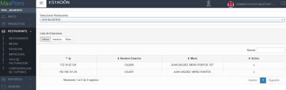

5. Seleccionar la estación a configurar con **VITALITY**, y agregar en la opción **Selección** **Menú**, el menú VITALITY creado anteriormente.

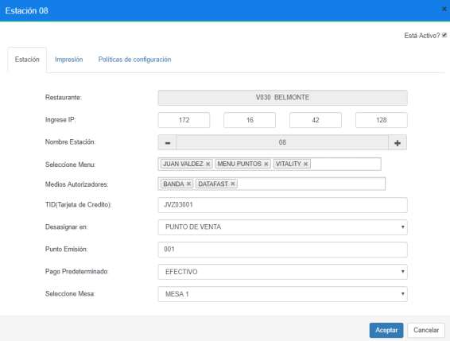
