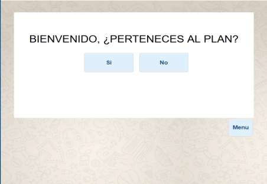
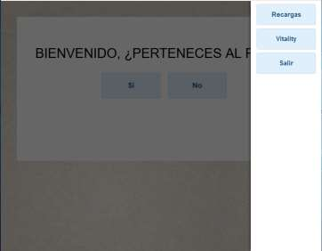
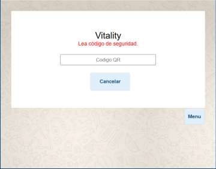
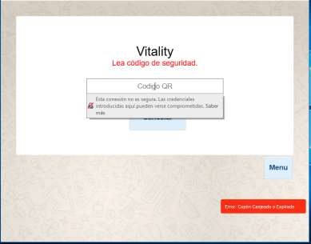
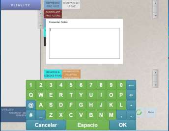
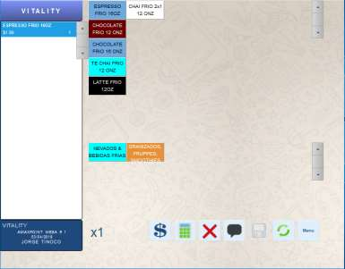
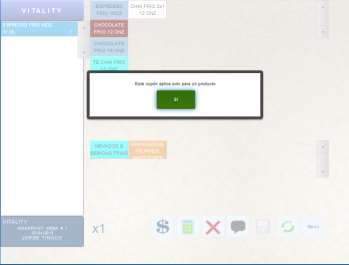
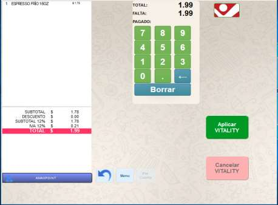
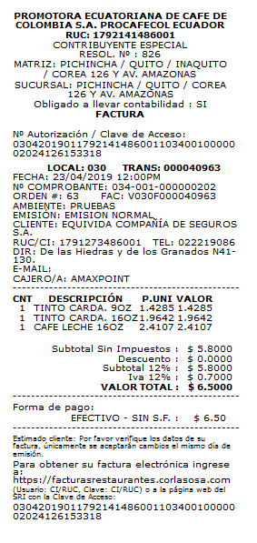
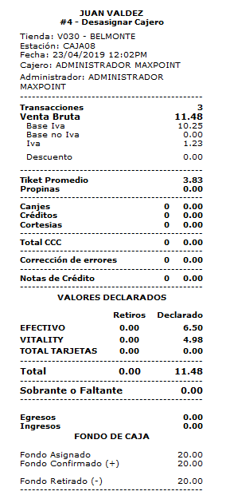

# Manual de Usuario Proceso Vitality-POS

**MANUAL DE USUARIO PROCESO VITALITY**

##  INTEGRACIÓN VITALITY - MAXPOINT

**MANUAL USUARIO PROCESO VITALITY.**

El objetivo de este manual es explicar el funcionamiento del proceso que se debe seguir al 
momento de realizar canjes de cupones a los usuarios de la aplicación VITALITY.

## **1. PANTALLA INICIO MAXPOINT**

Al ingresar al sistema Maxpoint siguiendo el flujo normal de inicio de sesión del cajero, el 
sistema permitirá al cajero elegir la opción de venta VITALITY que se encuentra dentro del 
botón MENU

**Pantalla de Inicio Fidelización Juan Valdez**

## 2. OPCION VITALITY DENTRO DE MENU

Como podemos observar en la siguiente imagen, la opción **VITALITY** se encuentra al hacer 
clic sobre la opción **MENU** ubicada en la parte derecha de la pantalla de Inicio.

**Pantalla de Inicio Fidelización Juan Valdez-Opción Vitality**

Al seleccionar la opción **VITALITY** mencionada anteriormente, el sistema desplegará una 
pantalla en la que el cajero podrá leer el código QR dada por la aplicación de vitality del 
cliente.

**Pantalla Opción Vitality – Lectura Código QR**

**Notas:**

1. El cajero debe usar el lector QR una vez presionado el botón vitality

2. Si la lectura del código QR es errónea, el sistema presenta el siguiente mensaje 
“Error: Cupón canjeado o expirado”.

**Pantalla Opción Vitality – Lectura Código QR ERROR**

**Mensaje de alerta cuando el cupón ya ha sido canjeado o ha expirado.**

## 3. TOMA DE PEDIDO VITALITY

Una vez que se ha validado el código QR, el sistema permitirá realizar la toma de pedido 
correspondiente, para esto le pedirá digitar el nombre del cliente para realizar el despacho y a su vez seleccionar el producto que desea el cliente.

**Pantalla Orden de Pedido Vitality –Comentario Despacho**

**Pantalla Orden de Pedido Vitality-Selección Producto.**

**Notas:**

1. El sistema permite que solo se pueda seleccionar una bebida sea fría o caliente del 
menú. (Requerimiento de Vitality)

2. El sistema filtra el menú de acuerdo al monto de cupón leído por el lector QR y 
además filtrado por el listado de bebidas dado por vitality.

**Pantalla Orden de Pedido Vitality-Validación Producto.**

## 4. FACTURACION VITALITY

Realizado todo el flujo anterior de toma de pedido pasamos al módulo de facturación para realizar el pago y se valide el canje de cupón, para ello como se visualiza en la imagen, solo se filtra la forma de pago vitality con los respectivos valores de producto y se aprueba el canje del cupón dado por la aplicación.

**Pantalla Facturación Vitality.**

Realizada la parte de facturación y el proceso se haya realizado correctamente, el sistema imprimirá la respectiva factura con datos del cliente, en este caso, a nombre de SALUD SA O EQUIVIDA, empresas del proyecto vitality y además la forma de pago crédito externo usado para este proceso.

## 5. RIDE

En este RIDE es importante observar los datos de facturación que se han generado a nombre de 
EQUIVIDA, y la forma de pago que es un CREDITO EXTERNO – SIN S.F.

## 6. DESASIGNACIÓN DE CAJERO

