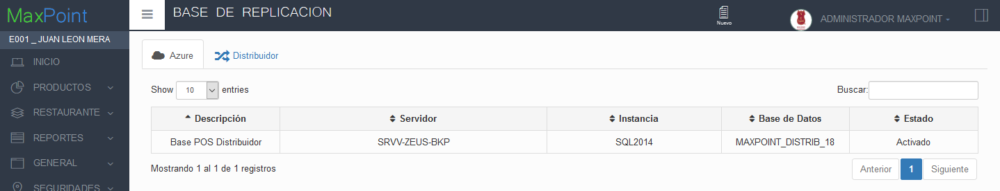
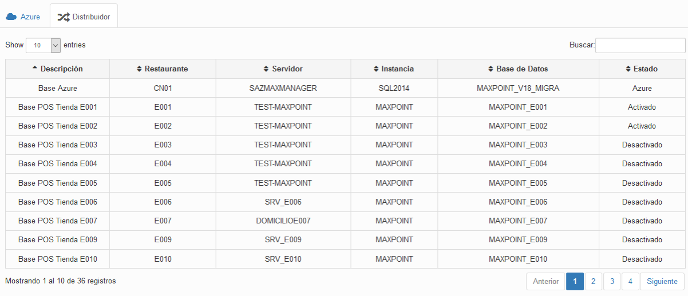
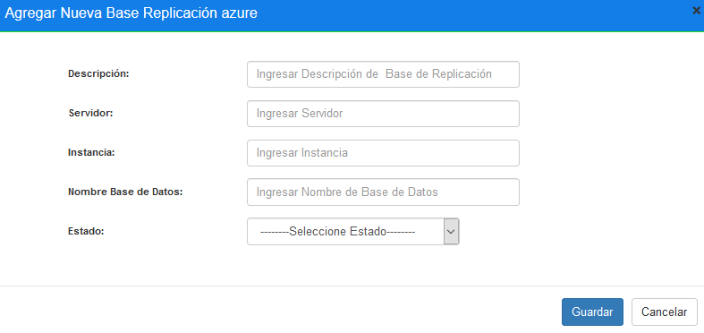
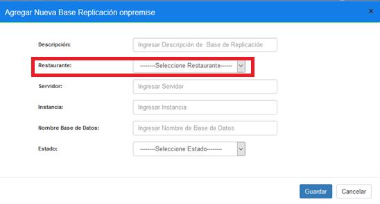
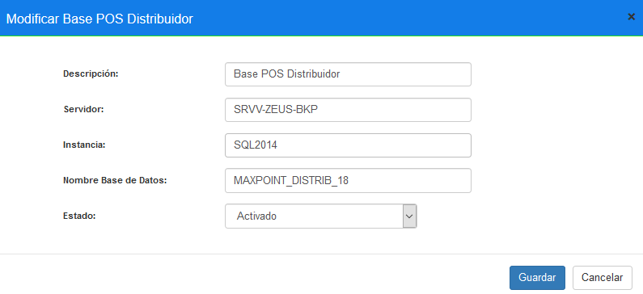
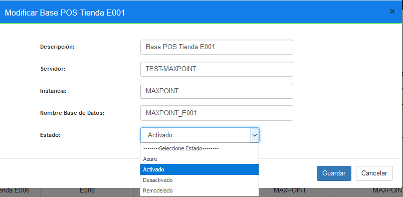

# Manual Bases Replicacion

 ## 1 OBJETIVOS

 - Conocer sobre el uso de la nueva pantalla de bases replicación.

 ## 2 PANTALLA BASES REPLICACION 

 ### 2.1 Datos Generales

 En este manual se detalla el manejo de pantalla bases replicación con el objetivo de que todos los usuarios conozcan sobre el uso, esto permitirá tener una mejor administración sobre el proceso de réplica hacia los locales.

Para la administración sobre esta pantalla, se debe tener los siguientes aspectos:

- En Azure y distribuidor deberían estar creadas y configuradas la bases a las cuales se destinará la réplica.
- La administración sobre esta pantalla será a nivel de cadena.

### 2.2 CREACION Y MODIFICACION BASES REPLICACION
 
 Ingresar al sistema MP backoffice con credenciales de administrador sistemas y seleccionar la cadena a la cual pertenece el restaurante a configurar.

Lo primero que debemos realizar es verificar la existencia de las bases para replicación, para ello en el menú que se encuentra en la parte izquierda nos digerimos a la opción **SEGURIDADES** y seleccionamos **BASES REPLICACION**, seguidamente observaremos una pantalla que nos despliega información dependiendo del ambiente en el que nos encontremos, es decir, si estamos en ambiente azure nos muestra dos pestanas que son **Azure y Distribuidor** y si es ambiente tienda nos muestra **Tiendas**.

**Azure-Español:**
  

  **Distribuidor-Español**
    

    **Tienda- Español:**

   ### 2.2.1 Creación de Base Replicación 

   - Azure

Si no existen la base para el proceso de replicación de una determinada cadena, se debe crear, para ello presionamos sobre la pestaña **Azure** y luego en la opción **Nuevo** que se encuentra en el menú superior dentro de la pantalla. 

    

Para agregar una nueva base replicación debemos insertar los siguientes datos en la pantalla flotante que se nos despliega al momento de pulsar sobre la opción **Nuevo**.

 

 Una vez que se haya ingresado y seleccionado la información establecida procedemos a **Guardar**.Siguiendo este proceso se ha creado la base de datos para la replicación de tramas desde el ambiente Azure al Distribuidor:

 - Distribuidor

Se realiza los mismos pasos para la creación de una nueva base de replicación en azure pero ahora seleccionamos sobre la pestaña **Distribuidor** y luego sobre la opción **Nuevo**. La única diferencia sobre la creación de una nueva base de datos para replicar es en el ingreso de datos, el usuario debe seleccionar un restaurante de la cadena para la creación.

 

 **Nota:** No se desplegarán restaurantes que ya contengan bases replicación. 

### 2.2.2 Modificación de Base Replicación

Para poder modificar cualquier registro se necesita tener creadas las bases replicación para cada ambiente. 
- Esta función está disponible para los ambientes **Azure** y **Distribuidor**.

 

 - Si deseamos modificar, seleccionamos el registro (cambia de color como la imagen) y pulsamos dos veces sobre el mismo. El sistema carga la información del registro que deseemos modificar y el usuario tendrá la posibilidad de modificar lo que considere necesario.

  

  Realizada la modificación de la información establecida procedemos a **Guardar**.

 ### 2.3 ADMINISTRACION DE ESTADOS BASES REPLICACION

 Para administrar de la mejor manera los estados de bases replicación; lo primero que debemos tener en claro es que, si el estado es **Desactivado** o **Remodelado** de cualquier base replicación, la información de tramas y lotes no se transmitirá, por lo tanto, debemos tener bien configuradas las bases de datos.

Si queremos habilitar o deshabilitar alguna base de replicación debemos entrar a la modificación de la misma y en la opción de estado seleccionar la opción que deseemos.

  

**Nota:** La opción remodelado es para los locales que se encuentran estado temporalmente deshabilitados. 

  Si pasamos de un estado Desactivado o Remolado al estado Activado; los lotes que se encuentren en estado de error del local que estemos cambiando la configuración serán reactivados y además el sistema informar ‘a en una ventana modal la información de los lotes que serán reactivados.