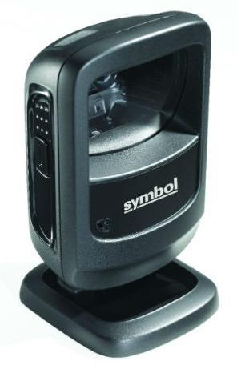
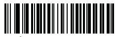
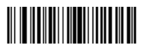
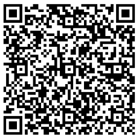
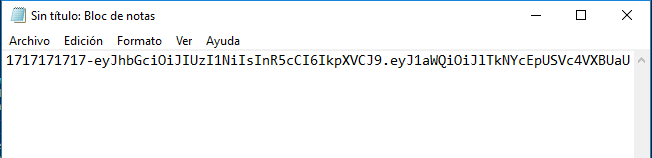
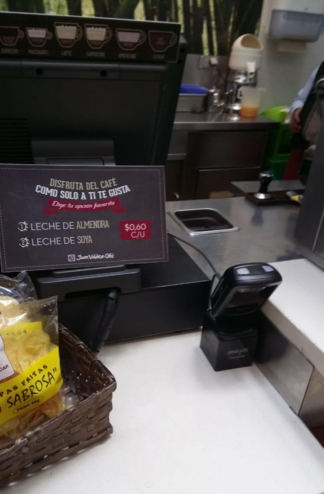

# ManualConfiguraciónSymbolDS9208

**Manual de Instalación de Symbol DS9208**

  

**1. Habilitar Configuraciones Manual del lector**

  

**2. Nivel de Volumen Bajo (leer ambos códigos)**

  
  

**3. Configuración de Idioma**

  

**4. Distancia de lectura**

  

**5. Optimizar lectura de QR en Teléfonos Móviles**

  

**6. Agregar Salto de Línea**

   

**7. Activar 10 segundos**

  

**8. Deshabilitar Configuraciones**

  

9. Pruebas

Para confirmar que el proceso de configuración ha sido correcto, siga los siguientes pasos:

1. Abra un bloc de notas

2. Léa el siguiente código con el lector

3. Si la configuración ha sido correcta al leer el código QR debe aparecer un guion medio, si aparece 
cualquier otro código vuelva a realizar toda la operación.

**10. Manual OnLine** 
El siguiente código sirve para revertir todas las configuraciones.

**10. Manual OnLine **

https://www.zebra.com/content/dam/zebra_new_ia/en-us/manuals/barcode-scanners/ds9208-prg-en.pdf

**11. Anexos**

