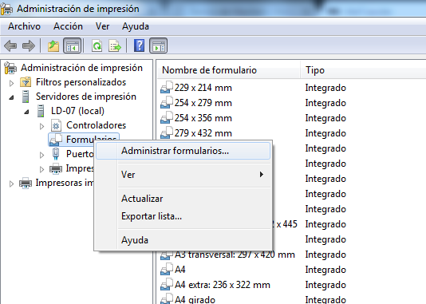
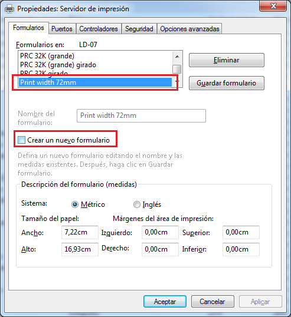
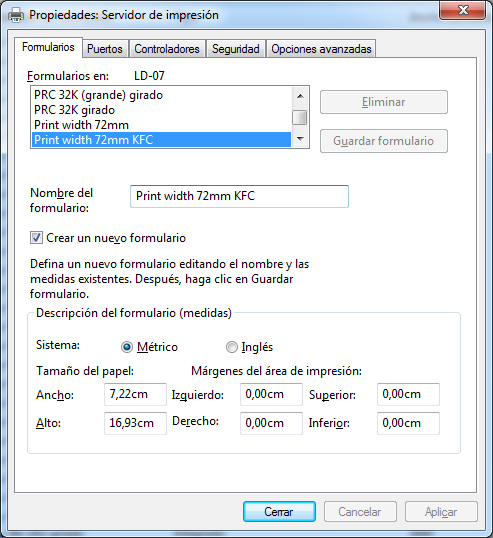
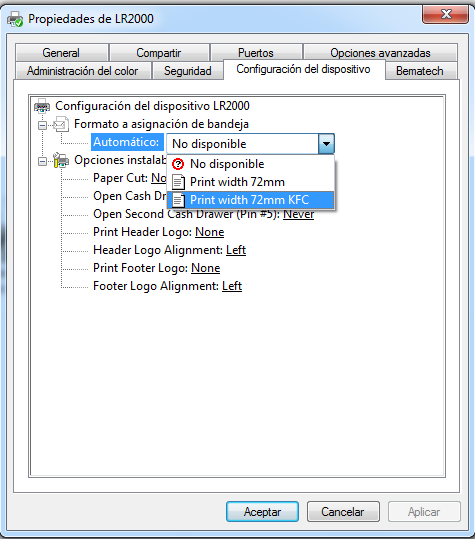
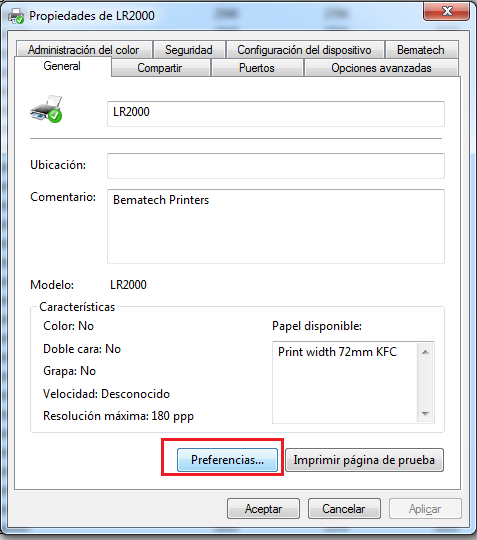
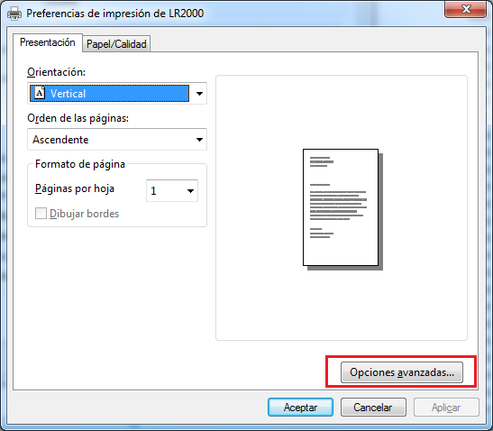
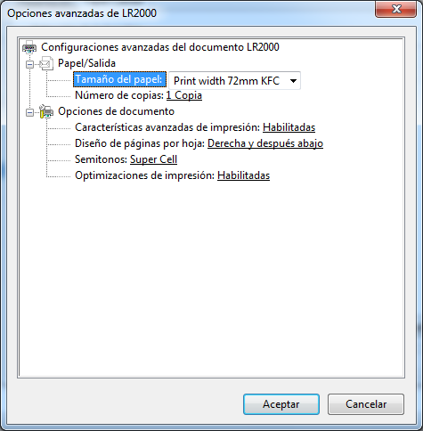

# Administrador de Impresión

1. Ingresar al Administrador de Impresión, y dar click derecho sobre formularios y seleccionar “Administrar Formularios”.

2. Ubicarse en el formulario que usa por default la impresora “Print width 72mm” y dar click en ítem “Crear Nuevo Formulario”.

3. Procedemos a Modificar el Nombre de Formulario “Print width 72mmKFC”, damos click en botón “Guardar Formulario”  

4. Dar click en botón Cerrar

5. Nos dirigimos a las propiedades de la impresora, en la pestaña “Configuración del Dispositivo” en lista asignación de Bandeja al desplegar debe aparecer el nuevo formulario creado.

Lo seleccionamos y damos aplicar.

6. Nos dirigimos a la pestaña ”General” y botón preferencias, con la finalidad de asignar el formulario nuevo
	

7. En las pestañas Presentación y Papel Calidad se debe ingresar al botón Opciones Avanzadas y dejar seleccionado el nuevo formulario.

Visualización de botón “Opciones Avanzadas” en donde debe quedar seleccionado el formulario nuevo.

8. Regresamos a la ventana da Administración de Impresión, formularios, click derecho Administrar formularios. Nos ubicamos en el formulario nuevo para cambiar la dimensión en el campo “Alto” a “60,93” y damos click en Aceptar.

