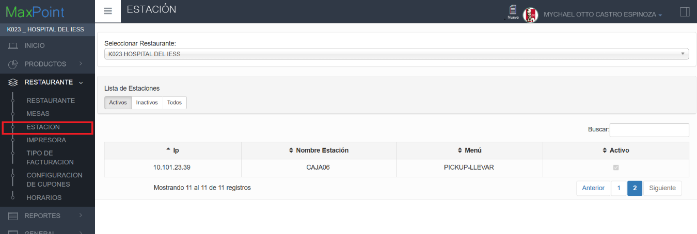
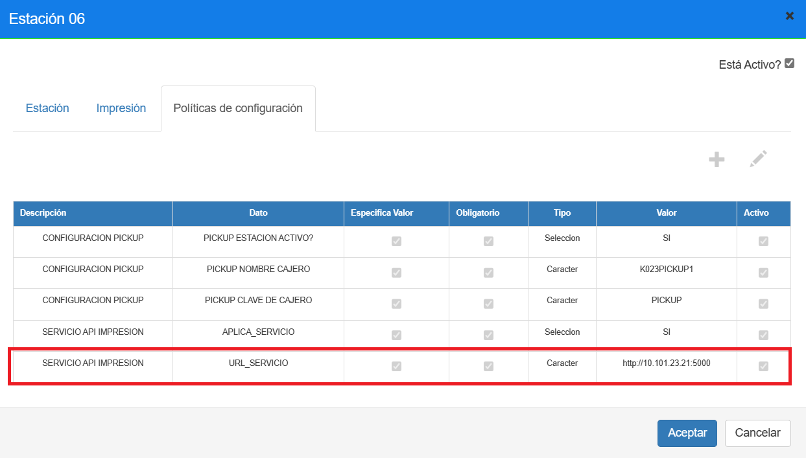
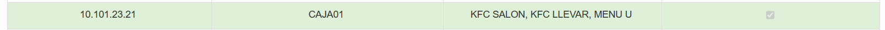
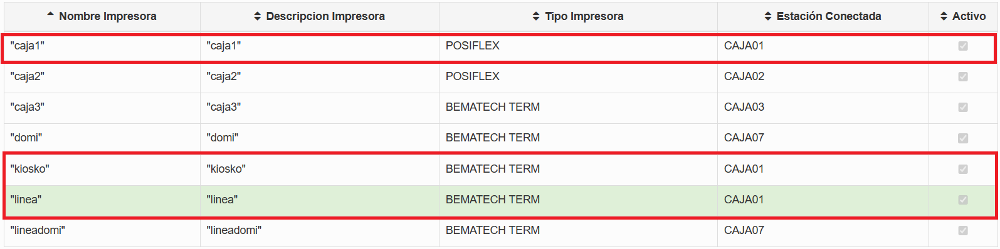
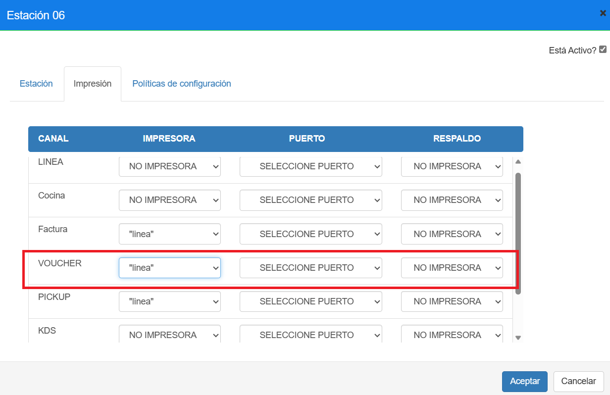

# Manual - Configuración estación pickup - impresora

**CONFIGURACIÓN IMPRESORA PARA LA ESTACIÓN DE PICKUP**

## 1 ANTECEDENTES

Actualmente en el sistema MaxPoint punto de venta, se tiene la necesidad de definir la impresora para el canal VOUCHER en la estación de pickup

## 2 OBJETIVO GENERAL

Definir impresora para el canal VOUCHER en las estaciones de pickup.

## 3 PROCEDIMIENTO

Ingresamos al sistema MXP backoffice con credenciales de administrador sistemas y seleccionar la cadena a la cual se realizará las configuraciones.
 

1. Nos dirigimos al formulario de estación

2. Buscamos la estación de pickup y la seleccionamos.

3. En la pestaña de “políticas de configuración” verificamos la siguiente política “URL_SERVICIO”

Para este caso esta estación imprime en la estación “CAJA01”.

Por lo cual verificamos que impresoras reconoce esta estación “CAJA01”, para seleccionarla en el canal VOUCHER de la estación de pickup.

4. Como verificamos la caja “CAJA01” reconoce la impresora “caja1”, “linea” y “kiosko” en consecuencia, puedes seleccionar cualquiera de estas impresoras en el canal “VOUCHER” para la estación de pickup.

