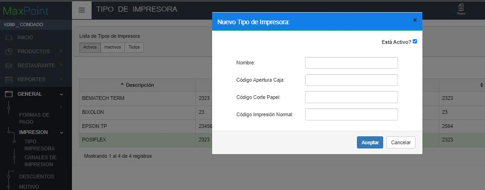

# Manual - Configuración impresora POSIFLEX

**CONFIGURACIÓN DE IMPRESORA – TIPO DE IMPRESORA**

1 ANTECEDENTES

Actualmente en el sistema MaxPoint punto de venta, se tiene la necesidad de definir un nuevo tipo de impresora para la integración del servicio API Impresión.

2 OBJETIVO GENERAL

Definir tipo de impresora “POSIFLEX”

3 PROCEDIMIENTO

En Azure ingresar al sistema MXP backoffice con credenciales de administrador sistemas y seleccionar la cadena a la cual se realizará las configuraciones.

En el menú que se encuentra en la parte izquierda:

1. nos dirigimos a la opción **GENERAL**, 

2. desplegamos **IMPRESION** y 

3. seleccionamos **TIPO DE IMPRESORA**,

4. seguidamente presionamos sobre el botón **Nuevo **

5. en el cual abrirá una ventana modal (ver figura 1).

Figura 1 

6. En la ventana modal (ver figura 1) completamos los campos con los siguientes
valores:

a. Nombre: POSIFLEX

b. Código Apertura Caja: 2323

c. Código Corte Papel: 2323

d. Código Impresión Normal: 2323

7. Finalmente presionamos el botón **ACEPTAR**

8. Se habrá listado el nuevo tipo de impresora como muestra la figura 2.

Figura 2

 NOTA: El tipo de impresora debe ser configurado en base a la marca de la impresora que utilice cada estación.

