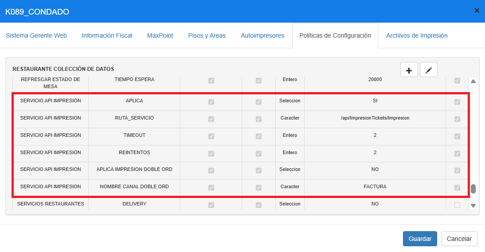
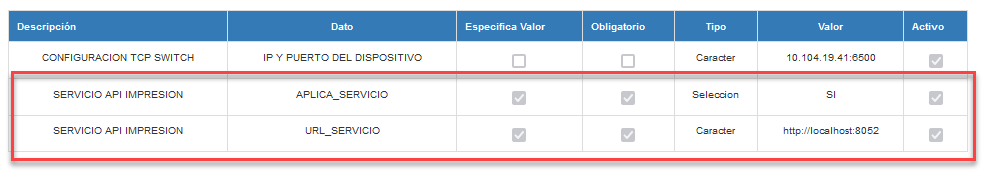
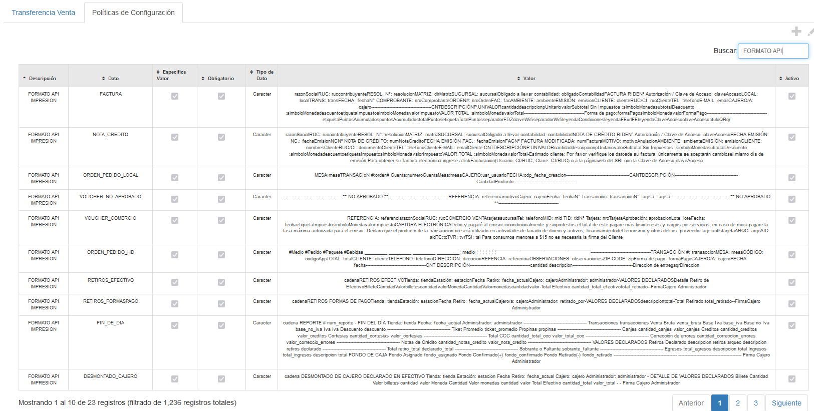

# Manual - Configuración Políticas Servicio API Impresión (3)

**CONFIGURACIÓN DE POLÍTICAS – SERVICIO API IMPRESIÓN**

## 1 ANTECEDENTES

Actualmente en el sistema MaxPoint punto de venta, se tiene la necesidad de realizar una configuración de políticas a nivel de restaurante, estación y cadena para la integración del servicio API Impresión.

## 2 OBJETIVO GENERAL

Crear y configurar la política a nivel de restaurante, estación y cadena

### 2.1 Objetivos específicos

- Configurar la política y parámetros a nivel de restaurante

- Configurar la política y parámetros a nivel de estación

- Configurar la política y parámetros a nivel de cadena

## 3 POLÍTICAS DE CONFIGURACIÓN

### 3.1 Datos Generales

En este manual se detalla cómo realizar la configuración de políticas que permitirán realizar la integración y funcionamiento del servicio api impresión.

A considerar:

Colección Restaurante: SERVICIO API IMPRESION

- Aplica, a través de este dato se especificará si el restaurante aplica el servicio api impresión.

- Ruta Servicio, será la descripción URL del servicio api impresión.

- Reintentos, será la cantidad de veces a intentar imprimir un documento en el caso que el servicio falle.

- Timeout, será el tiempo de espera para obtener la respuesta del servicio.

- APLICA IMPRESION DOBLE ORD, Verifica si aplica doble impresión de orden de pedido para pedidos.

- NOMBRE CANAL DOBLE ORD, Nombre del canal donde se imprimirá la segunda orden de pedido

Colección Estación: SERVICIO API IMPRESION

- Aplica Servicio, a través de este dato se especificará si la estación aplica el servicio api impresión.

- URL Servicio, será la ip y puerto de la estación en donde se encuentra instalado el servicio api impresión.

Colección Cadena: FORMATO API IMPRESION

- En esta política se creará todos los formatos de los documentos a ser impresos.

### 3.2 Pantalla de Políticas

En Azure ingresar al sistema MXP backoffice con credenciales de administrador sistemas y seleccionar la cadena a la cual se realizará las configuraciones.

En el menú que se encuentra en la parte izquierda no dirigimos a la opción **SEGURIDADES** y seleccionamos **POLÍTICAS**, seguidamente presionamos sobre el botón **Ir a Administración Políticas** en el cual abrirá una nueva pestaña en el navegador.

### 3.3 Restaurante

### 3.3.1 Colección Restaurante

Antes de crear las políticas de configuración; como primer paso se debe verificar que no se encuentren creadas, de ser el caso validar que cada colección contenga los parámetros establecidos en este manual.

En la opción **Restaurante** presionar sobre el botón **Nueva Colección**, se abrirá una modal para su creación ingresando los siguientes datos:

Tabla 1. Colección Restaurante

|N°|Colección|Descripción|
|:----|:----|:----|
|1|SERVICIO API IMPRESION|Colección que pennite establec.er si el restaurante aplica el servicio api impresión.|

**Nota:** NO puede contener espacios en blanco al inicio y final del nombre de la colección; debe ser escrita tal y como se especifica en la tabla 1.

**Colección:** Nombre de la colección que se especifica en la tabla 1.

**Módulo:** Restaurante.

**Observaciones:** Una descripción de la función que realizara dicha colección.

Una vez que se haya ingresado y seleccionado la información establecida procedemos a 

**Guardar.**

### 3.3.2 Colección de Datos Restaurante

Antes de agregar los parámetros de configuración, como primer paso se debe verificar que no se encuentren creados, de ser el caso validar que cada parámetro contenga los valores establecidos en este manual.

Una vez creada la colección se debe proceder a crear los parámetros de configuración y para ello seleccionamos la colección y presionamos sobre el botón **Nuevo Parámetro** en la cual se abrirá una venta para su creación e ingresamos los siguientes datos:

Tabla 2. Colección de Datos Restaurante

|Nº|Colección|Parán1etro|Esp.Valor|Obligatorio|Tipo Dato|
|:----|:----|:----|:----|:----|:----|
|1|SERVICIO API IMPRESION|APLICA|SI|SI|Selección|
|2|SERVICIO API IMPRESION|RUTA SERVICIO|SI|SI|Carácter|
|3|SERVICIO API IMPRESION|REINTENTOS|SI|SI|Entero|
|4|SERVICIO API IMPRESION|TIMEOUT|SI|SI|Entero|
|5|SERVICIO API IMPRESION|APLICA IMPRESION DOBLE ORD|SI|SI|Selección|
|6|SERVICIO API IMPRESION|NOMBRE CANAL DOBLE ORD|SI|SI|Carácter|

**Nota:** NO puede contener espacios en blanco al inicio y final del parámetro; deben ser escritos tal y como se especifica en la tabla 2.

**Parámetro:** Nombre del parámetro que se especifica en la tabla 2.

**Tipo de Dato:** Se especifica en la tabla 2.

**Especifica Valor:** Se especifica en la tabla 2

**Obligatorio:** Se especifica en la tabla 2.

Una vez que se haya ingresado y seleccionado la información establecida procedemos a

**Guardar.**

### 3.3.3 Restaurante Colección de Datos

En el menú nos dirigimos a **Restaurante** y seleccionamos la opción **Restaurante**, buscamos el restaurante a ser configurados y seguidamente seleccionamos la pestaña **Políticas de configuración.**

Para la configuración se debe presionar sobre el botón agregar “+”; el cual abrirá una ventana, seguidamente buscaremos la colección creada y agregamos el valor en los parametros solicitados.

### 3.3.4 Parámetros de configuración Restaurante

En la tabla 3, se especifica los valores que deben ser configurados por cada parámetro colección.

Tabla 3. Valores de los parámetros de colección

|Nº|Parámetro|Tipo Dato|Valor a ingresar|
|:----|:----|:----|:----|
|1|APLICA|Selección|SI|
|2|RUTA  SERVICIO|Carácter|/api/Impre.sionTickets/ npre.sion|
|3|REINTENTOS|Entero|2|
|4|TIMEOUT|Entero|2|
|5|APLICA IMPRESION DOBLE ORD|Selección|NO|
|6|NOMBRE CANAL DOBLE ORD|Carácter|FACTURA|

Al realizar la configuración de todos los parámetros se debe tener lo siguiente:

### 3.4 Estación

### 3.4.1 Colección Estación

Antes de crear las políticas de configuración; como primer paso se debe verificar que no se encuentren creadas, de ser el caso validar que cada colección contenga los parámetros establecidos en este manual.

En la opción **Estación** presionar sobre el botón **Nueva Colección**, se abrirá una modal para su creación ingresando los siguientes datos:

Tabla 4. Colección Estación

|Nº|Colección|Descripción|
|:----|:----|:----|
|1|SERVICIO API IMPRESION|Coleccion que permite establecer si la estación aplica el servicio api impresion.|

**Nota:** NO puede contener espacios en blanco al inicio y final del nombre de la colección; debe ser escrita tal y como se especifica en la tabla 4.

**Colección:** Nombre de la colección que se especifica en la tabla 4.

**Módulo:** Estación.

**Observaciones**: Una descripción de la función que realizara dicha colección.

Una vez que se haya ingresado y seleccionado la información establecida procedemos a

**Guardar.**

### 3.4.2 Colección de Datos Estación

Antes de agregar los parámetros de configuración, como primer paso se debe verificar que no se encuentren creados, de ser el caso validar que cada parámetro contenga los valores establecidos en este manual.

Una vez creada la colección se debe proceder a crear los parámetros de configuración y para ello seleccionamos la colección y presionamos sobre el botón **Nuevo Parámetro** en la cual se abrirá una venta para su creación e ingresamos los siguientes datos:

Tabla 5. Colección de Datos Estación

|Nº|Colección|Parámetro|Esp.Valor|Obligatorio|Tipo Dato|
|:----|:----|:----|:----|:----|:----|
|1|SERVICIO API IMPRESION|APLICA SERVICIO|SI|SI|Selección|
|2|SERVICIO API IMPRESION|URL SERVICIO|SI|SI|Carácter|

**Nota:** NO puede contener espacios en blanco al inicio y final del parámetro; deben ser escritos tal y como se especifica en la tabla 5.

**Parámetro:** Nombre del parámetro que se especifica en la tabla 5.

**Tipo de Dato:** Se especifica en la tabla 5.

**Especifica Valor:** Se especifica en la tabla 5

**Obligatorio: **Se especifica en la tabla 5.

Una vez que se haya ingresado y seleccionado la información establecida procedemos a

**Guardar.**

### 3.4.3 Estación Colección de Datos

En el menú nos dirigimos a **Restaurante** y seleccionamos la opción **Estación**, buscamos la estación a ser configurados y seguidamente seleccionamos la pestaña **Políticas de configuración**.

Para la configuración se debe presionar sobre el botón agregar “+”; el cual abrirá una ventana, seguidamente buscaremos la colección creada y agregamos el valor en los parametros solicitados.

### 3.4.4P arámetros de configuración Estación

En la tabla 6, se especifica los valores que deben ser configurados por cada parámetro colección.

Tabla 6. Valores de los parámetros de colección

|Nº|Parámetro|Tipo Dato|Valor a ingresar|
|:----|:----|:----|:----|
|1|APLICA  SERVICIO|Selección|SI|
|2|URL  SERVICIO|Carácter|Servidor y puerto de la estación en dónde está instalado el servicio api impresión. Ejemplo: http://10.101.23.21:5000  LA IP CORRESPONDE AL NUMERO DE LA ESTACION|

Al realizar la configuración de todos los parámetros se debe tener lo siguiente:

### 3.5 Cadena

## 3.5.1 Colección Cadena

Antes de crear las políticas de configuración; como primer paso se debe verificar que no se encuentren creadas, de ser el caso validar que cada colección contenga los parámetros establecidos en este manual.

En la opción **Cadena** presionar sobre el botón **Nueva Colección**, se abrirá una modal para su creación ingresando los siguientes datos:

Tabla 7. Colección Estación

|Nº|Colección|Descripción|
|:----|:----|:----|
|1|FORMATO API IMPRESION|Colección que permitirá configurar todo los formatos de los documentos a ser impresos|

**Nota:** NO puede contener espacios en blanco al inicio y final del nombre de la colección; debe ser escrita tal y como se especifica en la tabla 7.

**Colección**: Nombre de la colección que se especifica en la tabla 7.

**Módulo**: Cadena.

**Observaciones:** Una descripción de la función que realizara dicha colección.

Una vez que se haya ingresado y seleccionado la información establecida procedemos a

**Guardar**.

### 3.5.2 Colección de Datos Cadena

Antes de agregar los parámetros de configuración, como primer paso se debe verificar que no se encuentren creados, de ser el caso validar que cada parámetro contenga los valores establecidos en este manual.

Una vez creada la colección se debe proceder a crear los parámetros de configuración y para ello seleccionamos la colección y presionamos sobre el botón Nuevo Parámetro en la cual se abrirá una venta para su creación e ingresamos los siguientes datos:

Tabla 8. Colección de Datos Estación

|N°|Colección|Parámetro|Esp.Valor|Obligatorio|TipoDato|
|:----|:----|:----|:----|:----|:----|
|1|FORMATO API IMPRESION|ARQUEO|SI|SI|Carácter|
|2|FORMATO API IMPRESION|CORTE XX|SI|SI|Carácter|
|3|FORMATO API IMPRESION|CREDITO EMPLEADO|SI|SI|Carácter|
|4|FORMATO API IMPRESION|CREDITO EXTER'.NO|SI|SI|Carácter|
|5|FORMATO API IMPRESION|DESASIGNAR CAJERO|SI|SI|Carácter|
|6|FORMATO API IMPRESION|DESMONTADO CAJERO|SI|SI|Carácter|
|11|FORMATO API IMPRESION|FACTURA|SI|SI|Carácter|
|8|FORMATO API IMPRESION|FIN-DE-DIA|SI|SI|Carácter|
|9|FORMATO API IMPRESION|MOTORIZADO|SI|SI|Carácter|
|10|FORMATO API IMPRESION|NOTA CREDITO|SI|SI|Carácter|
| |FORMATO API IMPRESION|ORDEN-PEDIDO-HD|SI|SI|Carácter|
|12|FORMATO API IMPRESION|ORDEN-PEDIDO-LOCAL|SI|SI|Carácter|
|13|FORMATO API IMPRESION|PRE-CUENTA|SI|SI|Carácter|
|14|FORMATO API IMPRESION|RETIRO-FONDO-ASIGNADO|SI|SI|Carácter|
|15|FORMATO API IMPRESION|RETIROS  EFECTIVO|SI|SI|Carácter|
|16|FORMATO API IMPRESION|RETIROS FORMASPAGO|SI|SI|Carácter|
|17|FORMATO API IMPRESION|TEST IMPRESION|SI|SI|Carácter|
|18|FORMATO API IMPRESION|VOUCHER CLIENTE|SI|SI|Carácter|
|19|FORMATO API IMPRESION|VOUCHER COMERCIO|SI|SI|Carácter|
|20|FORMATO API IMPRESION|VOUCHER NO APROBADO|SI|SI|Carácter|
|21|FORMATO API IMPRESION|FACTIJRA CASHLESS|SI|SI|Carácter|
|22|FORMATO API IMPRESION|CAJA-CHICA-LOCAL|SI|SI|Carácter|
|23|FORMATO API IMPRESION|IMPRESION Cl'PON|SI|SI|Carácter|
|24|FORMATO API IMPRESION|VOUCHER-CANCELADO-NO-APROBADO-CLIENTE|SI|SI|Carácter|
|25|FORMATO API IMPRESION|VOUCHER_CANCELADO_NO_APROBADO_COMERCIO|SI|SI|Carácter|
|26|FORMATO API IMPRESION|VOUCHER-CLIENTE-ANULACION|SI|SI|Carácter|
|27|FORMATO API IMPRESION|VOUCHER-COMERCIO-ANULACION|SI|SI|Carácter|
|28|FORMATO API IMPRESION|FALTANTE-CAJA-CXC|SI|SI|Carácter|
|29|FORMATO API IMPRESION|PROMOCIONES|SI|SI|Carácter|
|30|FORMATO API IMPRESION|CREDITO_EMPRESA|SI|SI|Carácter|
|31|FORMATO API IMPRESION|CREDITO  PRODUCTO|SI|SI|Carácter|
|32|FORMATO API IMPRESION|FIDELIZACION   RECARGA|SI|SI|Carácter|
|33|FORMATO API IMPRESION|TRANSFERENCIA VENTA|SI|SI|Caracter|
|34|FORMATO API IMPRESION|VOUCHER  KIOSKO|SI|SI|Caracter|

**Nota:** NO puede contener espacios en blanco al inicio y final del parámetro; deben ser escritos tal y como se especifica en la tabla 8.

**Parámetro:** Nombre del parámetro que se especifica en la tabla 8.

**Tipo de Dato:** Se especifica en la tabla 8.

**Especifica Valor:** Se especifica en la tabla 8

**Obligatorio:** Se especifica en la tabla 8.

Una vez que se haya ingresado y seleccionado la información establecida procedemos a

 **Guardar.**

 ### 3.5.3 Cadena Colección de Datos

En el menú nos dirigimos a **Cadena** y seleccionamos la opción **Cadena**, seguidamente seleccionamos la pestaña **Políticas de configuración.**

Para la configuración se debe presionar sobre el botón agregar “+”; el cual abrirá una ventana, seguidamente buscaremos la colección creada y agregamos el valor en los parametros solicitados.

En este puntos, el valor a configurar de cada parametro será un formato XML del documento a imprimir, estos XML son enviados junto con el manual en una carpeta por separado; el contenido debe ser copiado y pegado en campo varchar acorde al documento en que se encuentren.

Al realizar la configuración de todos los parámetros se debe tener lo siguiente:

