# Manual Configuración Semáforo Pedidos

### CONFIGURACIÓN SEMÁFORO PEDIDOS DELIVERY RESUMEN

A continuación, se muestra un resumen de la configuración de esta política.

|SEMAFORO|COLOR|TIEMPO|ORDEN|
|:----|:----|:----|:----|
|VERDE|#3CBA77|3|1|
|AMARILLO|#D1C130|5|2|
|ROJO|#BA2422|6|3|

**CONFIGURACIÓN POLÍTICA**

Nos dirigimos al módulo de **SEGURIDADES** a la pantalla de **POLÍTICAS**, y damos clic en 
el botón **IR A ADMINISTRACIÓN DE POLÍTICAS.**

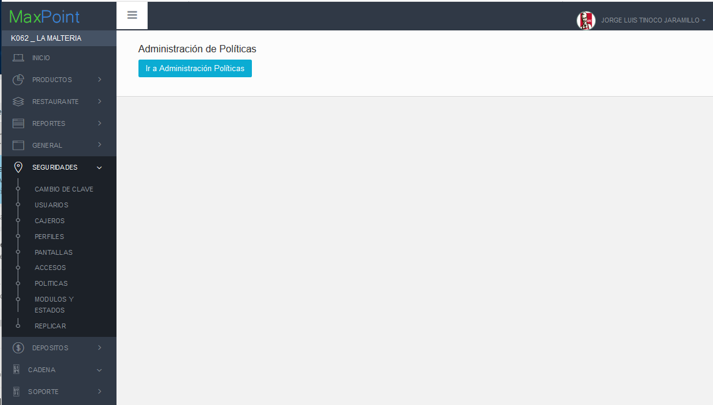

Seleccionamos las políticas por CADENA y presionamos el botón NUEVA COLECCIÓN.

En la modal que aparece configuramos la política **LISTA SEMAFORO TIEMPOS** como se muestra en la siguiente imagen:

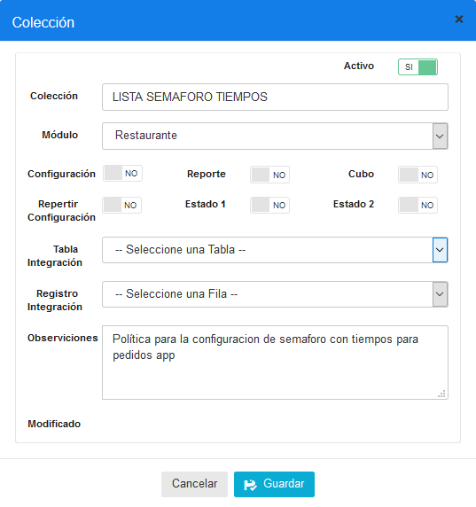

Presionamos GUARDAR, para almacenar la configuración, seleccionamos la política configurada **LISTA SEMAFORO TIEMPOS** y presionamos el botón **NUEVO PARAMETRO**.

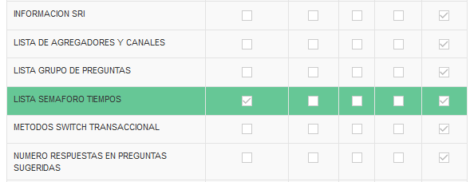

Agregamos el parámetro **VERDE** como se muestra en la siguiente imagen:

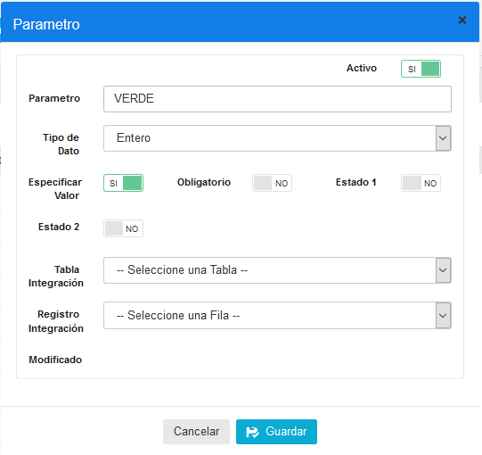

Agregamos el parámetro **AMARILLO** como se muestra en la siguiente imagen:

Agregamos el parámetro **ROJO** como se muestra en la siguiente imagen:

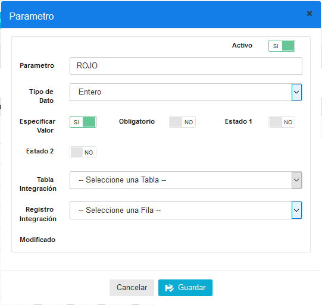

Verificamos los parámetros en la lista de parámetros, como se muestra en la siguiente imagen:

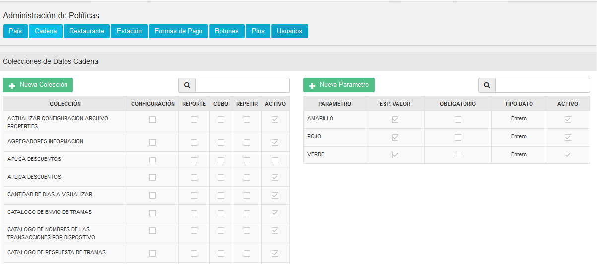

CONFIGURAR LISTA SEMÁFORO

Nos dirigimos al módulo de **CADENAS**, a la pantalla **CADENA**, y damos clic en la pestaña de **POLÍTICAS DE CONFIGURACIÓN.**

 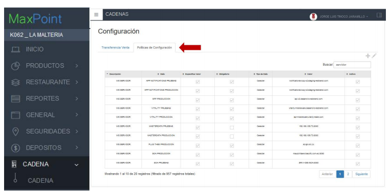

Presionamos el botón + para agregar una nueva política, y buscamos la política **LISTA SEMAFORO TIEMPOS.**

En el formulario que aparece a continuación configuramos los campos **VARCHAR, ENTERO**y **MÍNIMO.**

|PARAVETRO|VARCHAR|ENTERO|MINIMO|
|:----|:----|:----|:----|
|Parämetro|Configuraciön del color|Numero de minutos para cambiar de color|Orden de los colores|
|VERDE|#3CBA77|3|1|
|AMARILLO|#D1C130|5|2|
|ROJO|#BA2422|6|3|

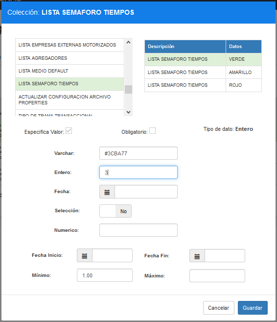

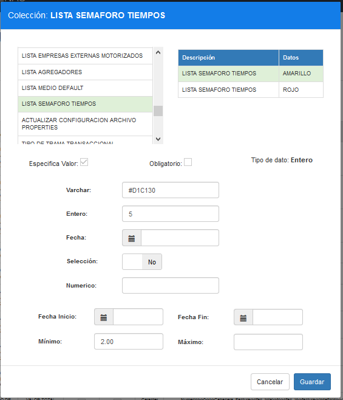

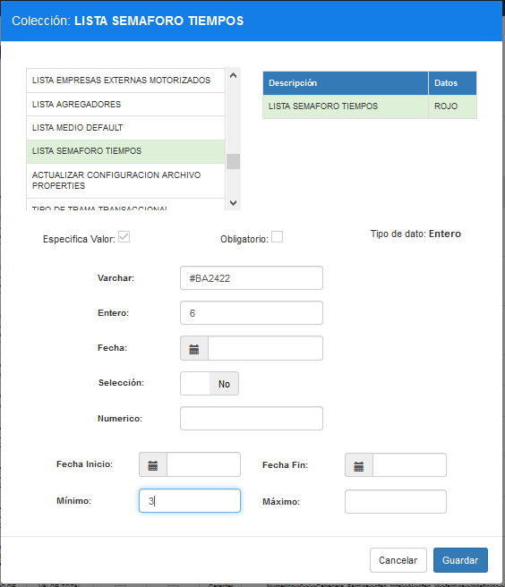

Para finalizar verificamos que se ha configurado correctamente la política buscando con la palabra SEMAFORO, como se muestra a continuación:

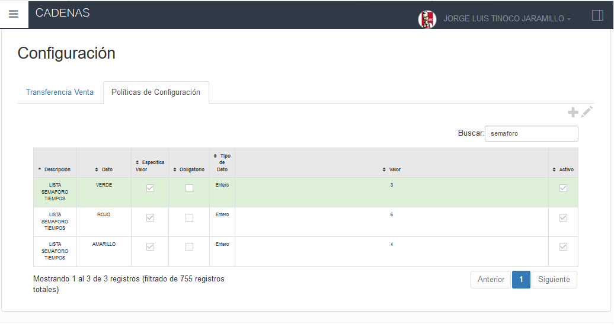

**VERIFICAR CONFIGURACIÓN POR BASE DE DATOS**

Para verificar esta configuración se puede ejecutar el siguiente procedimiento:

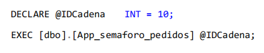

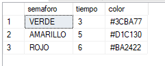