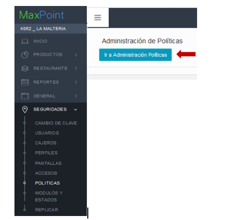
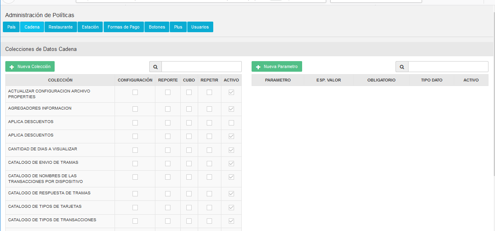
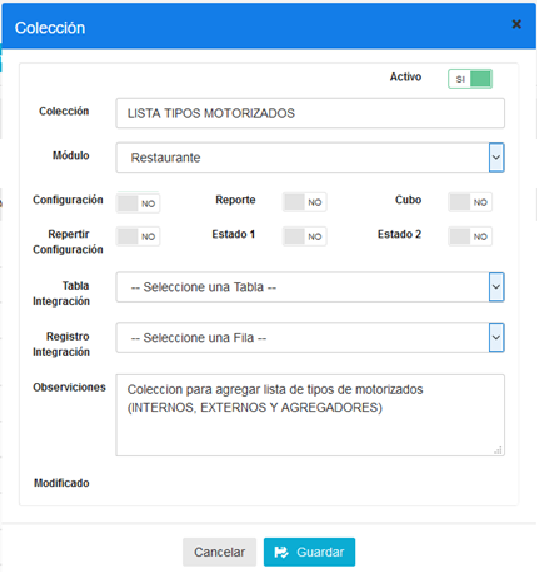
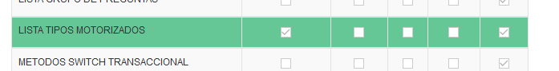
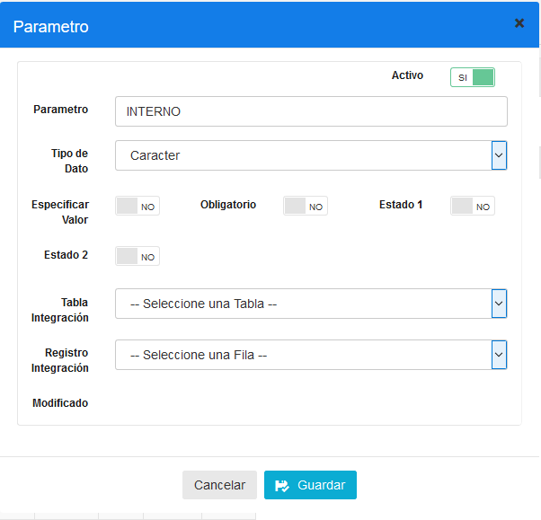
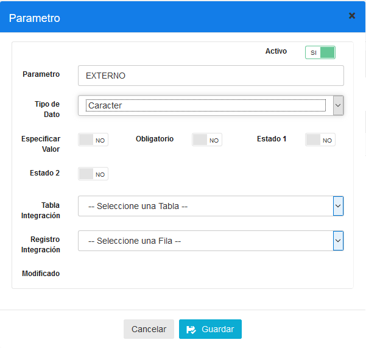
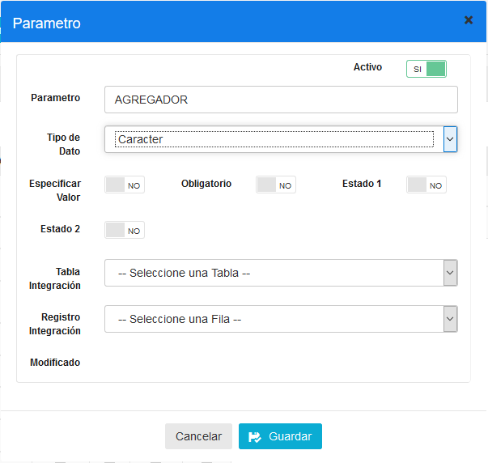
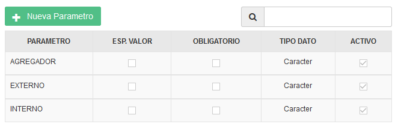
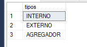

# Manual Configuración Tipo de Motorizados

## MANUAL CONFIGURACIÓN TIPOS DE MOTORIZADOS CONFIGURACIÓN POLÍTICA

Nos dirigimos al módulo de **SEGURIDADES** a la pantalla de **POLÍTICAS**, y damos click en el botón **IR A ADMINISTRACIÓN DE POLÍTICAS**.

Seleccionamos las políticas por **CADENA** y presionamos el botón **NUEVA COLECCIÓN**.

Configuramos la política **LISTA TIPOS MOTORIZADOS**, como se muestra en la siguiente imagen:

Presionamos el botón GUARDAR, para almacenar la información y la verificamos en la lista de políticas de Cadena.

**CONFIGURACIÓN DE PARAMETROS**
Seleccionamos la política LISTA TIPOS MOTORIZADOS y presionamos el botón **NUEVO PARÁMETRO**.

Configuramos los parámetros como se muestra en las siguientes imágenes:

**INTERNO**

**EXTERNO**

AGREGADOR

Verificamos que se hayan creado los parámetros correctamente en la lista de parámetros.

**Importante:** Esta solo es una lista por lo cual no es necesario atarla a una cadena.

**VERIFICAR LISTA TIPOS MOTORIZADOS POR BASE DE DATOS**

En la base de datos podemos ejecutar este procedimiento para verificar que los parámetros se agregaron correctamente.

DECLARE @IDCadena INT = 10;
EXEC dbo.MOT_cargar_tipos_motorizados @IDCadena;

