# Manual Configuracion URL Motorizados

## **CONFIGURACION URL MOTOROLOS AMBIENTES**

|AMBIENTE|DOMINIO|
|:----|:----|
|PRUEBAS|srw-dev|
|PRODUCCIÓN| |

## CONFIGURACIÓN DE POLÍTICAS

Nos dirigimos al módulo de **SEGURIDADES** a la pantalla de **POLÍTICAS**, y damos click en el botón **IR A ADMINISTRACIÓN DE POLÍTICAS**.

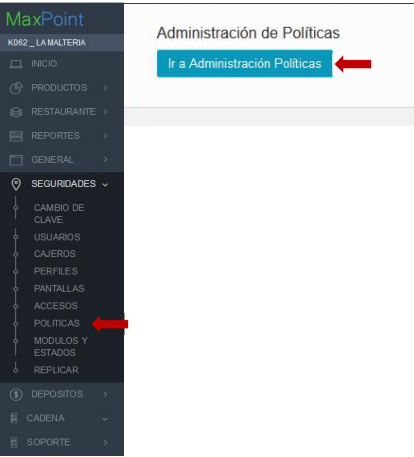

Seleccionamos las políticas por **CADENA.**

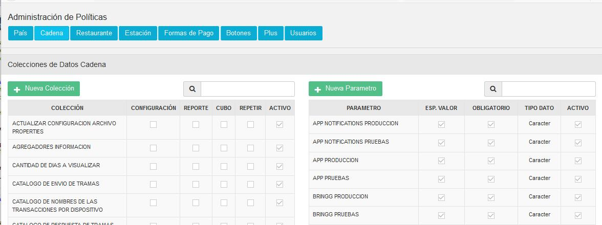

Buscamos la política WS SERVIDOR, esta política se utiliza para configurar los nombres de dominios de los servicios que se consumen de servidores externos.

AMBIENTE DE PRUEBAS
Presionamos el botón **NUEVO PARÁMETRO**, y configuramos el parámetro **MOTORIZADO PRUEBAS** como se muestra en la imagen a continuación.

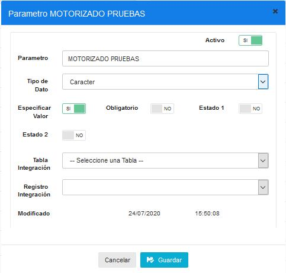

Presionamos el botón **NUEVO PARÁMETRO**, y configuramos el parámetro **MOTORIZADO PRODUCCION** como se muestra en la imagen a continuación.

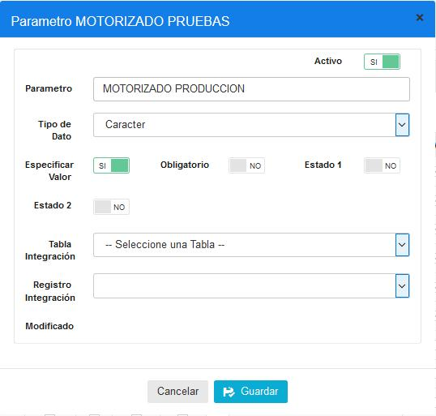

Verificamos que se haya creado en la lista de parámetros.

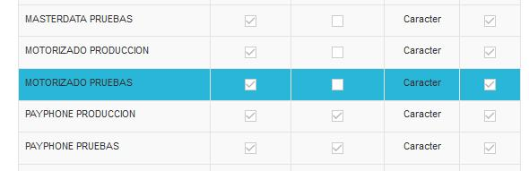

CREAR RUTAS DE SERVICIOS
Buscamos la política WS RUTA SERVICIO, esta política se utiliza para configuran las funciones de los servicios que se consumen.

Presionamos el botón **NUEVO PARÁMETRO**, y configuramos el parámetro **MOTORIZADO MASTER DATA** como se muestra en la imagen a continuación.

Damos click al botón GUARDAR para que se almacene la información.

Presionamos el botón **NUEVO PARÁMETRO**, y configuramos el parámetro **GERENTE MOTOROLO COMANDAS*** como se muestra en la imagen a continuación.

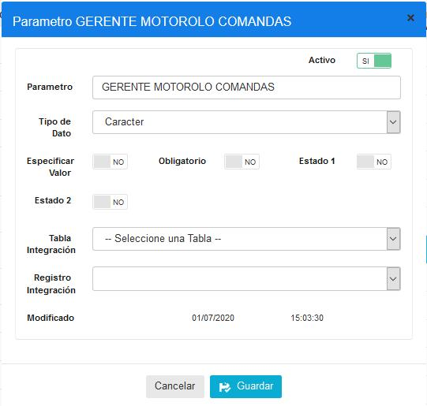

Verificamos que se haya creado en la lista de parámetros.

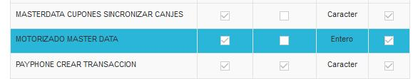
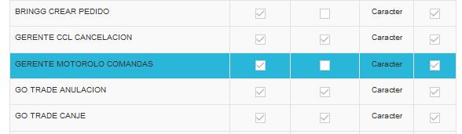

CONFIGURACIÓN URL SERVICIOS

Nos dirigimos al módulo de **CADENAS**, a la pantalla **CADENA**, y damos click en la pestaña de **POLÍTICAS DE CONFIGURACIÓN.**

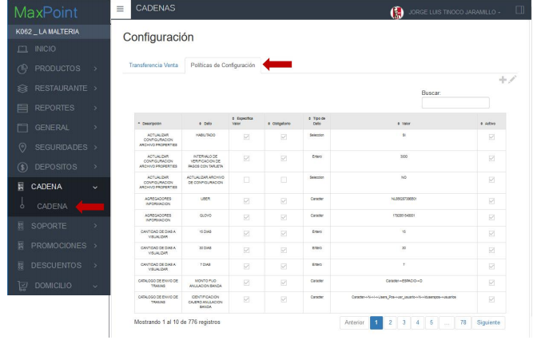

Presionamos el botón + para agregar una nueva política. Buscamos la política **WS SERVIDOR,** y seleccionamos el parámetro **MOTORIZADO PRUEBAS.**

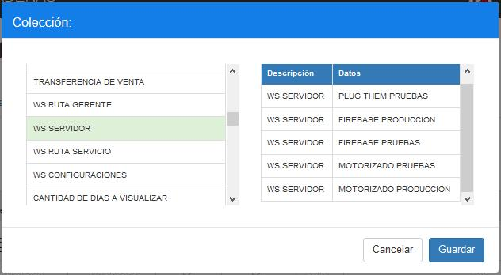

En el campo VARCHAR escribimos la siguiente URL: srvv-dev:8091

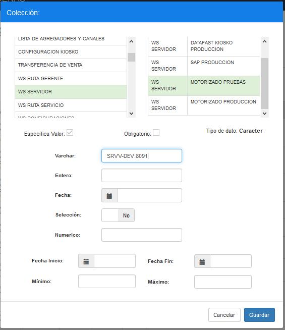

Presionamos el botón + para agregar una nueva política. Buscamos la política **WS SERVIDOR**, y seleccionamos el parámetro **MOTORIZADO PRODUCCION**.

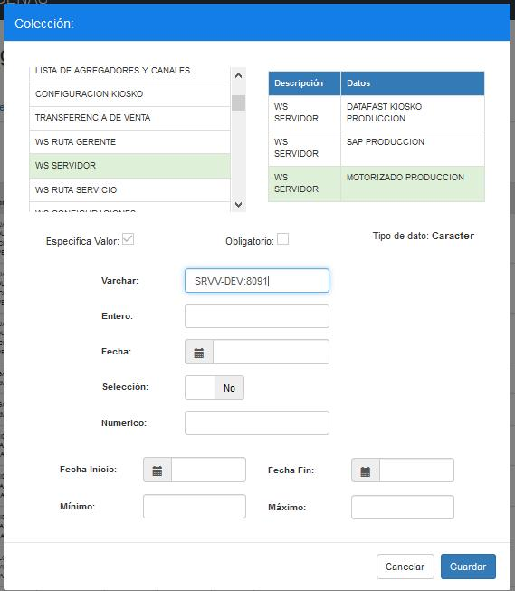

CONFIGURACIÓN DE RUTAS

MOTORIZADO DATOS MAESTROS

Presionamos el botón + para agregar una nueva política a la cadena que tenemos
seleccionada. Buscamos la política WS RUTA SERVICIO y buscamos la función **MOTORIZADO MASTER DATA.**

En el campo VARCHAR escribimos la siguiente ruta: /motorolo

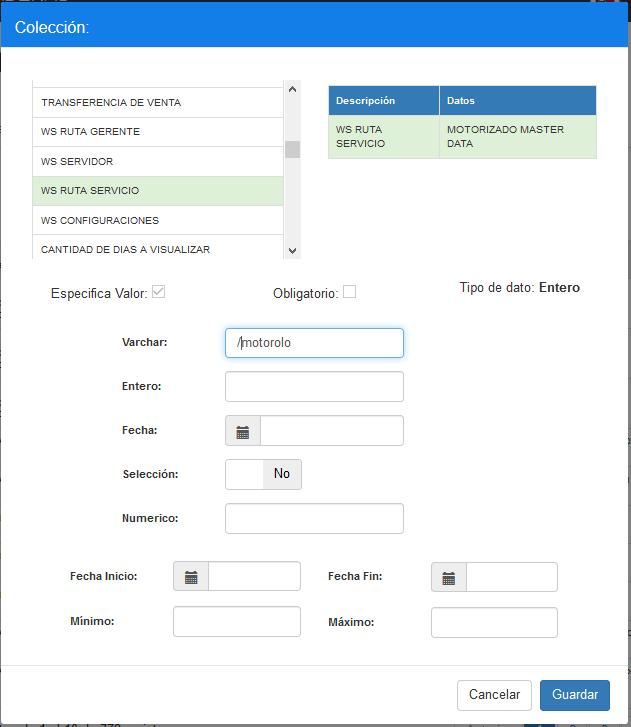

GERENTE MOTOROLO COMANDAS

Presionamos el botón + para agregar una nueva política a la cadena que tenemos
seleccionada. Buscamos la política **WS RUTA SERVICIO** y buscamos la función **GERENTE MOTOROLO COMANDAS**, y agregamos en el campo **VARCHAR** la siguiente ruta:
/sir_20/serviciosweb/domicilio/comandasMotorolo.php

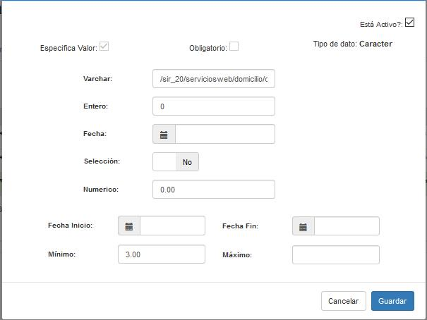

Comprobamos que las políticas se configuraron correctamente en la tabla principal, como se muestra la siguiente imagen:

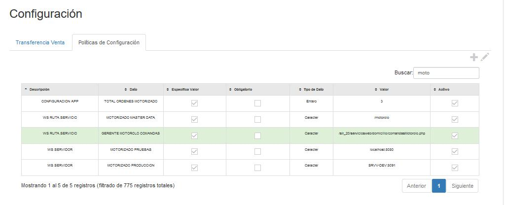
