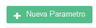
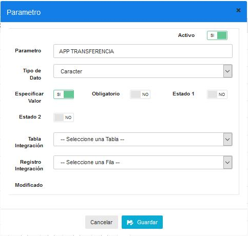
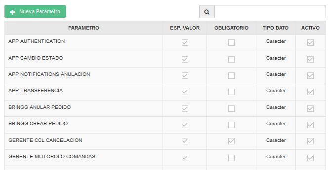
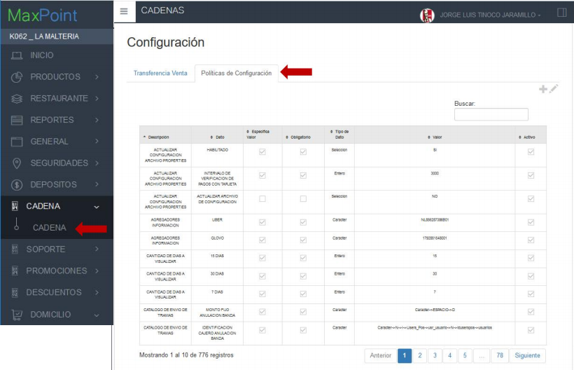
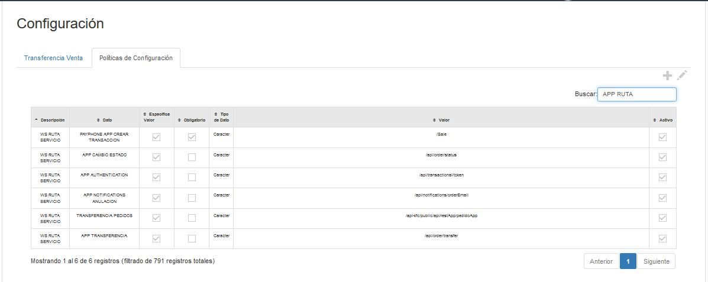

# Manual Configuración URL Transferencia
+

## URL TRANSFERENCIAS PEDIDOS APP KFC

CONFIGURACIÓN POLÍTICA APP TRANSFERENCIA
En el menú nos dirigimos a la pantalla de administración de POLÍTICAS. En la pantalla de políticas nos ubicamos en las políticas por CADENA. 

Seleccionamos la política **WS RUTA SERVICIO.**

Damos clic en el botón NUEVO PARÁMETRO.

Agregamos el parámetro **APP TRANSFERENCIA**, como se muestra en la siguiente imagen:

Verificamos en la lista de parámetros que se haya creado correctamente.

CONFIGURACIÓN URL TRANSFERENCIA PEDIDOS

Nos dirigimos al módulo de **CADENAS**, a la pantalla **CADENA**, y damos click en la pestaña de **POLÍTICAS DE CONFIGURACIÓN.**

Presionamos el botón + para agregar una nueva política. Buscamos la política **WS RUTA SERVIDOR**, y seleccionamos el parámetro **APP TRANSFERENCIA**. En el campo VARCHAR escribimos la siguiente ruta: /api/order/transfer

Comprobamos que las políticas se configuraron correctamente en la tabla principal, como semuestra la siguiente imagen:

