# Manual Configuracion URL Transferencias App y Web

**CONFIGURACION URL TRANSFERENCIA AMBIENTES**

|AMBIENTE|DOMINIO|
|:----|:----|
|PRUEBAS|192.168.101.30:9090|
|PRODUCCIÓN|192.168.100.168|

CONFIGURACIÓN DE POLÍTICAS

Nos dirigimos al módulo de **SEGURIDADES** a la pantalla de **POLÍTICAS**, y damos click en el botón **IR A ADMINISTRACIÓN DE POLÍTICAS**.

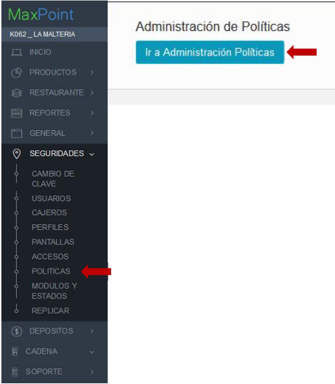

Seleccionamos las políticas por **CADENA**

Buscamos la política WS SERVIDOR, esta política se utiliza para configurar los nombres de dominios de los servicios que se consumen de servidores externos.

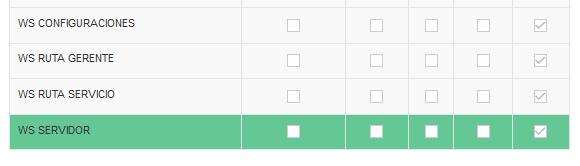

**AMBIENTE DE PRUEBAS**

Presionamos el botón **NUEVO PARÁMETRO**, y configuramos el parámetro **TRANSFERENCIA
PRUEBAS** como se muestra en la imagen a continuación.

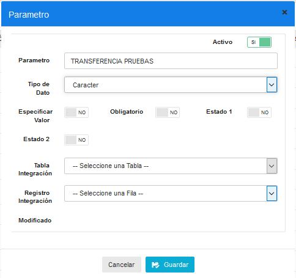

**AMBIENTE DE PRODUCCIÓN**

Presionamos el botón **NUEVO PARÁMETRO**, y configuramos el parámetro **TRANSFERENCIA PRODUCCION** como se muestra en la imagen a continuación.

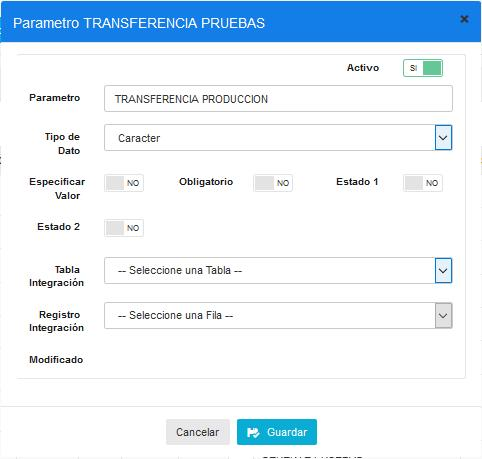

Verificamos que se haya creado los parámetros en la lista

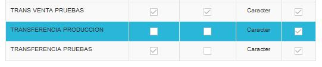

**CREAR RUTAS DE SERVICIOS**

Buscamos la política WS RUTA SERVICIO, esta política se utiliza para configuran las funciones de los servicios que se consumen.

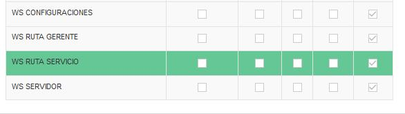

Presionamos el botón **NUEVO PARÁMETRO**, y configuramos el parámetro **TRANSFERENCIA PEDIDOS** como se muestra en la imagen a continuación.

Damos click al botón GUARDAR para que se almacene la información.

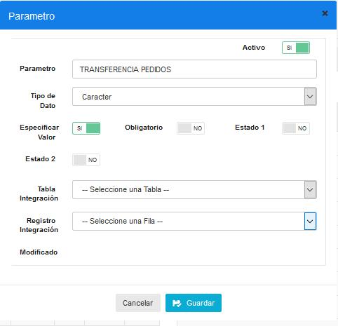

Verificamos que se haya creado en la lista de parámetros.

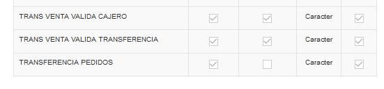

## CONFIGURACIÓN URL SERVICIOS

Nos dirigimos al módulo de **CADENAS**, a la pantalla **CADENA**, y damos click en la pestaña de **POLÍTICAS DE CONFIGURACIÓN.**

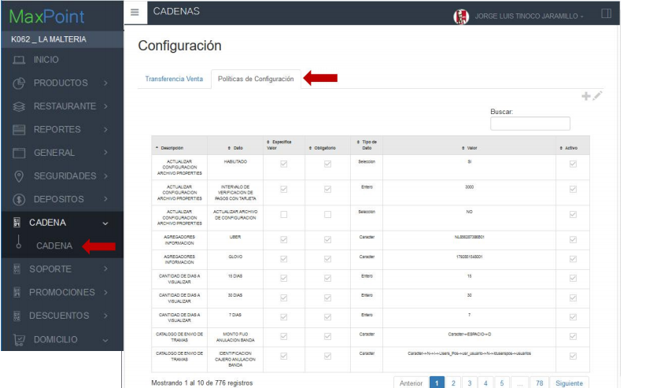

Presionamos el botón **+** para agregar una nueva política. Buscamos la política **WS SERVIDOR**, y seleccionamos el parámetro **TRANSFERENCIA PRUEBAS.**

En el campo VARCHAR escribimos la siguiente URL: 192.168.101.30:9090

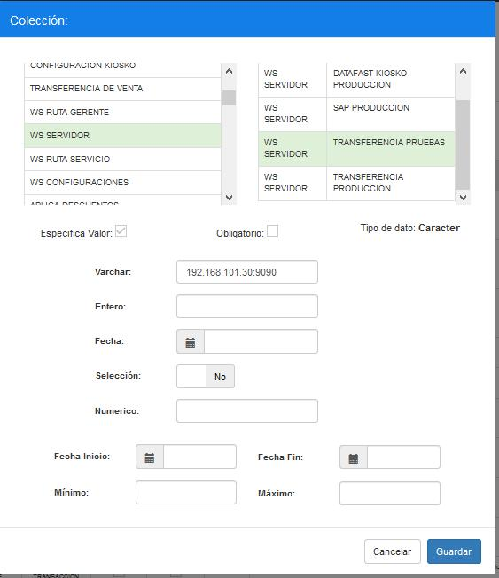

Presionamos el botón **+** para agregar una nueva política. Buscamos la política **WS SERVIDOR**, y seleccionamos el parámetro **TRANSFERENCIA PRODUCCION.**

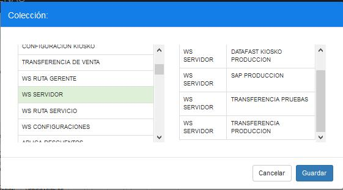

En el campo VARCHAR escribimos la siguiente URL: 192.168.101.168

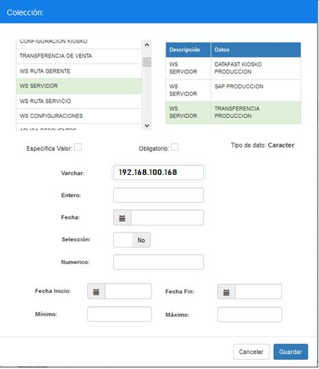

CONFIGURACIÓN DE RUTAS

RUTA TRANSFERENCIA DE PEDIDOS

Presionamos el botón **+** para agregar una nueva política a la cadena que tenemos
seleccionada. Buscamos la política WS RUTA SERVICIO y buscamos el parámetro
**TRANSFERENCIA PEDIDOS**

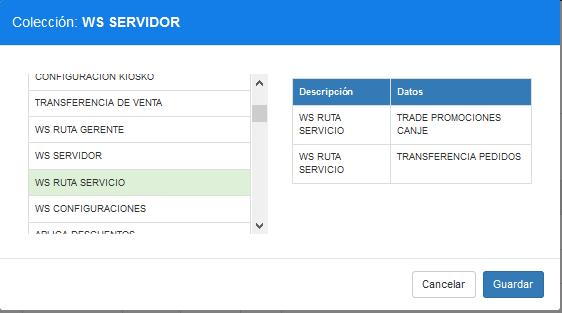

En el campo VARCHAR escribimos la siguiente ruta: /api-kfc/public/api/restApp/pedidoApp

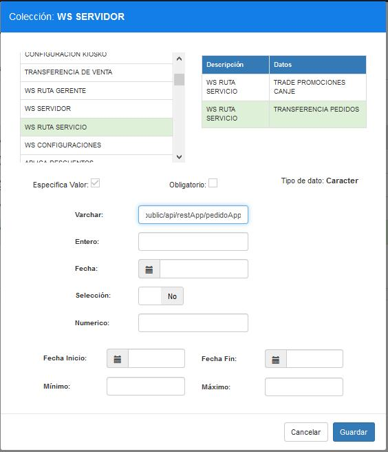

Comprobamos que las políticas se configuraron correctamente en la tabla principal, como se muestra la siguiente imagen:

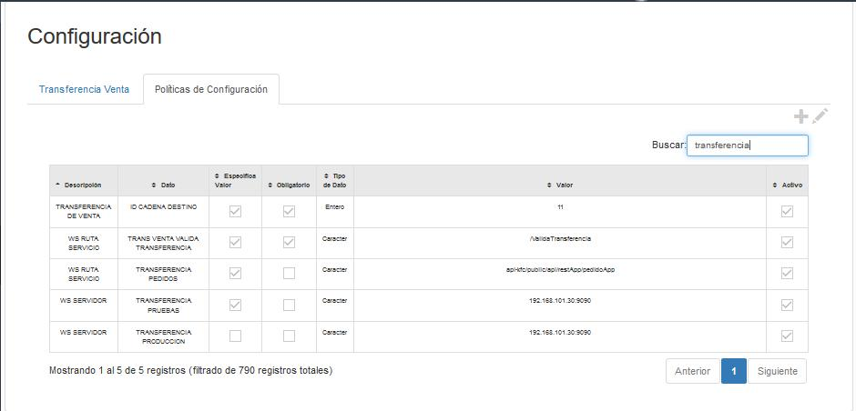