# Manual de Configuracion Tracking

**MANUAL PARA POLITICA TRACKING TRADE**

**INTRODUCCION**

TRACKING TRADE
Introducción - En este manual se detalla la creación y configuración de políticas, 
procedimientos y funciones de base de datos para la configuración de TRACKING 
TRADE

- POLÍTICAS EN LA OPCIÓN DE CADENA

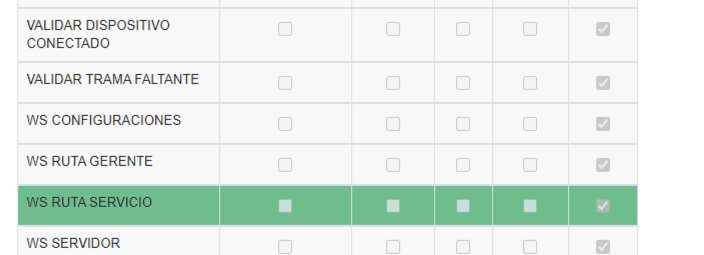

- POLÍTICAS EN LA OPCIÓN DE CADENA

|COLECCIÓN|PARAMETRO|
|:----|:----|
|WS RUTA SERVICIO|APP TRACKING|

## 1. CONFIGURACION DE POLÍTICAS

1. Para ingresar al módulo de “**Administración De Políticas**”, debe dar clic en la 
opción “**Seguridades**” y en el módulo de “**Políticas**”

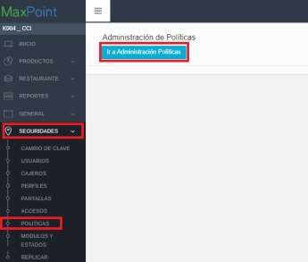

2. Al dar clic en la opción de 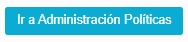 , se desplegará la siguiente 
pestaña

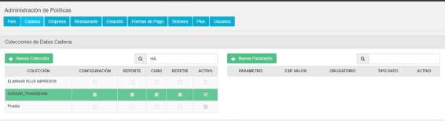

### 1.2 POLÍTICAS DE CADENA

### 1.2.1 COLECCIÓN WS RUTA SERVICIO

**a. Selección de la Colección**

1. Clic en el ícono “**CADENA**” para seleccionar una colección de Cadena

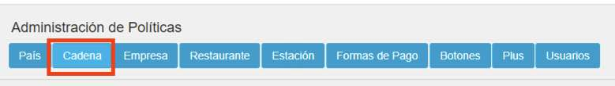

2. Seleccionar la Colección de Cadena WS RUTA SERVICIO

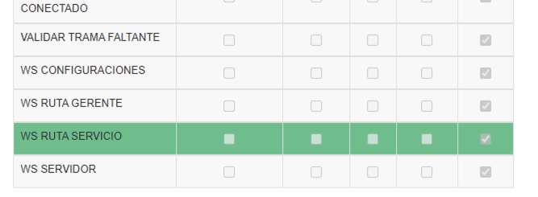

**b. Creación de los Parámetros**

Ubicarse en las políticas por “**CADENA**”, y seleccionar la colección “**WS RUTA SERVICIO”**

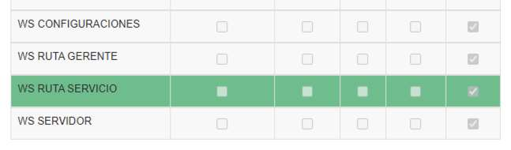

A continuación, se debe crear el siguiente parámetro : APP TRACKING.

Al dar click sobre el icono   , se desplegará una pantalla emergente 
para crear el parámetro mencionado. Ahora se detallará las configuraciones de los 
nuevos parametros

1. PARAMETRO: APP TRACKING

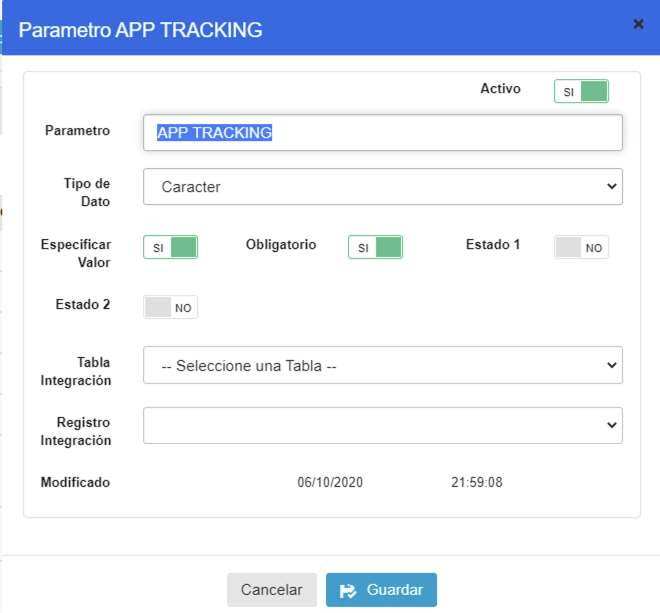

|PARAMETRO|TIPO DATO| ESP. VALOR|OBLIGATORIO|
|:----|:----|:----|:----|
|APP TRACKING|Caracter|SI|SI|

## 2. ACTIVACIÓN DE POLÍTICAS

### 2.1 ACTIVACIÓN DE POLITICA POR CADENA

1. Para ingresar al módulo de Políticas de Configuración de Cadena, debe dar clic 
en la opción “**Cadena**” en el módulo de “**Cadena**”

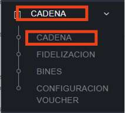

Selección de opción **Políticas**

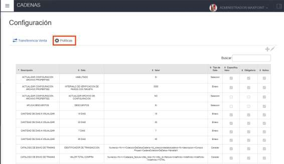

2. Seleccionar el icono  para configurar las siguientes politicas, seleccionar en descripcion la opción “**WS RUTA SERVICIO**” .

### 2.2.1 COLECCIÓN DE CONFIGURACIÓN WS RUTA SERVICIO

**a. PARAMETRO: APP TRACKING**

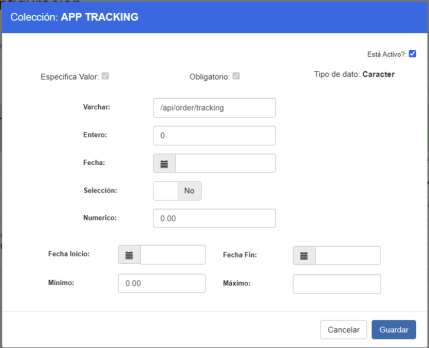

Ingrese los siguientes parametros y dar click sobre el botón Guardar.

|Campo|valor|Descripcion|
|:----|:----|:----|
|Caracter|/api/order/tracking|Indica el valor del punto final provisto porel proveedor trade para el servicio deTracking|
