# Manual Instalación API Motorizados

**Manual DE INSTALACIÓN Y USO DEL SISTEMA CENTRALIZADO DE MOTORIZADOS**

**INTRODUCCION**

**Introducción**- En este manual se detalla la instalación, configuración y ejecución del API de Motorizados Centralizados para el sistema MaxPoint en lenguaje de programación Java con el IDE Spring Tool Suite 4.

**Objetivo** – Conocer el funcionamiento del API de Motorizados, desde su instalación, configuración y ejecución.

**Requerimientos Iniciales** 

Es necesario poseer o instalar los aplicativos en las versiones mencionadas o superiores:

- JDK 1.8 o superior 

- Git 2.0 o superior

## **1.DESCARGA E INSTALACIÓN DEL IDE DE DESARROLLO**

1. Ingresamos a la URL https://spring.io/tools y descargamos el ide Spring Tool Suite 4 para el sistema operativo que estamos trabajando en este caso Windows.
 

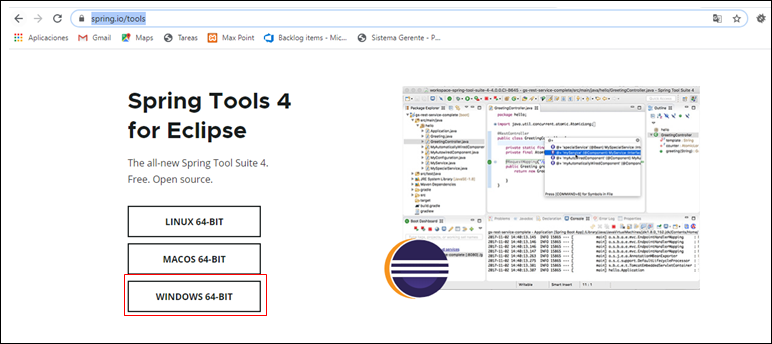

2. Se descargara un archico con extensión **.jar**, seleccionar la opción **Descargar**  al finalizar la descargar del archivo.

3. Colocar el archivo **.jar**en la ubicación donde desea instalar el ide en este caso lo colocamos en la raiz del disco **D**

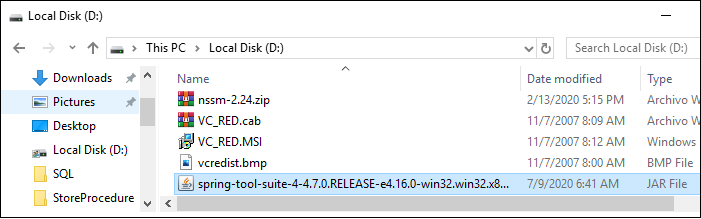

4. Abrimos una terminal (CMD), nos ubicamos en el disco D y ejecutamos el comando:

#java –jar  spring-tool-suite-4-4.7.0.RELEASE-e4.16.0-win32.win32.x86_64.self-extracting.jar

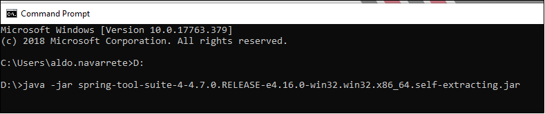

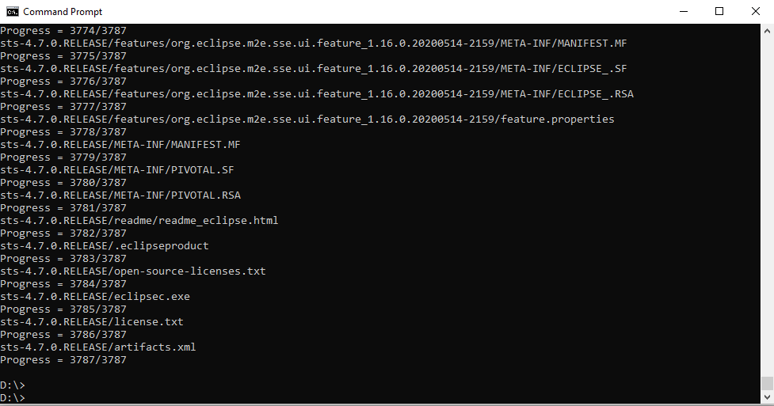

5. El comando ejecutado previamente extraera una carpeta que contiene el IDE **Spring Tool Suite 4**

6. Dar clic derecho sobre el archivo **SpringToolSuite4.exe** y crear un acceso directo al escritorio

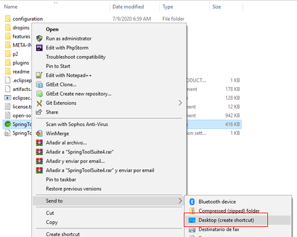

### 1.1 INSTALACIÓN DE BIBLIOTECA JAVA LOMBOK

Lombok es una librería Java que nos permite reducir la escritura de código Java. Escribiendo de manera automática getters, setters, constructores y funciones equals de manera automática.

1. Ingresamos a la url https://projectlombok.org/download y presionamos la opción de descarga del archivo jar

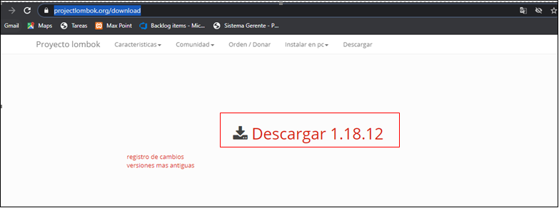

2. Guardar el archivo **.jar** descargado en una ubicación conocida en este caso en el disco D

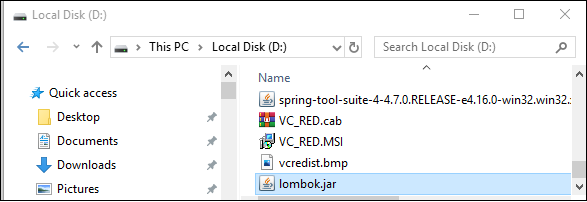

3. Abrimos una terminal (CMD), nos ubicamos en el disco D y ejecutamos el comando:

#java –jar lombok.jar

4. Se abrira una ventana que buscara nuestro IDE Spring Tool Suite 4 en nuestro computador. Seleccionamos el IDE que hayamos instalado en el paso previo y presionamos el botón **Install/Update**

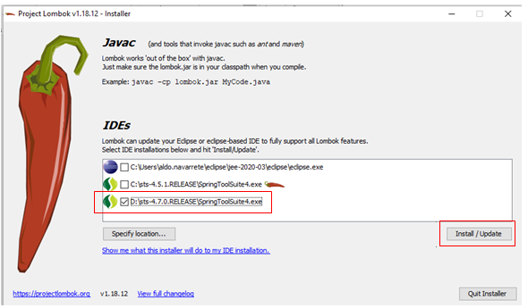

## 2. CARGA DE FUENTES DESDE EL REPOSITORIO EN SPRING TOOL SUITE 4

### 2.1. DESCARGA DE FUENTES

1. Seleccionamos una carpeta donde vamos a guardar nuestro código fuente. En este caso la carpeta “D:\Proyectos\Java”

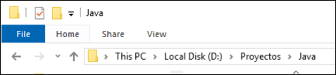

2.Abrimos el terminal GIT CMD y nos ubicamos en la carpeta del paso anterior. Y clonamos el repositorio con el siguiente comando:

# git clone http://sazteamfs:8080/tfs/KFCCollection/InvestigacionArquitecturas/_git/MSMotorizados_MasterData

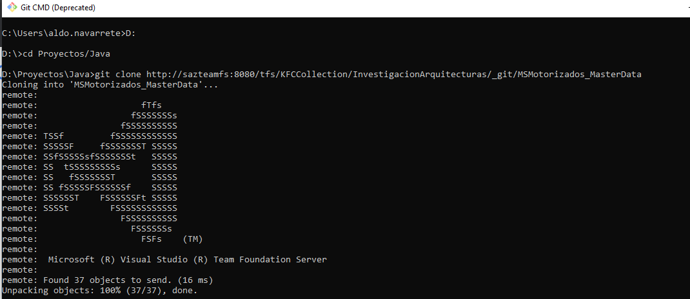

**Url del Repositorio:**
 http://sazteamfs:8080/tfs/KFCCollection/InvestigacionArquitecturas/_git/MSMotorizados_MasterData

### 2.2.CARGA DEL PROYECTO EN SPRING TOOL SUITE

1. Abrimos el IDE Spring Tool Suite ubicado en el escritorio. Damos doble clic sobre el icono que mostramos a continuación:

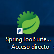

2. En el workspace seleccionamos la carpeta donde se encuentran nuestros proyectos en nuestro caso **D:\Proyectos\Java**. Esta carpeta se creo en el punto 2.1

3. Seleccionamos la opción **File/Import**

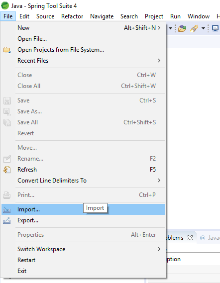

4. En la ventana emergente que se desplegara seleccionamos la opción **Existing Maven Projects**  y luego el botón **Next**

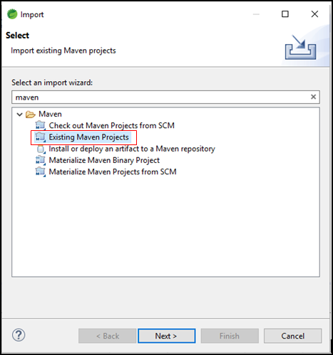

En la siguiente pantalla presionamos el botón **Browse**. Escogemos la carpeta de nuestros proyectos y finalmente presionamos el botón de Seleccionar carpeta **(Select Folder**).

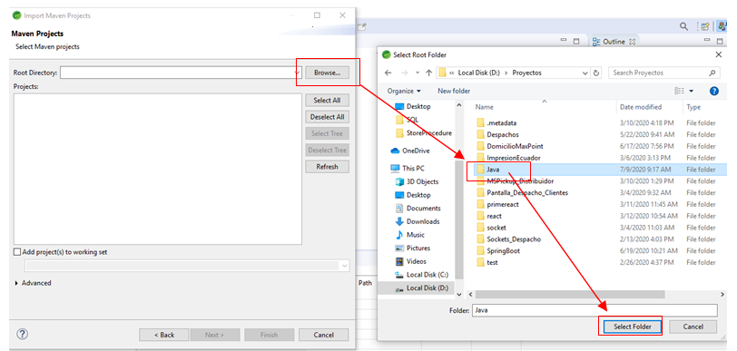

6. Seleccionamos el proyecto **MSMotorizados_MasterData** y presionamos el botón **Finish**

7. Para ejecutar y probar el servicio se debe dar clic derecho en la sección de **Boot Dashboard** y seleccionar la opción **Start**

8. Una vez se inicia el servicio. Se indicara por consola que el servicio a arrancado.

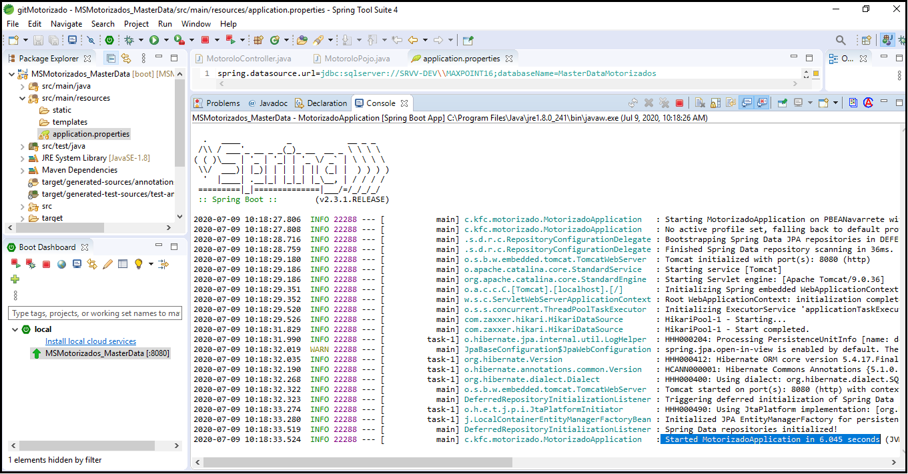

### 2.3. ARCHIVO DE CONFIGURACIÓN DEL PROYECTO 

El archivo de configuración del proyecto contiene información importante para conectarse a la base de datos, y en este archivo se deben colocar cualquier información adicional que se desee ofrezca el servicio.

El archivo se encuentra ubicado dentro de la carpeta **src/main/resources** y se llama **application.properties**

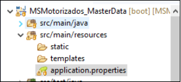

Este archivo contiene la siguiente estructura:

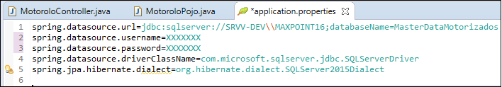

La cual describimos a continuación:

- **spring.datasource.url:**  Url de Conexión hacia la base de datos

- **spring.datasource.username:** Usuario de Base de Datos

- **spring.datasource.password:** Clave de Usuario

- **spring.datasource.driverClassName:** Driver de Conexión a Base de Datos

- **spring.jpa.hibernate.dialect:** Dialecto de comunicación con la Base de Datos

## 3. EXPORTACIÓN DE PROYECTO PARA EJECUCIÓN EXTERNA

Damos clic derecho sobre el proyecto y seleccionamos la opción **Run As/Maven build**

2. En la pantalla de configuración en la opción **Goals** escribimos la palabra **package** y presionamos el botón **Run**

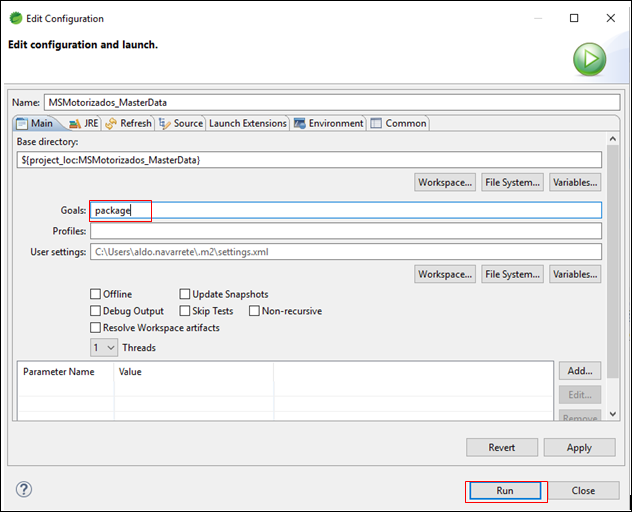

3. Ingresamos a la carpeta donde se encuentra el proyecto en este caso **D:\Proyectos\Java\MSMotorizados_MasterData**  y ingresamos a la carpeta **target** ahí se encontrara el archivo **.jar** compilado que se utilizara para la ejecución.

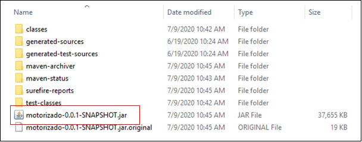

4. Para ejecutar el archivo jar del punto anterior ejecutamos el comando 
	#java –jar motorizado-0.0.1-SNAPSHOT.jar 