# Manual_Precios_Domicilio_V8

**MANUAL PARA LA CONFIGURACIÓN DE COSTO A DOMICILIO POR PLUS**

**INTRODUCCION**
CONFIGURACIÓN COSTO A DOMICILIO POR MENÚ

**Introducción** - En este manual se detalla la creación y configuración de políticas, procedimientos y funciones de base de datos para la configuración del costo a domicilio por Plus

## 1. CONFIGURACION DE POLÍTICAS

1. Para ingresar al módulo de “**Administración De Políticas**”, debe dar clic en la 
opción “**Seguridades**” y en el módulo de “**Políticas**”

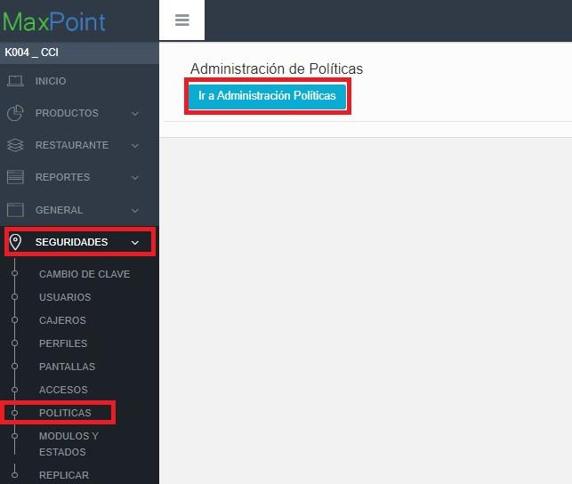

Al dar clic en la opción de 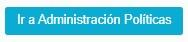  , se desplegará la siguiente pestaña

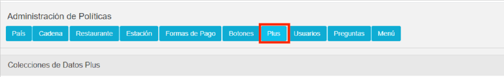

### 1.2 POLÍTICAS DE PLUS 

### 1.2.1 COLECCIÓN CONFIGURACION DOMICILIO 

a. Selección de la Colección 
1. Clic en el ícono “**Plus**” para seleccionar una colección de Cadenas

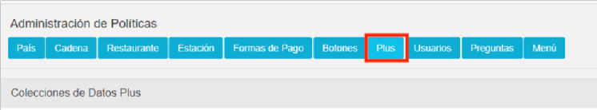

2. Verificar si se encuentra creada la colección “CONFIGURACION DOMICILIO” 
si se encuentra creada la seleccionamos, caso contrario para crear la nueva

colección damos clic en el botón Nueva Coleccion 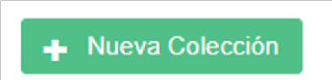  y 
llenamos la información de la siguiente forma:

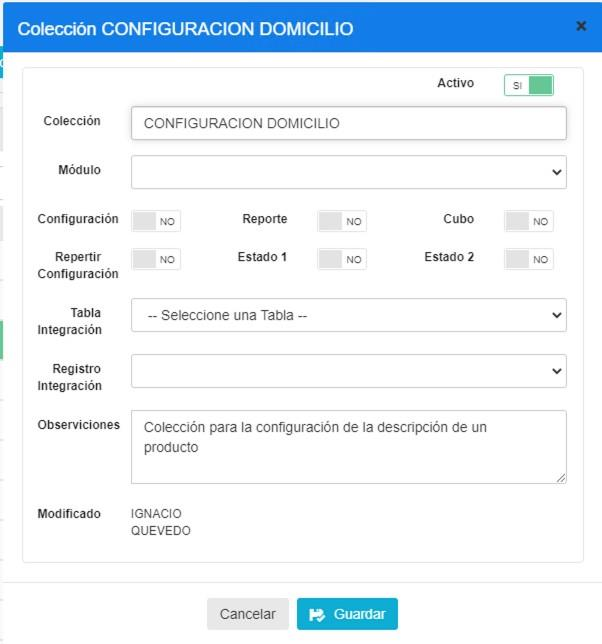

b. Creación de los Parámetros 

Ubicarse en las políticas por “**PLUS**”, y seleccionar la colección 
“**CONFIGURACION DOMICILIO**”

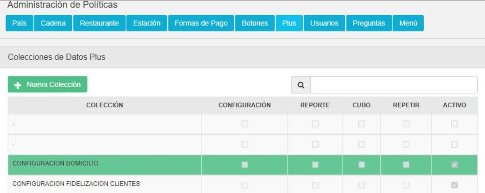

A continuación, se debe crear los siguientes parámetro : COSTO DELIVERY. 

Al dar click sobre el icono  , se desplegará una pantalla emergente 
para crear el parámetro mencionado. Ahora se detallará las configuraciones de los 
nuevos parametros.

1. PARAMETRO: COSTO DELIVERY

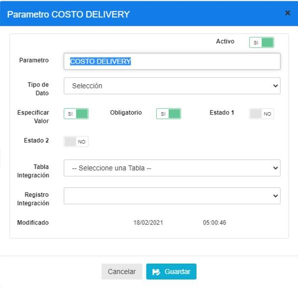

|PARAMETRO|TIPO DATO| ESP. VALOR|OBLIGATORIO|
|:----|:----|:----|:----|
|COSTO DELIVERY|Selección|SI|SI|

### 1. ACTIVACIÓN DE POLÍTICAS 

a. ACTIVACIÓN DE POLITICA POR PLUS 

1. Para configurar una **política de Plus** es necesario ingresar a la opción 
Productos/Nueva Productos

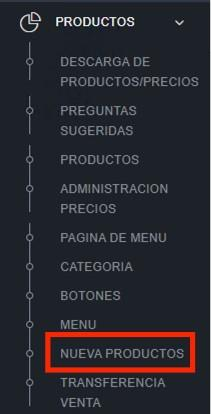

Creamos o seleccionamos un producto

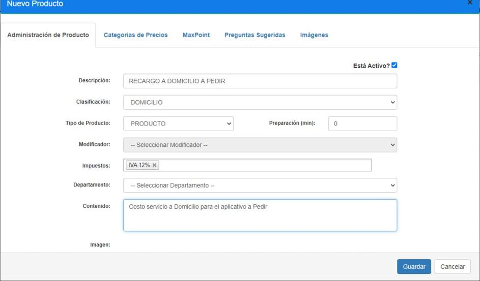

Agregamos o verificamos que se encuentren creados los precios de venta al 
publico PVP de todas las categorías de precios

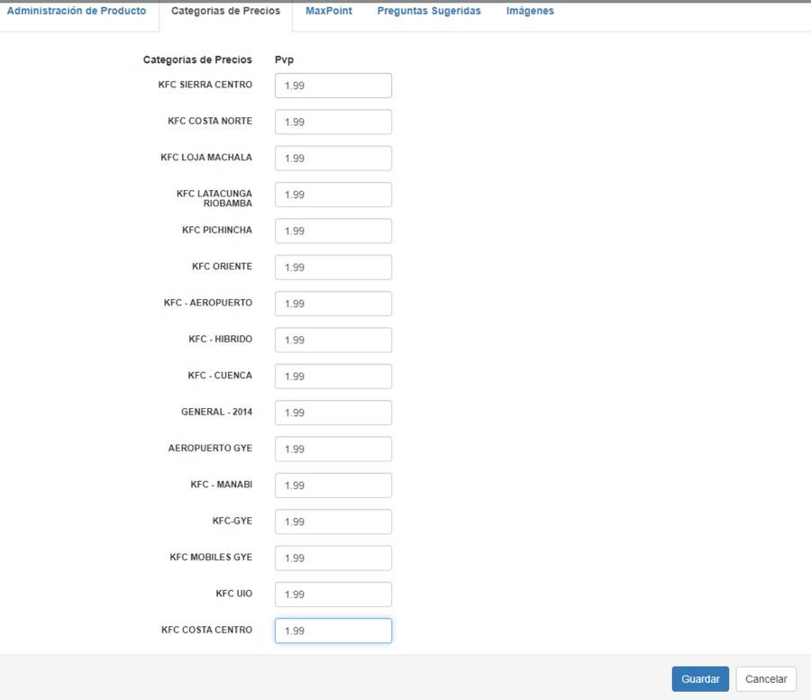
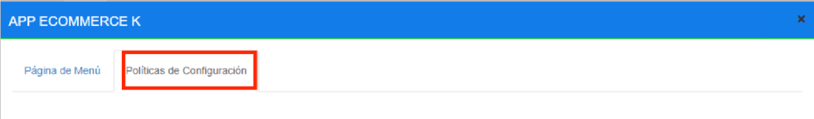

2. Al presionar el icono   seleccionamos la colección “**CONFIGURACION DOMICILIO**” y en la parte superior derecha el parametro “**COSTO DELIVERY**” en el campo **Selección** escojemos la opción SI.

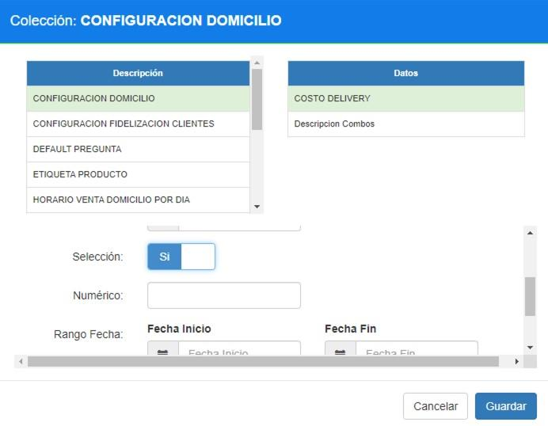

3. Al presionar el icono  seleccionamos la colección “**TIPO DE PRODUCTO**” y en la parte superior derecha el parámetro “**PRODUCTO**” en el campo 
Selección escogemos la opción **SI.**

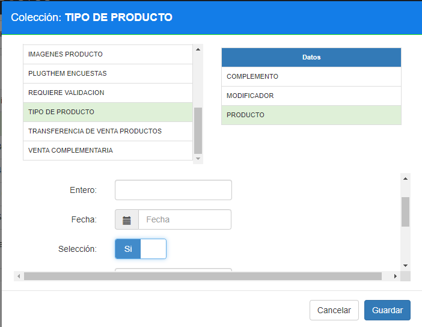

