#  Manual de instalación Turnero V3.0

 **Manual para INSTALACIÓN de turnero**

 **INTRODUCCION**

TURNERO

**Introducción**- En este manual se detalla la creación y configuración de políticas, instalación del socket despacho, implementación clientes Turnero, instalación de raspberry, configuración cliente Turnero y configuración de lector que se deben configurar en el BackOffice de Max-Point para el correcto funcionamiento del Turnero. A continuación, un listado de la administración de políticas que se deben configurar a nivel de Cadena y Restaurante 

- POLÍTICAS EN LA OPCIÓN DE CADENA 

|COLECCIÓN|PARAMETRO|
|:----|:----|
|CONFIGURACION TURNERO|TEMA|

- POLÍTICAS EN LA OPCIÓN DE RESTAURANTE  

|COLECCIÓN|PARAMETRO|
|:----|:----|
|CONFIGURACION TURNERO|ACTIVO|
|CONFIGURACION TURNERO|SERVIDOR SOCKETS|
|CONFIGURACION TURNERO|COLUMNAS|
|CONFIGURACION TURNERO|DISPOSICION|
|CONFIGURACION TURNERO|DISPOSICION BANNER|
|CONFIGURACION TURNERO|FILAS|
|CONFIGURACION TURNERO|MOSTRAR SOLO ORDENES LISTAS|
|CONFIGURACION TURNERO|TIEMPO CAMBIAR ESTADO ORDEN PREPARADA|
|CONFIGURACION TURNERO|TIEMPO ELIMINAR ORDEN LISTA|
|CONFIGURACION TURNERO|TIEMPO MOSTRAR ORDEN|

- POLÍTICAS EN LA OPCIÓN DE ESTACIÓN  

|COLECCIÓN|PARAMETRO|
|:----|:----|
|CONFIGURACION TURNERO|HABILITADO|

**Objetivo**- Conocer sobre las diferentes configuraciones que se deben realizar antes de colocar en producción el desarrollo del proceso de Turnero, así evitar inconvenientes con Maxpoint. 

## 1. CONFIGURACION DE POLÍTICAS

1.Para ingresar al módulo de “**Administración De Políticas**”, debe dar clic en la opción “**Seguridades**” y en el módulo de “**Políticas**”

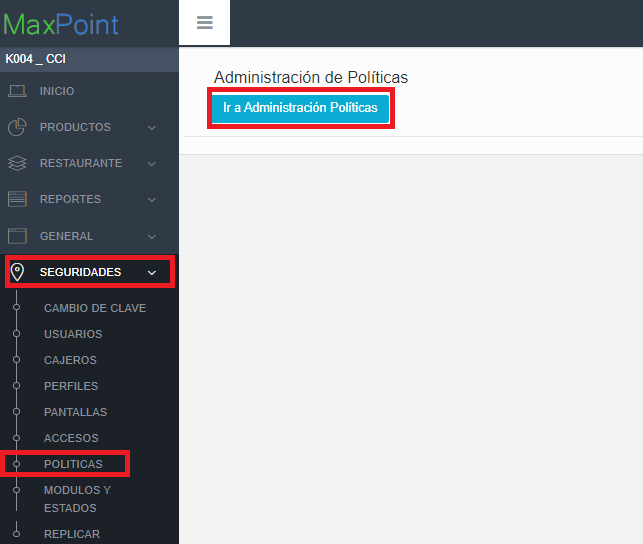

2. Al dar clic en la opción de , se desplegará la siguiente pestaña

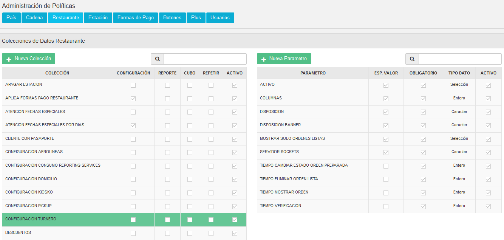

3. A continuación, se detallará la creación de las politicas que se deben realizar para el paso a producción de TURNERO en cadena y restaurante:

### 1.1 POLÍTICAS DE CADENA 

### 1.1.1 COLECCIÓN CONFIGURACIÓN TURNERO 	

a.Creación de la Colección

1. Clic en el ícono “**Cadena**” para agregar una colección de Cadena

2. Dar clic en la opción   y se desplegará la siguiente pantalla emergente.   

Ingrese los siguientes parametros y dar click sobre el botón Guardar. 

|Campo|valor|
|:----|:----|
|Colección|CONFIGURACION TURNERO|
|Observaciones|Configuración de parámetros para turnero|

b.Creación de los Parámetros

Ubicarse en las políticas por “**CADENA**”, buscar la nueva colección “**CONFIGURACION TURNERO**”.

Al dar click sobre el icono   ,  una pantalla emergente se desplegará  para crear el parámetro TEMA. 

1. PARAMETRO: TEMA

|PARAMETRO|TIPO DATO|ESP. VALOR|OBLIGATORIO|
|:----|:----|:----|:----|
|TEMA|Caracter|SI|SI|

Como resultado el parámetro de la política “**CONFIGURACION TURNER**O” quedaría de la siguiente forma.

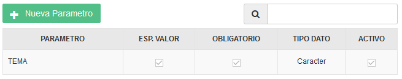

### 1.2 POLÍTICAS DE RESTAURANTE 

### 1.2.1 COLECCIÓN CONFIGURACIÓN TURNERO
a.Creación de la Colección

1. Clic en el ícono “**RESTAURANTE**” para agregar una colección de Restaurante

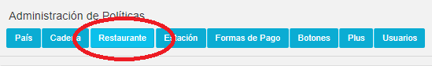

2. Dar clic en la opción   y se desplegara la siguiente pantalla emergente 

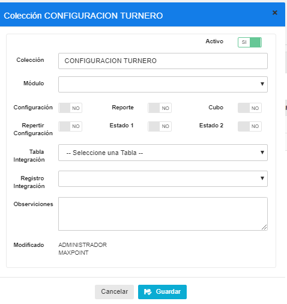

3. Ingrese los siguientes parametros y dar click sobre el botón Guardar. 

| **Campo** |       **valor**       |
|:---------:|:---------------------:|
| Colección | CONFIGURACION TURNERO |

b.Creación de los Parámetros

Ubicarse en las políticas por “**RESTAURANTE**”, y buscar la nueva colección “**CONFIGURACION TURNERO**”

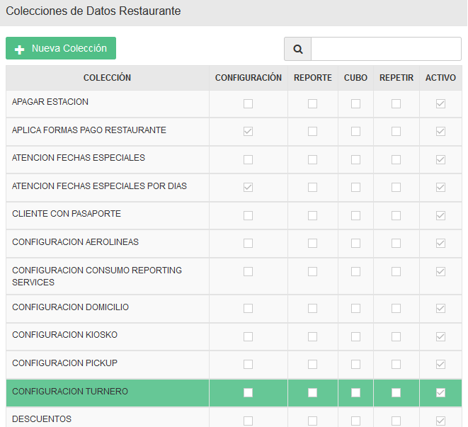

A continuación, se debe crear los siguientes parámetros : *ACTIVO, SERVIDOR SOCKETS, COLUMNAS, DISPOSICION, DISPOSICION BANNER, MOSTRAR SOLO ORDENES LISTAS,  TIEMPO CAMBIAR ESTADO ORDEN PREPARADA, TIEMPO ELIMINAR ORDEN LISTA, TIEMPO MOSTRAR ORDEN, TIEMPO VERIFICACION.*

Al dar click sobre el icono  , se desplegará una pantalla emergente para crear los parámetros ya mencionados. Ahora se detallará las configuraciones de los nuevos parametros.

1. PARAMETRO: ACTIVO

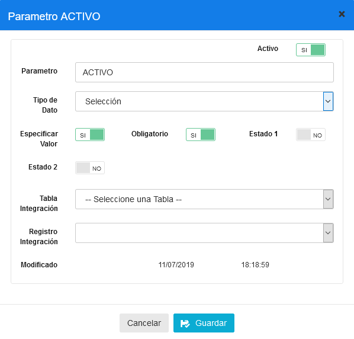

| PARAMETRO | TIPO DATO | ESP. VALOR | OBLIGATORIO |
|:---------:|:---------:|:----------:|:-----------:|
| ACTIVO    | Selección |     SI     |      SI     |

2. PARAMETRO: SERVIDOR SOCKETS

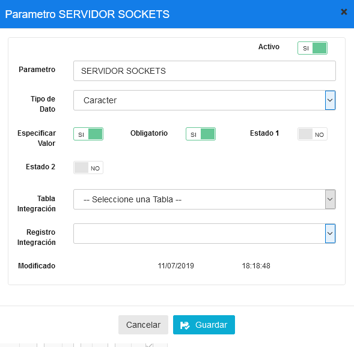

|     PARAMETRO    | TIPO DATO | ESP. VALOR | OBLIGATORIO |
|:----------------:|:---------:|:----------:|:-----------:|
| SERVIDOR SOCKETS |  Caracter |     SI     |      SI     |

3. PARAMETRO: COLUMNAS

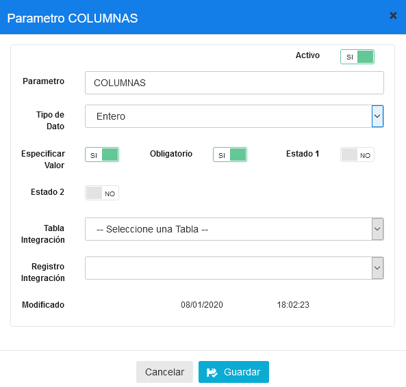

| PARAMETRO | TIPO DATO | ESP. VALOR | OBLIGATORIO |
|:---------:|:---------:|:----------:|:-----------:|
| COLUMNAS  |   Entero  |     SI     |      SI     |

4. PARAMETRO: DISPOSICION

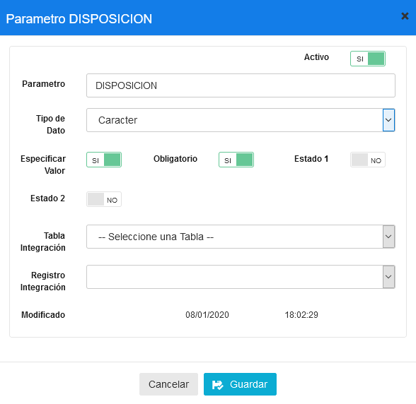

|  PARAMETRO  | TIPO DATO | ESP. VALOR | OBLIGATORIO |
|:-----------:|:---------:|:----------:|:-----------:|
| DISPOSICION |  Caracter |     SI     |      SI     |

5. PARAMETRO: DISPOSICION BANNER

|      PARAMETRO     | TIPO DATO | ESP. VALOR | OBLIGATORIO |
|:------------------:|:---------:|:----------:|:-----------:|
| DISPOSICION BANNER |  Caracter |     SI     |      SI     |

6. PARAMETRO: FILAS

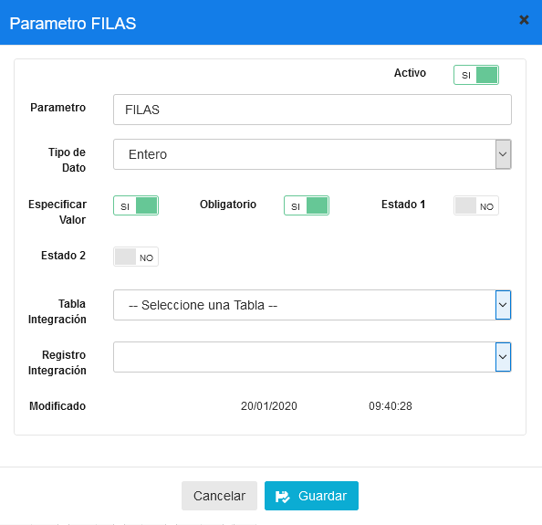

| PARAMETRO | TIPO DATO | ESP. VALOR | OBLIGATORIO |
|:---------:|:---------:|:----------:|:-----------:|
| FILAS     |   Entero  |     SI     |      SI     |

7. PARAMETRO: MOSTRAR SOLO ORDENES LISTAS

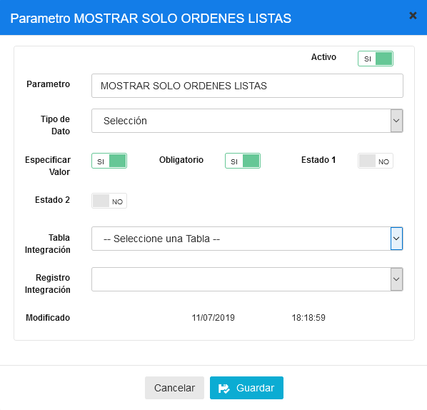

|          PARAMETRO          | TIPO DATO | ESP. VALOR | OBLIGATORIO |
|:---------------------------:|:---------:|:----------:|:-----------:|
| MOSTRAR SOLO ORDENES LISTAS | Selección |     SI     |      SI     |

8. PARAMETRO: TIEMPO CAMBIAR ESTADO ORDEN PREPARADA

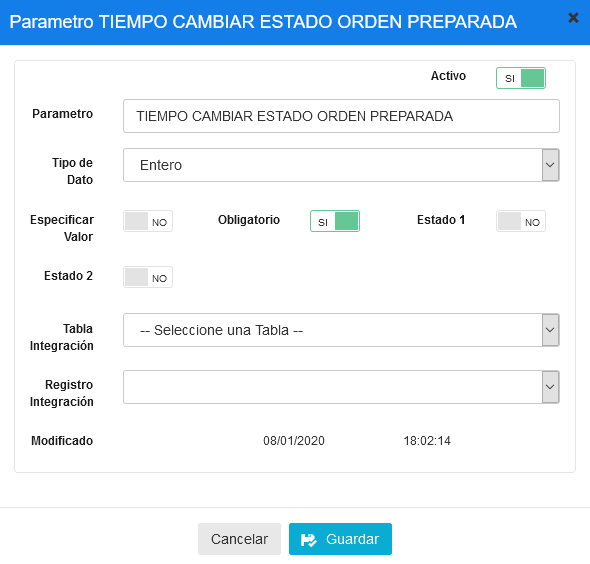

|                PARAMETRO               | TIPO DATO | ESP. VALOR | OBLIGATORIO |
|:--------------------------------------:|:---------:|:----------:|:-----------:|
| TIEMPO CAMBIAR ESTADO ORDEN PREPARADA  |   Entero  |     NO     |      SI     |

9. PARAMETRO: TIEMPO ELIMINAR ORDEN LISTA

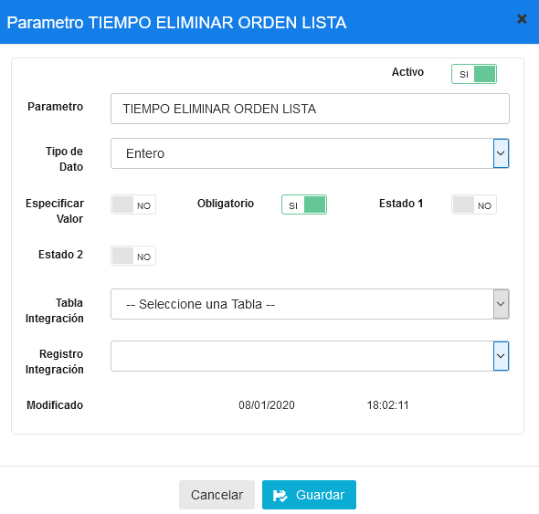

|          PARAMETRO          | TIPO DATO | VALOR | OBLIGATORIO |
|:---------------------------:|:---------:|:-----:|:-----------:|
| TIEMPO ELIMINAR ORDEN LISTA |   Entero  |   NO  |      SI     |

10. PARAMETRO: TIEMPO MOSTRAR ORDEN

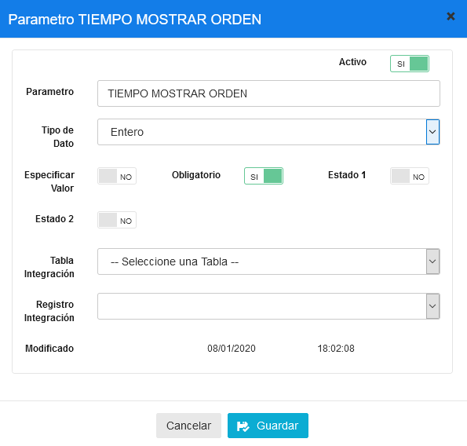

|       PARAMETRO      | TIPO DATO | ESP. VALOR | OBLIGATORIO |
|:--------------------:|:---------:|:----------:|:-----------:|
| TIEMPO MOSTRAR ORDEN |   Entero  |     NO     |      SI     |

11. PARAMETRO: TIEMPO VERIFICACION

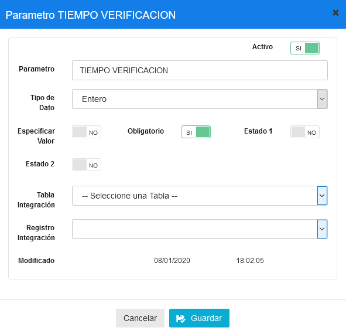

|      PARAMETRO      | TIPO DATO | ESP. VALOR | OBLIGATORIO |
|:-------------------:|:---------:|:----------:|:-----------:|
| TIEMPO VERIFICACION |   Entero  |     NO     |      SI     |

Como resultado los parámetros de la política **“CONFIGURACION TURNERO”** quedarían de la siguiente forma.

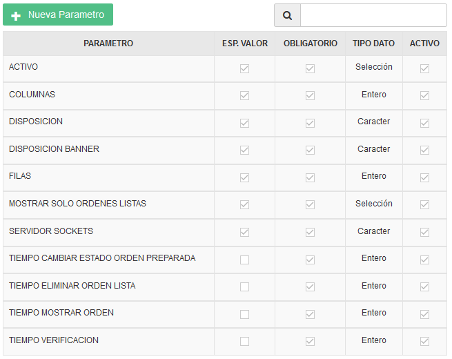

Ahora, ubicarse en las políticas por “**RESTAURANTE**”, y buscar la colección **IMPRIMIR ORDEN DE PEDIDO**

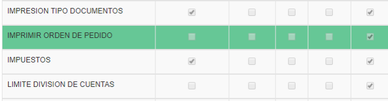

Dar click sobre el icono   , se desplegará una pantalla emergente para crear el siguiente parámetro. 

|  PARAMETRO  | TIPO DATO | ESP. VALOR | OBLIGATORIO |
|:-----------:|:---------:|:----------:|:-----------:|
| ACTIVAR QR? | Selección |     SI     |      SI     |

Como resultado los parámetros de la política “IMPRIMIR ORDEN DE PEDIDO” quedarían de la siguiente forma.

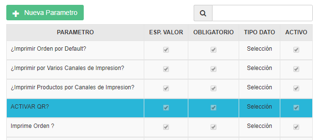

### 1.3 POLÍTICAS DE ESTACIÓN

### 1.3.1 COLECCIÓN CONFIGURACIÓN TURNERO

a.Creación de la Colección
1. Clic en el ícono “**Estación”** para agregar una colección de Restaurante

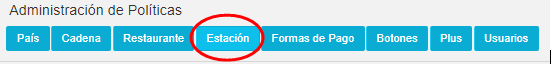

2. Dar clic en la opción    y se desplegara la siguiente pantalla emergente 

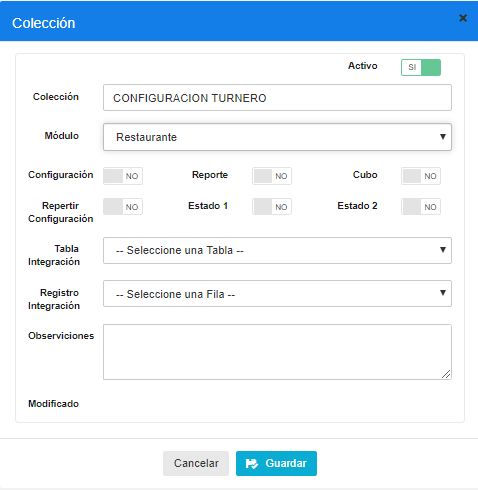

3. Ingrese los siguientes parametros y dar click sobre el botón Guardar. 

|   Campo   |         valor         |
|:---------:|:---------------------:|
| Colección | CONFIGURACION TURNERO |

b.Creación de los Parámetros

Ubicarse en las políticas por “**Estación**”, y buscar la nueva colección “**CONFIGURACION TURNERO**”

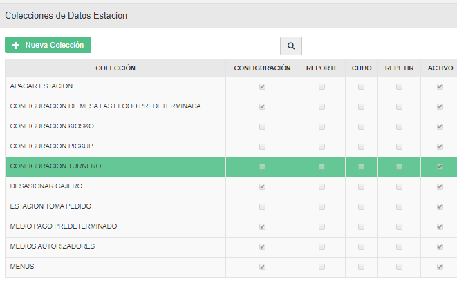

A continuación, se debe crear los siguientes parámetros : HABILITADO. 

Al dar click sobre el icono  , se desplegará una pantalla emergente para crear los parámetros ya mencionados. Ahora se detallará las configuraciones de los nuevos parametros.

1. PARAMETRO: HABILITADO

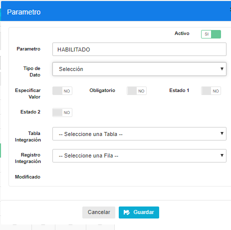

|  PARAMETRO | TIPO DATO | ESP. VALOR | OBLIGATORIO |
|:----------:|:---------:|:----------:|:-----------:|
| HABILITADO | Selección |     NO     |      NO     |

## 2. ACTIVACIÓN DE POLÍTICAS

### 2.1 ACTIVACIÓN DE POLITICA POR CADENA

Para ingresar al módulo de Políticas de Configuración de Cadena, debe dar clic en la opción “**Cadena**” en el módulo de “Cadena”

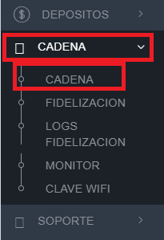

A continuación, se despliega la siguiente pantalla con dos pestañas: Transferencia de venta y Políticas de configuración. 

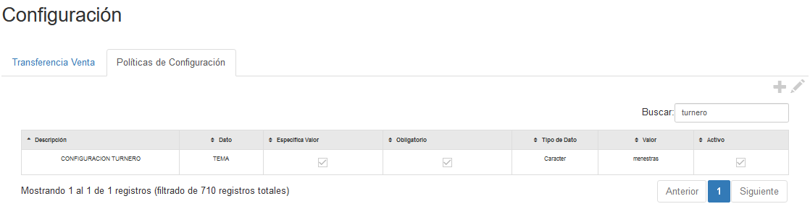

2. Dar click sobre la pestaña de politicas de configuración y en la parte superior derecha , seleccionar  el icono   para configurar las siguientes politicas en la descripción de “CONFIGURACION PICKUP” .

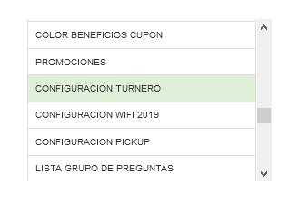

### 2.1.1 COLECCIÓN DE CONFIGURACIÓN TURNERO 

a. PARAMETRO: TEMA

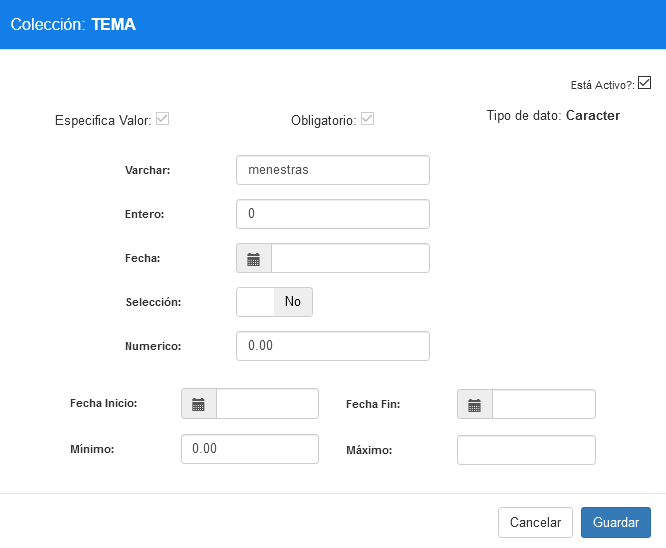

Ingrese los siguientes parametros y dar click sobre el botón Guardar. 

|   Campo  |   valor   |                Descripcion                | OBLIGATORIO |
|:--------:|:---------:|:-----------------------------------------:|:-----------:|
| Caracter | menestras | El tema va acorde al nombre de la cadena  |      NO     |

**Nota : Se recomienda utilizar los nombres de los temas creados (menestras, kfc) y de preferencia el valor debe ser escrito en minusculas**

### 2.2 ACTIVACIÓN DE POLITICA POR RESTAURANTE

1. Para ingresar al módulo de Políticas de Configuración de Restaurante, debe dar clic en la opción “**Restaurante**” en el módulo de “**Restaurante**”

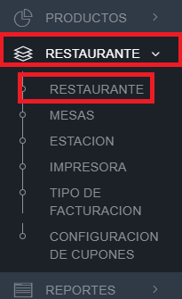

A continuación, se despliega una tabla con todos los restaurantes para la cadena seleccionada.

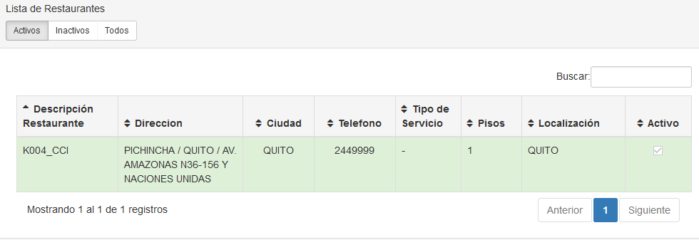

2. Dar click sobre el restaurante deseado y una pantalla emergente se despliega. En la parte superior derecha de la pantalla emergente, seleccionar la pestaña “**Políticas de configuración**”

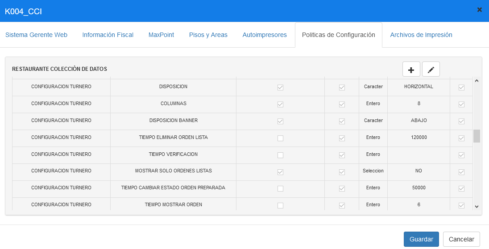

3. Seleccionar  el icono   para configurar las siguientes politicas en la descripcion de “**CONFIGURACION TURNERO**” .

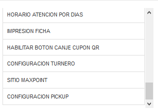

### 2.2.1 COLECCIÓN DE CONFIGURACIÓN TURNERO

**a.PARAMETRO: DISPOSICION**

Ingrese los siguientes parametros y dar click sobre el botón Guardar.

|   Campo  |         valor         |                                Descripcion                                |
|:--------:|:---------------------:|:-------------------------------------------------------------------------:|
| Caracter | HORIZONTAL / VERTICAL | Disposicion del Turnero de acuerdo a la posicion de la pantalla del local |

**Nota : El valor dependera si la pantalla esta ubicada de manera Horizontal o Vertical**

**b. PARAMETRO: COLUMNAS**

Ingrese los siguientes parametros y dar click sobre el botón Guardar.

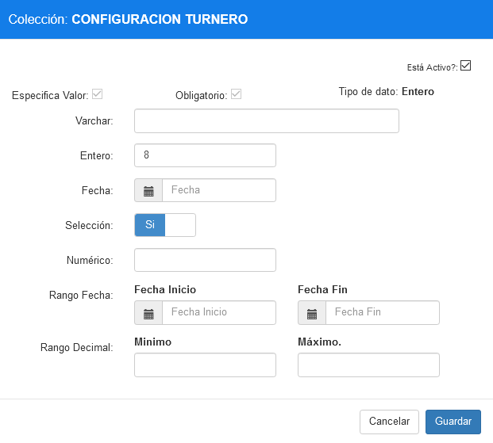

Ingrese los siguientes parametros y dar click sobre el botón Guardar.

|  Campo | valor |              Descripcion              |
|:------:|:-----:|:-------------------------------------:|
| Entero |   8   | Numero de columnas (ordenes) por fila |

**Nota : Si el valor de COLUMNA es un numero impar se redondea al superior  ( 3 columnas = 4 columnas), es importe saber que solo se admiten valores enteros del 1 al 8**

**En las siguientes tablas se explica como quedaria la configuracion de las columnas**

**Si el turnero esta configurado solo para mostrar la seccion PREPARANDO y ORDEN LISTA**

| COLUMNAS | PREPARANDO | ORDEN LISTA |
|:--------:|:----------:|:-----------:|
|     2    |   1 orden  |   1 orden   |
|     4    |  2 ordenes |  2 ordenes  |
|     6    |  3 ordenes |  3 ordenes  |
|     8    |  4 ordenes |  4 ordenes  |

**Si el turnero esta configurado solo para mostrar la seccion ORDEN LISTA**

| COLUMNAS | ORDEN LISTA | ORDEN LISTA |
|:--------:|:-----------:|:-----------:|
|     2    |  2 ordenes  |   1 orden   |
|     4    |  4 ordenes  |  2 ordenes  |
|     6    |  6 ordenes  |  3 ordenes  |
|     8    |  8 ordenes  |  4 ordenes  |

	Mas adelante se explica como configurar las secciones antes mencionadas
    
**c. PARAMETRO: DISPOSICION BANNER**

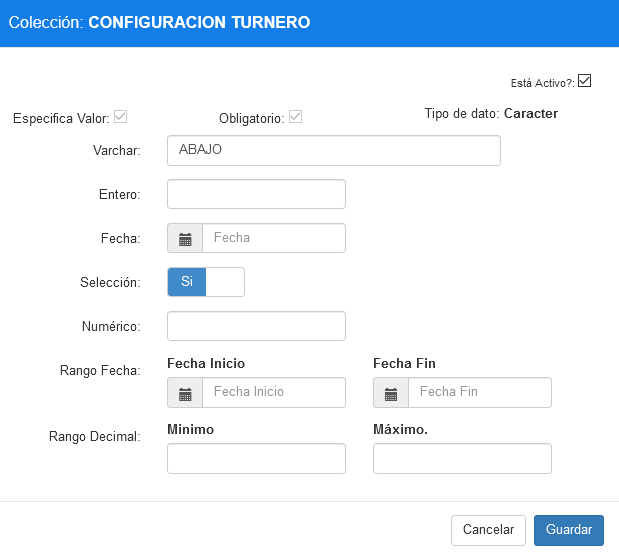

Ingrese los siguientes parametros y dar click sobre el botón Guardar.

|   Campo  |      valor     |                Descripcion                |
|:--------:|:--------------:|:-----------------------------------------:|
| Caracter | ABAJO / ARRIBA | Ubicación del banner (logo) de la cadena  |

**Nota :El banner su ubica horizontalmente en la parte superior o inferior de las ordenes del Turnero, de acuerdo a la cadena**

**d.PARAMETRO: FILAS**

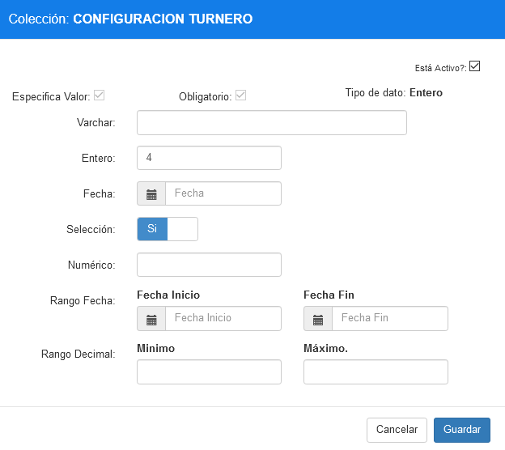

Ingrese los siguientes parametros y dar click sobre el botón Guardar.

|  Campo | valor |              Descripcion              |
|:------:|:-----:|:-------------------------------------:|
| Entero |   3   | Numero de filas (ordenes) por columna |

**Nota: El turnero solo admite el valor de 3 y 4 FILAS. Cuando la disposicion del turnero sea Horizontal se reflejara el numero de filas configurado.**

**Si el turnero esta en Vertical hara un calculo de filas por columnas para mostrar el total de ordenes, por ejemplo:**

| FILAS | COLUMNAS | ORDENES |
|:-----:|:--------:|:-------:|
|   3   |     6    |    15   |
|   3   |     8    |    20   |
|   4   |     6    |    21   |
|   4   |     8    |    14   |

**Esta tabla seria la configuracion recomendada tanto en filas y columnas, pero puede existir el caso de menos columnas (1-8), pero filas solo puede admitir valores de (3-4).**

**e. PARAMETRO: TIEMPO ELIMINAR ORDEN LISTA**

Ingrese los siguientes parametros y dar click sobre el botón Guardar.

|  Campo | valor |                                              Descripcion                                              |
|:------:|:-----:|:-----------------------------------------------------------------------------------------------------:|
| Entero |  600  | Tiempo (segundos) que se demora el turnero para que las ordenes se eliminen de la seccion ORDEN LISTA |

**Nota :El tiempo se encuentra en segundos ( 1 min = 60 segundos), si el valor es 0, NO PASARA AUTOMATICAMENTE LAS ORDENES.**

**f. PARAMETRO: TIEMPO VERIFICACION**

Ingrese los siguientes parametros y dar click sobre el botón Guardar.

|  Campo | valor |                                                   Descripcion                                                   |
|:------:|:-----:|:---------------------------------------------------------------------------------------------------------------:|
| Entero |   10  | Tiempo (segundos) que se demora el turnero para verificar si una orden se encuentra en PREPARANDO u ORDEN LISTA |

**Nota :El tiempo se encuentra en segundos ( 1 min = 60 segundos), si el valor es 0 NO SE VERIFICARA, ES DECIR NO PASARA AUTOMATICAMENTE LAS ORDENES.**

**g. PARAMETRO: MOSTRAR SOLO ORDENES LISTAS**

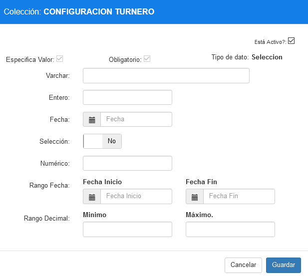

Ingrese los siguientes parametros y dar click sobre el botón Guardar.

|   Campo   |  valor  |             Descripcion             |
|:---------:|:-------:|:-----------------------------------:|
| Selección | SI / NO | Mostrar solo la seccion ORDEN LISTA |

**Nota :Si el valor es ( SI ) solo mostrará la sección ORDEN LISTA en vertical u horizontal, si el calor es (NO) se mostrar las dos secciones PREPARANDO y ORDEN LISTA en vertical u horizontal.**

**h.PARAMETRO: TIEMPO CAMBIAR ESTADO ORDEN PREPARADA**

Ingrese los siguientes parametros y dar click sobre el botón Guardar.

|  Campo | valor |                                                 Descripcion                                                |
|:------:|:-----:|:----------------------------------------------------------------------------------------------------------:|
| Entero |  300  | Tiempo (segundos) que se demora el turnero para cambiar el estado de una orden de PREPARANDO a ORDEN LISTA |

**Nota :El tiempo se encuentra en segundos ( 1 min = 60 segundos), si el valor es 0, NO PASARA AUTOMATICAMENTE LAS ORDENES.**

**i. PARAMETRO: TIEMPO MOSTRAR ORDEN**

Ingrese los siguientes parametros y dar click sobre el botón Guardar.

|   Campo  | valor |                                                         Descripcion                                                         |
|:--------:|:-----:|:---------------------------------------------------------------------------------------------------------------------------:|
|   Entero |    6  | Tiempo (segundos) que el turnero mantiene visible una Orden Lista en el centro de la pantalla sobre una caja de color verde |

**Nota :El tiempo se encuentra en segundos ( 1 min = 60 segundos)**

j. PARAMETRO: SERVIDOR SOCKETS

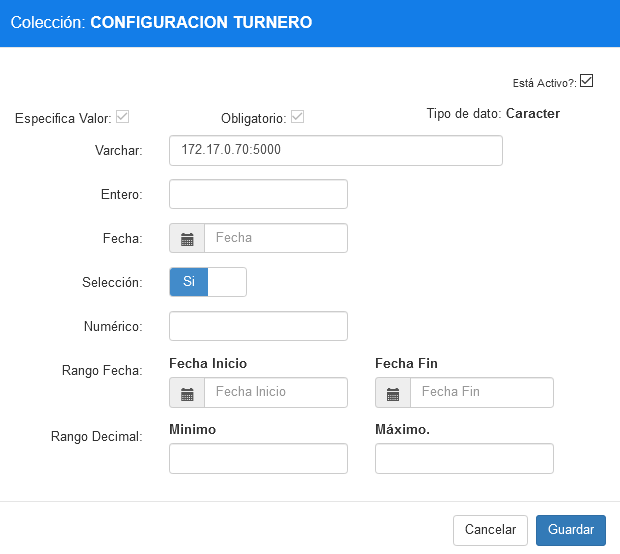

Ingrese los siguientes parametros y dar click sobre el botón Guardar.

|   Campo  |       valor      |           Descripcion           |
|:--------:|:----------------:|:-------------------------------:|
| Caracter | 172.17.0.70:5000 | Puerto e IP del servidor socket |

**Nota :Se configura de acuerdo a los parametros del local**

**k. PARAMETRO: ACTIVO**

Ingrese los siguientes parametros y dar click sobre el botón Guardar.

|   Campo   |  valor  |         Descripcion         |
|:---------:|:-------:|:---------------------------:|
| Selección | SI / NO | SI el local aplica Turnero  |

### 2.2.2 COLECCIÓN DE IMPRIMIR ORDEN DE PEDIDO

**a.  ¿ACTIVAR QR?**

Ingrese los siguientes parametros y dar click sobre el botón Guardar.

|   Campo   |  valor  |                         Descripcion                        |
|:---------:|:-------:|:----------------------------------------------------------:|
| Selección | SI / NO | Activa la impresión del QR en la impresión de orden pedido |

**Nota :Imprime el QR debajo del detalle de la orden pedido**

1. Una vez configurado correctamente quedará de la siguiente manera.

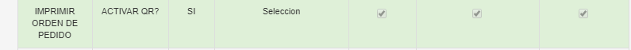

### 2.3 ACTIVACIÓN DE POLITICA POR ESTACIÓN

1. Para ingresar al módulo de Políticas de Configuración de Estación, debe dar clic en la opción “**Estación**” en el módulo de “**Restaurante**”

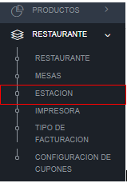

2. A continuación, se debe seleccionar el restaurante asociado en el selector “Seleccionar Restaurante”:

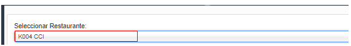

3. En la parte inferior es necesario seleccionar la estación a la que se le desea aplicar la politica y darle doble clic

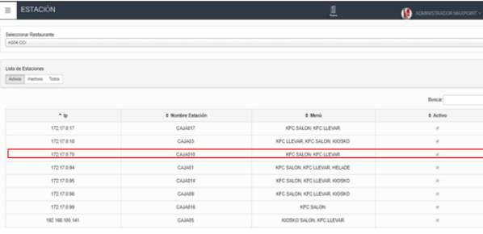

4. Al dar doble clic se desplegará una ventana emergente con las opciones de configuración de la estación. Seleccionamos la pestaña “Politicas de Configuración”:s

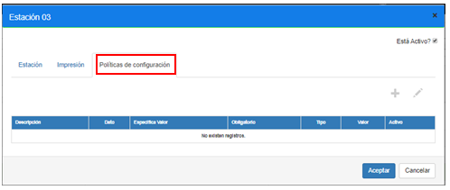

5. Seleccionar  el icono  para configurar la politica en el primer recuadro seleccionamos “**CONFIGURACION TURNERO**” y en el segundo recuadro seleccionamos la opción “**HABILITADO**” . Si deseamos que esta estación no muestre sus pedidos en el Turnero en el campo **Selecciòn**  escojemos la opción **NO**. Finalmente se presiona el botón Guardar.

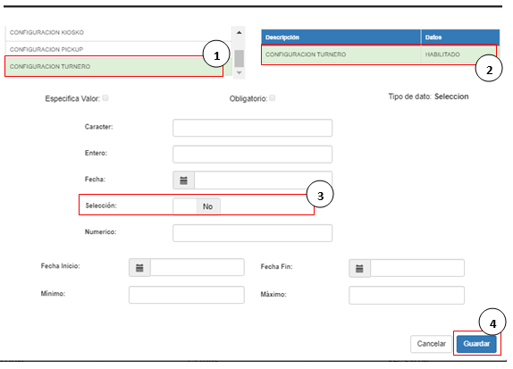

**Nota: Si esta política no se encuentra configurada, todos los pedidos serán mostrados en la pantalla del turnero**.

## 3. INSTALACIÓN DEL SOCKETS DESPACHO

### 3.1 IMPLEMENTACIÓN SERVIDOR (Windows)

1.Instalar Node 
La versión 10.16.3 o superior https://nodejs.org/es/download/

2. Copiar ficheros o descargar 

Si el proceso se lo realiza mediante despliegue de TFS, se copiara la carpeta Sockets_Despacho en el disco C sobre la raiz o en la ruta c:/Node, preferiblemente guardarlo en la ruta: c:/Sockets_Despacho (copiar el fichero directamente en c:/)

Si el proceso se lo realiza manualmente, de igual manera se debe copiar la carpeta Sockets_Despacho sobre la raiz.

**Nota: Si la carpeta se la copia de otra instalación o local, es necesario borrar la carpeta /node_modules antes de proceder con los siguientes puntos.**

3. Se verifica la instalación de typescript, si no instalarlo con el comando: 
Iniciar la consola en la carpeta Sockets_Despacho y a continuacion:

**npm install -g typescript**

4. En la locación c:/Sockets_Despacho (o donde se haya copiado el fichero) descargar las dependencias con el comando:

**npm install**

5. A continuación, en la misma carpeta ejecutar comando:

**tsc**

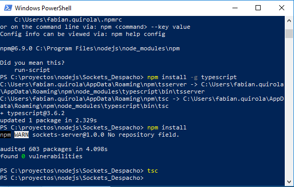

6. Verificar la existencia del archivo config.json en el fichero dist/config/

**Nota: Es necesario que exista el archivo config.json (OJO deben existir los archivos config.js que se genera automaticamente y config.json) dentro de la carpeta Sockets_Despacho/dist/config/, si no se encuentra se lo debe copiar desde Sockets_Despacho/config/**

7. Verificar los parámetros del archivo Sockets_Despacho/dist/config/config.json

**"node_port": 5000,**

**"url_credentials":"http://localhost:8090/credencial",**

**"vcp":[],**

**"baudRate": 9600,**

| PARAMETRO       | APLICA CONFIGURACION                  |
|-----------------|---------------------------------------|
| node_port       | 5000                                  |
| url_credentials | http://localhost:8090/credencial      |
| vcp             | Si no se usan VCP debe estar vacío [] |

**Nota: Verificar que la url de credenciales sea correcta en el caso de copiar de un local a otro**

8. Verificación del proceso. (Opcional)

Si las políticas se encuentran configuradas y el proceso hasta este punto se ha realizado correctamente se puede verificar el levantamiento del servicio con el comando mediante consola e ingresando a la carpeta Socket_Despacho/

**node dist/**

Esto levantara el servicio y nos mostrara la configuración de la base de datos y si el servicio se levanto sin inconvenientes.

También ingresando al navegador la siguiente url podríamos verificar los valores de las políticas

**http://localhost:5000/politics**

Una vez realizada esta verificación en la consola que se levanto el servicio presionar Ctrl+C para parar el proceso antes de continuar con los pasos siguientes.

9. Descargar nssm desde la url: https://nssm.cc/download

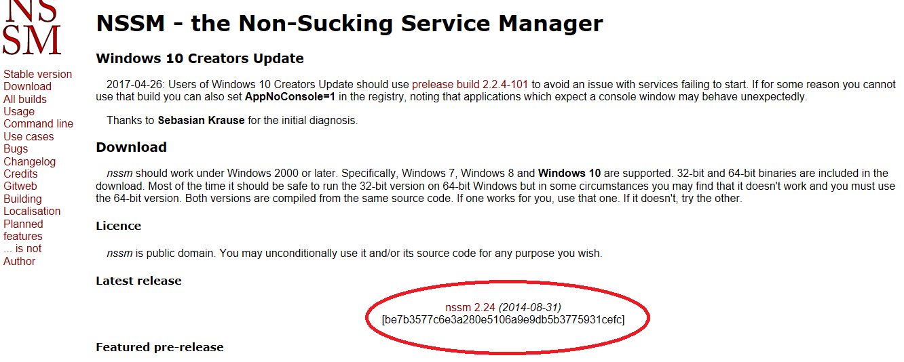

### 3.2 INICIO AUTOMATICO 

1. Descomprimir el archivo descargado en el directorio **C:\nssm-2.24**.

2. Ingresar a través de consola al directorio donde se descomprimieron los archivos, tener en cuenta la arquitectura **C:\nssm-2.24\win64**

3. Ejecutar el siguiente comando. **(en CMD)** 

**nssm install**

aparecerá la siguiente pantalla

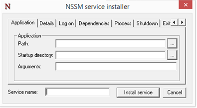

4. Para configurar el directorio Path ingresar en donde se encuentra instalado Node.js

**Path:** C:\Program Files\nodejs\node.exe

**Startup directory**: C:\Program Files\nodejs

Además, se debe configurar cual es la aplicación de Node.js que se desea, que se ejecute como servicio, para ello se agrega la ubicación de este archivo.

**Arguments:** C:\Sockets_Despacho\dist\index.js

Agregar un nombre que se le dará al servicio para poder identificarlo.

**Service name**: Sockets_Despacho

5. Una vez ingresada toda esta información, hacer clic en Install Service

6. Para verificar la creación del servicio ejecutar el siguiente comando: 

**services.msc**

7. El servicio debe estar iniciado.

8. Verificar que el servicio se encuentre como **Automático (Retardado)**

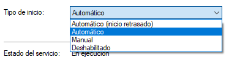

9. En el caso de haber creado mal el servicio, este se lo debe eliminar y crear nuevamente. El comando para eliminar es el siguiente (ejecutarlo en la ubicación del nssm ej. C:\nssm-2.24\win64)

**nssm remove "Sockets_Despacho" confirm**

## 4. IMPLEMENTACIÓN CLIENTE TURNEROS 

### 4.1 INSTALACIÒN DEL SERVIDOR

1. Descargue o copie los archivos por tfs desde la dirección:
http://sazteamfs:8080/tfs/KFCCollection/InvestigacionArquitecturas/git/Pantalla_Despacho_Clientes

2. Se copian los archivos seleccionados en el directorio /htdocs del xampp instalado en el servidor. (se copian los archivos una vez hecho el build. dist/visor-transaciones)

**Nota: Si el proceso se realiza por TFS se copiaran ya los archivos dentro del directorio /htdocs del XAMPP en la carpeta /visor-transacciones**

3. CONFIGURACIÓN 
Modificación del archivo config.js ubicado en assets/config/ 

**IMPORTANTE ingresar IP del servidor donde se configuro el Socket_Despacho**

## 5. INSTALACIÓN RASPBERRY 

1. Instalación de imagen raspberry win32diskmanager, la imagen https://www.raspberrypi.org/downloads/raspbian/

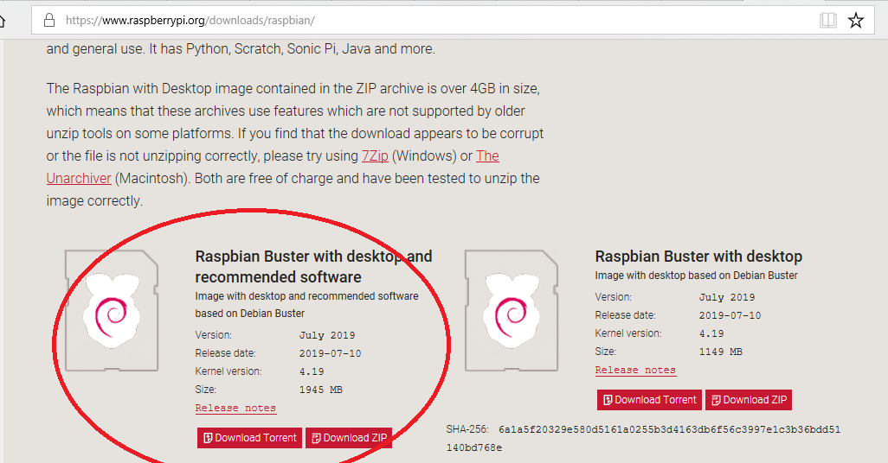

2. Se debe cargar la imagen en una tarjeta min sd mediante el programa Win32DiskImager desde el link: https://sourceforge.net/projects/win32diskimager/

3. Una vez descargado el programa este se debe iniciar

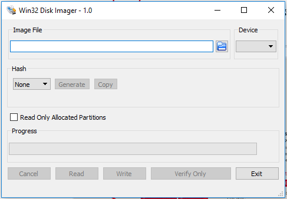

4. En Image File buscar la imagen descargada de raspbian y en device, seleccionar la unidad de la micro sd  a usar.

5. Una vez seleccionado hacer clic en **WRITE**

6. Una vez finalizado el proceso, se puede retirar la tarjeta micro sd e insertarla en el raspberry.

7. Iniciar el raspberry, esto nos mostrara un WIZARD de configuración en el cual iremos pasando con las configuraciones por default, tomando en cuenta lo siguiente:

7.1. Configurar lenguaje y teclado en ingles

7.2. Activar las interfaces necesarias para VNC (Para el control remoto) y COM (En el caso de usar los lectores en modo Virtual COM Port )

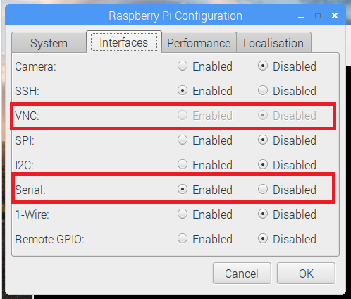

7.3. Actualizamos Raspberryan ejecutando los siguientes comandos desde la consola:

**sudo apt-get update**
**sudo apt-get dist-upgrade**

## 6. CONFIGURACIÓN CLIENTE TURNEROS

## 6.1 RASPBERRY

1. Se verifica el funcionamiento del servidor ingresando en el navegador la dirección la cual sería la IP del servidor y el nombre de la carpeta ej. http://172.17.0.2/visor-transacciones

#### 6.2 CONFIGURACIÓN PARA EVITAR MODO SUSPENSIÓN.

1. Abrir /etc/lightdm/lightdm.conf.
sudo nano /etc/lightdm/lightdm.conf
2. Buscar y descomentar la linea “xserver-command” bajo la sección “[Seat:*]” y modificar:

**xserver-command=X -s 0 -dpms**

3. Resetear el sistema

**sudo reboot**

### 6.3 INICIO AUTOMÁTICO DEL NAVEGADOR

1. Verificar la existencia de la carpeta  ~/.config/autostart/ mediante consola, si esta no existe se debe crear con el comando

**cd ~/.config/**

2. y luego 

**mkdir autostart**

3. Se debe crear un nuevo archivo *.desktop por medio de la consola en: ~/.config/autostart/ con el comando

**sudo nano ~/.config/autostart/autoChromium.desktop**

4. Ingresar la siguiente información cambiando la página de destino

[Desktop Entry]
Type=Application
Exec=/usr/bin/chromium-browser --noerrdialogs --kiosk --disable-session-crashed-bubble --disable-infobars --incognito http://172.17.0.2/visor-transaciones
Hidden=false
X-GNOME-Autostart-enabled=true
Name[en_US]=AutoChromium
Name=AutoChromium
Comment=Start Chromium when GNOME starts

5. Guardar archivo ctrl+O  y salir ctrl+X

6. Reiniciar

### 6.4 CONFIGURACION DE ROTACION DE PANTALLA RASPBERRY 

1. Abrir el terminal y escribir el comando 

**Sudo nano /boot/config/text**

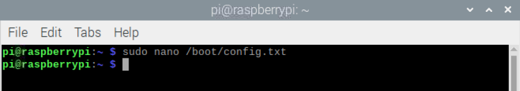

2. Si se quiere que la rotación de la pantalla sea vertical 

#rotacion de pantalla

display_rotate=1

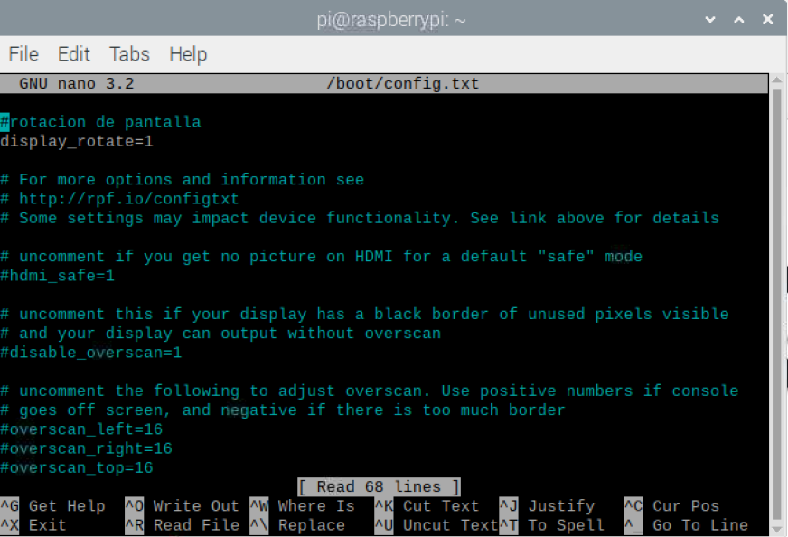

3. Si se quiere que la rotación de la pantalla sea horizontal, solo se comenta la segunda línea

#rotacion de pantalla
#display_rotate=1

4. Luego para guardar los cambios realizar:  ctrl + O, ENTER, ctrl + X

5. Finalmente, en la consola escribir reboot para que rapsberry realice la rotación de la pantalla

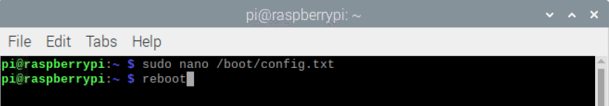

## 7. CONFIGURACIÓN DE LECTOR

1. Para el lector de códigos QR se utiliza un lector marca OPTICON, M-10. Se debe realizar la configuración del lector con la siguiente imagen.

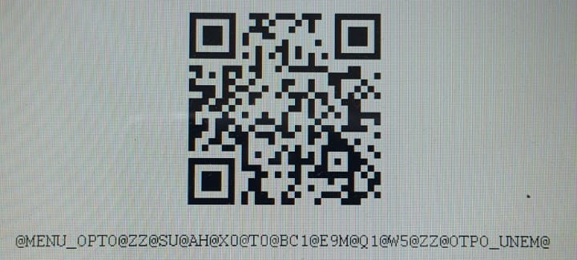

### 7.1 USO DEL LECTOR MODO USB-HID (Modo entrada de teclado) por default

Si el equipo es nuevo no necesita configurarse con este modo ya que viene por default, si se lo ha cambiado de modo se lo puede configurar con la siguiente imagen.

### 7.2 USO DEL LECTOR MODO USB-VCP (Modo entrada de teclado) por default

Para usar el lector en modo Virtual COM Port es necesario cambiar el modo con el siguiente código.

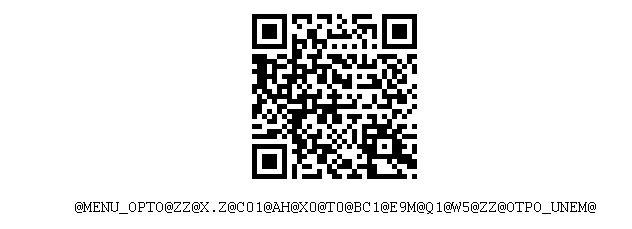

## 8. RECOMENDACIONES

1. Para el correcto funcionamiento del Turnero es necesario que se instale primero el Socket Server, verificar el correcto funcionamiento del mismo y luego proceda a la instalación del cliente pantalla Turnero.

2. El Socket Server usa el sistema de credenciales, así que es necesario su correcto funcionamiento.