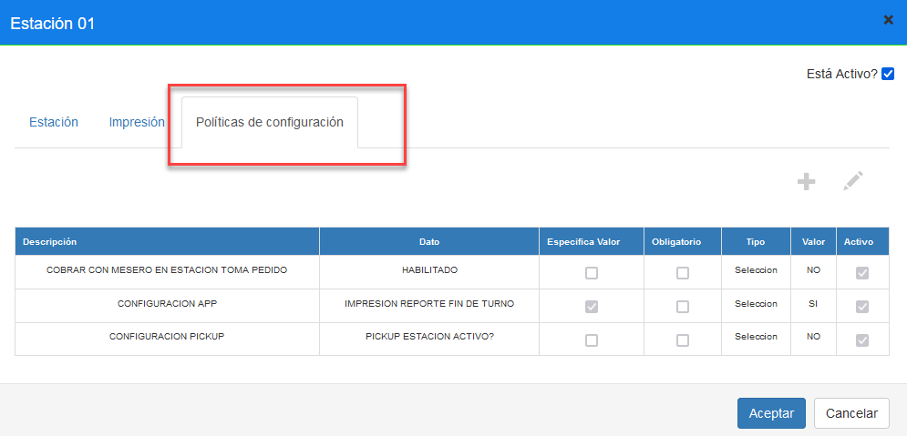
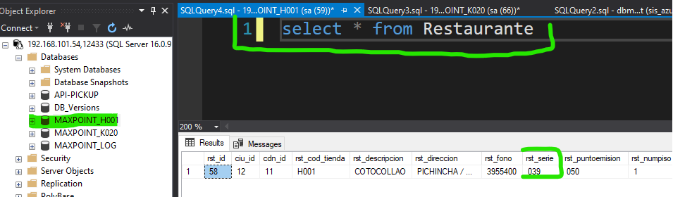

# Manual - Configuración Unificación Transferencia de Venta

**Configuración Políticas - Unificación transferencia de venta**

## 1 ANTECEDENTES

Actualmente en el sistema MaxPoint, se tiene la necesidad de realizar una configuración de políticas a nivel de estación para unificar la venta de heladería en la del local.

## 2 OBJETIVO GENERAL

Crear y configurar la estación que sería de heladería, y la serie de restaurante.

### 2.1 Objetivos específicos

- Desactivar la política a nivel de restaurante “Transferencia De Venta”
- Configurar la política y parámetros a nivel de estación “ES HELADERIA”
- Configurar la política y parámetros a nivel de estación “SERIE RESTAURANTE”

## 3 POLÍTICAS DE CONFIGURACIÓN

### 3.1 Datos Generales

Para el correcto funcionamiento de este proceso como primer paso de debe proceder a desactivar la política a nivel de restaurante

**- Transferencia De Venta -> Habilitado**

Esto para el sitio /pos. Y, no es necesario ejecutarlo para el sitio /heladería.

A continuación, se detalla cómo realizar la configuración de políticas que permitirán establecer los parámetros a ser utilizados **UNIFICACIÓN DE TRANSFERENCIA DE VENTA.**

A considerar:

- **ES HELADERIA**, Nos indicara si esta caja es heladería.

- **SERIE RESTAURANTE**, Es la serie del restaurante.

### 3.2 Pantalla de Políticas

Se ingresará en sistema MXP backoffice con credenciales de administrador sistemas y seleccionar la estación a la cual se realizará las configuraciones.

En el menú que se encuentra en la parte izquierda no dirigimos a la opción **SEGURIDADES** y seleccionamos **POLÍTICAS**, seguidamente presionamos sobre el botón **Ir a Administración Políticas** en el cual abrirá una nueva pestaña en el navegador.

### 3.3 Estación

### 3.3.1 Colección Estación

Antes de crear las políticas de configuración; como primer paso se debe verificar que no se encuentren creadas, de ser el caso validar que cada colección contenga los parámetros establecidos en este manual.

En la opción **Estación** presionar sobre el botón **Nueva Colección**, se abrirá una modal para su creación ingresando los siguientes datos:

Tabla 1. Colección Estación

| N° |              Colección             |                                                      Descripción                                                     |
|:--:|:----------------------------------:|:--------------------------------------------------------------------------------------------------------------------:|
| 1  | UNIFICACION TRANSFERENCIA DE VENTA | Colección que permite establecer  la configuración de la caja de heladería para el procesos de unificación de venta. |

**Nota: NO puede contener espacios en blanco al inicio y final del nombre de la colección; debe ser escrita tal y como se especifica en la tabla 1.**

**Colección:** Nombre de la colección que se especifica en la tabla 1.

**Módulo:** 

**Observaciones:** Una descripción de la función que realizara dicha colección.

Una vez que se haya ingresado y seleccionado la información establecida procedemos a

**Guardar.**

### 3.3.2 Colección de Datos Estación

Antes de agregar los parámetros de configuración, como primer paso se debe verificar que no se encuentren creados, de ser el caso validar que cada parámetro contenga los valores establecidos en este manual.

Una vez creada la colección se debe proceder a crear los parámetros de configuración y para ello seleccionamos la colección y presionamos sobre el botón **Nuevo Parámetro** en la cual se abrirá una venta para su creación e ingresamos los siguientes datos:

Tabla 2. Colección de Datos Estación

| Colección: UNIFICACION TRANSFERENCIA DE VENTA |
|-----------------------------------------------|

|  N° |              Colección             |     Parámetro     | Esp. Valor | Obligatorio | Tipo Dato |
|:---:|:----------------------------------:|:-----------------:|:----------:|:-----------:|:---------:|
| 1   | UNIFICACION TRANSFERENCIA DE VENTA | ES HELADERIA      |     SI     |      SI     | Selección |
| 2   | UNIFICACION TRANSFERENCIA DE VENTA | SERIE RESTAURANTE |     SI     |      SI     |  Carácter |

**Nota: NO puede contener espacios en blanco al inicio y final del parámetro; deben ser escritos tal y como se especifica en la tabla 2**.

**Parámetro:** Nombre del parámetro que se especifica en la tabla 2.

**Tipo de Dato: **Se especifica en la tabla 2.

**Especifica Valor:** Se especifica en la tabla 2

**Obligatorio:** Se especifica en la tabla 2.

Una vez que se haya ingresado y seleccionado la información establecida procedemos a 

**Guardar.**

**1.1.1 Estación Colección de Datos**

**Esta configuración debe ser aplicada únicamente a la estación que contendrá el menú de heladería. Para este punto la estación ya debe estar previamente creada o a su vez utilizar una ya existente. (Únicamente debe poseer el menú de heladería)**

En el menú nos dirigimos a **Restaurante** y seleccionamos la opción **Estación**, buscamos la estación a ser configurados y seguidamente seleccionamos la pestaña **Políticas de configuración.**

Para la configuración se debe presionar sobre el botón agregar “+”; el cual abrirá una ventana, seguidamente buscaremos la colección creada y agregamos el valor en los parametros solicitados.

### 3.3.3 ES HELADERIA

En la tabla 3, se especifica los valores que deben ser configurados por cada parámetro colección.

Tabla 3. Valores de los parámetros de colección

| Colección: UNIFICACION TRANSFERENCIA DE VENTA |
|-----------------------------------------------|

| N° |   Parámetro  | Valor (Tipo Dato Selección) |                               Descripción                              |
|:--:|:------------:|:---------------------------:|:----------------------------------------------------------------------:|
|  1 | ES HELADERIA |              Sí             | Con esta configuración se especifica que una estación es de heladería. |

### 3.3.4 SERIE RESTAURANTE

En la tabla 4, se especifica los valores que deben ser configurados por cada parámetro colección.

Tabla 4. Valores de los parámetros de colección

| Colección: UNIFICACION TRANSFERENCIA DE VENTA |
|-----------------------------------------------|

| N° |     Parámetro     |     Valor  (Tipo Dato Carácter)     |                              Descripción                              |
|:--:|:-----------------:|:-----------------------------------:|:---------------------------------------------------------------------:|
|  1 | SERIE RESTAURANTE | (específico para cada restaurante*) | La serie de restaurante debe ser el perteneciente al de la heladería. |

* **Para obtener el valor SERIE RESTAURANTE**, se debe realizar una consulta a la tabla restaurante de la base de la HELADERIA: 

SELECT * FROM Restaurante, y utilizar el valor del campo **rst_serie** para la configuración de la tabla 4. 

A continuación, un ejemplo:

