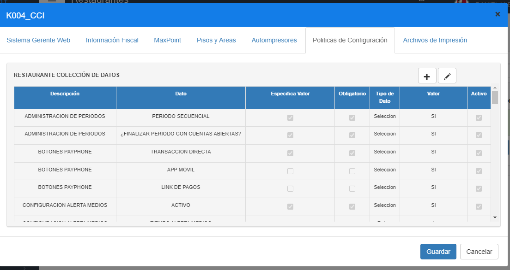
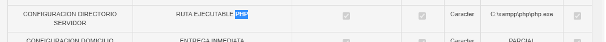

# Manual de politicas - Ruta Binario PHP v2

**MANUAL DE DEFINICIÓN DE RUTA A BINARIO PHP**

## 1 ANTECEDENTES

Actualmente en el sistema MaxPoint, se tiene la necesidad de realizar una configuración de políticas a nivel restaurante que permita establecer la ruta a un binario PHP.

## 32 OBJETIVO GENERAL

Crear y configurar la política de restaurante para establecer el valor de la ruta a un binario PHP.

### 2.1 Objetivos específicos

- Configurar la política “CONFIGURACION DIRECTORIO SERVIDOR” a nivel de restaurante.
- Configurar el parámetro “RUTA EJECUTABLE PHP” de la política “CONFIGURACION DIRECTORIO SERVIDOR” a nivel de restaurante.

## 3 POLÍTICAS DE CONFIGURACIÓN

### 3.1 Datos Generales

La política de configuración “CONFIGURACION DIRECTORIO SERVIDOR” necesaria para que trabaje correctamente la función Clientes Centralizados en MaxPoint, almacena en el parámetro “RUTA EJECUTABLE PHP” la ruta de un ejecutable PHP, para asignar dicho valor se debe considerar:

- Añadir la ubicación del ejecutable de PHP: php.exe, php-win.exe o php-cli.exe dependiendo de su versión de PHP y las preferencias de presentación.

### 3.2 Pantalla de Políticas

Se ingresará en sistema MXP backoffice con credenciales de administrador sistemas y seleccionar la cadena a la cual se realizará las configuraciones.

En el menú que se encuentra en la parte izquierda no dirigimos a la opción **SEGURIDADES** y seleccionamos **POLÍTICAS**, seguidamente presionamos sobre el botón **Ir a Administración Políticas** en el cual abrirá una nueva pestaña en el navegador.

### 3.3 Restaurante

### 3.3.1 Colección
 
Antes de crear las políticas de configuración; como primer paso se debe verificar que no se encuentren creadas, de ser el caso validar que cada colección contenga los parámetros establecidos en este manual.

En la opción **Restaurante** presionar sobre el botón **Nueva Colección**, se abrirá una modal para su creación ingresando los siguientes datos:

Tabla 1. Colección 

| N° |             Colección             |                                     Descripción                                    |
|:--:|:---------------------------------:|:----------------------------------------------------------------------------------:|
| 1  | CONFIGURACION DIRECTORIO SERVIDOR | Colección que permite establecer la configuración de la ruta hacia un binario PHP. |

**Nota: NO puede contener espacios en blanco al inicio y final del nombre de la colección; debe ser escrita tal y como se especifica en la tabla 1.**

**Colección:** Nombre de la colección que se especifica en la tabla 1.

**Observaciones:** Una descripción de la función que realizara dicha colección.

Una vez que se haya ingresado y seleccionado la información establecida procedemos a

**Guardar.**

### 3.3.2 Colección de Datos Restaurante

Antes de agregar los parámetros de configuración, como primer paso se debe verificar que no se encuentren creados, de ser el caso validar que cada parámetro contenga los valores establecidos en este manual.

Una vez creada la colección se debe proceder a crear los parámetros de configuración y para ello seleccionamos la colección y presionamos sobre el botón **Nuevo Parámetro** en la cual se abrirá una venta para su creación e ingresamos los siguientes datos:

Tabla 2. Colección de Datos Restaurante

| Colección: CONFIGURACION DIRECTORIO SERVIDOR |
|----------------------------------------------|

|  N° |      Parámetro      | Esp. Valor | Obligatorio | Tipo Dato |
|:---:|:-------------------:|:----------:|:-----------:|:---------:|
| 1   | RUTA EJECUTABLE PHP |     SI     |      SI     |  Caracter |

**Nota: NO puede contener espacios en blanco al inicio y final del parámetro; deben ser escritos tal y como se especifica en la tabla 2.**

Parámetro: Nombre del parámetro que se especifica en la tabla 2.

Tipo de Dato: Se especifica en la tabla 2.

Especifica Valor: Se especifica en la tabla 2

Obligatorio: Se especifica en la tabla 2.

Una vez que se haya ingresado y seleccionado la información establecida procedemos a

**Guardar.**

### 3.3.3 Restaurante Colección de Datos

En el menú nos dirigimos a **RESTAURANTE** y seleccionamos la opción **RESTAURANTE**, buscamos el o los menús a ser configurados y seguidamente seleccionamos la pestaña **Políticas de configuración**.

Para la configuración se debe presionar sobre el botón agregar “+”; el cual abrirá una ventana, seguidamente buscaremos la colección creada y agregamos el valor en los parámetros solicitados.

En la tabla 3, se especifica los valores que deben ser configurados por cada parámetro colección.

Tabla 3. Valores de los parámetros de colección

| Colección: CONFIGURACION DIRECTORIO SERVIDOR |
|----------------------------------------------|

| N° |      Parámetro      | Valor a ingresar(caracter) |                                                                     Descripción                                                                    |
|:--:|:-------------------:|:--------------------------:|:--------------------------------------------------------------------------------------------------------------------------------------------------:|
|  1 | RUTA EJECUTABLE PHP |    C:\xampp\php\php.exe    | Añadir la ubicación del ejecutable de PHP: php.exe, php-win.exe o php-cli.exe dependiendo de su versión de PHP y las preferencias de presentación. |

Al realizar la configuración de todos los parámetros se debe tener lo siguiente:

### 3.3.4 Consideraciones adicionales:

- C:\xampp\php\php.exe es un caso común de locación de php.exe, particularmente esta ruta es parte de una instalación estándar del software de aplicación Xampp. Por lo tanto, la ruta al binario de PHP puede cambiar dependiendo de su versión de PHP y las preferencias de presentación.
Es recomendable, que la ruta al binario de PHP sea escrita de forma absoluta. 