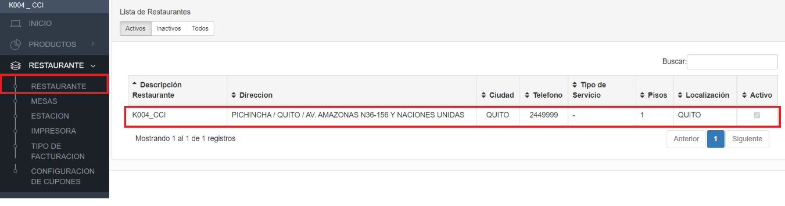
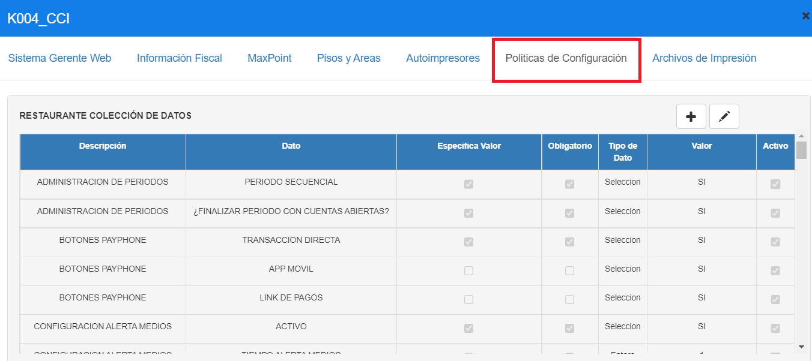
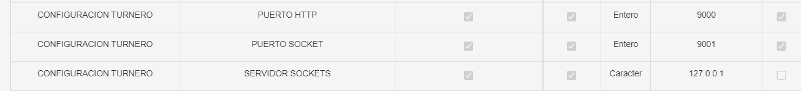

# Manual - Configuración Políticas de Turneros

**SOCKET despacho TURNERO**

## 1 ANTECEDENTES

Actualmente en el sistema MaxPoint, se tiene la necesidad de realizar una configuración de políticas a nivel restaurante que permita establecer la configuración del socket despacho turnero.

## 2 OBJETIVO GENERAL

Crear y configurar la política de restaurante para establecer el valor para validar el socket despacho turnero.

### 2.1 Objetivos específicos

- Configurar la política y parámetros a nivel de restaurante “PUERTO HTTP”
- Configurar la política y parámetros a nivel de restaurante “PUERTO SOCKET”
- Configurar la política y parámetros a nivel de restaurante “SERVIDOR SOCKETS”

## 3 POLÍTICAS DE CONFIGURACIÓN

### 3.1 Datos Generales

En este manual se detalla cómo realizar la configuración de políticas que permitirán establecer los parámetros a ser utilizados en socket despacho turnero.

A considerar:

- **PUERTO HTTP**, Puerto de ejecución para peticiones HTTP del socket.

- **PUERTO SOCKET**, Puerto de ejecución para peticiones WS del socket.

- **SERVIDOR SOCKETS**, URL del socket “**SIN PUERTO**”.

### 3.2 Pantalla de Políticas

Se ingresará en sistema MXP backoffice con credenciales de administrador sistemas y seleccionar el restaurante a la cual se realizará las configuraciones.

En el menú que se encuentra en la parte izquierda no dirigimos a la opción **SEGURIDADES** y seleccionamos **POLÍTICAS**, seguidamente presionamos sobre el botón **Ir a Administración Políticas** en el cual abrirá una nueva pestaña en el navegador.

### 3.3 Restaurante

### 3.3.1 Colección Restaurante

Antes de crear las políticas de configuración; como primer paso se debe verificar que no se encuentren creadas, de ser el caso validar que cada colección contenga los parámetros establecidos en este manual.

En la opción **Restaurante** presionar sobre el botón **Nueva Colección**, se abrirá una modal para su creación ingresando los siguientes datos:

Tabla 1. Colección Restaurante

| N° |       Colección       |                                    Descripción                                   |
|:--:|:---------------------:|:--------------------------------------------------------------------------------:|
| 1  | CONFIGURACION TURNERO | Colección que permite establecer las configuraciones del socket despacho turnero |

**Nota:** NO puede contener espacios en blanco al inicio y final del nombre de la colección; debe ser escrita tal y como se especifica en la tabla 1.

**Colección:** Nombre de la colección que se especifica en la tabla 1.

**Módulo:** Menú.

**Observaciones:** Una descripción de la función que realizara dicha colección.

Una vez que se haya ingresado y seleccionado la información establecida procedemos a

**Guardar.**

### 3.3.2 Colección de Datos Restaurante

Antes de agregar los parámetros de configuración, como primer paso se debe verificar que no se encuentren creados, de ser el caso validar que cada parámetro contenga los valores establecidos en este manual.

Una vez creada la colección se debe proceder a crear los parámetros de configuración y para ello seleccionamos la colección y presionamos sobre el botón **Nuevo Parámetro** en la cual se abrirá una venta para su creación e ingresamos los siguientes datos:

Tabla 2. Colección de Datos Restaurante

| Colección: CONFIGURACION TURNERO |
|----------------------------------|

|  N° |       Colección       |     Parámetro    | Esp. Valor | Obligatorio | Tipo Dato |
|:---:|:---------------------:|:----------------:|:----------:|:-----------:|:---------:|
| 1   | CONFIGURACION TURNERO | PUERTO HTTP      |     SI     |      SI     |   Entero  |
| 2   | CONFIGURACION TURNERO | PUERTO SOCKET    |     SI     |      SI     |   Entero  |
| 3   | CONFIGURACION TURNERO | SERVIDOR SOCKETS |     SI     |      SI     |  Caracter |

**Nota:** NO puede contener espacios en blanco al inicio y final del parámetro; deben ser escritos tal y como se especifica en la tabla 2.

**Parámetro:** Nombre del parámetro que se especifica en la tabla 2.

**Tipo de Dato:** Se especifica en la tabla 2.

**Especifica Valor:** Se especifica en la tabla 2

**Obligatorio**: Se especifica en la tabla 2.

Una vez que se haya ingresado y seleccionado la información establecida procedemos a

 **Guardar.**

### 3.3.3 Restaurante Colección de Datos

En el menú nos dirigimos a **Restaurante** en el módulo de **Restaurante** y seleccionamos el restaurante a diligenciar. 

En la parte superior derecha de la pantalla emergente, seleccionar la pestaña **Políticas de configuración.**

Para la configuración se debe presionar sobre el botón agregar “+”; el cual abrirá una ventana, seguidamente buscaremos la colección creada y agregamos el valor en los parámetros solicitados.

En la tabla 3, se especifica los valores que deben ser configurados por cada parámetro colección.

Tabla 3. Valores de los parámetros de colección

| Colección: CONFIGURACION TURNERO |
|----------------------------------|

| N° |     Parámetro    | Tipo de dato | Valor a ingresar |                     Descripción                     |
|:--:|:----------------:|:------------:|:----------------:|:---------------------------------------------------:|
|  1 | PUERTO HTTP      |    Entero    |       9000       | Puerto de ejecución para peticiones HTTP del socket |
|  1 | PUERTO SOCKET    |    Entero    |       9001       | Puerto de ejecución para peticiones WS del socket   |
|  1 | SERVIDOR SOCKETS |   Caracter   |     127.0.0.1    | URL del socket “SIN PUERTO”.                        |

Al realizar la configuración de todos los parámetros se debe tener lo siguiente:

### 3.3.4 Consideraciones adicionales:

- Si se realiza una petición HTTP se debe ingresar por el puerto 9000, de lo contrario si es una petición WS se debe generar por el 9001 
- El parámetro “SERVIDOR SOCKETS” se debe diligenciar sin puerto.
