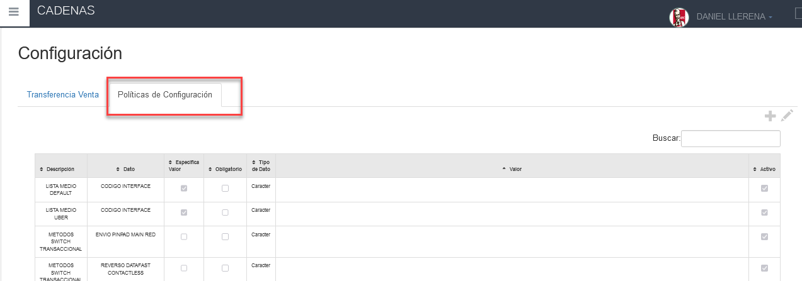
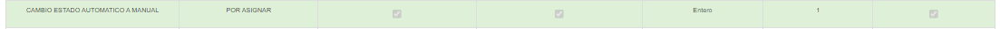

# OK-Manual - Configuracion Politicas Cambio Estado Automatico a Manual

**CAMBIO ESTADO AUTOMÁTICO A MANUAL**

## 1 ANTECEDENTES

Actualmente en el sistema MaxPoint, se tiene la necesidad de realizar una configuración de políticas a nivel cadena que permita establecer Cambio Estado Automático a Manual.

## 2 OBJETIVO GENERAL

Crear y configurar la política de cadena para establecer el valor para validar el Cambio Estado Automático A Manual.

### 2.1 Objetivos específicos

- Configurar la política y parámetros a nivel de cadena “POR ASIGNAR”
- Configurar la política y parámetros a nivel de cadena “ASIGNADO”
- Configurar la política y parámetros a nivel de cadena “ACTIVO”
- Configurar la política y parámetros a nivel de cadena “EN CAMINO”

## 3 POLÍTICAS DE CONFIGURACIÓN

### 3.1 Datos Generales

En este manual se detalla cómo realizar la configuración de políticas que permitirán establecer los parámetros a ser utilizados Cambio Estado Automático a Manual.
A considerar:

- **ACTIVO** , Nos indicara si se habilitara las reglas o no las reglas de la Cambio Estado Automático a Manual.

- **POR ASIGNAR** , El tiempo para esperar después de Facturar para permitir asignar manualmente si no fue asignada automáticamente.

- **ASIGNADO** , EL tiempo para esperar después de hacer asignado para enviar en camino si no lo hace automáticamente.

- **EN CAMINO** , EL tiempo para esperar después de hacer asignado para enviar en camino si no lo hace automáticamente.

### 3.2 Pantalla de Políticas

Se ingresara en sistema MXP backoffice con credenciales de administrador sistemas y seleccionar la cadena a la cual se realizará las configuraciones.

En el menú que se encuentra en la parte izquierda no dirigimos a la opción **SEGURIDADES** y seleccionamos **POLÍTICAS**, seguidamente presionamos sobre el botón **Ir a Administración Políticas** en el cual abrirá una nueva pestaña en el navegador.

### 3.3 Cadena

### 3.3.1 Colección Cadena

Antes de crear las políticas de configuración; como primer paso se debe verificar que no se encuentren creadas, de ser el caso validar que cada colección contenga los parámetros establecidos en este manual.

En la opción **Cadena** presionar sobre el botón **Nueva Colección**, se abrirá una modal para su creación ingresando los siguientes datos:

Tabla 1. Colección Cadena

| N° |             Colección             |                                                     Descripción                                                     |
|:--:|:---------------------------------:|:-------------------------------------------------------------------------------------------------------------------:|
| 1  | CAMBIO ESTADO AUTOMATICO A MANUAL | Colección que permite establecer las configuraciones de Cambio Estado Automático A Manual en tiempo para el cambio. |

**Nota:** NO puede contener espacios en blanco al inicio y final del nombre de la colección; debe ser escrita tal y como se especifica en la tabla 1.

**Colección:** Nombre de la colección que se especifica en la tabla 1.

**Módulo:** Menú.

**Observaciones:** Una descripción de la función que realizara dicha colección.

Una vez que se haya ingresado y seleccionado la información establecida procedemos a 

**Guardar.**

3.3.2 Colección de Datos Cadena

Antes de agregar los parámetros de configuración, como primer paso se debe verificar que no se encuentren creados, de ser el caso validar que cada parámetro contenga los valores establecidos en este manual.

Una vez creada la colección se debe proceder a crear los parámetros de configuración y para ello seleccionamos la **colección** y presionamos sobre el botón **Nuevo Parámetro** en la cual se abrirá una venta para su creación e ingresamos los siguientes datos:

Tabla 2. Colección de Datos Cadena

|  N° |             Colección             |  Parámetro  | Esp. Valor | Obligatorio | Tipo Dato |
|:---:|:---------------------------------:|:-----------:|:----------:|:-----------:|:---------:|
| 1   | CAMBIO ESTADO AUTOMATICO A MANUAL | ACTIVO      |     NO     |      SI     | Seleccion |
| 2   | CAMBIO ESTADO AUTOMATICO A MANUAL | POR ASIGNAR |     NO     |      SI     |   Entero  |
| 3   | CAMBIO ESTADO AUTOMATICO A MANUAL | ASIGNADO    |     NO     |      SI     |   Entero  |
|     | CAMBIO ESTADO AUTOMATICO A MANUAL | EN CAMINO   |     NO     |      SI     |   Entero  |

**Nota:** NO puede contener espacios en blanco al inicio y final del parámetro; deben ser escritos tal y como se especifica en la tabla 2.

**Parámetro:** Nombre del parámetro que se especifica en la tabla 2.

**Tipo de Dato:** Se especifica en la tabla 2.

**Especifica Valor**: Se especifica en la tabla 2

**Obligatorio:** Se especifica en la tabla 2.

Una vez que se haya ingresado y seleccionado la información establecida procedemos a

 **Guardar.**

 ### 3.3.3 Cadena Colección de Datos

En el menú nos dirigimos a **Cadena** y seleccionamos la opción **Cadena**, buscamos el o los menús a ser configurados y seguidamente seleccionamos la pestaña **Políticas de configuración.**

Para la configuración se debe presionar sobre el botón agregar “+”; el cual abrirá una ventana, seguidamente buscaremos la colección creada y agregamos el valor en los parámetros solicitados.

### 3.3.4 ACTIVO

En la tabla 3, se especifica los valores que deben ser configurados por cada parámetro colección.

Tabla 3. Valores de los parámetros de colección

| Colección: CAMBIO ESTADO AUTOMATICO A MANUAL |
|----------------------------------------------|

| N° | Parámetro | Tipo Dato | Valor a ingresar |                                  Descripción                                  |
|:--:|:---------:|:---------:|:----------------:|:-----------------------------------------------------------------------------:|
|  1 | ACTIVO    | Seleccion |        si        | Para que se activen o desactiven la opción Cambio Estado Automatico a Manual. |

Al realizar la configuración de todos los parámetros se debe tener lo siguiente: 

### 3.3.5 POR ASIGNAR

En la tabla 4, se especifica los valores que deben ser configurados por cada parámetro colección.

Tabla 4. Valores de los parámetros de colección

Colección: CAMBIO ESTADO AUTOMATICO A MANUAL

| N° |  Parámetro  | Tipo Dato | Valor a ingresar |                                      Descripción                                      |
|:--:|:-----------:|:---------:|:----------------:|:-------------------------------------------------------------------------------------:|
|  1 | POR ASIGNAR |   Entero  |        10        | El tiempo   que se espera antes de  presentar  el  botón para permitir manualmente la |

Al realizar la configuración de todos los parámetros se debe tener lo siguiente:

La cantidad de tiempo la debe definir operaciones.

### 3.3.6 ASIGNADO

En la tabla 4, se especifica los valores que deben ser configurados por cada parámetro colección.

Tabla 4. Valores de los parámetros de colección

| Colección: CAMBIO ESTADO AUTOMATICO A MANUAL |
|----------------------------------------------|

| N° | Parámetro | Tipo Dato | Valor a ingresar |                                         Descripción                                         |
|:--:|:---------:|:---------:|:----------------:|:-------------------------------------------------------------------------------------------:|
|  1 | ASIGNADO  |   Entero  |        10        | El tiempo   que se espera antes de  presentar  el  botón para permitir manualmente el envio |

La cantidad de tiempo la debe definir operaciones

### 3.3.7 EN CAMINO

En la tabla 5, se especifica los valores que deben ser configurados por cada parámetro colección.

Tabla 4. Valores de los parámetros de colección

| Colección: CAMBIO ESTADO AUTOMATICO A MANUAL |
|----------------------------------------------|

| N° | Parámetro | Tipo Dato | Valor a ingresar |                                         Descripción                                         |
|:--:|:---------:|:---------:|:----------------:|:-------------------------------------------------------------------------------------------:|
|  1 | EN CAMINO |   Entero  |        10        | El tiempo   que se espera antes de  presentar  el  botón para permitir manualmente el envio |

La cantidad de tiempo la debe definir operaciones.