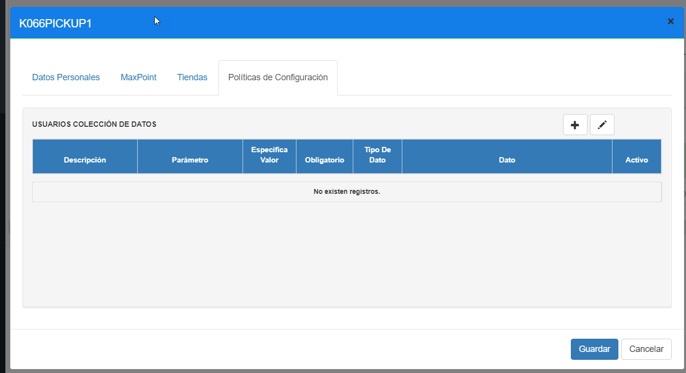
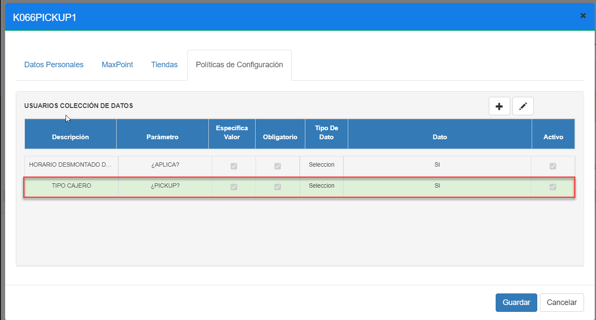

# OK-Manual - Configuracion Politicas Tipo Cajero (v2)

**Tipo cajero**

## 1 ANTECEDENTES

Actualmente en el sistema MaxPoint, se tiene la necesidad de realizar una configuración de políticas a nivel usuarios que permita establecer si un cajero es pickup.

##  2 OBJETIVO GENERAL

Crear y configurar la política de usuario para establecer si un usuario es Pickup

### 2.1 Objetivos específicos

- Configurar la política y parámetros a nivel de usuarios “TIPO CAJERO”

## 3 POLÍTICAS DE CONFIGURACIÓN

### 3.1 Datos Generales

En este manual se detalla cómo realizar la configuración de políticas que permitirán establecer los parámetros a ser utilizados determinar si un usuario es Pickup.

A considerar:

- **TIPO CAJERO**, indica el tipo de cajero puede ser Pickup.

## 3.2 Pantalla de Políticas

Se ingresará en sistema MXP backoffice con credenciales de administrador sistemas y seleccionar la cadena a la cual se realizará las configuraciones.

En el menú que se encuentra en la parte izquierda no dirigimos a la opción **SEGURIDADES** y seleccionamos **POLÍTICAS**, seguidamente presionamos sobre el botón **Ir a Administración Políticas** en el cual abrirá una nueva pestaña en el navegador.

### 3.3 Usuarios

### 3.3.1 Colección de Datos usuarios

Antes de crear las políticas de configuración; como primer paso se debe verificar que no se encuentren creadas, de ser el caso validar que cada colección contenga los parámetros establecidos en este manual.

En la opción **Usuarios** presionar sobre el botón **Nueva Colección**, se abrirá una modal para su creación ingresando los siguientes datos:

Tabla 1. Colección Cadena

| N° |  Colección  |                                                   Descripción                                                   |
|:--:|:-----------:|:---------------------------------------------------------------------------------------------------------------:|
| 1  | TIPO CAJERO | Colección que permite establecer las configuraciones necesarias  para determinar si un cajero es de tipo Pickup |

**Nota:** NO puede contener espacios en blanco al inicio y final del nombre de la colección; debe ser escrita tal y como se especifica en la tabla 1.

**Colección:**  Nombre de la colección que se especifica en la tabla 1.

**Módulo:** Vacío.

**Observaciones**: Vacío.

Una vez que se haya ingresado y seleccionado la información establecida procedemos a

 **Guardar.**

### 3.3.2 Colección de Datos Usuarios

Antes de agregar los parámetros de configuración, como primer paso se debe verificar que no se encuentren creados, de ser el caso validar que cada parámetro contenga los valores establecidos en este manual.

Una vez creada la colección se debe proceder a crear los parámetros de configuración y para ello seleccionamos la colección **HORARIO DESMONTADO CAJERO**  y presionamos sobre el botón **Nuevo Parámetro** en la cual se abrirá una venta para su creación e ingresamos los siguientes datos:

Tabla 2. Colección de Datos Cadena

|  N° |  Colección  | Parámetro | Esp. Valor | Obligatorio | Tipo Dato |
|:---:|:-----------:|:---------:|:----------:|:-----------:|:---------:|
| 1   | TIPO CAJERO | ¿PICKUP?  |     SI     |      SI     | Selección |

**Nota:** NO puede contener espacios en blanco al inicio y final del parámetro; deben ser escritos tal y como se especifica en la tabla 2.

**Parámetro:** Nombre del parámetro que se especifica en la tabla 2.

**Tipo de Dato:** Se especifica en la tabla 2.

**Especifica Valor:** Se especifica en la tabla 2

**Obligatorio:** Se especifica en la tabla 2.

Una vez que se haya ingresado y seleccionado la información establecida procedemos a 

**Guardar.**

### 3.3.3 Cajeros Colección de Datos

En el menú de Backoffice nos dirigimos a **Seguridades**  y seleccionamos la opción **Cajeros**, seleccionamos el cajero al que deseamos habilitar la política y damos doble clic. Seguido seleccionamos la opción **Politicas de Configuración.**

Para la configuración se debe presionar sobre el botón agregar “+”; el cual abrirá una ventana, seguidamente buscaremos la colección creada y agregamos el valor en los parámetros solicitados.

