# OK-Manual - Configuracion Politicas Transferencia Pickup

**CONFIGURACIÓN DE POLÍTICAS TRANSFERENCIA PEDIDOS PICKUP**

## 1 ANTECEDENTES

Es una funcionalidad no implementada, pero que se da en algunas ocasiones en los locales cuando el cliente ya está en el local se dio cuenta que pidió al local equivocado como motivo principal, por tal motivo se ha desarrollado la transferencia de pedidos.

## 2 OBJETIVO GENERAL

Crear y configurar las políticas que involucran esta funcionalidad para poder transferir pedidos entre locales.

### 2.1 Objetivos específicos

• Crear las políticas y parámetros a nivel de Cadena y restaurante
• Configurar los parámetros de las políticas creadas

### 3 POLÍTICAS DE CONFIGURACIÓN

### 3.1 Datos Generales

En este manual se detalla cómo crear las políticas y parámetros de estas a nivel de cadena, y a nivel de restaurante que permitirán integrarse con la funcionalidad.

### 3.2Pantalla de Políticas

Ingresar al sistema MaxPoint BackOffice con credenciales de administrador sistemas.
En el menú que se encuentra en la parte izquierda no dirigimos a la opción **SEGURIDADES**y seleccionamos **POLÍTICAS**, seguidamente presionamos sobre el botón **Ir a Administración Políticas** en el cual abrirá una nueva pestaña en el navegador.

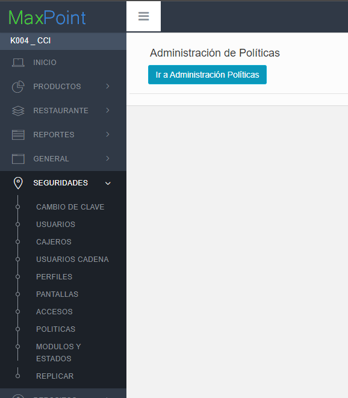

### 3.3 Cadena

### 3.3.1 Colección Cadena

Antes de crear las políticas de configuración; como primer paso se debe verificar si la política **CONFIGURACION PICKUP**, ya se encuentra creada. De ser el caso validar que la colección contenga los parámetros establecidos en este manual.

Si alguna de las políticas NO existe, se debe crearla así:

**Política CONFIGURACION PICKUP**

En la opción **Cadena** presionar sobre el botón **Nueva Colección**, se abrirá una modal para su creación ingresando los siguientes datos:

Tabla 1. Colección de Datos Cadena

|N°|Colección|Observaciones|
|:----|:----|:----|
|1|CONFIGURACION PICKUP| |
|2|LISTA MOTIVOSTRANSFERENCIAS PICKUP| |

Nota: NO puede contener espacios en blanco al inicio y final del nombre de la colección; debe ser escrita tal y como se especifica en la tabla 1.

**Colección:**Nombre de la colección que se especifica en la tabla 1.

**Módulo:** No aplica.

**Repetir Configuración:** NO

**Observaciones:**

Una vez que se haya ingresado y seleccionado la información establecida procedemos a

**Guardar.**

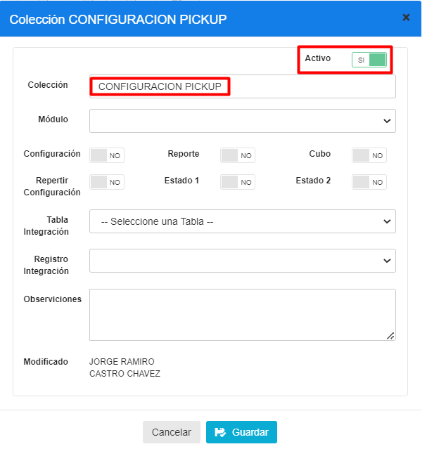

### 3.3.2 Parámetro de Colección 

Antes de agregar los parámetros de configuración mostrados en la tabla 2, se debe verificar si ya encuentren creados. De ser el caso validar que cada parámetro contenga los valores establecidos en este manual.

Si alguno de los parámetros NO existe dentro de la **Colección** especificada en la Tabla 2, se debe crearla así:

Seleccionamos la **colección** y presionamos sobre el botón **Nuevo Parámetro** en la cual se abrirá una venta para su creación y para cada Parámetro ingresamos los siguientes datos:

Tabla 2. Datos Parámetros de Colección de Datos Cadena

| N°  | Colección            |          Parámetro          |  Tipo Dato  | Esp. Valor | Obligatorio | Estado 1 | Estado 2 |
|-----|----------------------|:---------------------------:|:-----------:|------------|:-----------:|----------|----------|
|   1 | CONFIGURACION PICKUP | PICKUP TRANSFERENCIA APLICA |   SELECCION |   SI       |   SI        |   NO     |   NO     |
|   2 | CONFIGURACION PICKUP |   CLIENT_ID                 |   CARACTER  |   SI       |   SI        |   NO     |   NO     |
|   3 | CONFIGURACION PICKUP |   CLIENT_SECRET             |   CARACTER  |   SI       |   SI        |   NO     |   NO     |
|   4 | CONFIGURACION PICKUP |   CLIENT_ID_TRADE           |   CARACTER  |   SI       |   SI        |   NO     |   NO     |
|   5 | CONFIGURACION PICKUP |   CLIENT_SECRET_TRADE       |   CARACTER  |   SI       |   SI        |   NO     |   NO     |

**Nota:** NO puede contener espacios en blanco al inicio y final del parámetro; deben ser escritos tal y como se especifica en la tabla 2.

**Parámetro:** Nombre del parámetro que se especifica en la tabla 2.

**Tipo de Dato:** Se especifica en la tabla 2.

 **Especificar Valor:** Se especifica en la tabla 2. 

 **Obligatorio:** Se especifica en la tabla 2.

**Estado 1:** Se especifica en la tabla 2.

**Estado 2:** Se especifica en la tabla 2.

Una vez que se haya ingresado y seleccionado la información establecida procedemos a

**Guardar.**

Se deben crear todos los parámetros de configuración establecidos en la tabla 2. Se presentan los modales de configuración de cada parámetro a continuación:

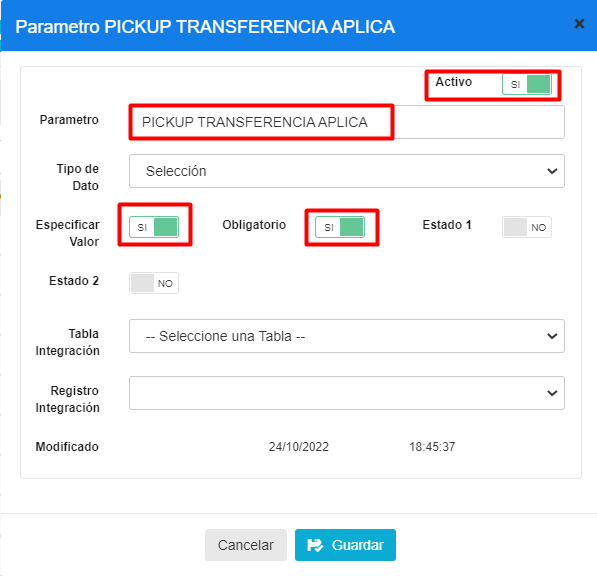

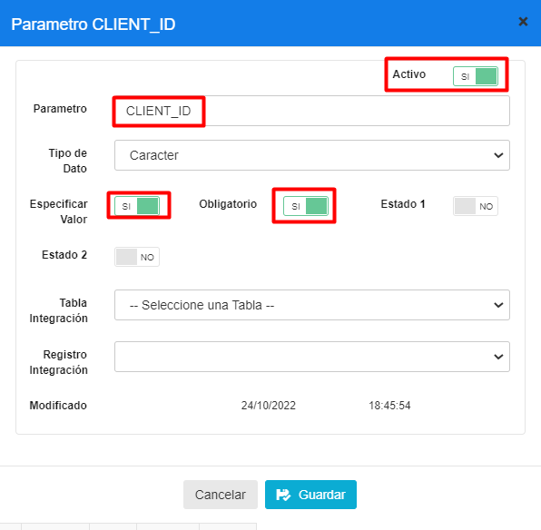

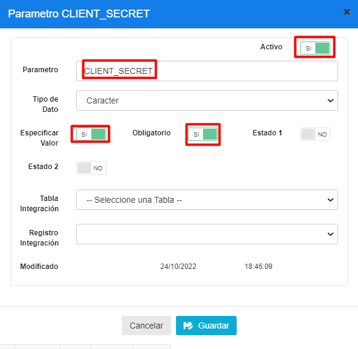

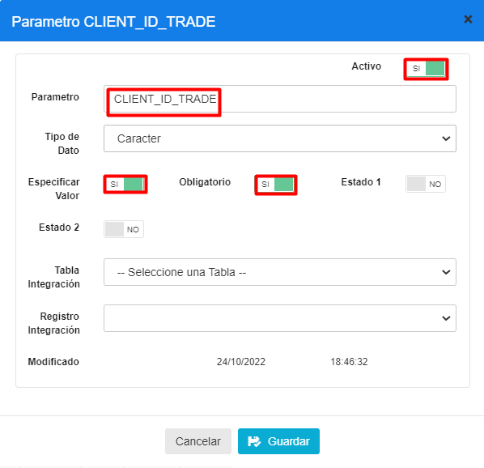

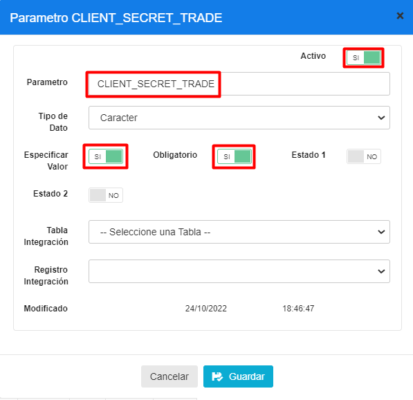

3.3.3 Cadena Colección de Datos

En el menú principal del BackOffice de MaxPoint, nos dirigimos a **Cadena** y 
seleccionamos la opción **CADENA**, seguidamente seleccionamos la pestaña **Políticas de configuración.**

Para la configuración se debe presionar sobre el botón agregar “+”; el cual abrirá una ventana, seguidamente buscaremos la colección creada y agregamos el valor en los 
parametros solicitados.

Para cada uno de los parametros como “PICKUP TRANSFERENCIA APLICA” y llenar sus 
valores como se muestra en la tabla a continuación:

Tabla 3. Parámetros de la colección

|  N° |             Dato            |        Valor       |
|:---:|:---------------------------:|:------------------:|
|   1 | PICKUP TRANSFERENCIA APLICA |   SI               |
|   2 |   CLIENT_ID                 |   11               |
|   3 |   CLIENT_SECRET             |   ksS4zvPkUmYsf27u |
|   4 |   CLIENT_ID_TRADE           |   trade            |
|   5 |   CLIENT_SECRET_TRADE       |   12345            |

Si se ha realizado correctamente, se debe mostrar así:

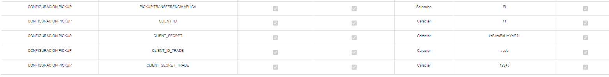

### 3.3.4 Puntos a considerar

1. Cada uno de los parámetros deben configurarse (escribirse) **exactamente** como está 
en este manual, respetando mayúsculas y minúsculas.

2. El botón de transferir pedido se debe mostrar cuando la política de “PICKUP 
TRANSFERENCIA APLICA “está configurada y su valor en SI.

### 3.3.5 Colección Cadena

Antes de crear las políticas de configuración; como primer paso se debe verificar si la política **WS SERVIDOR**, ya se encuentra creada. De ser el caso validar que la colección contenga los parámetros establecidos en este manual.

Si alguna de las políticas NO existe, se debe crearla así:

**Política WS SERVIDOR**

En la opción **Cadena** presionar sobre el botón **Nueva Colección**, se abrirá una modal para su creación ingresando los siguientes datos:

Tabla 4. Colección de Datos Cadena

| N°  |  Colección  | Observaciones |
|-----|:-----------:|:-------------:|
|   1 | WS SERVIDOR |               |

**Nota:** NO puede contener espacios en blanco al inicio y final del nombre de la colección; debe ser escrita tal y como se especifica en la tabla 4.

**Colección:** Nombre de la colección que se especifica en la tabla 4.

**Módulo:** No aplica.

**Repetir Configuración:** NO

**Observaciones:**

Una vez que se haya ingresado y seleccionado la información establecida procedemos a

**Guardar.**

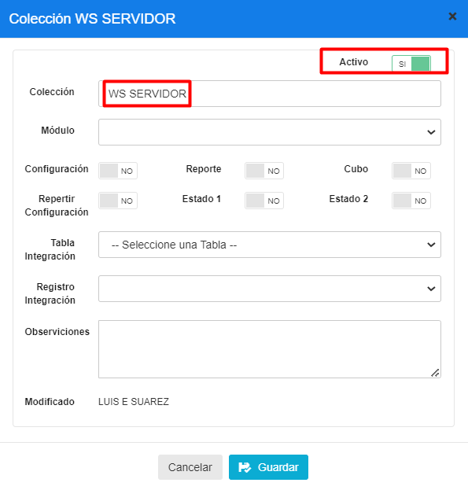

3.3.6 Parámetro de Colección

Antes de agregar los parámetros de configuración mostrados en la tabla 5, se debe verificar si ya encuentren creados. De ser el caso validar que cada parámetro contenga los valores establecidos en este manual.

Si alguno de los parámetros NO existe dentro de la *Colección* especificada en la Tabla 5, se debe crearla así:

Seleccionamos la colección y presionamos sobre el botón **Nuevo Parámetro** en la cual se abrirá una venta para su creación y para cada Parámetro ingresamos los siguientes datos:

Tabla 5. Datos Parámetros de Colección de Datos Cadena

|N°|Colección|Parámetro|Tipo Dato|Esp. Valor|Obligatorio|Estado 1|Estado 2|
|:----|:----|:----|:----|:----|:----|:----|:----|
|1|WS SERVIDOR|PICKUP TRADE PRODUCCION|CARACTER|SI|SI|NO|NO|
|2|WS SERVIDOR|DISTRIBUIDOR PRODUCCION|CARACTER|SI|SI|NO|NO|
|3|WS SERVIDOR|DISTRIBUIDOR TRADE PRODUCCION|CARACTER|SI|SI|NO|NO|

**Nota:** NO puede contener espacios en blanco al inicio y final del parámetro; deben ser escritos tal y como se especifica en la tabla 5.

**Parámetro:** Nombre del parámetro que se especifica en la tabla 5.

**Tipo de Dato:** Se especifica en la tabla 5. 

**Especificar Valor:** Se especifica en la tabla 5. 

**Obligatorio:** Se especifica en la tabla 5.

**Estado 1**: Se especifica en la tabla 5.

**Estado 2:** Se especifica en la tabla 5.

Una vez que se haya ingresado y seleccionado la información establecida procedemos a

**Guardar.**

Se deben crear todos los parámetros de configuración establecidos en la tabla 5. Se presentan los modales de configuración de cada parámetro a continuación:

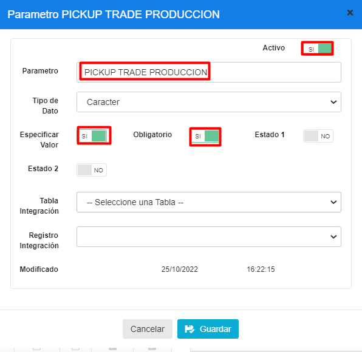

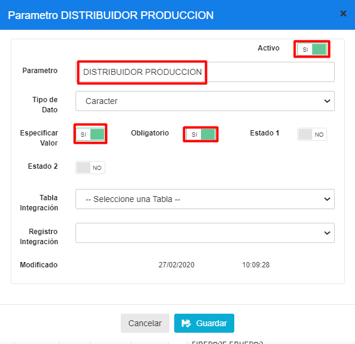

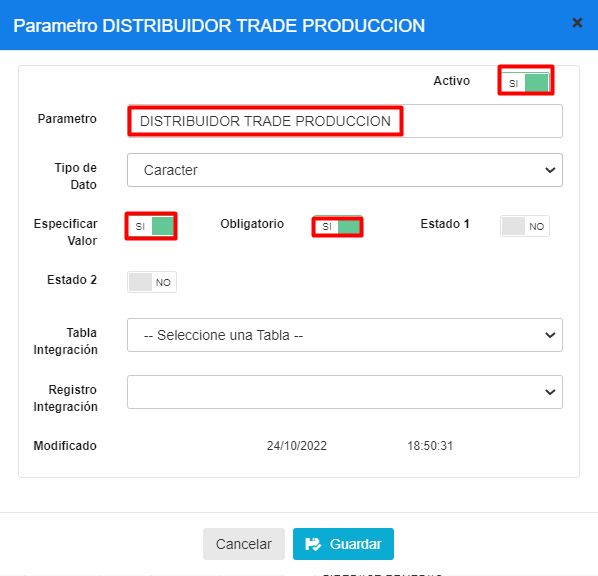

### 3.3.7 Cadena Colección de Datos

En el menú principal del BackOffice de MaxPoint, nos dirigimos a Cadena y seleccionamos la opción CADENA, seguidamente seleccionamos la pestaña Políticas de

**configuración**.

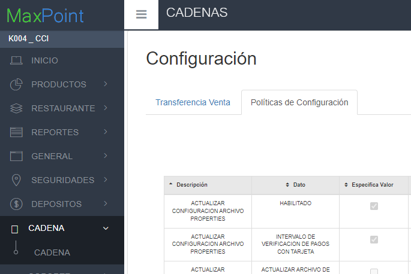

Para la configuración se debe presionar sobre el botón agregar “+”; el cual abrirá una ventana, seguidamente buscaremos la colección creada y agregamos el valor en los 
parametros solicitados. 

Para cada uno de los parametros como “PICKUP TRADE PRODUCCION” y llenar sus valores 
como se muestra en la tabla a continuación:

Tabla 6. Parámetros de la colección

|  N° |              Dato             |             Valor             |
|:---:|:-----------------------------:|:-----------------------------:|
|   1 | PICKUP TRADE PRODUCCION       |   api.multimarca.app-kfc.com  |
|   2 | DISTRIBUIDOR PRODUCCION       |   pedidospickupkfc.kfc.com.ec |
|   3 | DISTRIBUIDOR TRADE PRODUCCION |   192.168.159.73:8098         |

Si se ha realizado correctamente, se debe mostrar así:

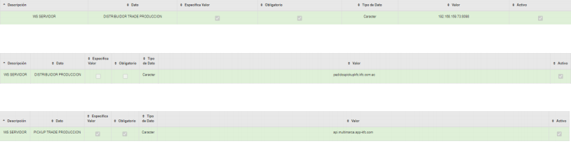

3.3.8 Puntos a considerar

1. Cada uno de los parámetros deben configurarse (escribirse) **exactamente** como está en este manual, respetando mayúsculas y minúsculas.

### 3.3.9 Colección Cadena

Antes de crear las políticas de configuración; como primer paso se debe verificar si la política **WS RUTA SERVICIO,** ya se encuentra creada. De ser el caso validar que la colección contenga los parámetros establecidos en este manual.

Si alguna de las políticas NO existe, se debe crearla así:

**Política WS RUTA SERVICIO**

En la opción **Cadena** presionar sobre el botón **Nueva Colección**, se abrirá una modal para su creación ingresando los siguientes datos:

Tabla 7. Colección de Datos Cadena

N°	Colección	Observaciones

1	WS RUTA SERVICIO	

**Nota:** NO puede contener espacios en blanco al inicio y final del nombre de la colección; debe ser escrita tal y como se especifica en la tabla 7.

**Colección:** Nombre de la colección que se especifica en la tabla 7.

**Módulo:** No aplica.

**Repetir Configuración:** NO

**Observaciones:**

Una vez que se haya ingresado y seleccionado la información establecida procedemos a

**Guardar.**

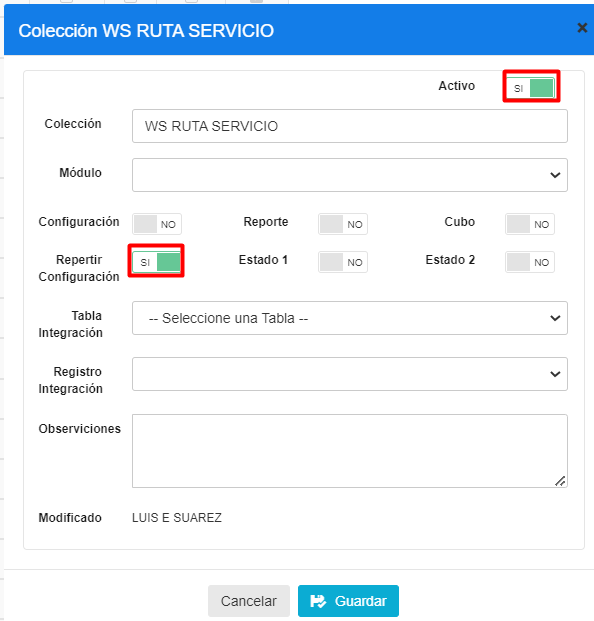

3.3.10 Parámetro de Colección 

Antes de agregar los parámetros de configuración mostrados en la tabla 8, se debe verificar si ya encuentren creados. De ser el caso validar que cada parámetro contenga los valores establecidos en este manual.

Si alguno de los parámetros NO existe dentro de la **Colección** especificada en la Tabla 8, se debe crearla así:

Seleccionamos la colección y presionamos sobre el botón **Nuevo Parámetro** en la cual se abrirá una venta para su creación y para cada Parámetro ingresamos los siguientes datos:

Tabla 8. Datos Parámetros de Colección de Datos Cadena

| N°  |      Colección     | Parámetro                        |  Tipo Dato | Esp. Valor | Obligatorio | Estado 1 | Estado 2 |
|-----|:------------------:|----------------------------------|:----------:|------------|:-----------:|----------|----------|
|   1 |   WS RUTA SERVICIO | DISTRIBUIDOR LOCALES PICKUP      |   CARACTER |   SI       |   SI        |   NO     |   NO     |
|   2 |   WS RUTA SERVICIO | DISTRIBUIDOR TRADE AUTENTICACION |   CARACTER |   SI       |   SI        |   NO     |   NO     |
|   3 |   WS RUTA SERVICIO | DISTRIBUIDOR TRANSFERENCIA       |   CARACTER |   SI       |   SI        |   NO     |   NO     |
|   4 |   WS RUTA SERVICIO | PICKUP TRADE OBTENER TOKEN       |   CARACTER |   SI       |   SI        |   NO     |   NO     |
|   5 |   WS RUTA SERVICIO | PICKUP TRADE TRANSFERENCIA       |   CARACTER |   SI       |   SI        |   NO     |   NO     |

**Nota:** NO puede contener espacios en blanco al inicio y final del parámetro; deben ser escritos tal y como se especifica en la tabla 8.

**Parámetro**: Nombre del parámetro que se especifica en la tabla 8.

**Tipo de Dato:** Se especifica en la tabla 8. 

**Especificar Valor:** Se especifica en la tabla 8. 

**Obligatorio**: Se especifica en la tabla 8.

**Estado 1**: Se especifica en la tabla 8.

**Estado 2**: Se especifica en la tabla 8.

Una vez que se haya ingresado y seleccionado la información establecida procedemos a

**Guardar.**

Se deben crear todos los parámetros de configuración establecidos en la tabla 8. Se presentan los modales de configuración de cada parámetro a continuación:

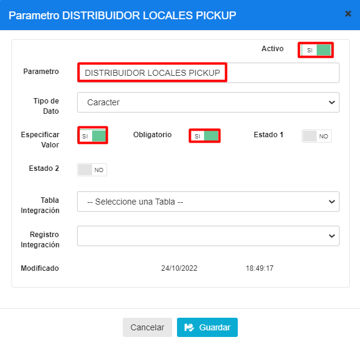

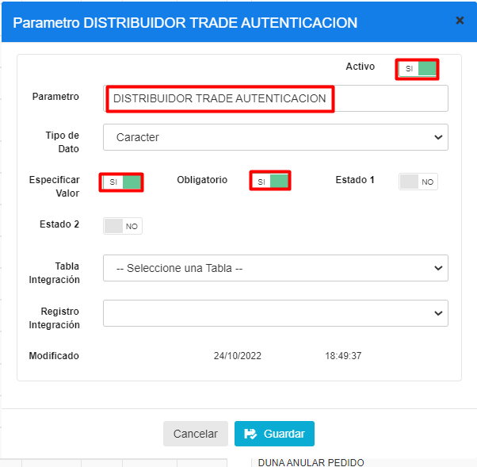

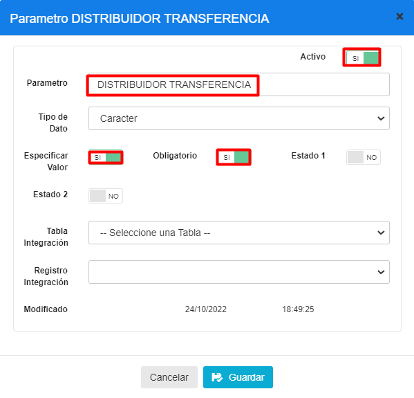

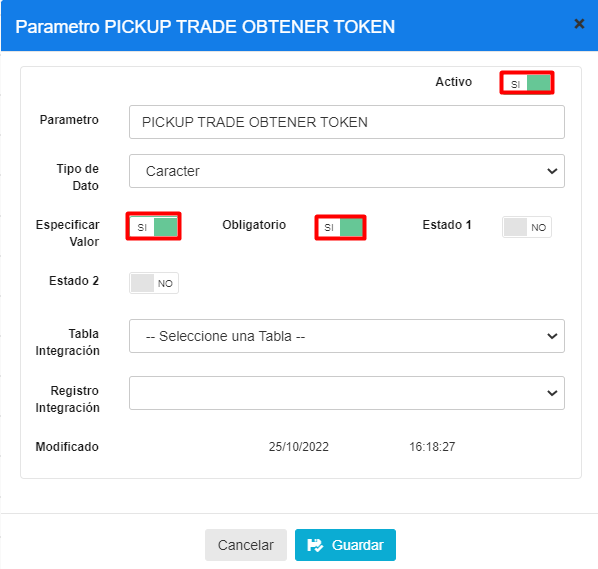

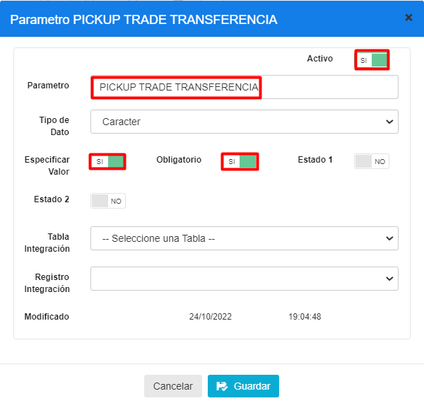

### 3.3.11 Cadena Colección de Datos

En el menú principal del BackOffice de MaxPoint, nos dirigimos a **Cadena** y 
seleccionamos la opción **CADENA**, seguidamente seleccionamos la pestaña **Políticas de configuración.**

Para la configuración se debe presionar sobre el botón agregar “+”; el cual abrirá una ventana, seguidamente buscaremos la colección creada y agregamos el valor en los parametros solicitados.

Para cada uno de los parametros como “DISTRIBUIDOR LOCALES PICKUP” y llenar sus valores como se muestra en la tabla a continuación:

Tabla 9. Parámetros de la colección

|  N° |               Dato               |             Valor             |
|:---:|:--------------------------------:|:-----------------------------:|
|   1 | DISTRIBUIDOR LOCALES PICKUP      |   /restaurantes-transferencia |
|   2 | DISTRIBUIDOR TRADE AUTENTICACION |   /oauth/token                |
|   3 | DISTRIBUIDOR TRANSFERENCIA       |   /transferencia              |
|   4 | PICKUP TRADE OBTENER TOKEN       |   /api/authentication/login   |
|   5 | PICKUP TRADE TRANSFERENCIA       |   /api/order/transfer         |

Si se ha realizado correctamente, se debe mostrar así:

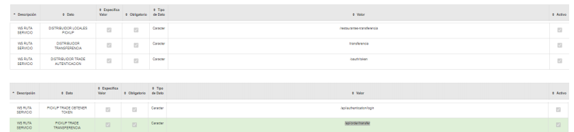

### 3.3.12 Puntos a considerar

1. Cada uno de los parámetros deben configurarse (escribirse) exactamente como está en este manual, respetando mayúsculas y minúsculas.

### 3.3.13 Colección Cadena

Antes de crear las políticas de configuración; como primer paso se debe verificar si la política** LISTA MOTIVOS TRANSFERENCIAS PICKUP**, ya se encuentra creada. De ser el caso validar que la colección contenga los parámetros establecidos en este manual.

Si alguna de las políticas NO existe, se debe crearla así:

**Política LISTA MOTIVOS TRANSFERENCIAS PICKUP**

En la opción **Cadena** presionar sobre el botón **Nueva Colección**, se abrirá una modal para su creación ingresando los siguientes datos:

Tabla 10. Colección de Datos Cadena

| N°  |              Colección              | Observaciones |
|-----|:-----------------------------------:|:-------------:|
|   1 | LISTA MOTIVOS TRANSFERENCIAS PICKUP |               |

**Nota**: NO puede contener espacios en blanco al inicio y final del nombre de la colección; debe ser escrita tal y como se especifica en la tabla 10.

**Colección:** Nombre de la colección que se especifica en la tabla 10.

**Módulo**: No aplica.

**Repetir Configuración**: NO

**Observaciones:**

Una vez que se haya ingresado y seleccionado la información establecida procedemos a

**Guardar.**

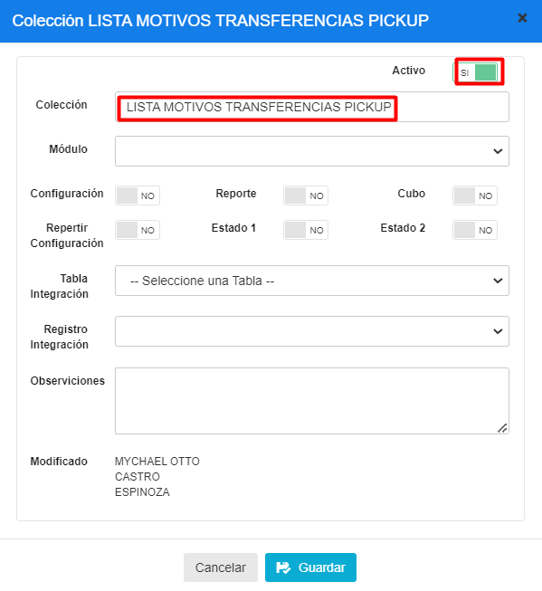

### 3.3.14 Parámetro de Colección

Antes de agregar los parámetros de configuración mostrados en la tabla 11, se debe verificar si ya encuentren creados. De ser el caso validar que cada parámetro contenga los valores establecidos en este manual.

Si alguno de los parámetros NO existe dentro de la **Colección** especificada en la Tabla 11, se debe crearla así:

Seleccionamos la **colección** y presionamos sobre el botón **Nuevo Parámetro** en la cual se abrirá una venta para su creación y para cada Parámetro ingresamos los siguientes datos:

Tabla 11. Datos Parámetros de Colección de Datos Cadena

|N°|Colección|Parámetro|Tipo Dato|Esp. Valor|Obligatorio|Estado 1|Estado 2|
|:----|:----|:----|:----|:----|:----|:----|:----|
|1|LISTA MOTIVOS TRANSFERENCIAS PICKUP|CLIENTE SE EQUIVOCA|ENTERO|NO|NO|NO|NO|
|2|LISTA MOTIVOS TRANSFERENCIAS PICKUP|DIRECCION NO CORRESPONDE|ENTERO|SI|SI|NO|NO|

**Nota:** NO puede contener espacios en blanco al inicio y final del parámetro; deben ser escritos tal y como se especifica en la tabla 11.

**Parámetro:** Nombre del parámetro que se especifica en la tabla 11.

**Tipo de Dato:** Se especifica en la tabla 11.

**Especificar Valor:** Se especifica en la tabla 11.

** Obligatorio:** Se especifica en la tabla 11.

**Estado 1:** Se especifica en la tabla 11.

**Estado 2:** Se especifica en la tabla 11.

Una vez que se haya ingresado y seleccionado la información establecida procedemos a

**Guardar.**

Se deben crear todos los parámetros de configuración establecidos en la tabla 11. Se presentan los modales de configuración de cada parámetro a continuación:

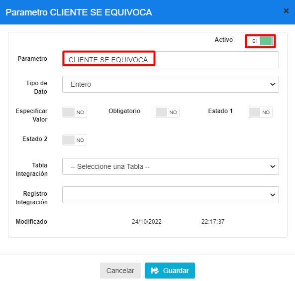

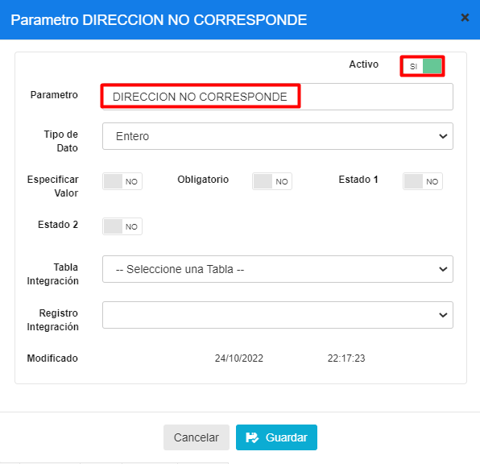

3.3.15 Puntos a considerar

1. Cada uno de los parámetros deben configurarse (escribirse) exactamente como está 
en este manual, respetando mayúsculas y minúsculas.

2. Se debe considerar aumentar más motivos de la transferencia de pedidos pickup.
Restaurante 

### 3.4.1 Colección Restaurante

Antes de crear las políticas de configuración; como primer paso se debe verificar si la política 
**CONFIGURACION PICKUP**, ya se encuentra creada. De ser el caso validar que la colección contenga los parámetros establecidos en este manual.

Si alguna de las políticas NO existe, se debe crearla así:

**Política CONFIGURACION PICKUP**

En la opción **Restaurante** presionar sobre el botón **Nueva Colección**, se abrirá una modal
para su creación ingresando los siguientes datos:

Tabla 12. Colección de Datos Restaurante

| N°  |       Colección      | Observaciones |
|-----|:--------------------:|:-------------:|
|   1 | CONFIGURACION PICKUP |               |

**Nota:** NO puede contener espacios en blanco al inicio y final del nombre de la colección; debe ser escrita tal y como se especifica en la tabla 12.

**Colección:** Nombre de la colección que se especifica en la tabla 12.

**Módulo:** No aplica.

**Repetir Configuración:** NO

**Observaciones:**

Una vez que se haya ingresado y seleccionado la información establecida procedemos a

**Guardar.**

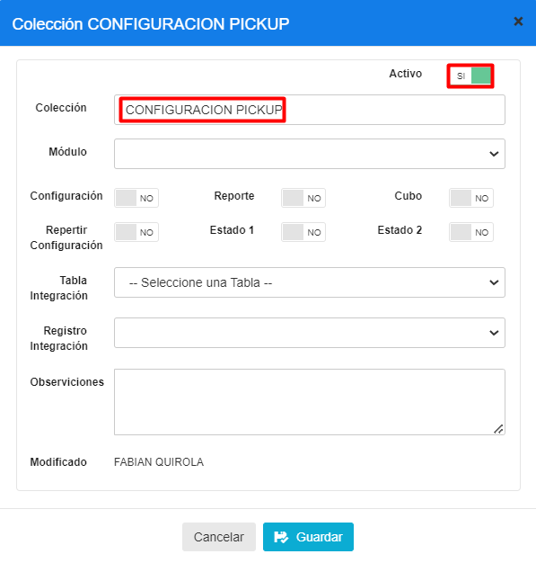

### 3.4.2 Parámetro de Colección 

Antes de agregar los parámetros de configuración mostrados en la tabla 13, se debe verificar 
si ya encuentren creados. De ser el caso validar que cada parámetro contenga los valores 
establecidos en este manual.

Si alguno de los parámetros NO existe dentro de la **Colección** especificada en la Tabla 13, se 
debe crearla así:

Seleccionamos la colección y presionamos sobre el botón **Nuevo Parámetro** en la cual se 
abrirá una venta para su creación y para cada Parámetro ingresamos los siguientes datos:

Tabla 13. Datos Parámetros de Colección de Datos Restaurante

| N°  | Colección            | Parámetro                   |  Tipo Dato  | Esp. Valor | Obligatorio | Estado 1 | Estado 2 |
|-----|----------------------|-----------------------------|:-----------:|------------|:-----------:|----------|----------|
|   1 | CONFIGURACION PICKUP | PICKUP TRANSFERENCIA APLICA |   SELECCION |   SI       |   SI        |   NO     |   NO     |

**Nota:** NO puede contener espacios en blanco al inicio y final del parámetro; deben ser escritos tal y como se especifica en la tabla 13.

**Parámetro:** Nombre del parámetro que se especifica en la tabla 13.

**Tipo de Dato**: Se especifica en la tabla 13.

 **Especificar Valor:** Se especifica en la tabla 13.
 
  **Obligatorio:** Se especifica en la tabla 13.

**Estado 1:** Se especifica en la tabla 13.

**Estado 2:** Se especifica en la tabla 13.

Una vez que se haya ingresado y seleccionado la información establecida procedemos a

**Guardar.**

Se deben crear todos los parámetros de configuración establecidos en la tabla 13. Se presentan los modales de configuración de cada parámetro a continuación:

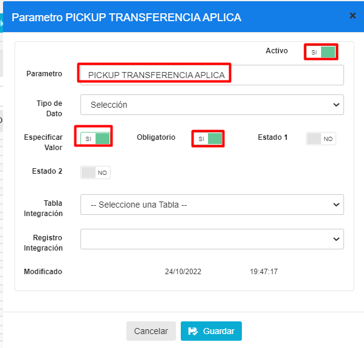

### 3.4.3 Restaurante Colección de Datos

En el menú principal del BackOffice de MaxPoint, nos dirigimos a RESTAURANTE y 
seleccionamos la opción RESTAURANTE, seguidamente seleccionamos el restaurante y 

seleccionamos la pestaña “**Políticas de Configuración**”.

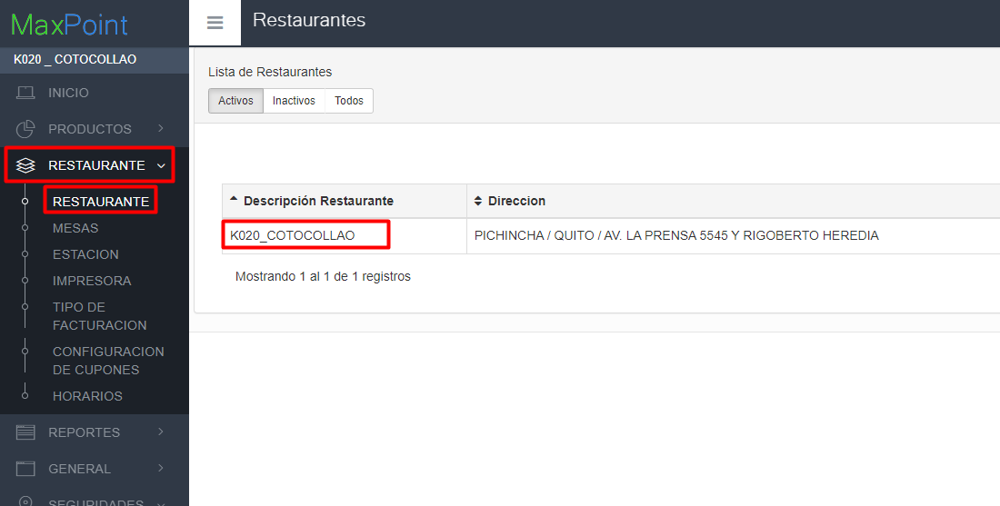

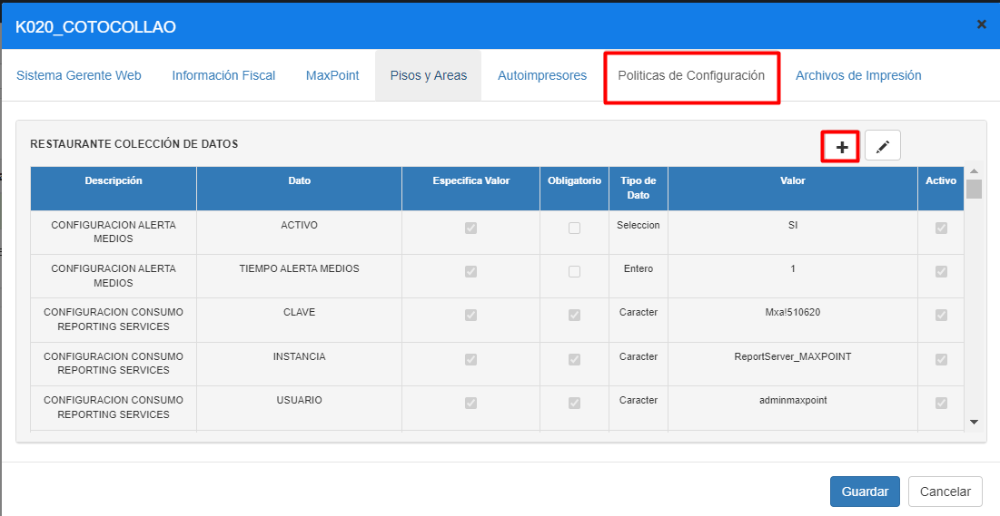

Para la configuración se debe presionar sobre el botón agregar “+”; el cual abrirá una 
ventana, seguidamente buscaremos la colección creada y agregamos el valor en los 
parametros solicitados. 

Para cada uno de los parametros como “**PICKUP TRANSFERENCIA APLICA**” y llenar sus 
valores como se muestra en la tabla a continuación:

Tabla 14. Parámetros de la colección

|N°|Dato|Valor|
|:----|:----|:----|
|1|PICKUP TRANSFERENCIA APLICA|SI|

Si se ha realizado correctamente, se debe mostrar así:

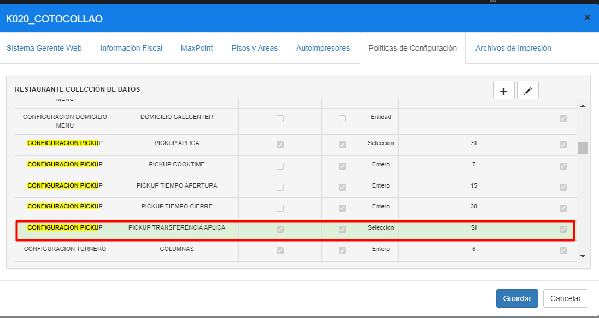

### 3.4.4 Puntos a considerar

1. Cada uno de los parámetros deben configurarse (escribirse) **exactamente** como 
está en este manual, respetando mayúsculas y minúsculas.

2. El botón de transferir pedido se debe mostrar cuando la política de “PICKUP 
TRANSFERENCIA APLICA “está configurada y su valor en SI.