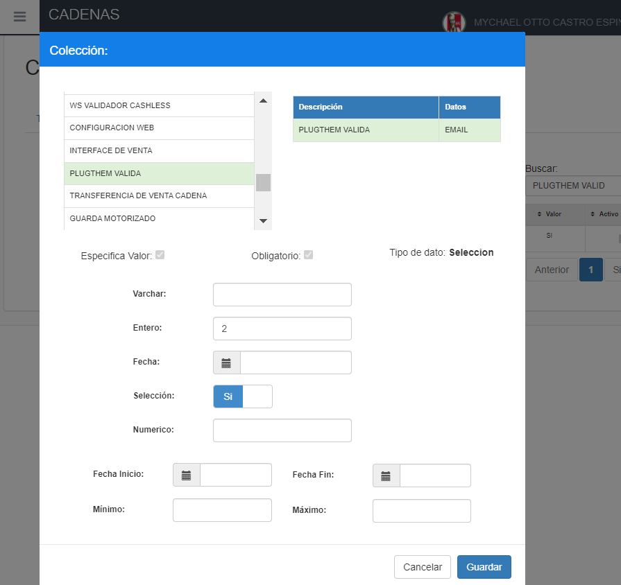
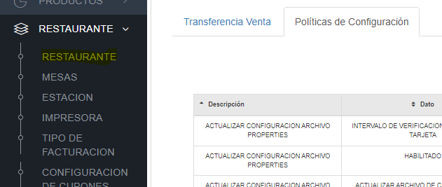
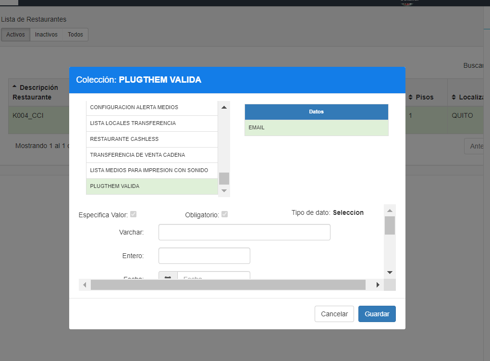

# OK-Manual - Configuracion politicas Valida email PlugThem (v2)

**OK-Manual - Configuracion politicas Valida email PlugThem (v2)**

**1 ANTECEDENTES**

Actualmente en el sistema MaxPoint, se tiene la necesidad de realizar validaciones de correo a fin de evitar lo más que se pueda correos con formatos erróneos.

**2 OBJETIVO GENERAL**

Crear y configurar la política de cadena y restaurante para activar la validación de emails con PLUGTHEM.

**2.1 Objetivos específicos**

- Configurar la política y parámetros a nivel de cadena.

- Configurar la política y parámetros a nivel de restaurante.

**3 POLÍTICAS DE CONFIGURACIÓN**

**3.1 Datos Generales**

En este manual se detalla cómo realizar la configuración de políticas que permitirán establecer los parámetros a ser utilizados Cambio Estado Automático a Manual.

**3.2 Pantalla de Políticas**

Se ingresara en sistema MXP backoffice con credenciales de administrador sistemas y seleccionar la cadena a la cual se realizará las configuraciones.

En el menú que se encuentra en la parte izquierda no dirigimos a la opción **SEGURIDADES** y seleccionamos **POLÍTICAS**, seguidamente presionamos sobre el botón **Ir a Administración Políticas** en el cual abrirá una nueva pestaña en el navegador.

**3.3 Cadena**

**3.3.1 Colección Cadena**

Antes de crear las políticas de configuración; como primer paso se debe verificar que no se encuentren creadas, de ser el caso validar que cada colección contenga los parámetros establecidos en este manual.
En la opción **Cadena** presionar sobre el botón **Nueva Colección**, se abrirá una modal para su creación ingresando los siguientes datos:

Tabla 1. Colección Cadena

| N° |    Colección    |                                                Descripción                                                |
|:--:|:---------------:|:---------------------------------------------------------------------------------------------------------:|
| 1  | PLUGTHEM VALIDA | Colección que permite establecer en verdadero o falso la posibilidad de validar los correos con plugthem. |

**Nota:** NO puede contener espacios en blanco al inicio y final del nombre de la colección; debe ser escrita tal y como se especifica en la tabla 1.

**Colección:** Nombre de la colección que se especifica en la tabla 1.

**Módulo:** Menú.

**Observaciones:** Una descripción de la función que realizara dicha colección.

Una vez que se haya ingresado y seleccionado la información establecida procedemos a Guardar.

### 3.3.2 Colección de Datos Cadena

Antes de agregar los parámetros de configuración, como primer paso se debe verificar que no se encuentren creados, de ser el caso validar que cada parámetro contenga los valores establecidos en este manual.

Una vez creada la colección se debe proceder a crear los parámetros de configuración y para ello seleccionamos la **colección** y presionamos sobre el botón **Nuevo Parámetro** en la cual se abrirá una venta para su creación e ingresamos los siguientes datos:

Tabla 2. Colección de Datos Cadena

|  N° | Colección | Parámetro | Esp. Valor | Obligatorio | Tipo Dato |
|:---:|:---------:|:---------:|:----------:|:-----------:|:---------:|
| 1   | EMAIL     | ACTIVO    |     NO     |      SI     | Seleccion |

**Nota:** NO puede contener espacios en blanco al inicio y final del parámetro; deben ser escritos tal y como se especifica en la tabla 2.

**Parámetro:** Nombre del parámetro que se especifica en la tabla 2.

**Tipo de Dato:**Se especifica en la tabla 2.

**Especifica Valor:** Se especifica en la tabla 2

**Obligatorio:** Se especifica en la tabla 2.

Una vez que se haya ingresado y seleccionado la información establecida procedemos a

 **Guardar.**

### 3.3.3 Cadena Colección de Datos

En el menú nos dirigimos a **Cadena** y seleccionamos la opción **Cadena**, buscamos el o los menús a ser configurados y seguidamente seleccionamos la pestaña **Políticas de configuración**.

Para la configuración se debe presionar sobre el botón agregar “+”; el cual abrirá una ventana, seguidamente buscaremos la colección creada y agregamos el valor en los parámetros solicitados.

### 3.3.4 PLUGTHEM VALIDA

En la tabla 3, se especifica los valores que deben ser configurados por cada parámetro colección.

Tabla 3. Valores de los parámetros de colección

| Colección: DESCUADRE DE PRECIOS |
|---------------------------------|

| N° | Parámetro | Tipo Dato | Valor a ingresar |                               Descripción                              |
|:--:|:---------:|:---------:|:----------------:|:----------------------------------------------------------------------:|
|  1 | EMAIL     | Selección |        si        | Para que se activen o desactiven la validación de emails con plugthem. |

Al realizar la configuración de todos los parámetros se debe tener lo siguiente:
En la tabla 4, se especifica los valores que deben ser configurados por cada parámetro colección.

Tabla 4. Valores de los parámetros de colección

| Colección: PLUGTHEM VALIDA |
|----------------------------|

| N° | Parámetro | Tipo Dato | Valor a ingresar |                               Descripción                              |
|:--:|:---------:|:---------:|:----------------:|:----------------------------------------------------------------------:|
|  1 | EMAIL     | Selecciòn |        Si        | Para que se activen o desactiven la validación de emails con plugthem. |

Adicionalmente en el campo Entero, se debe escribir la cantidad de intentos posibles a ejecutar la validación.

Es importante destacar que la cantidad de intentos fungirá como un contador, y al llegar a su límite, el correo será tomado como valido automáticamente. 

### 3.4 Restaurante 

### 3.4.1 Colección Restaurante

Antes de crear las políticas de configuración; como primer paso se debe verificar que no se encuentren creadas, de ser el caso validar que cada colección contenga los parámetros establecidos en este manual.

En la opción **Restaurante** presionar sobre el botón **Nueva Colección**, se abrirá una modal para su creación ingresando los siguientes datos:

Tabla 1. Colección Restaurante

| N° |    Colección    |                                                Descripción                                                |
|:--:|:---------------:|:---------------------------------------------------------------------------------------------------------:|
| 1  | PLUGTHEM VALIDA | Colección que permite establecer en verdadero o falso la posibilidad de validar los correos con plugthem. |

**Nota:** NO puede contener espacios en blanco al inicio y final del nombre de la colección; debe ser escrita tal y como se especifica en la tabla 1.

**Colección:** Nombre de la colección que se especifica en la tabla 1.

**Módulo:** Menú.

**Observaciones:** Una descripción de la función que realizara dicha colección.

Una vez que se haya ingresado y seleccionado la información establecida procedemos a

 **Guardar**.

### 3.4.2 Colección de Datos Restaurante

Antes de agregar los parámetros de configuración, como primer paso se debe verificar que no se encuentren creados, de ser el caso validar que cada parámetro contenga los valores establecidos en este manual.

Una vez creada la colección se debe proceder a crear los parámetros de configuración y para ello seleccionamos la colección y presionamos sobre el botón **Nuevo Parámetro** en la cual se abrirá una venta para su creación e ingresamos los siguientes datos:

Tabla 2. Colección de Datos Restaurante

|  N° | Colección | Parámetro | Esp. Valor | Obligatorio | Tipo Dato |
|:---:|:---------:|:---------:|:----------:|:-----------:|:---------:|
| 1   | EMAIL     | ACTIVO    |     NO     |      SI     | Selección |

**Nota:** NO puede contener espacios en blanco al inicio y final del parámetro; deben ser escritos tal y como se especifica en la tabla 2.

**Parámetro:** Nombre del parámetro que se especifica en la tabla 2.

**Tipo de Dato:** Se especifica en la tabla 2.

**Especifica Valor:** Se especifica en la tabla 2

**Obligatorio:** Se especifica en la tabla 2.

Una vez que se haya ingresado y seleccionado la información establecida procedemos a

 **Guardar.**

### 3.4.3 Restaurante Colección de Datos

En el menú nos dirigimos a **Restaurante** y seleccionamos la opción **Restaurante**, buscamos el o los menús a ser configurados y seguidamente seleccionamos la pestaña **Políticas de configuración.**

Para la configuración se debe presionar sobre el botón agregar “+”; el cual abrirá una ventana, seguidamente buscaremos la colección creada y agregamos el valor en los parámetros solicitados.

### 3.4.4 PLUGTHEM VALIDA

En la tabla 3, se especifica los valores que deben ser configurados por cada parámetro colección.

Tabla 3. Valores de los parámetros de colección

| Colección: PLUGTHEM VALIDA |
|----------------------------|

| N° | Parámetro | Tipo Dato | Valor a ingresar |                               Descripción                              |
|:--:|:---------:|:---------:|:----------------:|:----------------------------------------------------------------------:|
|  1 | EMAIL     | Selección |        si        | Para que se activen o desactiven la validación de emails con plugthem. |

Al realizar la configuración de todos los parámetros se debe tener lo siguiente:

En la tabla 4, se especifica los valores que deben ser configurados por cada parámetro colección.

Tabla 4. Valores de los parámetros de colección

| Colección: PLUGTHEM VALIDA |
|----------------------------|

| N° | Parámetro | Tipo Dato | Valor a ingresar |                               Descripción                              |
|:--:|:---------:|:---------:|:----------------:|:----------------------------------------------------------------------:|
|  1 | EMAIL     | Selecciòn |        Si        | Para que se activen o desactiven la validación de emails con plugthem. |

Adicionalmente en el campo Entero, se debe escribir la cantidad de intentos posibles a ejecutar la validación.

Es importante destacar que la cantidad de intentos fungirá como un contador, y al llegar a su límite, el correo será tomado como valido automáticamente. 

**CONSIDERACIONES IMPORTANTE**

Si la validación se aplica por Cadena, este cambio estará activo para todos los restaurantes de dicha cadena, pero si solo se quiere aplicar a un Restaurante, la creación solo debe aplicarse al restaurante en cuestión. 
