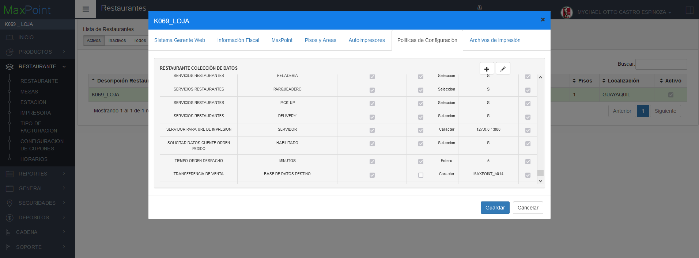

# OK-Manual Politicas Cod Orden App (v2.1)

**CONFIGURACIÓN DE POLÍTICAS PARA CÓDIGO ORDEN APP**

## 1 ANTECEDENTES
Actualmente en el sistema MaxPoint, se tiene la necesidad de realizar una configuración de políticas a nivel cadena que permita el uso del código app para la retoma de pedidos pickup establecer su longitud.

## 2 OBJETIVO GENERAL

Crear y configurar la política de cadena para establecer el uso del código app en la retoma de pedidos y la longitud del mismo.

### 2.1 Objetivos específicos

- Los primeros dígitos del código de la app (parte izquierda) se generan de forma incremental "0000013416"-010102.

- Los últimos dígitos del código de la app (parte derecha) 0000013416-"010102" hace referencia al account/vendor/channel.

oEl primero par "010102" hace referencia al account (KFC, Wendy´s, etc)
oEl segundo par "010102" hace referencia al vendor para saber de la marca.
oEl último par "010102" hace referencia al channel (domicilio, pickup).

- Definir la longitud extensión de la parte izquierda.

| **Account (Pick-up)** | **Código de la app (parte derecha)** |
|:---------------------:|:------------------------------------:|
| KFC Ecuador           |                -010103               |
| KFC Colombia          |                -010403               |
| KFC Chile             |                -010703               |
| KFC Argentina         |                -011003               |
| Wendy´s Chile         |                -080903               |
| Wendy´s Argentina     |                -081103               |
| Juan Valdez App       |                -020203               |

## 3 POLÍTICAS DE CONFIGURACIÓN

### 3.1 Datos Generales

En este manual se detalla cómo realizar la configuración de políticas que permitirán establecer los parámetros a ser utilizados para el uso del código app en la retoma de pedidos pickup.

### 3.2 Pantalla de Políticas

Se ingresará en sistema MXP BackOffice con credenciales de administrador sistemas y seleccionar la cadena a la cual se realizará las configuraciones.

En el menú que se encuentra en la parte izquierda no dirigimos a la opción **SEGURIDADES** y seleccionamos **POLÍTICAS**, seguidamente presionamos sobre el botón **Ir a Administración Políticas** en el cual abrirá una nueva pestaña en el navegador.

**3.3 Cadena**

**3.3.1 Colección Cadena** 

Antes de crear las políticas de configuración; como primer paso se debe verificar que no se encuentren creadas, de ser el caso validar que cada colección contenga los parámetros establecidos en este manual.
En la opción **Cadena** presionar sobre el botón **Nueva Colección**, se abrirá una modal para su creación ingresando los siguientes datos:

Tabla 1. Colección Cadena

| **N°** | **Colección** |                                                 **Descripción**                                                 |
|:------:|:-------------:|:---------------------------------------------------------------------------------------------------------------:|
| 1      | COD ORDEN APP | Colección que permite establecer las configuraciones para el uso del código app en la retoma de pedidos pickup. |

**Nota:** NO puede contener espacios en blanco al inicio y final del nombre de la colección; debe ser escrita tal y como se especifica en la tabla 1.

**Colección:** Nombre de la colección que se especifica en la tabla 1.

**Módulo: **

**Observaciones:** Una descripción de la función que realizara dicha colección.
Una vez que se haya ingresado y seleccionado la información establecida procedemos a 

**Guardar.**

### 3.3.2 Colección de Datos Cadena

Antes de agregar los parámetros de configuración, como primer paso se debe verificar que no se encuentren creados, de ser el caso validar que cada parámetro contenga los valores establecidos en este manual.

Una vez creada la colección se debe proceder a crear los parámetros de configuración y para ello seleccionamos la **colección** y presionamos sobre el botón **Nuevo Parámetro** en la cual se abrirá una venta para su creación e ingresamos los siguientes datos:

Tabla 2. Colección de Datos Cadena

| Colección: COD ORDEN APP |
|--------------------------|

| **N°** | **Parámetro** | **Esp. Valor** | **Obligatorio** | **Tipo Dato** |
|:------:|:-------------:|:--------------:|:---------------:|:-------------:|
| 1      | COD CADENA    |       SI       |        SI       |    Carácter   |
| 2      | LONGITUD COD  |       SI       |        SI       |     Entero    |

**Nota:** NO puede contener espacios en blanco al inicio y final del parámetro; deben ser escritos tal y como se especifica en la tabla 2.

**Parámetro**: Nombre del parámetro que se especifica en la tabla 2.

**Tipo de Dato:** Se especifica en la tabla 2.

**Especifica Valor**: Se especifica en la tabla 2

**Obligatorio**: Se especifica en la tabla 2.
Una vez que se haya ingresado y seleccionado la información establecida procedemos a

 **Guardar.**

### 3.3.3 Cadena Colección de Datos

En el menú nos dirigimos a Cadena y seleccionamos la opción **Cadena**, buscamos el o los menús a ser configurados y seguidamente seleccionamos la pestaña **Políticas de configuración**.

Para la configuración se debe presionar sobre el botón agregar “+”; el cual abrirá una ventana, seguidamente buscaremos la colección creada y agregamos el valor en los parámetros solicitados.

### 3.3.4 COD CADENA

En la tabla 3, se especifica los valores que deben ser configurados por cada parámetro colección.
El valor a ingresar dependerá del account/vendor/channel según sea el caso (Ver tabla inicial del apartado **Objetivos Específicos**). Se debe colocar el valor correspondiente al País/Cadena a configurar (**Ejem:** Para KFC Ecuador el valor a ingresar es “-010103”).

Tabla 3. Valores de los parámetros de colección

| Colección: COD ORDEN APP |
|--------------------------|

| N° |  Parámetro |   Varchar   |
|:--:|:----------:|:-----------:|
|  1 | COD CADENA | [Ver Tabla] |

**3.3.5 LONGITUD COD**

En la tabla 4, se especifica los valores que deben ser configurados por cada parámetro colección.
Se debe especificar el valor de la longitud del lado izquierdo del **Código App** según el País/Cadena. El valor a ingresar por defecto es 10. Para determinar la longitud, solo se debe tomar en cuenta el lado izquierdo del Codigo App: **0000252625-010103.**

Tabla 4. Valores de los parámetros de colección

| Colección: COD ORDEN APP |
|--------------------------|

| N° |   Parámetro  | Entero |
|:--:|:------------:|:------:|
|  1 | LONGITUD COD |   10   |

### 3.4 Restaurante

### 3.4.1 Colección Restaurante

Antes de crear las políticas de configuración; como primer paso se debe verificar que no se encuentren creadas, de ser el caso validar que cada colección contenga los parámetros establecidos en este manual.

Volvemos a la ventana inicial del en MXP BackOffice. En el menú que se encuentra en la parte izquierda no dirigimos a la opción **SEGURIDADES** y seleccionamos **POLÍTICAS**, seguidamente presionamos sobre el botón **Ir a Administración Políticas** en el cual abrirá una nueva pestaña en el navegador.

En la opción Restaurante presionar sobre el botón Nueva Colección, se abrirá una modal para su creación ingresando los siguientes datos:

Tabla 5. Colección Restaurante

| N° |   Colección   |                                                   Descripción                                                   |
|:--:|:-------------:|:---------------------------------------------------------------------------------------------------------------:|
| 1  | COD ORDEN APP | Colección que permite establecer las configuraciones para el uso del código app en la retoma de pedidos pickup. |

**Nota:** NO puede contener espacios en blanco al inicio y final del nombre de la colección; debe ser escrita tal y como se especifica en la tabla 5.

### 3.4.2 Colección de Datos Restaurante

Antes de agregar los parámetros de configuración, como primer paso se debe verificar que no se encuentren creados, de ser el caso validar que cada parámetro contenga los valores establecidos en este manual.

Una vez creada la colección se debe proceder a crear los parámetros de configuración y para ello seleccionamos la colección y presionamos sobre el botón **Nuevo Parámetro** en la cual se abrirá una venta para su creación e ingresamos los siguientes datos:
Tabla 6. Colección de Datos Restaurante

|  N° |   Colección   |           Parámetro           | Esp. Valor | Obligatorio | Tipo Dato |
|:---:|:-------------:|:-----------------------------:|:----------:|:-----------:|:---------:|
| 1   | COD ORDEN APP | LECTURA CODIGOS MANUAL PICKUP |     SI     |      SI     | Selección |

**Nota:** NO puede contener espacios en blanco al inicio y final del parámetro; deben ser escritos tal y como se especifica en la tabla 6.

**Parámetro:** Nombre del parámetro que se especifica en la tabla 6.

**Tipo de Dato:** Se especifica en la tabla 6.

**Especifica Valor:** Se especifica en la tabla 6

**Obligatorio:** Se especifica en la tabla 6.

Una vez que se haya ingresado y seleccionado la información establecida procedemos a 

**Guardar.**

### 3.4.3 Restaurante Colección de Datos

En el menú nos dirigimos a **Restaurante** y seleccionamos la opción **Restaurante**, buscamos el o los menús a ser configurados y seguidamente hacemos doble clic sobre el **restaurante a configurar**. En la nueva ventana, iremos a la pestaña **Políticas de Configuración**.

Para la configuración se debe presionar sobre el botón agregar “+”; el cual abrirá una ventana, seguidamente buscaremos la colección creada y agregamos el valor en los parámetros solicitados.

### 3.4.1 LECTURA CODIGOS MANUAL PICKUP

En la tabla 3, se especifica los valores que deben ser configurados por cada parámetro colección.
El valor a ingresar corresponde tiene como objeto especificar si está activa la funcionalidad.

Tabla 7. Valores de los parámetros de colección

| Colección: LECTURA CODIGOS MANUAL PICKUP |
|------------------------------------------|

| N° |           Parámetro           | Selección | Esp. Valor | Obligatorio | Tipo Dato |
|:--:|:-----------------------------:|:---------:|:----------:|:-----------:|:---------:|
|  1 | LECTURA CODIGOS MANUAL PICKUP |     Si    |     SI     |      SI     | Selección |

## 4 ANEXOS

A continuación, cuadro comparativo para explicar el uso y alcance de la política creada a nivel de Cadena:

Tabla 8. Anexos

| ACTIVA CADENA | ACTIVA RESTAURANTE |            RESULTADO           |                                                 DESCRIPCIÓN                                                |
|:-------------:|:------------------:|:------------------------------:|:----------------------------------------------------------------------------------------------------------:|
| Si            | Si                 | Se aplicará la validación.     | En este escenario se aplicará la longitud al código digitado completando los espacios faltantes con ceros. |
| Si            | No                 | Se aplicará la validación.     | En este caso no se aplicará la validación y será usado el cfac_id                                          |
| No            | No                 | No se aplicará la validación.  | En este caso no se aplicará la validación de la cadena y se mostrará un mensaje de error.                  |