# Manual de Usuario Creación y Actualización de Productos

### Manual de USUARio PARA LA CREACIÓN Y ACTUALIZACIÓN DE PRODUCTOS, DESDE MAXPOINT HACIA SIR.

## INTRODUCCION
Creación y Actualización de Productos desde MaxPoint hacia SIR

### Introducción 

- Este manual indica al usuario las diferentes alertas y validaciones que se realizan en el proceso de la creación y actualización de los productos.

## 1. INGRESO A LA PANTALLA NUEVA PRODUCTOS

### 1.1 ESCENARIO CON PARAMETRO DE APLICA INTEGRACION EN NO

1. Para ingresar se debe dar click en la opción “PRODUCTOS”, luego “NUEVA PRODUCTOS” y se cargara la pantalla con los productos. Si la política “INTEGRACION SIR” y el parámetro “APLICA INTEGRACION” no existen o el parámetro “APLICA INTEGRACION” esta con valor “NO”, se cargaran los productos y sus parámetros desde la BD de MaxPoint. Y no será visible el botón “NUEVO” que permite crear productos.
Además el usuario solo podrá realizar la acción de Actualización de los productos

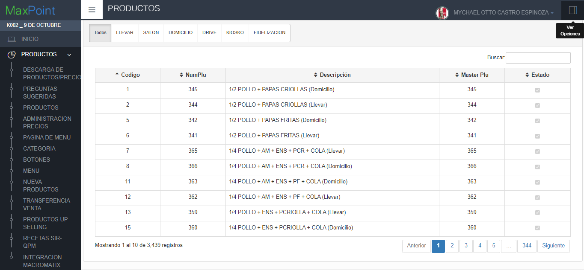

### 1.2 ESCENARIO CON PARAMETRO DE APLICA INTEGRACION EN SI

Para ingresar se debe dar click en la opción “PRODUCTOS”, luego “NUEVA PRODUCTOS” y se cargara la pantalla con los productos. Si las políticas y sus parámetros no han sido configurados correctamente, no mostrar la información de los productos. Y mostrara un mensaje con los parámetros que faltan por configurar.

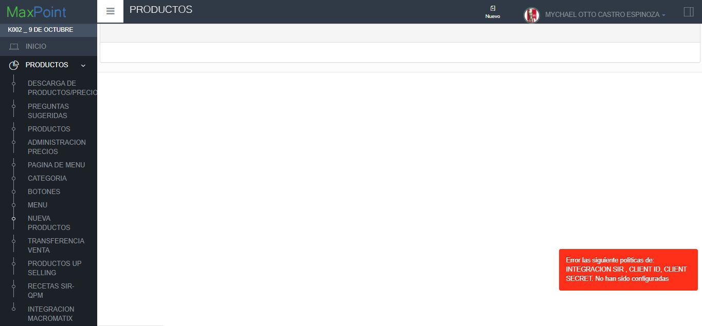

2. Si las políticas se encuentran configuradas correctamente podrá ingresar a la pantalla de “PRODUCTOS” y visualizar los productos.

**Nota:** En esta pantalla se cargan los departamentos, clasificaciones y categorías desde SIR y se actualizan hacia maxpoint, en caso de que alguna de esa información no venga desde SIR, se muestra un mensaje”   

 
3.  La siguiente pantalla muestra la validación cuando la información que debe de llegar desde SIR no pudo ser obtenida, en su defecto se carga la data desde MaxPoint. Mostrando el mensaje correspondiente.

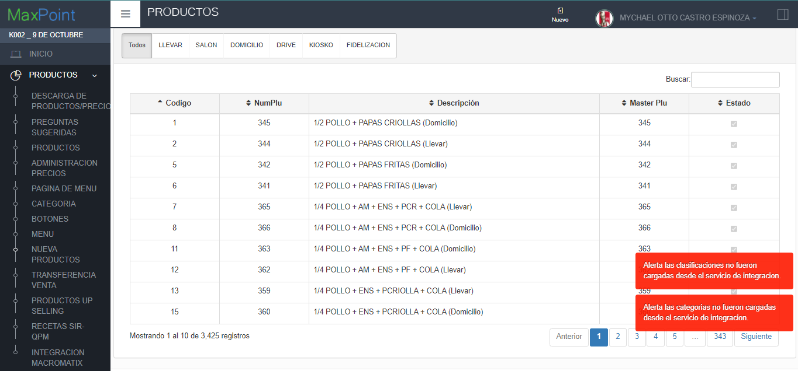

## 2. CREACIÓN DEL PRODUCTO

### 2.1 ESCENARIO DE EXITOSO

1.Dar click sobre el botón nuevo.
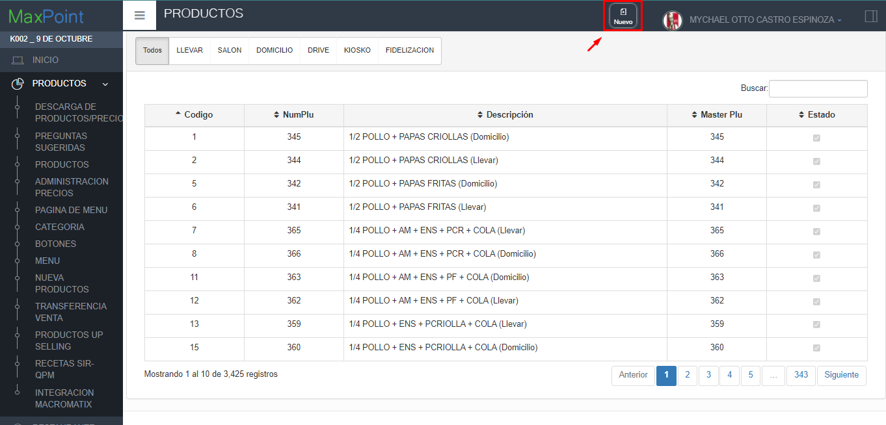

  2. Mostrará la ventana modal donde el usuario deberá ingresar los datos del producto a crear. Además el campo Plu Num Plu se encontrara deshabilitado.

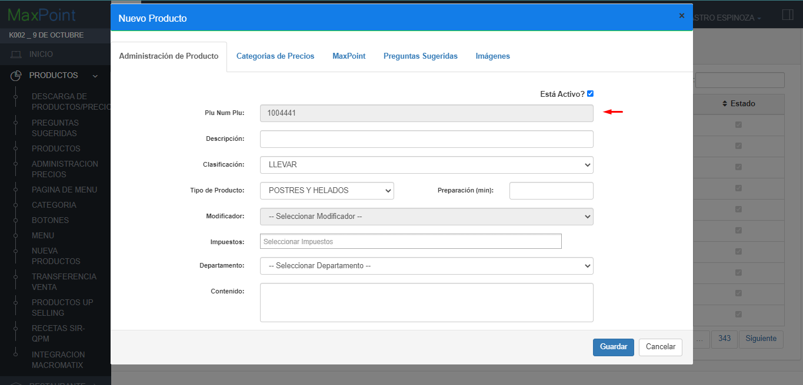

3. Una vez ingresado todos los datos el sistema deberá darle click en el botón.
 “Guardar”.

 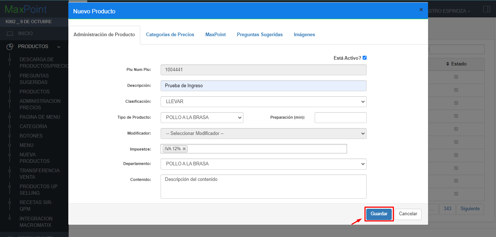

 4. Mostrará el loading indicando que el producto está siendo guardado.
  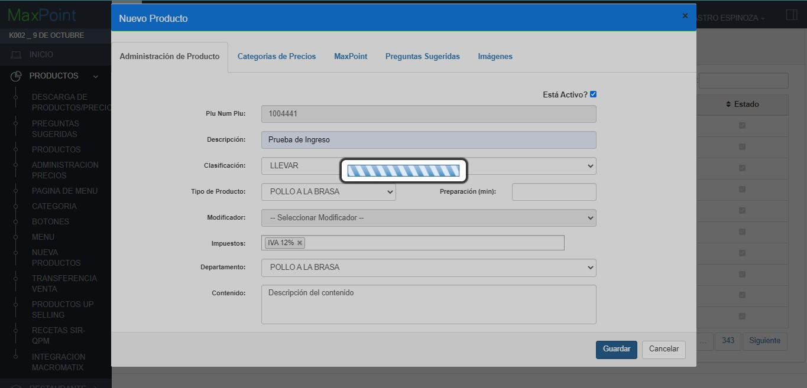

  5. Cuando el producto se haiga guardado correctamente el sistema muestra el mensaje correspondiente a la transacción “Se ha creado el Plus correctamente”.

  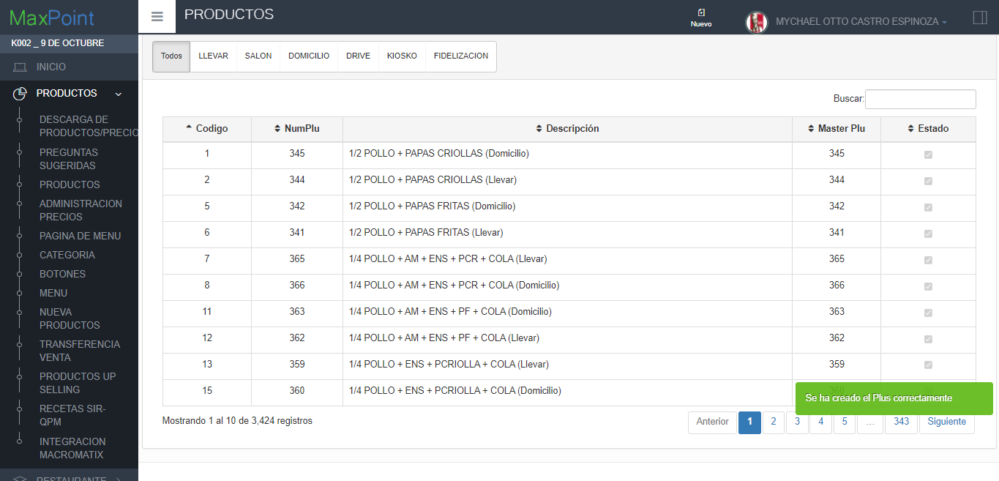

### 2.2 ESCENARIO FALLIDO
1. Repetir los pasos de la CREACION EXITOSA hasta el paso 4.
2. Si hubo un error al consumir el servicio que almacena el producto en SIR, mostrara el mensaje correspondiente a “No se guardó el producto, intente nuevamente” 

  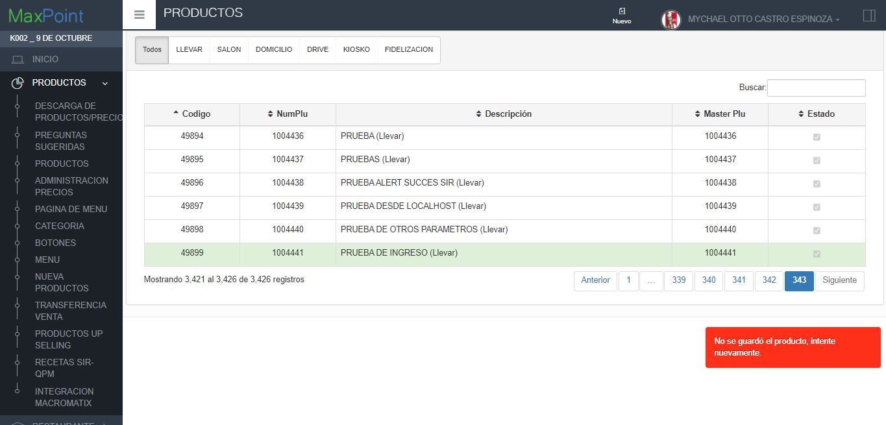

 ###  2.3. ESCENARIO PLU NUM PLU YA EXISTE
1. Repetir los pasos de la CREACION EXITOSA hasta el paso 4.
2. El sistema le indicara que Ya existe un Numero de Plus ****** creado con ese código para la cadena “Nombre de la cadena”.
 

   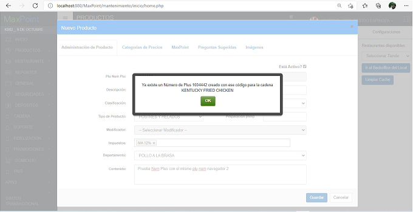

   3. Dar click en el Botón “OK”.
   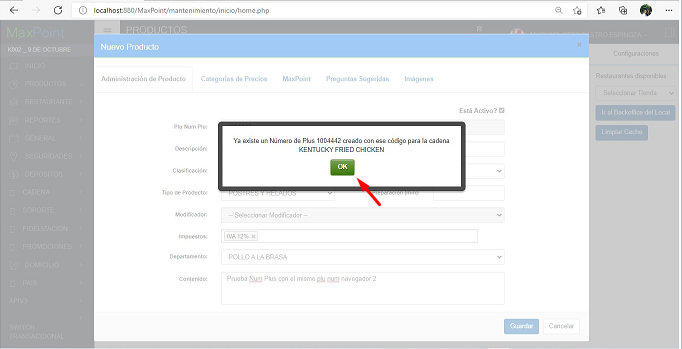

   4. Como podemos observar el campo Plu Num Plus, toma un nuevo valor y podremos continuar con la transacción.
     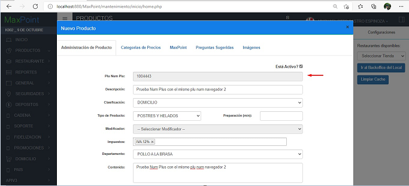

## 3. ACTUALIZACIÓN DE PRODUCTOS 
1.Ingresar al menú “PRODUCTOS”, y seleccionar la opción de “NUEVA PRODUCTOS”

    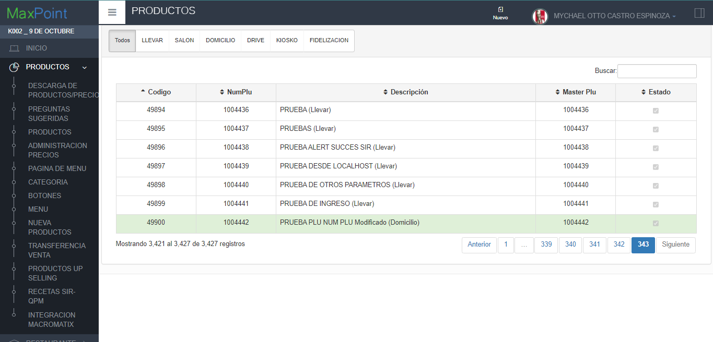

2. De doble click sobre el producto que desea editar, se le mostrara un modal con los datos del producto.

3. Una vez editado los datos del producto, de click sobre el botón “Guardar”
    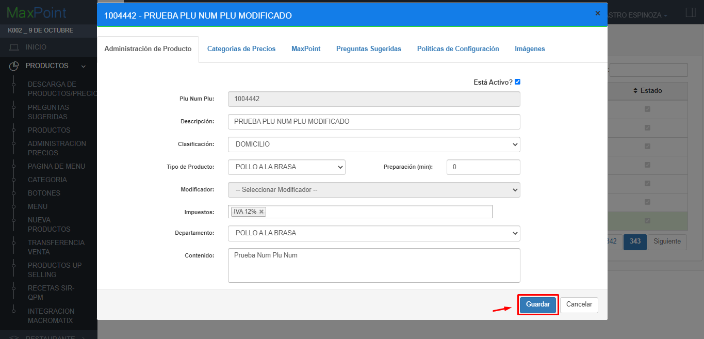

    4. Cuando de click en “Guardar”, se mostrara un loading que nos indica que se esta realizando la actualización del producto.
     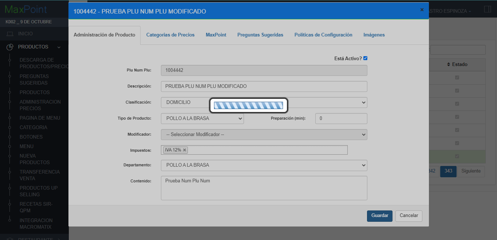

     5. Se mostrara el mensaje de la actualización del producto, “Se ha actualizado el Plus correctamente”

     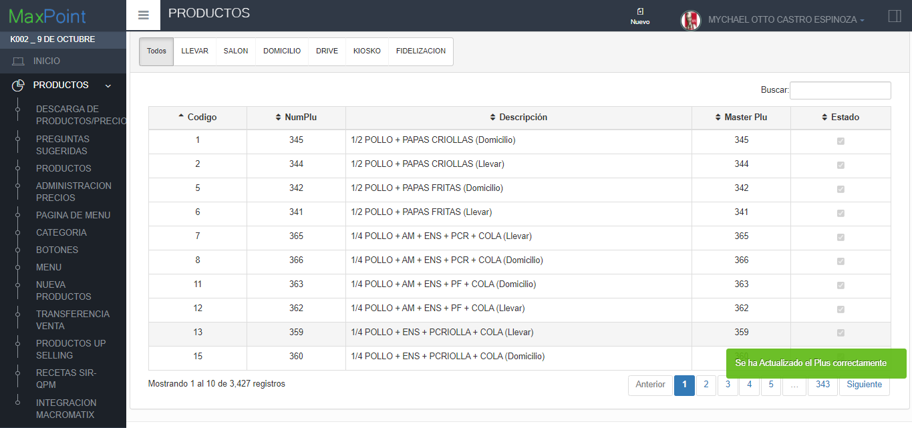

   