# Habilitar Encuesta de Satisfacción

HABILITAR ENCUESTA DE SATISFACCIÓN AL CLIENTE

## 1 ANTECEDENTES

Actualmente en el sistema MaxPoint punto de venta se desea realizar una encuesta de 
satisfacción hacia los clientes que apliquen factura con datos, para ello se debe realizar las 
configuraciones para habilitar este proceso.
## 2 OBJETIVO

- Habilitar la política de configuración a nivel de restaurante para generar encuestas 
de satisfacción al cliente.
## 3 IMPRESIÓN

### 3.1 Actualizar el servicio de impresión

Como primer paso debemos copiarnos al disco “C:” de la estación, el nuevo servicio de 
impresión de la siguiente ruta:

[Link de la ruta aqui ](\\192.168.101.249\Publico\Instaladores\servicioImpresionJava\ImpresionEcuadorQr)

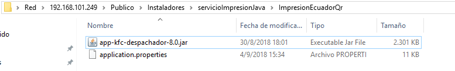

Una vez copiado el jar debemos editar el archivo properties, el mismo que se encuentra 
dentro de la carpeta “Config”

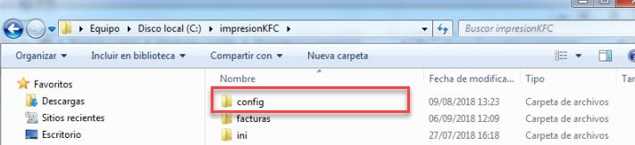

En el archivo properties, al final agregamos las siguientes líneas de código.

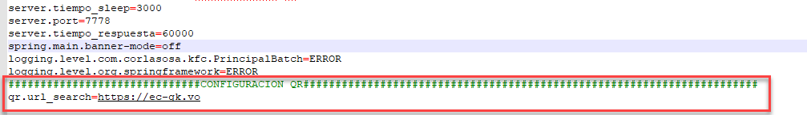

###########################CONFIGURACION QR#################################
qr.url_search=https://ec-gk.vo

**Nota:** Se puede copiar las líneas de código, desde el archivo properties que se encuentra en 
la misma ruta del servicio. 

### 3.2 Administración de Impresión - Tamaño de Papel

Con el buscador de Windows ingresamos a **Administrador de impresión.**

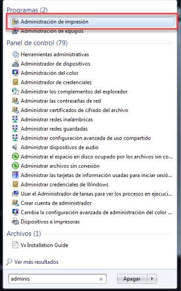

Seguidamente nos dirigimos hasta la opción **Formularios**

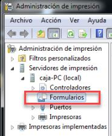

Click derecho sobre formularios y seleccionamos **Administrar Formularios…**

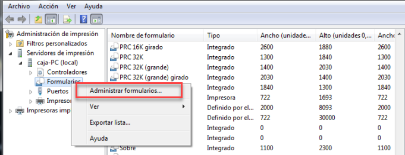

En la siguiente pantalla debemos marcar la casilla **Crear nuevo formulario** e ingresar un 

nombre como “**Print width kfc**” y en la opción Alto ingresamos **300cm**, seguidamente

aplicamos y guardamos.

**Nota:**Las configuraciones deben ser tal y como se muestra en la imagen.. 

### 3.3 Configuración de Impresión

Ingresamos a dispositivos e impresoras y sobre la impresora de facturación damos click 
derecho y seleccionamos la opción **Propiedades de impresora.**

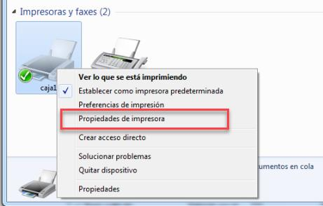

Click en **Preferencias…**

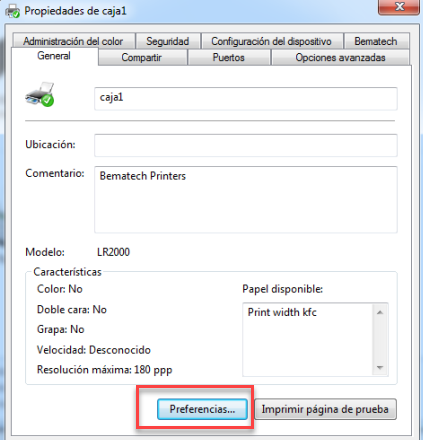

Click en Opciones **avanzadas…**

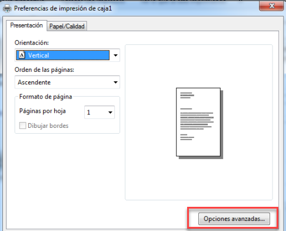

Aquí seleccionamos el tamaño de papel que se creó como “Print width kfc”, aceptamos,
aplicamos y guardamos

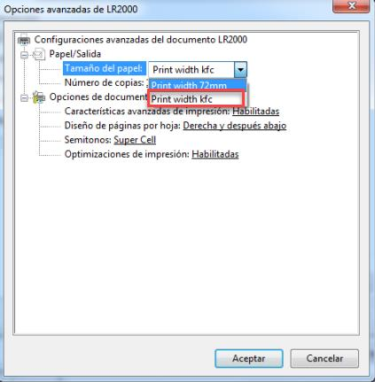

## 4 POLÍTICAS DE CONFIGURACIÓN

Datos Generales
En este manual se detalla cómo realizar la configuración de política a nivel de restaurante 
que permitirá activar el proceso para generar encuestas de satisfacción a los clientes desde 
MaxPoint punto de venta, para este proceso se debe considerar lo siguiente:

- En la tienda debe estar creada y configurada la política a nivel de cadena
PLUGTHEM VOC - ¿Aplica?

- En la tienda debe estar creada y configurada la política a nivel de restaurante
PLUGTHEM VOC - ¿Aplica?

**Nota:** Existen otras configuraciones las misma que se especifican en el manual “Encuesta 
de Satisfacción Cliente - Plug Them.pdf”. 

### 4.2 Restaurante Colección de Datos

En el menú nos dirigimos a **RESTAURANTE** y seleccionamos la opción 

**RESTAURANTE**, seguidamente seleccionamos el restaurante al cual se habilitará la 

configuración.

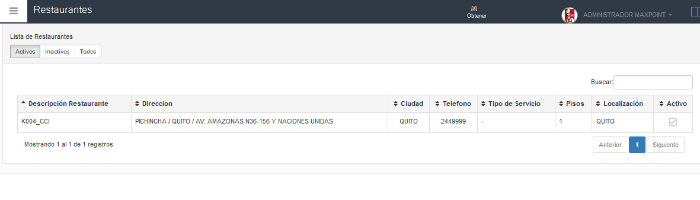

Con un doble click se abrirá una modal con la información del restaurante, seleccionamos 
la opción de la pestaña **Políticas de Configuración.**

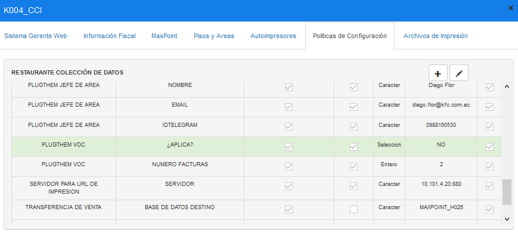

4.2.1 Editar Política de configuración

Para habilitar la configuración seleccionamos la colección **PLUG VOC - ¿Aplica?** y

presionar sobre el botón editar **“lápiz”**.

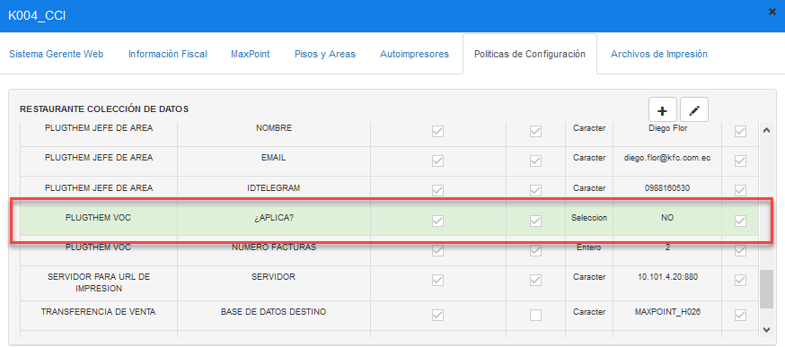

Aquí se podrá modificar el tipo de dato Selección es decir de SI a NO o viceversa, 

seguidamente presionar **Guardar.**

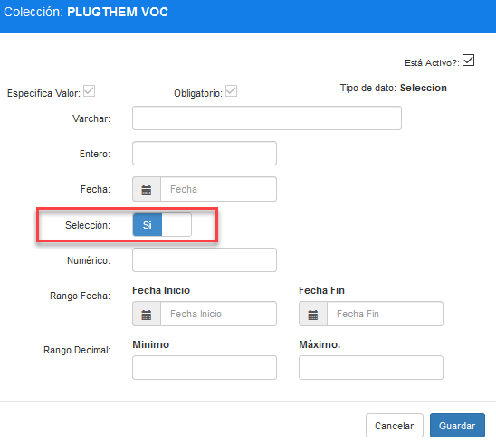

## 5 Verificación

Una vez habilitada la política y configurado el servicio de impresión, procedemos a realizar 
una prueba realizando facturas con datos (se debe especificar en número de celular del 
cliente), en la cual dependiendo de la configuración enviará un SMS al teléfono del cliente 
o a su vez imprimirá al final de la factura un código QR.

Tanto el código QR como el SMS debe permitir acceder a la página de encuesta.

