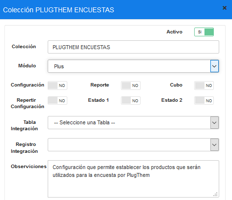
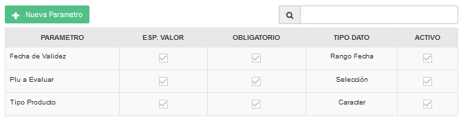
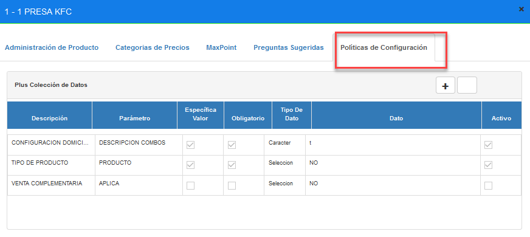
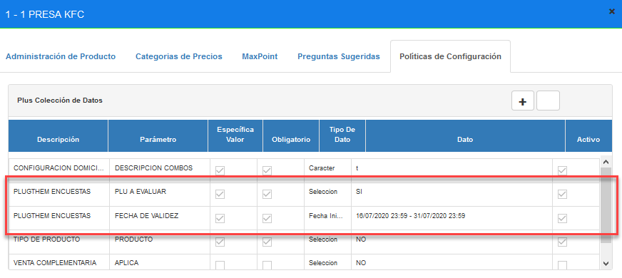

# Manual - Configuración PlugThem Encuestas Producto

CONFIGURACIÓN ENCUESTA PRODUCTOS - PLUGTHEM.

## 1 ANTECEDENTES

Actualmente en el sistema MaxPoint punto de venta, existe la integración con PlugThem 
para que el cliente realice encuestas de satisfacción. Ahora se desea realizar encuestas sobre productos configurados.

## 2 OBJETIVO GENERAL

Integrar en MXP las encuestas a productos o al cliente.

### 2.1 Objetivos específicos

- Crear una política de configuración a nivel de plus para los productos que serán
utilizados como encuesta.

- Validar si la encuesta es al cliente o al producto.

## 3 POLÍTICAS DE CONFIGURACIÓN

### 3.1 Datos Generales

En este manual se detalla cómo realizar la configuración de políticas a nivel de plus que permitirán establecer que productos serán utilizados para la encuesta.

### 3.2 Pantalla de Políticas

Ingresar al sistema MP backoffice con credenciales de administrador sistemas y seleccionar la cadena a la cual se realizará las configuraciones.

En el menú que se encuentra en la parte izquierda no dirigimos a la opción 
**SEGURIDADES** y seleccionamos **POLÍTICAS**, seguidamente presionamos sobre el 
botón **Ir a Administración Políticas** en el cual abrirá una nueva pestaña en el navegador.

### 3.3 Plus

### 3.3.1 Colección Plus

Antes de crear las políticas de configuración; como primer paso se debe verificar que no se encuentren creadas, de ser el caso validar que cada colección contenga los parámetros 
establecidos en este manual.

En la opción **Plus** presionar sobre el botón **Nueva Colección**, se abrirá una modal para su creación ingresando los siguientes datos:

Tabla 1. Datos Colección Plus

| N° | **Colección**      | **Descripción**                                                                                        |
|----|--------------------|--------------------------------------------------------------------------------------------------------|
| 1  | PLUGTHEM ENCUESTAS | Configuración que permite establecer los productos que  serán utilizados para la encuesta por Plugthem |

**Nota:** NO puede contener espacios en blanco al inicio y final 
del nombre de la colección; debe ser escrita tal y como se especifica en la tabla 1.”. 

**Colección:** Nombre de la colección que se especifica en la tabla 1.

**Módulo:** Plus.

**Observaciones:** Una descripción de la función que realizara dicha colección.

Una vez que se haya ingresado y seleccionado la información establecida procedemos a

**Guardar**

### 3.3.2 Parámetro de Colección 

Antes de agregar los parámetros de configuración, como primer paso se debe verificar que 
no se encuentren creados, de ser el caso validar que cada parámetro contenga los valores 
establecidos en este manual.

Una vez creada la colección se debe proceder a crear los parámetros de configuración y 
para ello seleccionamos la colección y presionamos sobre el botón **Nuevo Parámetro** en la 
cual se abrirá una venta para su creación e ingresamos los siguientes datos:

Tabla 2. Datos Parámetros de Colección Plus

| N° | **Colección** | **Parámetro** | **Esp. Valor** | **Obligatorio** | **Tipo Dato** |
|---|---|---|---|---|---|
| 1 | PLUGTHEM ENCUESTAS | Plu a Evaluar | SI | SI | Selección |
| 2 | PLUGTHEM ENCUESTAS | Fecha de Validez | SI | SI | Rango Fecha |
| 3 | PLUGTHEM ENCUESTAS | Tipo Producto | SI | SI | Carácter |

**Nota:**NO puede contener espacios en blanco al inicio y final del parámetro; deben ser 
escritos tal y como se especifica en la tabla 2. 

**Parámetro:** Nombre del parámetro que se especifica en la tabla 2.

**Tipo de Dato:** Se especifica en la tabla 2.

**Especifica Valor:** Se especifica en la tabla 2.

**Obligatorio:** Se especifica en la tabla 2.

Una vez que se haya ingresado y seleccionado la información establecida procedemos a 

**Guardar.**

Se deben crear todos los parámetros de configuración establecidos en la tabla 2 y se debe tener lo siguiente:

### 3.3.3 Cadena Colección de Plus

En el menú nos dirigimos a **PRODUCTOS** y seleccionamos la opción **NUEVA 

PRODUCTOS**, buscamos el producto a ser configurado y seguidamente seleccionamos la

pestaña **Políticas de configuración**.

Para la configuración se debe presionar sobre el botón agregar “+”; el cual abrirá una
ventana, seguidamente buscaremos la colección creada y agregamos el valor en los 
parametros solicitados.

### 3.3.4 PlugThem Encuestas

En la tabla 3, se especifica los valores que deben ser configurados por cada parámetro
colección.

Tabla 3. Valores de los parámetros de colección

|            **Colección: PLUGTHEM ENCUESTAS**                            |
|-------------------------------------------------------------------------|

| **N°**  | **Parámetro**       | **Tipo Dato**  | **Valor a ingresa**                                                                           |
|---------|---------------------|----------------|-----------------------------------------------------------------------------------------------|
| 1       | Plu a Evaluar       | Selección      | SÍ                                                                                            |
| 2       | Fecha de Validez    | Rango Fechas   | Fecha Inicio / Fecha Fin                                                                      |
| **_3_** | **_Tipo Producto_** | **_Carácter_** | Este parámetro es opcional en el caso de no ser configurado su valor por defecto es "Normal". |

**Nota:** El parámetro “Tipo Producto” por el momento no es indispensable así que no es 

necesario configurarlo.

Al realizar la configuración de todos los parámetros se debe tener lo siguiente:

### 3.3.5 Puntos a considerar

1. Con esta nueva integración, ahora en MXP se tiene dos tipos de encuestas
a. Encuesta al cliente.
b. Encuesta al producto
2. La encuesta al producto se genera si algún producto de la factura del cliente está
configurado con la política de plus “PlugThem Encuestas” y este dentro del rango 
de fechas establecido.
3. La encuesta al cliente se genera si la factura no posee ningún producto configurado 
como encuesta.

## 4 REPLICAR

Como siguiente paso se debe realizar las respectiva replica de todas las configuraciones 
hacia la tienda