# Manual de Usuario Politicas Creacion y Actualización de Productos

### Manual para LA CONFIGURACIÓN DE CREACIÓN Y ACTUALIZACIÓN DE PRODUCTOS DESDE MAXPOINT HACIA SIR

## INTRODUCCION
CONFIGURACIÓN CREACIÓN Y ACTUALIZACIÓN DE PRODUCTOS DESDE MAXPOINT HACIA SIR

**Introducción** - En este manual se detalla la creación y configuración de políticas, procedimientos y funciones para la configuración de “CREACIÓN Y ACTUALIZACIÓN DE PRODUCTOS DESDE MAXPOINT HACIA SIR “

## 1.CONFIGURACION DE POLÍTICAS

1. Para ingresar al módulo de “**Administración De Políticas**”, debe dar clic en la opción “**Seguridades**” y en el módulo de “**Políticas**”

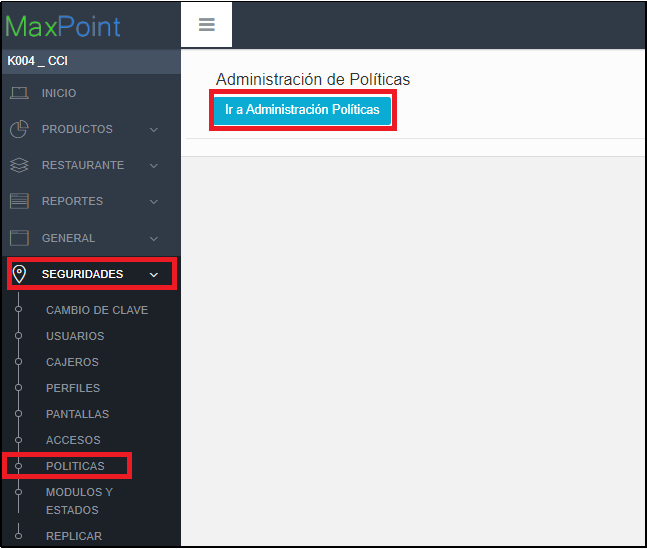

2. Al dar clic en la opción de  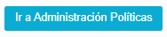 , se desplegará la siguiente pestaña

### 1.2 POLÍTICAS DE CADENA (Selección y Creación de Nueva Colección)
### 1.2.1 Creación de la Colección

1.Clic en el ícono “CADENA” y lyego en el boton de Nueva Colección. 

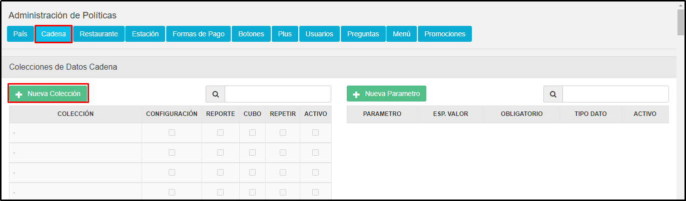

2. Al dar click en el boton de la Nueva Colección, se cargar el modal donde registraremos los datos de nuestra nueva collecion. 

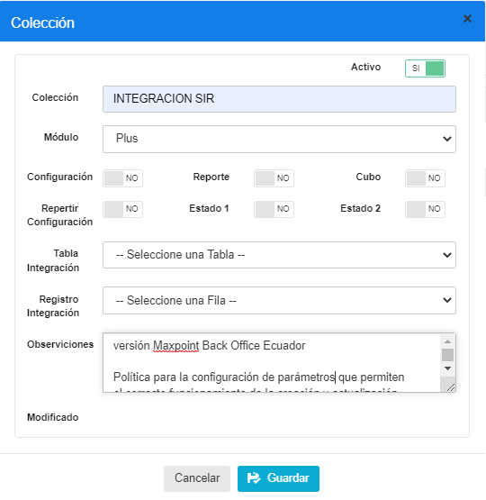

Creamos colección a nivel de cadena con los siguientes datos:

**Nombre de la colección:** INTEGRACION SIR

**Módulo:** Plus

**Observación:** versión Maxpoint Back Office Ecuador 

Politica para la configuración de parametros que permiten el correcto funcionamiento de la creación y actualización de productos. Actualizacion y creacion de los departamentos, clasificaciones y categorias.

3. En la tabla izquierda de Colecciones buscar la colección previamente creada “**INTEGRACION SIR**”  y la seleccionamos

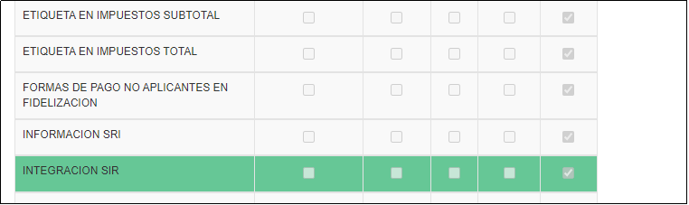

### 1.2.2. Creación de los Parámetros

A continuación, se debe crear los siguientes parámetro :  CLIENT ID, CREACION Y ACTUALIZACION PRODUCTOS, ENDPOINT CATEGORIAS, ENDPOINT LOCACIONES, ENDPOINT TOKEN, ENDPOINT DEPARTAMENTOS, PREFIJO PAIS, APLICA INTEGRACION  y URL BASE.
s
Al dar click sobre el icono   , se desplegará una pantalla emergente para crear el parámetro mencionado. Ahora se detallará las configuraciones de los nuevos parametros.

1. PARAMETRO: APLICA INTEGRACION

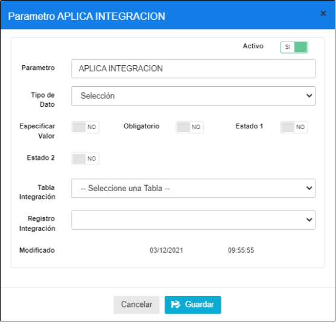

| **PARAMETRO**      | **TIPO DATO** | **ESP. VALOR** | **OBLIGATORIO** |
|--------------------|---------------|----------------|-----------------|
| APLICA INTEGRACION | Seleccion     | NO             | NO              |

2. PARAMETRO: PREFIJO PAIS

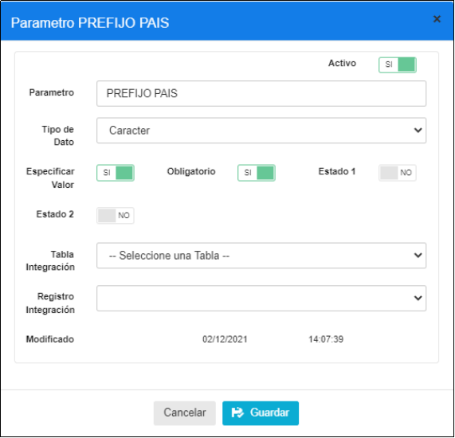

3. PARAMETRO: CLIENT ID

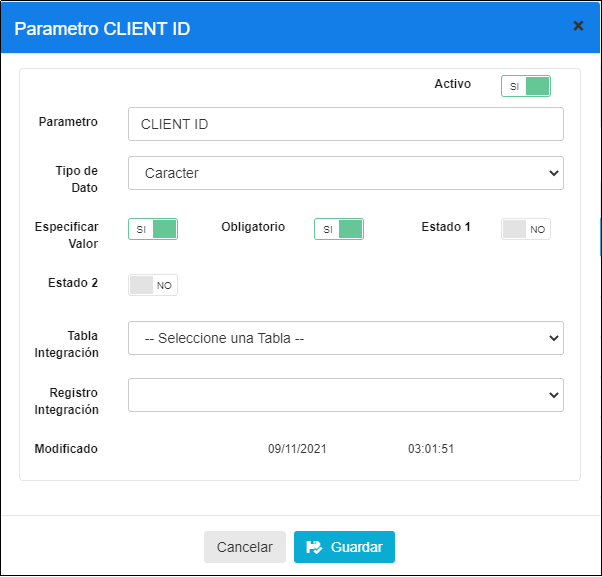

| **PARAMETRO** | **TIPO DATO** | **ESP. VALOR** | **OBLIGATORIO** |
|---------------|---------------|----------------|-----------------|
| CLIENT ID     | Caracter      | SI             | SI              |

4. PARAMETRO: CLIENT SECRET

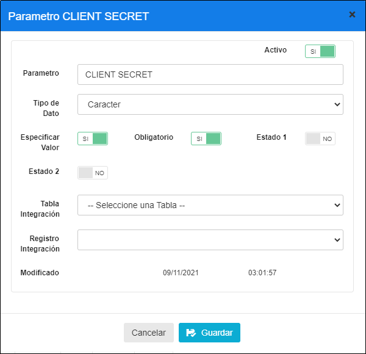

5. PARAMETRO: CREACION Y ACTUALIZACION PRODUCTOS

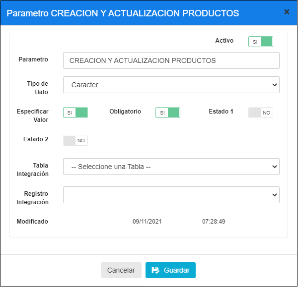

| **PARAMETRO**                      | **TIPO DATO** | **ESP. VALOR** | **OBLIGATORIO** |
|------------------------------------|---------------|----------------|-----------------|
| CREACION Y ACTUALIZACION PRODUCTOS | Caracter      | SI             | SI              |

6. PARAMETRO: ENDPOINT CATEGORIAS

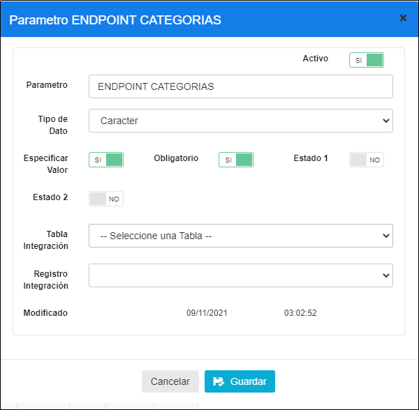

| **PARAMETRO**       | **TIPO DATO** | **ESP. VALOR** | **OBLIGATORIO** |
|---------------------|---------------|----------------|-----------------|
| ENDPOINT CATEGORIAS | Caracter      | SI             | SI              |

7. PARAMETRO: ENDPOINT LOCACIONES

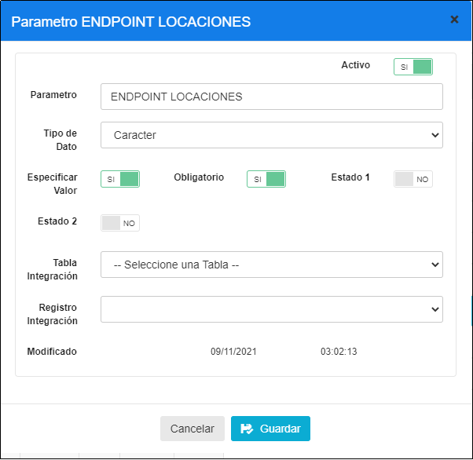

| **PARAMETRO**       | **TIPO DATO** | **ESP. VALOR** | **OBLIGATORIO** |
|---------------------|---------------|----------------|-----------------|
| ENDPOINT LOCACIONES | Caracter      | SI             | SI              |

8. PARAMETRO: ENDPOINT TOKEN

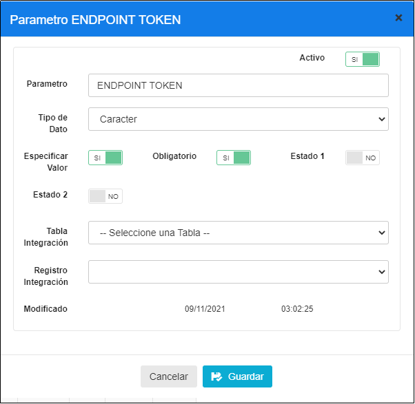

| **PARAMETRO**  | **TIPO DATO** | **ESP. VALOR** | **OBLIGATORIO** |
|----------------|---------------|----------------|-----------------|
| ENDPOINT TOKEN | Caracter      | SI             | SI              |

9. PARAMETRO: ENPOINT DEPARTAMENTOS

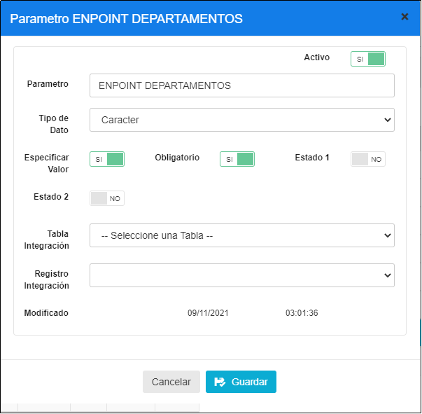

| **PARAMETRO**         | **TIPO DATO** | **ESP. VALOR** | **OBLIGATORIO** |
|-----------------------|---------------|----------------|-----------------|
| ENPOINT DEPARTAMENTOS | Caracter      | SI             | SI              |

10. PARAMETRO: URL BASE

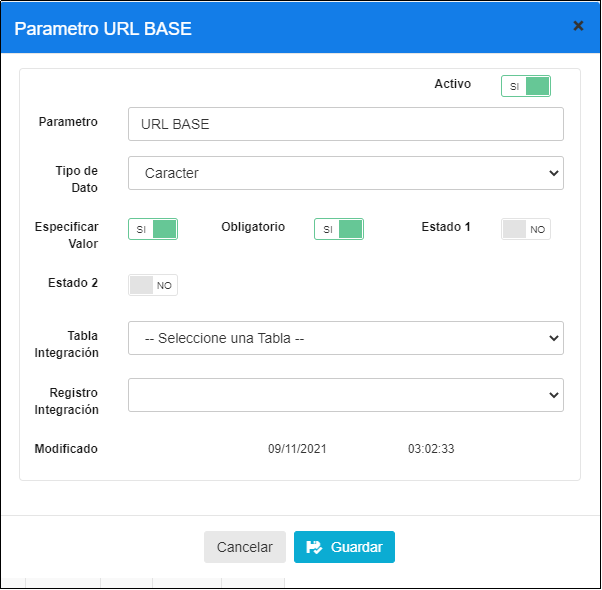

| **PARAMETRO** | **TIPO DATO** | **ESP. VALOR** | **OBLIGATORIO** |
|---------------|---------------|----------------|-----------------|
| URL BASE      | Caracter      | SI             | SI              |

### 2. ACTIVACIÓN DE POLÍTICAS

### 2.1 ACTIVACIÓN DE POLITICAS DE CONFIGURACION POR CADENA

1. Para configurar una política de cadena es necesario ingresar a la opción Cadena/Cadena, y en esta pantalla a la opción **Políticas de Configuración**.

Una vez ubicado en la pestaña Políticas de Configuración dar click en el botón “+” en la parte superior derecha de la tabla para añadir los parámetros, 

**IMPORTANTE:** repetir este proceso para la **COLECCIÓN** y sus **PARÁMETROS**

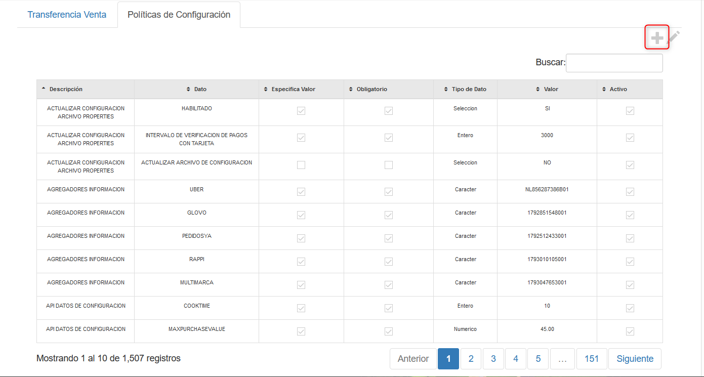

## 3.Elegir la Colección “**INTEGRACION SIR**”

### 3.1  Elegir el Parámetro “**APLICA  INTEGRACION**”

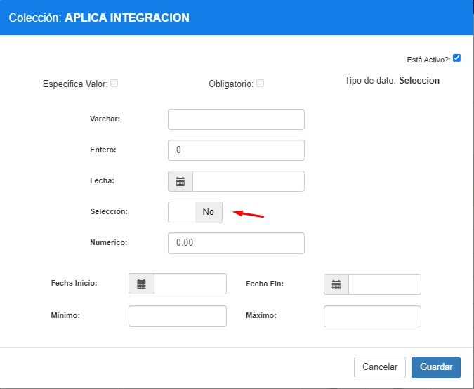
**NOTA: Este parámetro nos permite validar si se aplica la integración con SIR o el Sistema sigue funcionando solo con la data de MaxPoint.** 

| **PARAMETRO**      | **TIPO DATO** | **Seleccion** |
|--------------------|---------------|---------------|
| APLICA INTEGRACION | Seleccion     | NO            |

### 3.2  Elegir el Parámetro “PREFIJO PAIS”

**NOTA: Poner el prefijo del País al que se aplicara la integración Ejemplo: Ecuador => ECU, Colombia => COL, Chile => CHI, etc**

| **PARAMETRO** | **TIPO DATO** | **Varchar** |
|---------------|---------------|-------------|
| PREFIJO PAIS  | Caracter      | ECU         |

### 3.3 Elegir el Parámetro “**CLIENT ID**”

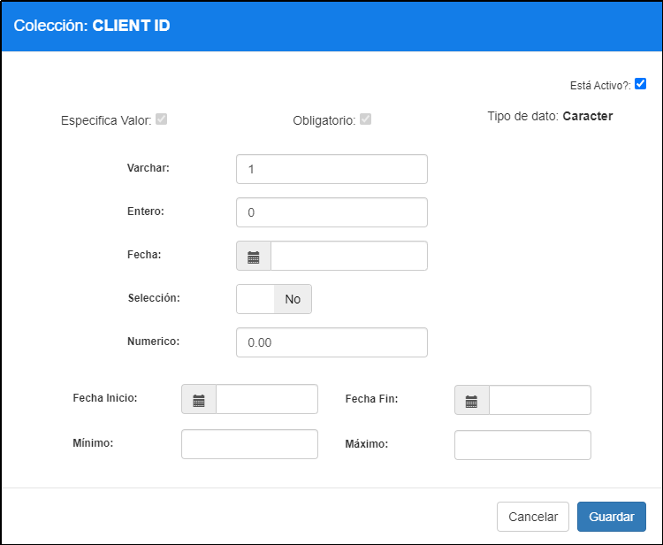

| **PARAMETRO** | **TIPO DATO** | **Varchar** |
|---------------|---------------|-------------|
| CLIENT ID     | Caracter      | 1           |

### 3.4 Elegir el Parámetro “CLIENT SECRET”

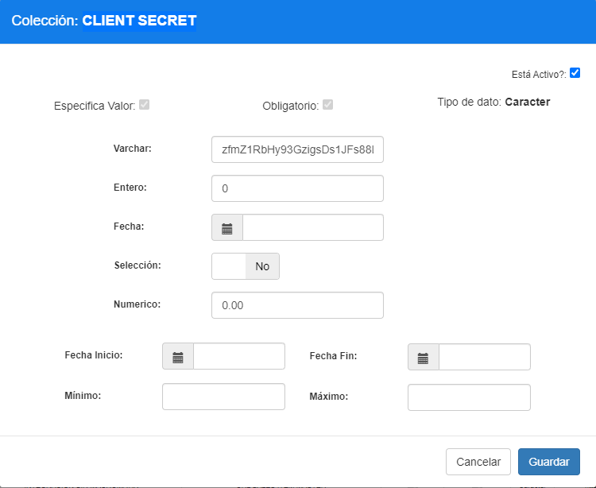

| **PARAMETRO** | **TIPO DATO** | **Varchar**                              |
|---------------|---------------|------------------------------------------|
| CLIENT SECRET | Caracter      | zfmZ1RbHy93GzigsDs1JFs88LhG0AEZZ9s8GhYra |

### 3.5  Elegir el Parámetro “URL BASE”

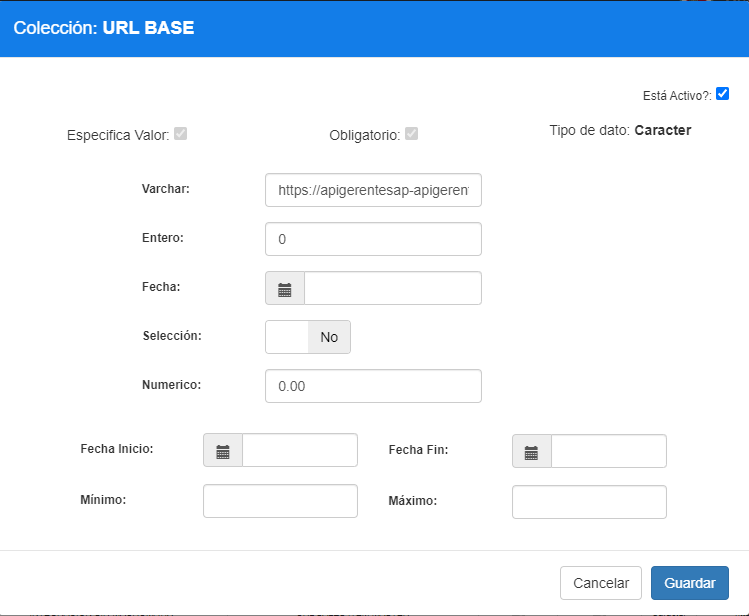

| **PARAMETRO** | **TIPO DATO** | **Varchar**                                               |
|---------------|---------------|-----------------------------------------------------------|
| URL BASE      | Caracter      | https://apigerentesap-apigerentesap-dev.azurewebsites.net |

### 3.6 Elegir el Parámetro “ENDPOINT TOKEN”

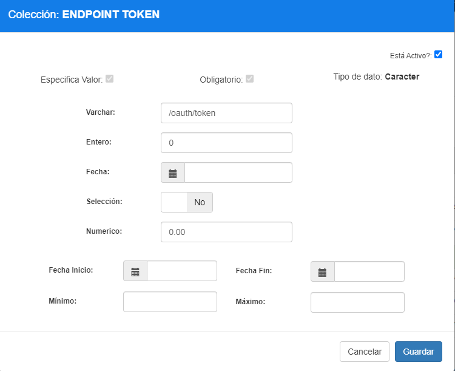

| **PARAMETRO**  | **TIPO DATO** | **Varchar**  |
|----------------|---------------|--------------|
| ENDPOINT TOKEN | Caracter      | /oauth/token |

### 3.7  Elegir el Parámetro “ENDPOINT LOCACIONES”

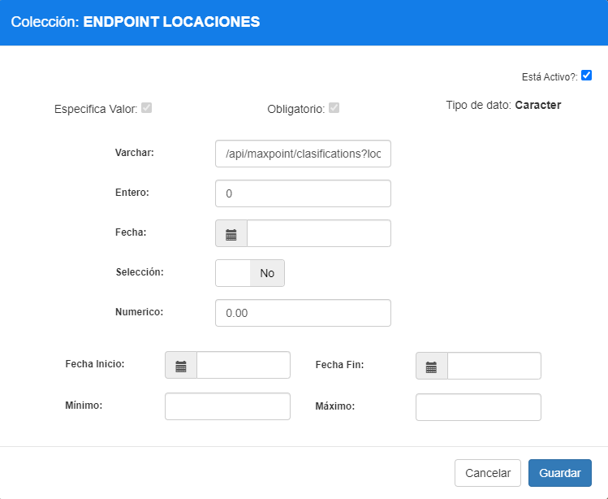

| **PARAMETRO**       | **TIPO DATO** | **Varchar**                            |
|---------------------|---------------|----------------------------------------|
| ENDPOINT LOCACIONES | Caracter      | /api/maxpoint/clasifications?location= |

### 3.8 Elegir el Parámetro “ENDPOINT DEPARTAMENTOS”

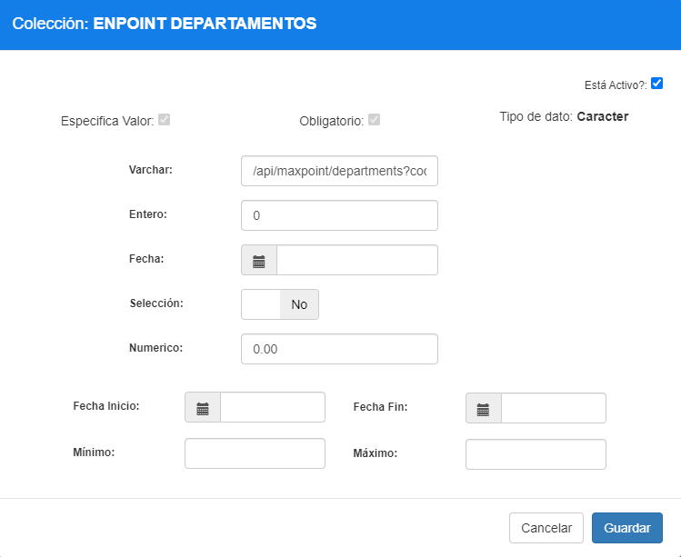

| **PARAMETRO**          | **TIPO DATO** | **Varchar**                           |
|------------------------|---------------|---------------------------------------|
| ENDPOINT DEPARTAMENTOS | Caracter      | /api/maxpoint/departments?cod_cadena= |

### 3.9 Elegir el Parámetro “ENDPOINT CATEGORIAS”

| **PARAMETRO**        | **TIPO DATO** | **Varchar**                          |
|----------------------|---------------|--------------------------------------|
| ENDPOINT CATEGGORIAS | Caracter      | /api/maxpoint/categories?cod_cadena= |

### 3.10 Elegir el Parámetro “CREACION Y ACTUALIZACION PRODUCTOS”

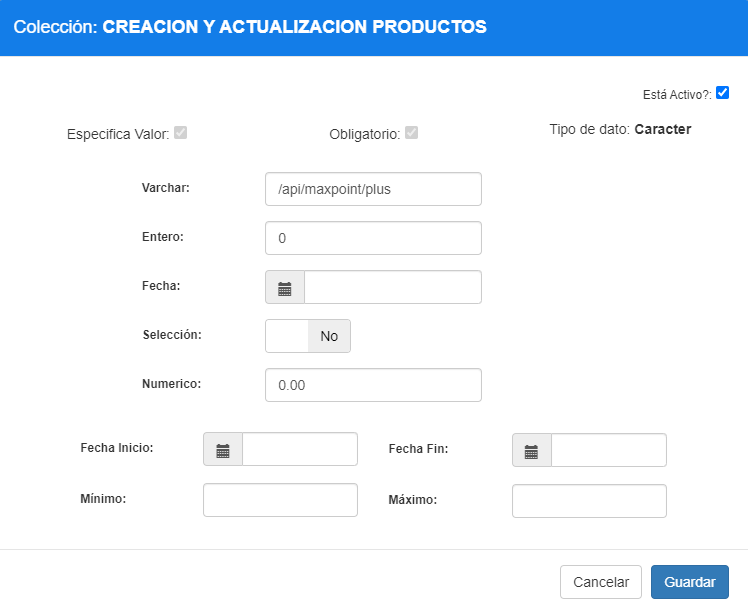

| **PARAMETRO**                      | **TIPO DATO** | **Varchar**        |
|------------------------------------|---------------|--------------------|
| CREACION Y ACTUALIZACION PRODUCTOS | Caracter      | /api/maxpoint/plus |

### 3.11 Elegir el Parámetro “**ID CADENA HOMOLOGA PRODUCTO**”

| **PARAMETRO**                | **TIPO DATO** | **Entero** |
|------------------------------|:-------------:|------------|
| ID CADENA HOMOLOGA PRODUCTOS | Entero        |            |

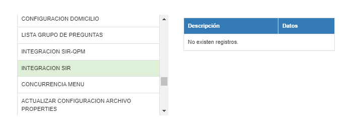

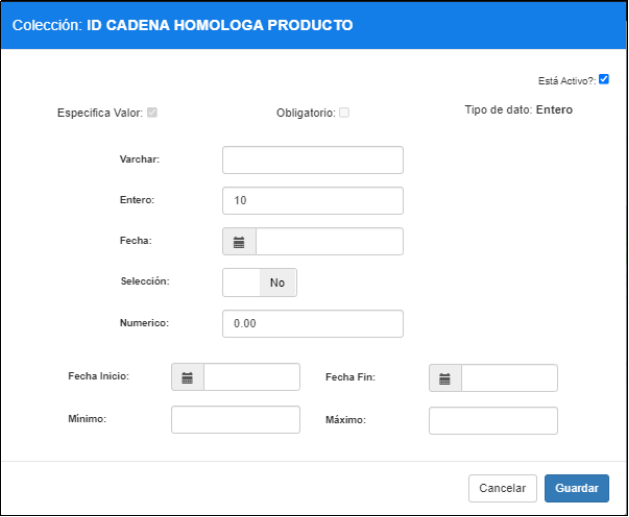

**OBSERVACIÓN: ESTE PARAMETRO ES OBLIGATORIO PARA LAS CADENAS QUE REALIZAN HOMOLOGACION DE PRODUCTOS HACIA UNA CADENA DESTINO.**