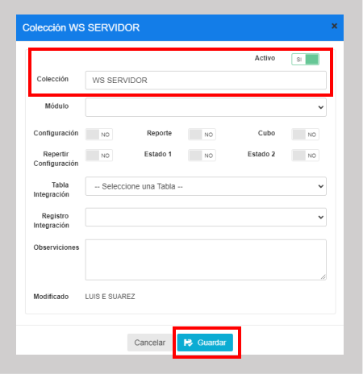
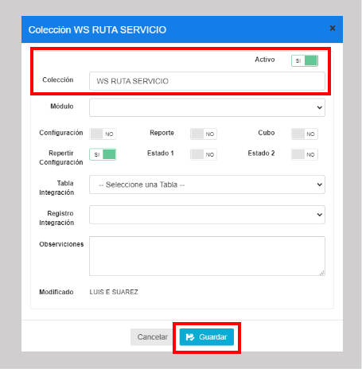
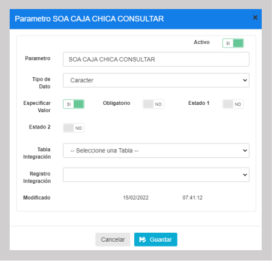
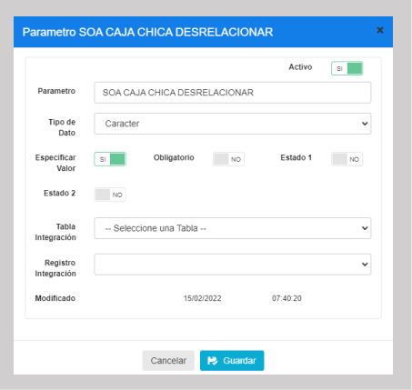
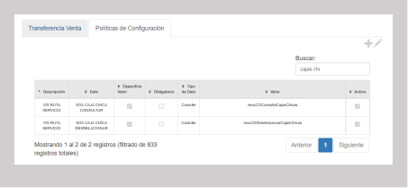

# Manual de politicas - desrelacionar cajas chicas

CONFIGURACIÓN POLÍTICA Des relacionar cajas chicas.

## 1 ANTECEDENTES

El sistema Back office de MaxPoint recibirá una nueva funcionalidad que le permitirá ejecutar el proceso de des relacionado de cajas chicas. Para este efecto, será necesario crear y configurar las políticas correspondientes en el sistema.

## 2 OBJETIVO GENERAL

Crear y configurar las políticas y parámetros para la integración con la funcionalidad

### 2.1 Objetivos específicos

-Crear las políticas y parámetros a nivel de Cadena
-Configurar los parámetros de las políticas creadas

## 3 POLÍTICAS DE CONFIGURACIÓN

### 3.1 Datos Generales

En este manual se detalla cómo crear las políticas y parámetros de estas a nivel de cadena, que permitirán integrarse con la funcionalidad.

### 3.2 Pantalla de Políticas

Ingresar al sistema MaxPoint BackOffice con credenciales de administrador sistemas.

En el menú que se encuentra en la parte izquierda no dirigimos a la opción **SEGURIDADES** y seleccionamos **POLÍTICAS**, seguidamente presionamos sobre el botón **Ir a Administración Políticas** en el cual abrirá una nueva pestaña en el navegador.

3.3 Cadena

3.3.1 Colección Cadena

Antes de crear las políticas de configuración; como primer paso se debe verificar si las políticas WS SERVIDOR y WS RUTA SERVICIO ya se encuentran creadas. De ser el caso validar que cada colección contenga los parámetros establecidos en este manual.

Si alguna de las políticas NO existe, se debe crearla así:

    **Política WS SERVIDOR:**

En la opción **Cadena** presionar sobre el botón **Nueva Colección**, se abrirá una modal para su creación ingresando los siguientes datos:

Tabla 1. Colección de Datos Cadena

| N° | Colección   | Observaciones |
|----|-------------|---------------|
| 1  | WS SERVIDOR |               |

**Nota:** NO puede contener espacios en blanco al inicio y final del nombre de la colección; 
debe ser escrita tal y como se especifica en la tabla 1.

Colección: Nombre de la colección que se especifica en la tabla 1.

**Módulo:** No aplica.

**Observaciones:** No aplica.

Una vez que se haya ingresado y seleccionado la información establecida procedemos a 

**Guardar.**

**Política WS RUTA SERVICIO:**

En la opción **Cadena** presionar sobre el botón **Nueva Colección**, se abrirá una modal para su creación ingresando los siguientes datos:

Tabla 2. Colección de Datos Cadena

| N° | Colección        | Observaciones |
|----|------------------|---------------|
| 1  | WS RUTA SERVIDOR |               |

Nota: NO puede contener espacios en blanco al inicio y final del nombre de la colección; debe ser escrita tal y como se especifica en la tabla 2.

**Colección:** Nombre de la colección que se especifica en la tabla 2.

**Módulo:** No aplica.

**Observaciones:** No aplica.

Una vez que se haya ingresado y seleccionado la información establecida procedemos a

**Guardar.**

### 3.3.2 Parámetro de Colección 

Antes de agregar los parámetros de configuración mostrados en la tabla 3, se debe verificar si ya encuentren creados. De ser el caso validar que cada parámetro contenga los valores establecidos en este manual.

Si alguno de los parámetros NO existe dentro de la *Colección* especificada en la Tabla 3,
 se debe crearla así:

Seleccionamos la colección y presionamos sobre el botón **Nuevo Parámetro** en la cual se abrirá una venta para su creación y para cada Parametro ingresamos los siguientes datos:

Tabla 3. Datos Parámetros de Colección de Datos Cadena

| **N°** | **Colección**    | **Parámetro**                | **Tipo Dato** | **Esp. Valo** | **Obligatorio** | **Estado 1** | **Estado 2** |
|--------|------------------|------------------------------|---------------|---------------|-----------------|--------------|--------------|
| 1      | WS SERVIDOR      | SOA PRODUCCION               | Caracter      | SI            | SI              | SI           | SI           |
| 2      | WS RUTA SERVICIO | SOA CAJA CHICA CONSULTAR     | Caracter      | SI            | NO              | NO           | NO           |
| 3      | WS RUTA SERVICIO | SOA CAJA CHICA DESRELACIONAR | Caracter      | SI            | NO              | NO           | NO           |

Nota: NO puede contener espacios en blanco al inicio y final del parámetro; deben ser escritos tal y como se especifica en la tabla 3.

**Parámetro:** Nombre del parámetro que se especifica en la tabla 3.

**Tipo de Dato:** Se especifica en la tabla 3.

**Especificar Valor:** Se especifica en la tabla 3.

**Obligatorio:** Se especifica en la tabla 3.

**Estado 1:** Se especifica en la tabla 3.

**Estado 2:** Se especifica en la tabla 3.

Una vez que se haya ingresado y seleccionado la información establecida procedemos a **Guardar.**

Se deben crear todos los parámetros de configuración establecidos en la tabla 3. Se presentan los modales de configuración de cada parámetro a continuación:

### 3.3.3 Cadena Colección de Datos

En el menú principal del BackOffice de MaxpOint, nos dirigimos a **Cadena** y seleccionamos la opción **CADENA**, seguidamente seleccionamos la pestaña **Políticas de configuración.**

Para la configuración se debe presionar sobre el botón agregar “+”; el cual abrirá una ventana, seguidamente buscaremos la colección creada y agregamos el valor en los parametros solicitados. 

Para cada uno de los parametros ‘SOA PRODUCCION’, ‘SOA CAJA CHICA CONSULTAR’, y ‘SOA CAJA CHICA DESRELACIONAR’ crearlos y llenar sus valores como se muestra en la tabla a continuación:

Tabla 4. Parámetros de la colección

| N° | Dato                         | Valor                            |
|----|------------------------------|----------------------------------|
| 1  | SOA PRODUCCION               | maxpointservices.kfc.com.ec:8080 |
| 2  | SOA CAJA CHICA CONSULTAR     | /ecu/22/ConsultaCajasChicas      |
| 3  | SOA CAJA CHICA DESRELACIONAR | /ecu/22/DesrelacionarCajasChicas |

Si se ha realizado correctamente, se debe mostrar así:

### 3.3.4 Puntos a considerar

1. Cada uno de los parámetros deben configurarse (escribirse) exactamente como está en este manual, respetando mayúsculas y minúsculas.