# manualPoliticas ControlCajas SIR-MAXPOINT (1)

Creación de parametro PARA CUADRE DE CAJA SIR-MAXPOINT

- Paso 1

En el apartado de políticas damos clic en el botón “Restaurante” seguidamente clic en “Nueva Colección”.

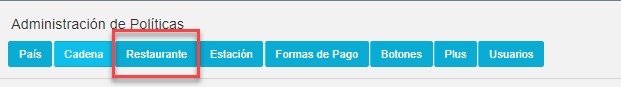

Nueva Colección:

- Paso 2 

Llenar los datos solicitados en la pantalla emergente de la siguiente manera: **Activo**: Si
**Colección**: CONTROL CAJAS SIR, **Módulo**: Apertura, **Configuración**: No, **Reporte:** No, **Cubo**: No, **Repetir Configuración**: No, **Estado 1**: No, **Estado 2**: No, **Tabla Integración**: no seleccionar ninguna opción, **Registro Integración**: No seleccionar ninguna opción, Observaciones: sin **observaciones**. Una vez lleno dar clic en botón “**GUARDAR**”.

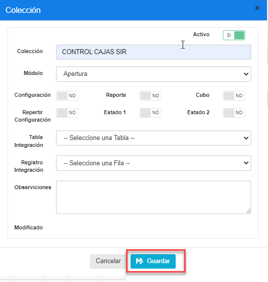

- Paso 3

Buscar en la lista de colecciones la colección creada “CONTROL CAJAS SIR” y seleccionarla.

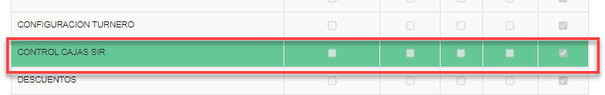

-Paso 4

Una vez seleccionada la colección en el apartado izquierdo dar clic en el botón “Nueva Parámetro” del apartado derecho

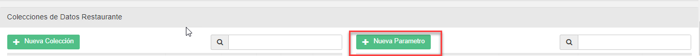

- Paso 5

Llenar los datos solicitados en la pantalla emergente de la siguiente manera: **Activo**: Si
**Parámetro**: APLICA?, **Tipo de Dato**: Selección, **Especificar Valor:** Si, **Obligatorio**: Si, Estado 1: No, Estado 2: No, **Tabla Integración**: no seleccionar ninguna opción, **Registro Integración:** No seleccionar ninguna opción. Una vez lleno el formulario dar clic en botón “**Guardar** ”.

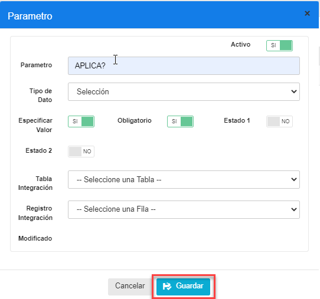

- Paso 6

Verificar que se haya creado correctamente la política.

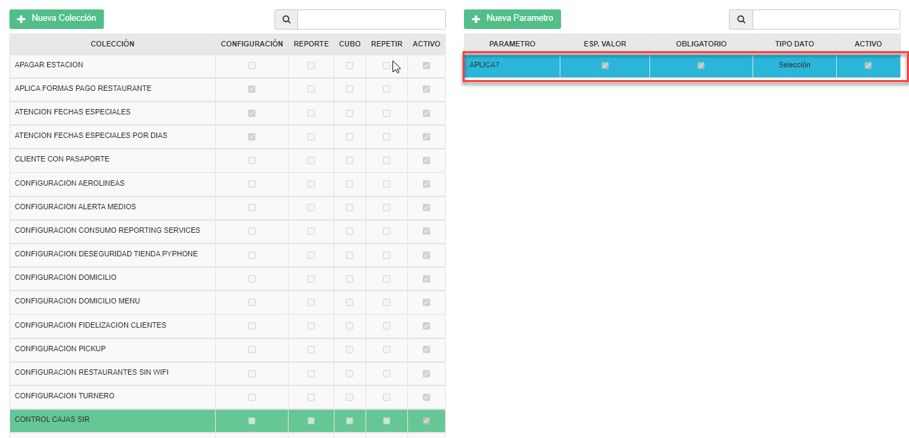

- Paso 7

Ir al backoffice de maxpoint, en el menú seleccionar la opción “RESTAURANTE” y en el submenú la opción Restaurante

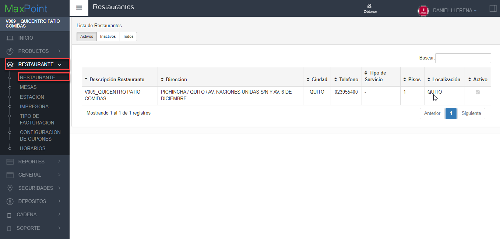

- Paso 8

Dar doble clic en el restaurante seleccionado de la lista con esto se conseguirá  ver la pantalla de opciones y seleccionar la pestaña “Politicas de Configuración”.

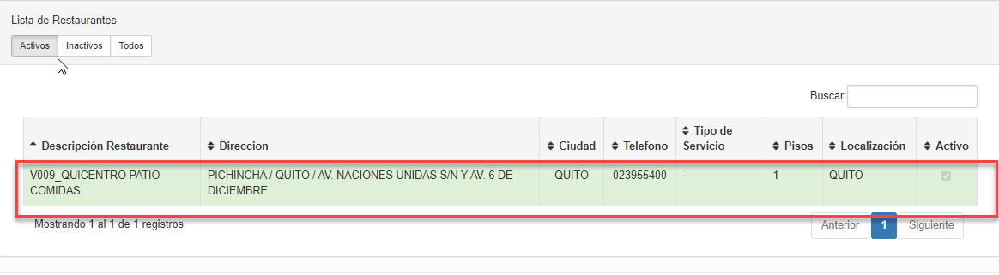

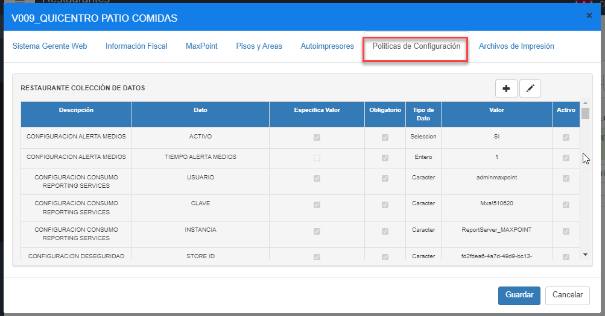

- Paso 9

Damos clic en el botón “Agregar Politica” (+).

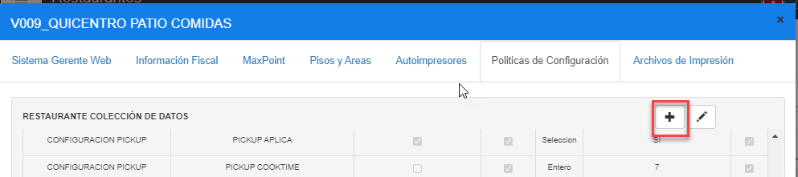

- Paso 10

Buscar la política creada “CONTROL CAJAS SIR” la seleccionamos, seguidamente en el apartado Datos seleccionar el registro “APLICA?” y clic en el botón “Guardar”.

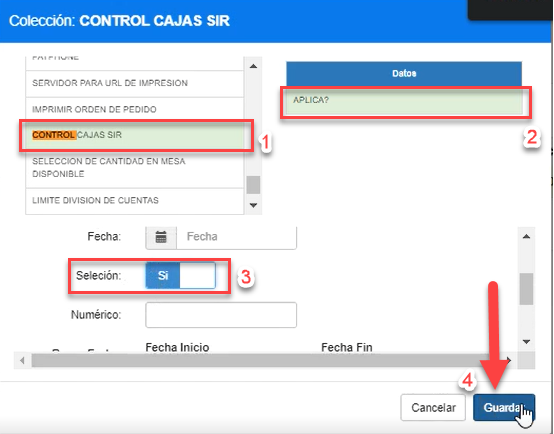

 Con esto la política ha sido activada para un determinado restaurante.