# MANUAL FULL SERVICE 27-07-2017

CONFIGURACIÓN FULL SERVICE

# 1 BACK OFFICE

### 1.1 CONFIGURAR RESTAURANTE A FULL SERVICE

EL proceso de configuración de full service es para aquellos restaurantes que brindan servicio a la mesa. 
Para establecer la configuración full service a un restaurante, tenemos que ingresar al Back Office y en el 
menú restaurante ingresamos al Sub-Menú Restaurante

Al dar doble clic sobre el restaurante a configurar se desplegara una ventana modal y en la pestaña **Sistema Gerente Web**seleccionamos en la lista desplegable **Tipo de Servicio** a **Full Service**, para 
finalizar el proceso damos clic en guardar

### 1.1.1 Crear política de refrescar estado de mesa
Esta política de refrescado de mesa se la crea en políticas por restaurante y se debe de crear una nueva colección solo con el nombre “**REFRESCAR ESTADO DE MESA**”.

Como parámetros de esta política debemos crear dos los cuales son “**HABILITADO**” y “**TIEMPO** **ESPERA**”

### 1.1.2 Activar política de refrescar estado de mesa
Esta opción busca cambios en los estados de las mesas cada cierto tiempo. Para activar este proceso nos dirigimos al **BackOffice** y dentro del Menú Restaurante seleccionamos la opción 
**RESTAURANTE**

Posterior a este paso seleccionamos el restaurante de FULL SERVICE al cual queramos 
activarle la opción de refrescado automático y le damos doble clic para activar la opción desde 
la pestaña de políticas de configuración.

Le damos clic al icono 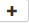 para agregar una nueva política y seleccionaremos de la tabla a la 
derecha la opción REFRESCAR ESTADO DE MESA y llenaremos las opciones HABILITADO y 
TIEMPO DE ESPERA.

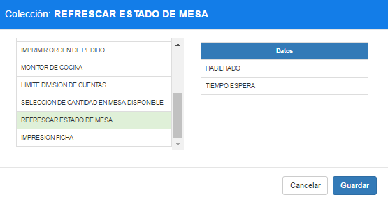

**Habilitado.**- Esto activara el proceso. Para activarlo se habilita la opción Selección en **Si**

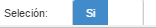

**Tiempo de espera.**- EL tiempo que esperara el sistema de inactividad de un usuario para refrescar el estado de las mesas. Para configurarlo llenamos el campo entero con el tiempo en milisegundos 5000 = 5 Sg

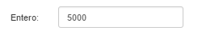

### 1.1.3 Crear política limite en división
Esta política de refrescado de mesa se la crea en políticas por restaurante y se debe de crear una nueva colección solo con el nombre “**LIMITE DIVISION DE CUENTAS**”.

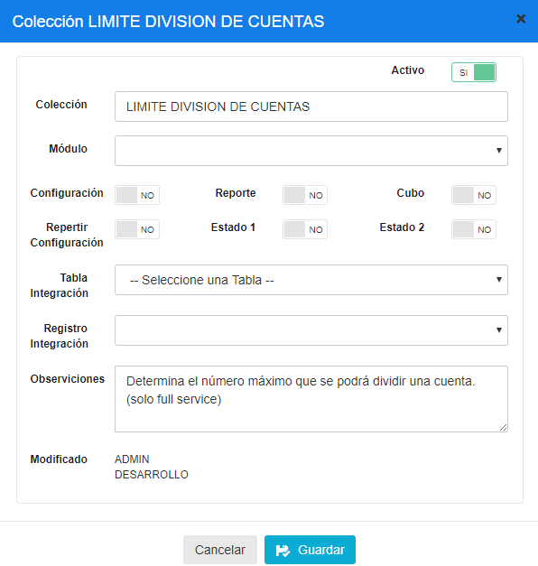

Como parámetros de esta política debemos crear un parámetro que se denominara “**RANGO**”

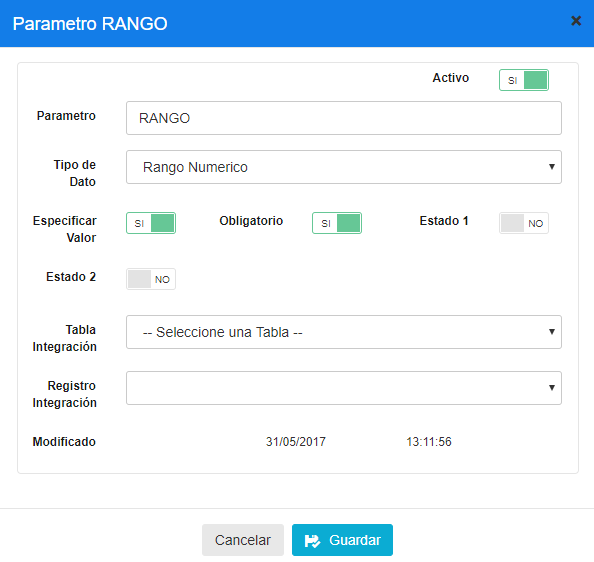

### 1.1.4 Configurar política limite en división de cuentas

La división de cuentas es el cálculo sobre un pedido para que se dividan equitativamente los valores a pagar para la cantidad de personas que especifiquen los usuarios. 

La cantidad de personas mínimas y máxima está determinada por una colección la cual se
llama **LÍMITE DIVISION DE CUENTAS** la cual la configuramos entrando al **BackOffice** y dentro del Menú Restaurante seleccionamos la opción **RESTAURANTE**

Posterior a este paso seleccionamos el restaurante de FULL SERVICE al cual queramos 
activarle la opción de refrescado automático y le damos doble clic para activar la opción desde la pestaña de políticas de configuración.

Le damos clic al icono  para agregar una nueva política y seleccionaremos de la tabla a la 
derecha la opción **LIMITE DIVISION DE CUENTAS** y llenaremos las opciones MINIMO Y 
MAXIMO

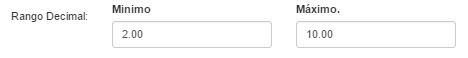
Guardamos y quedara configurada los limites para dividir cuentas.

### 1.1.5 Crear politica para activar/desactivar cantidad de personas al seleccionar mesa 
dentro del panel.

Esta política de refrescado de mesa se la crea en políticas por restaurante y se debe de crear una nueva colección solo con el nombre “**SELECCION DE CANTIDAD EN MESA DISPONIBLE**

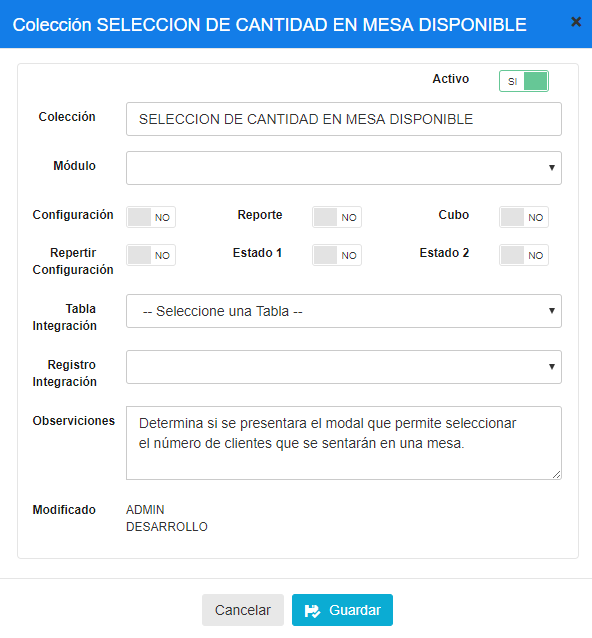

Como parámetro de esta política debemos crear “HABILITADO”

### 1.1.6 Mostrar cantidad de personas al seleccionar mesa dentro del panel.
Al seleccionar una mesa dentro del panel el sistema pregunta en una ventana modal cuantas 
personas se sentaran en la mesa.

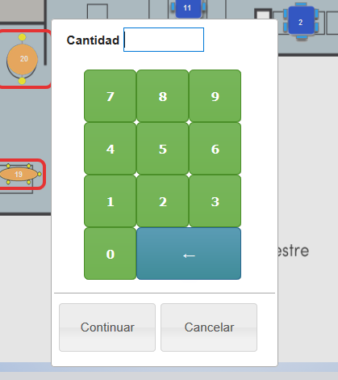

Esta ventana modal se puede configurar para que no aparezca al seleccionar una mesa, para 
ello debemos activar una política de configuración.

Debemos entrar al **BackOffice** y dentro del Menú Restaurante seleccionamos la opción 
**RESTAURANTE**

Posterior a este paso seleccionamos el restaurante de FULL SERVICE al cual queramos 
activarle la opción de refrescado automático y le damos doble clic para activar la opción desde la pestaña de políticas de configuración.

Le damos clic al icono  para agregar una nueva política y seleccionaremos de la tabla a la derecha la opción **SELECCION DE CANTIDAD EN MESA DISPONIBLE** y habilitamos la lista desplegable Selección con la opción ***Si**

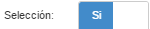

Guardamos y si dejamos establecido **SI** como la opción cada vez que se dé clic sobre una mesa el sistema preguntara cuantas personas se sentaran en la mesa y en caso de que se coloque No, no se mostrara la ventana modal que realiza la pregunta y proseguirá directamente a la toma de pedido estableciendo por defecto a 1 persona.

### 1.1.7 Crear política que permita guardar Mesas por defecto a estaciones
Esta política de refrescado de mesa se la crea en políticas por **Estación** y se debe de crear una nueva colección solo con el nombre “**CONFIGURACION DE MESA FAST FOOD 
PREDETERMINADA**”.

Como parámetro de esta política debemos crear “**MESA PREDETERMINADA**”

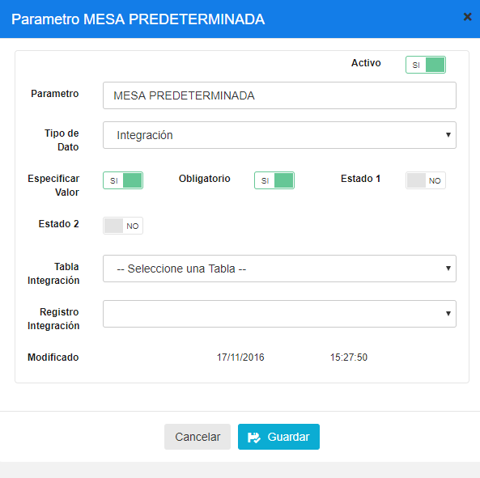

### 1.1.8 Mesas por defecto a estaciones
Las estaciones en restaurantes con Full Service (FS) deben de tener configurado una mesa por defecto. Esta configuración se realiza en el Back Office dentro del **Menú Restaurante** en la opción **Estación**

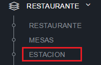

Seleccionamos el restaurante en el que vamos a configurar la estación y se nos despliega la lista de las que actualmente están configuradas.

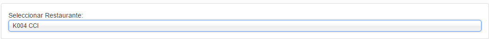

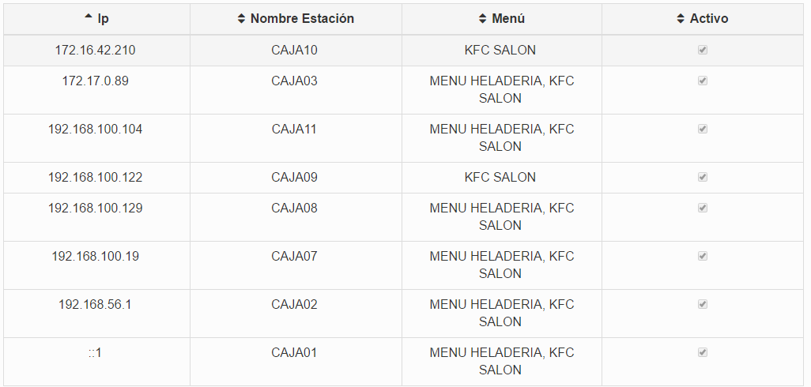

En la parte superior derecha está el botón Nuevo  con el que se desplegará la ventana modal para configurar la estación donde en la lista desplegable Seleccione mesa, elegiremos la que será configurada como por defecto en la estación.

### 1.1.9 Crear política de Configuración para una estación para toma de pedido.
Esta política de refrescado de mesa se la crea en políticas por **Estación** y se debe de crear una nueva colección solo con el nombre “**ESTACION TOMA PEDIDO**”.

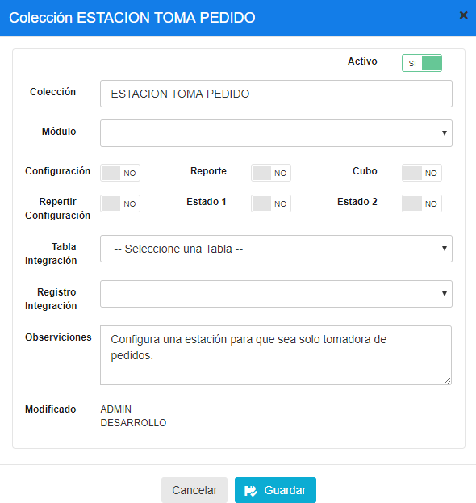

Como parámetro de esta política debemos crear “HABILITADO”

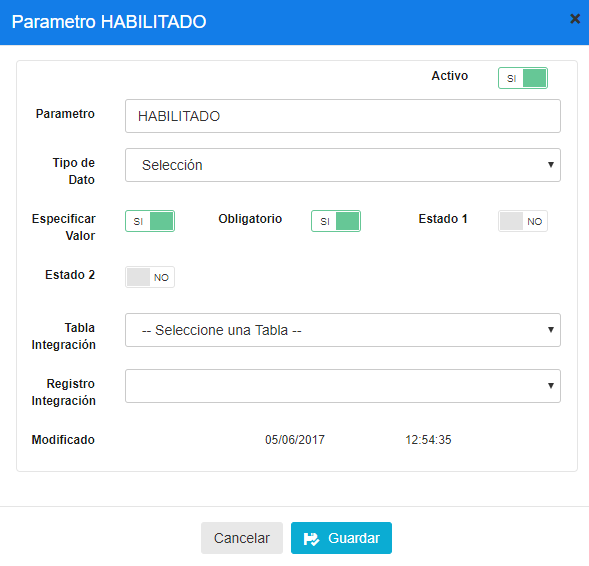

### 1.1.10 Configuración de una estación para toma de pedido.
Una estación configurada para solamente tomar pedido es útil para los meseros de los 
restaurantes full service. Esta configuración se realizara para que los meseros no tengan la necesidad de asignarse a una estación, donde les bastara ingresar solo su clave y podrán acceder al panel de mesas a tomar pedidos. 

Para realizar esta configuración, nos dirigimos al **BackOffice** y dentro del Submenú 
Restaurante seleccionamos la opción **ESTACION**

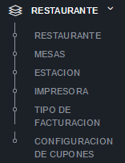

En la parte derecha se nos desplegara una tabla con el listado de todas las estaciones que están configuradas para el restaurante que seleccionemos de la lista desplegable. 
Identificamos la estación que queremos configurar para toma de pedidos y le damos doble clic y seleccionamos la pestaña **Políticas de configuración**.

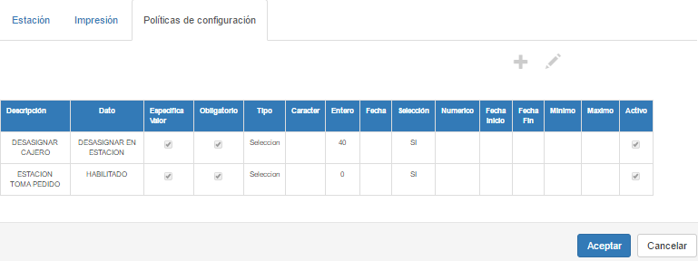

Luego damos clic en el icono de agregar una nueva política  y seleccionamos de la tabla 
derecha la opción ESTACION TOMA PEDIDO el cual cargara en la tabla derecha la opción 
HABILITADO

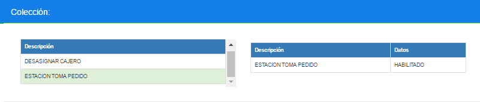
Al seleccionar la opción HABILITADO activaremos en la parte de abajo la opción **Selección** dejándola en Si y finalmente guardamos.

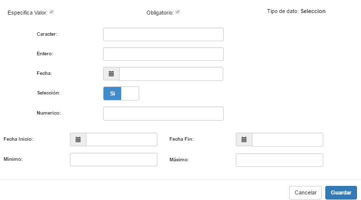
Con esto la estación quedara configurada para toma de pedidos

### 1.2 CONFIGURACIÓN PISOS Y AREAS

La configuración de los pisos y areas en restaurantes FS es importante para poder configurar las mesas que serviran para la toma de pedidos del local. Para acceder nos ubicamos en el menú Restaurante y en la opción Restaurante seleccionamos con doble clic al que vamos a configurar el piso y/o area.

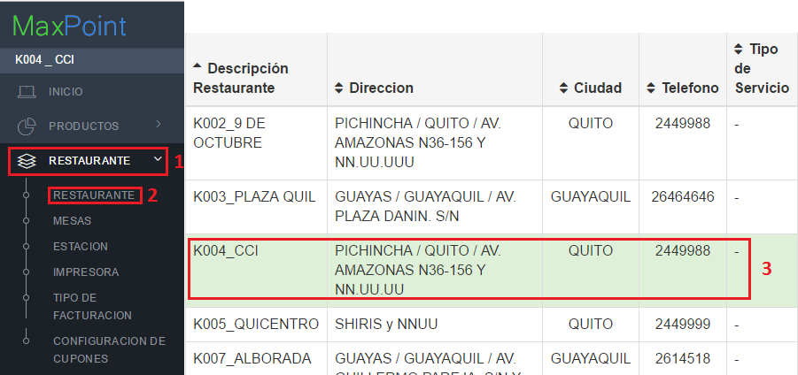

Se desplegará una ventana modal en la que nos ubicaremos dentro de la pestaña pisos y 
áreas.

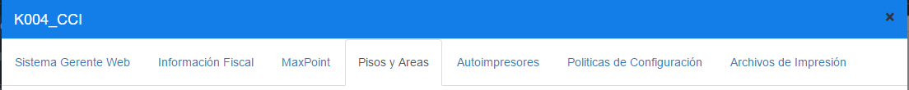
Dentro de ella se podrán realizar las configuraciones útiles para el local con FS.

### 1.2.1 Agregar Piso

Dentro de la pestaña Pisos y áreas mencionadas anteriormente, encontramos la opción de 
**Agregar Piso** 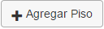 En donde se agregara un piso en la parte posterior.

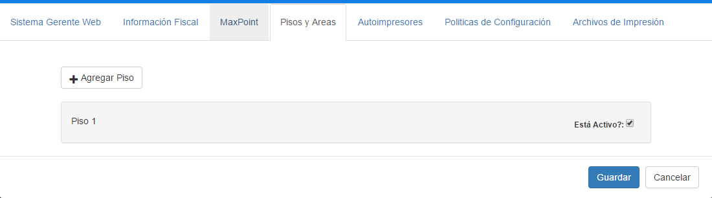

### 1.2.1.1 Agregar Área

Entendiéndose que un piso puede tener varias áreas. Las áreas se configuran y agregan a partir de la previa creación de un piso. Para ellos partimos de la pantalla de creación de pisos explicada en el punto anterior en el cual daremos un clic en el piso al cual vamos a agregar un 
área.

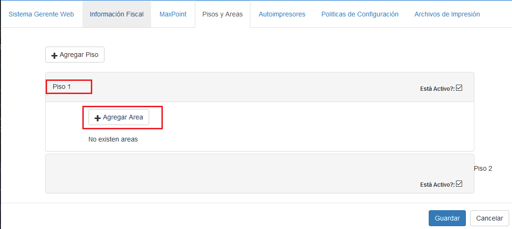

Al dar clic en agregar área esta se creara automáticamente, en donde para configurarla 
debemos de agregarle un nombre e imagen al área, para el nombre bastara con darle clic 
sobre la etiqueta que aparecerá por defecto **Empty** Donde se mostrara un pequeño modal 
para ingresar una descripción al área.

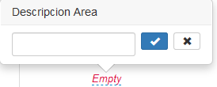

La imagen la agregamos dando clic en el botón **Imagen** el cual nos solicitara seleccionar una imagen desde el escritorio de nuestra pc.

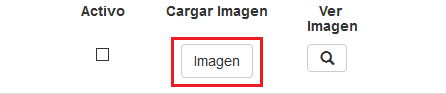

Con esto quedará configurado un piso y el área para un restaurante Full Service en el cual se podrán configurar las mesas posteriormente

### 1.3 MESAS
Las mesas con las que consta actualmente MAXPOINT para Full Service son Cuadradas, 
Circulares y Ovaladas entre ellas hay de 2, 4, 5, 6 personas respectivamente. Estas mesas son las que se visualizaran dentro de un área configurada posteriormente, las cuales servirán para captar la toma de pedidos por parte de los cajeros, meseros y administradores. Para acceder a esta pantalla debemos ingresar al Back Office y en el menú Restaurante seleccionamos la opción **Mesas**.

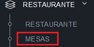

Dentro de esta pantalla seleccionamos el restaurante seguido el piso y el área para que en la parte posterior cargue las pestañas de Ubicación e listado de las mesas.
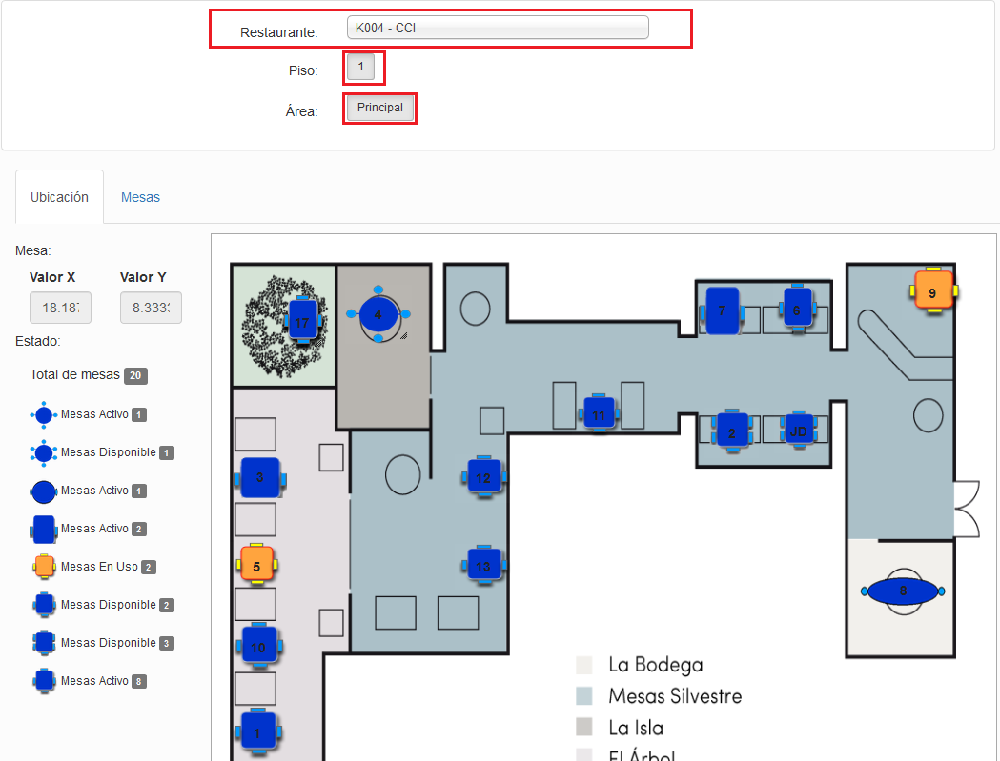

### 1.3.1 Posiciones X, Y

Las posiciones “X” y “Y” indican la posición en la que se guardan las mesas dentro del plano del área de un piso de un restaurante. Este apartado es simplemente informativo.
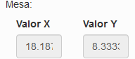

### 1.3.2 Estados

Los estados dentro de la pantalla de Mesas indican cuantas y en qué estado se encuentran las mesas configuradas dentro del área.
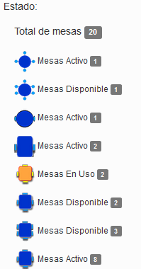

### 1.3.3 Plano

En esta sección se visualizan las mesas para que sean reacomodadas en el lugar que se crea conveniente, donde bastara con mover la mesa con un clic sostenido del mouse.

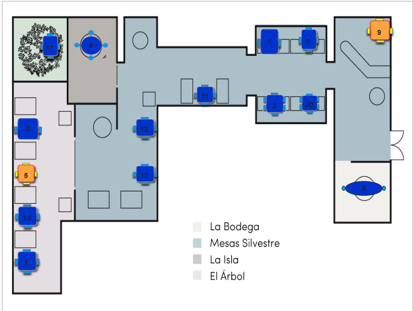

### 1.3.4 Agregar mesa

Para agregar una mesa al plano, nos dirigimos a la parte superior derecha en el botón Nuevo  EL cual desplegara una ventana modal para que el usuario coloque la descripción de la 
mesa (recomendable un número) y seleccione el tipo de mesa. Finalizando con un clic en el 
botón **Aceptar**

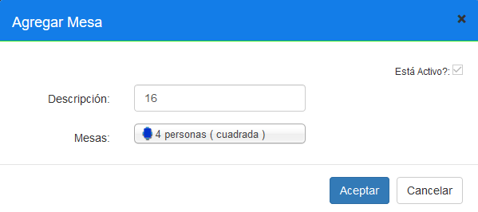

### 1.3.5 Modificar Mesa

Para modificar una mesa tenemos que ubicar en el plano la mesa a actualizar y/o desactivar y le damos un clic derecho el cual presentara un menú contextual que al dar clic presentara el modal el cual servirá para modificar los datos de la mesa o inactivarla.

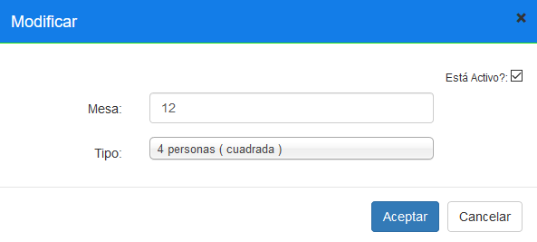
Importante: Solo se puede modificar una mesa cuando este en estado disponible, es decir que ningún cajero este usando la mesa para un pedido en ese momento.

### 1.4 CONFIGURACIÓN DE PERFILES

La configuración de los perfiles es útil para controlar que botones estarán disponibles para las personas que ingresen al panel de mesas según su perfil (cajero, mesero, administrador). Para ello debemos configurar pantallas y los accesos que tendrán los usuarios sobre las mismas.

### 1.4.1 PERFILES

Para el acceso a esta pantalla debemos estar en el Back Office dentro del menú SEGURIDADES en la sección de **PERFILES**

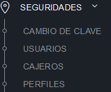

Eso mostrara en la parte derecha el listado de los perfiles con su nivel de acceso.

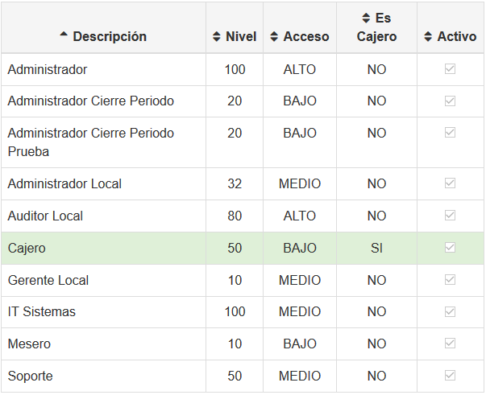

### 1.4.1.1 Niveles de acceso

Los niveles de acceso que se usan dentro del proceso de Full Service son. Mesero, Cajero y Administrador, estos poseen un nivel de acceso respectivamente:

- Mesero: Nivel de acceso = 10
- Cajero: Nivel de acceso = 50
- Administrador: Nivel de acceso = 100

### 1.4.1.2 Pantallas disponibles

Las pantallas disponibles para un perfil determinado se pueden observar al dar doble clic sobre un perfil el cual abrirá una ventana modal con dicha información, donde se puede realizar los cambios respectivos.

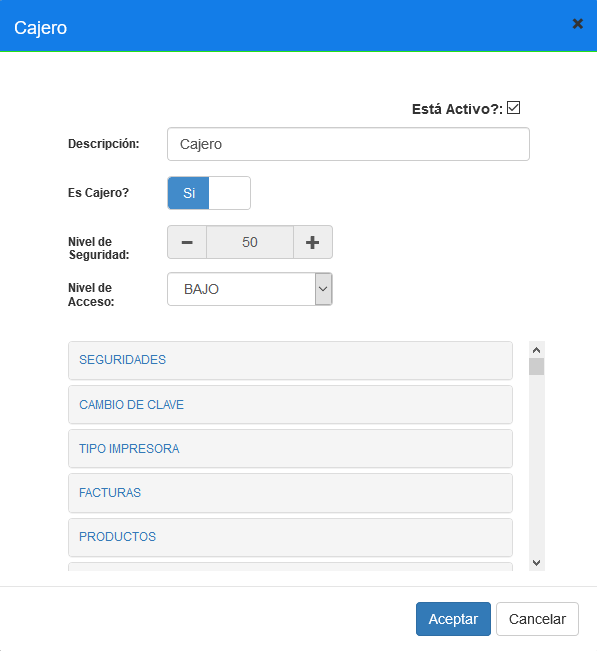

Hay que tener en cuenta que el listado de pantallas que aparecen en esta sección dependerá de lo siguiente:

Tomando en cuenta el nivel que tenga el perfil por ejemplo 50 de un cajero, en esta lista 
aparecerán las pantallas que tengan agregado un acceso con igual o mayor nivel.

### 1.4.2 ACCESOS

Los accesos son restricciones que tendrán los perfiles de los usuarios en las pantallas a las que acceda, en otras palabras serán los botones que contiene una pantalla. En caso de que una pantalla tenga el botón pero dicha pantalla no tenga agregada el acceso con el nombre del botón, significara que en esa pantalla no se constara con ese permiso de usar el botón.

**Importante:** Los accesos se los crea con un nivel de alcance, por ejemplo si un cajero que tiene un nivel de 50 queremos agregarle un acceso, el acceso deberá ser creado con un nivel menor o igual a 50

### 1.4.2.1 Listado de accesos

Para acceder al listado de accesos tenemos que estar dentro del back office, esta opción se ubica dentro del menú **SEGURIDADES** en la opción **ACCESOS**

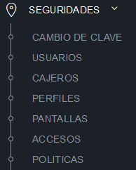

Lo cual nos mostrara el listado de accesos creados con información como el nivel.

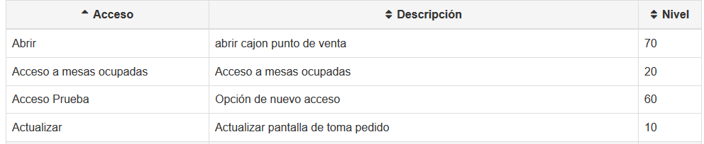

### 1.4.2.2 Insertar nuevo acceso

Para el registro de un nuevo acceso damos clic en el botón Nuevo ubicado en la parte 
superior derecha, esto nos desplegara una ventana modal el cual permitirá registrar los datos del nuevo acceso incluido el nivel.

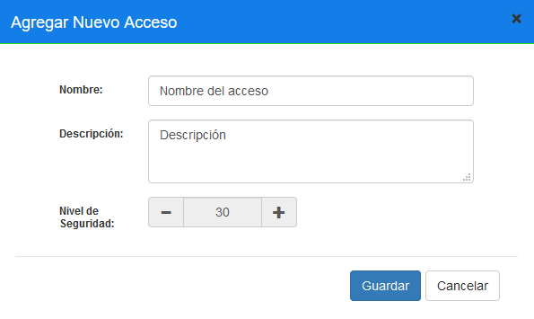

**Importante**: Cuando se cree un acceso, en el campo descripción hay que tener en cuenta que esa descripción será el nombre que se usara en una etiqueta en la programación, es decir la etiqueta descripción será el mismo nombre del botón en el HTML. Ejemplo:

Tomando en cuenta la imagen anterior donde se especifica en la descripción el texto 
Descripción, al programar la etiqueta button deberá tener el atributo **name=”Descripción**”

### 1.4.3 PANTALLAS
Las pantallas que se configuran para Full Service, son usadas para la validación de perfiles, dentro de estas pantallas se agregaran los accesos (botones) que tendrán disponibles.

### 1.4.3.1 Listado de pantallas

Para acceder al listado de accesos tenemos que estar dentro del back office, esta opción se ubica dentro del menú **SEGURIDADES** en la opción **PANTALLAS**.

Al dar clic se mostrará en la parte derecha el listado de pantallas.
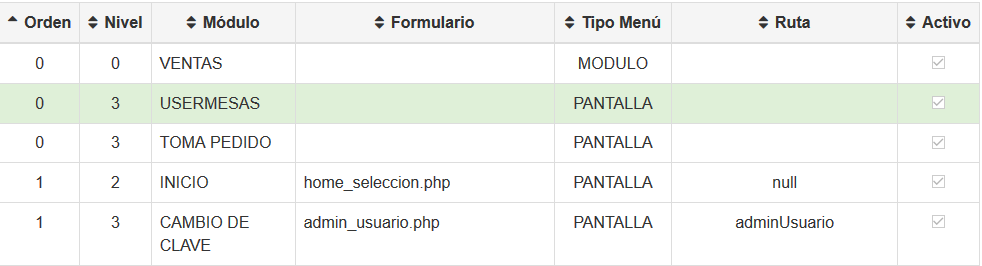

### 1.4.3.2 Accesos de la pantalla

Las pantallas que son utilizadas y deberán ser configuradas para el proceso de Full Service son:

USER MESAS, TOMA PEDIDO, SEPARAR CUENTAS y FACTURAS. Dentro de cada una se debe de 
incluir una lista de accesos para que los usuarios según su perfil puedan hacer uso de cada una de las opciones.

Para incluir un acceso dentro de alguna pantalla se debe de ingresar al Back Office y dentro del menú seguridades ingresamos a la opción **PANTALLAS**

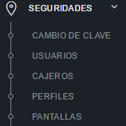

Esto desplegara un listado de las pantallas que consta actualmente el sistema, en el cual para añadir un acceso sobre la misma, damos doble clic sobre alguna y se desplegara un modal, en la cual dentro de la pestaña Accesos Pantalla seleccionamos los accesos y guardamos.

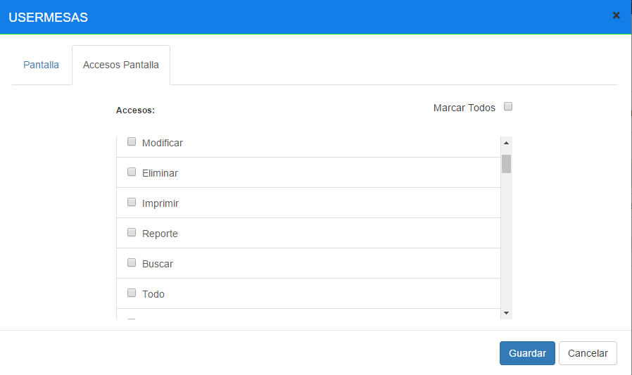

Dentro de la pantalla **USER MESAS** se deben de crear o marcar los siguientes tal cual como están escritos:

- Informacion total de mesas
- Informacion por mesa
- Pedido rápido
- Funciones Gerente

Dentro de la pantalla **TOMA PEDIDO** los siguientes:

- Eliminar
- Buscar
- Cantidad
- Funciones Gerente
- Cobrar
- Salir
- Separar cuentas
- Dividir por personas
- Salir mesas
- Comentar
- Imprimir Orden Pedido
- Imprimir Pre-Cuenta
- Resumen Ventas
- Guardar Cuenta
- Actualizar
- Transacciones
- Cupones
- Panel producto
- Panel categoría

Dentro de la pantalla SEPARAR CUENTA:

- Cobrar
- Imprimir Pre-Cuenta
- Panel de mesas
- Agregar Cuenta
- Dividir productos
- Imprimir todas las Pre-Cuenta
- Recuperar Cuenta
- Mover plus entre splits

## 2 FRONT END

### 2.1 Pantalla Principal
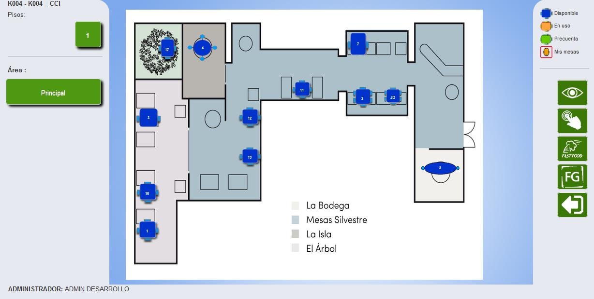
En la pantalla principal se presenta el mapa de ubicación de las mesas respecto a la 
configuración realizada en el backoffice anteriormente.

### 2.2 Nombre del restaurante

El nombre del restaurante se encuentra en la parte superior izquierda y nos detalla el código 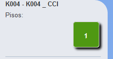 del restaurante y su nombre como se presenta en la siguiente 
figura.

###  2.3 Pisos

El piso determina la ubicación del restaurante con respecto a su 
infraestructura y puedo existir uno o varios pisos se pueden 
identificar con el nombre que generalmente es un número 
entero. 

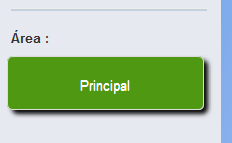 
### 2.4 Área

 El área es la sección que pertenece a un piso predeterminado, 
pueden existir una o más áreas de acuerdo a la configuración del 
piso.

### 2.5 Perfil

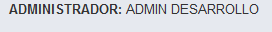  Se visualiza el perfil de la persona en la parte 
inferior izquierda de la pantalla donde se 
define el nombre del perfil y el nombre del usuario.

### 2.6 Plano y Mesas

El plano se visualizara si existe una mesa predeterminada en el piso y área por defecto esto se 
realiza en la configuración de estación en la pantalla de mantenimiento (backoffice). La 
pantalla de planos se presente en el siguiente escenario.

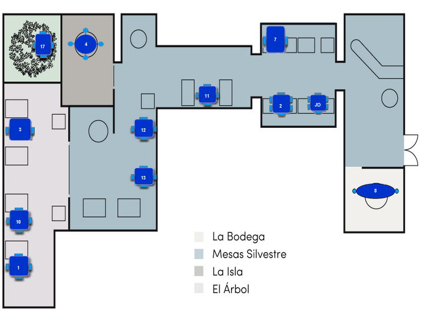

###  2.7 Panel de estados de las mesas

El panel de estados se muestra las mesas con los posibles estados 
que pueden tener, dependientes de la acción efectuada.

Disponible: Es el estado de las mesas que se encuentran listas 
para ser atendidas.

En Uso: Es el estado de las mesas que se encuentran atendidas 
por un mesero al tomar el pedido.

Precuenta: Es el estado de la mesa donde el mesero o cajero 
imprimió la precuenta del cliente.

Mis mesas: Es el estado de la mesa que indica las mesas atendidas por un mismo usuario.

### 2.8 Panel de funciones de las mesas

El panel de funciones se caracteriza por las diferentes acciones que pueden ejercer cada mesa.

### 2.8.1 Vista de transacciones

Posee el estado normal y el estado informativo

 Estado normal: Al presionar este botón ejecuta la acción para listar todas las mesas del área seleccionada o predeterminada en la pantalla.
 Estado informativo: Al presionar este botón regresa a la pantalla de planos y mesas

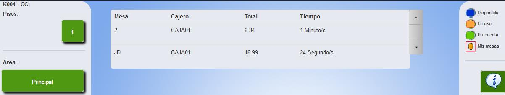

El listado de mesas que se encuentran en uso en la cual se define la mesa, el cajero que 
atendió, el total de la orden y el tiempo transcurrido desde que se tomó el pedido hasta el momento actual.

### 2.8.1.1 Grilla de productos

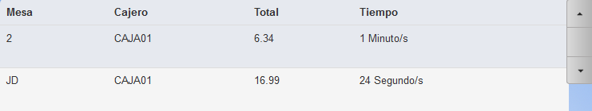

Al seleccionar un producto de una mesa 2 se desplegara un modal como se muestra en la 
siguiente imagen:

En el modal se indica la siguiente información: cantidad, descripción, precio, el nombre de la mesa.

 Existen dos botones cancelar y retomar

Cancelar: Cierra el modal.

Retomar: Retoma la orden guardada y direcciona a la 
pantalla orden pedido o separar cuenta.

### 2.8.2 Vista de mesas

Posee el estado normal y estado informativo

 Normal: Al presionar este botón cambia de estado a informativo y se despliega una leyenda en la parte inferior derecha que dice “Seleccione una mesa”.

 Informativo: Al presiona el estado informativo la mesa desactiva la posibilidad de desplegar el visualizador de mesa.

 A continuación buscar la mesa de su 
interés y seleccionar para presenciar los 
valores de la mesa regularmente se utiliza 
esta opción para visualizar las cuentas de las mesas que se encuentran divididas o separadas.

### 2.8.2.1 Visualizador de mesa

El modal que se despliega tiene los datos informativos de la mesa imagen, número de clientes, la capacidad de la mesa, estado, información de transacciones y el número de cuentas con todos sus totales

 Cancelar: Cierra el modal.

Retomar: Retoma la orden guardada y direcciona a la 
pantalla orden pedido o separar cuenta.

### 2.8.3 Venta Fast Food

Son consideradas ventas para llevar.

 El botón Fast Food permite realizar ventas rápidas, y direcciona a la pantalla de toma pedido. Cuando se cierra la transacción el botón queda con color verde.

 El botón cambia de color cuando existe un pedido con orden pendiente, este 
impide desmontar el cajero si existe el caso. Se debe facturar la orden o 
eliminar los productos pendientes para regresar al botón verde.

### 2.8.4 Funciones Gerente

 El botón de funciones gerentes direcciona a la pantalla de su mismo nombre.

### 2.8.6
 El botón salir dirige a la pantalla de inicio. Se utiliza para salir de la pantalla de planos y mesas

### 2.9 Selección de mesa

 Para realizar una venta full services se debe elegir cualquier mesa del plano que se encuentre 
disponible e ingresar el número de personas que van estar 
en la mesa, esto ayudará a guardar al registrar el numero en 
división de cuentas cabe mencionar que la cantidad de 
personas en una mesa se puede configurar en la colección 
de restaurante.
Al momento de presionar continuar ingresaremos a la 
pantalla de toma pedido para realizar la operación 
dependiendo el perfil del usuario.

### 2.10 Toma pedido

La pantalla toma pedido agregar nuevas funcionalidades en el menú de órdenes, cada botón 
tiene ciertas propiedades que se van a realizar en el menú.

### 2.10.1 Menú 

Presionar el botón menú se despliega un listado de opciones la primera a identificar es la siguiente:

 Separar cuentas: La separación de cuentas sirve para mover 
diferentes Plus cuando el cliente pide facturar a 2 o más 
personas una orden.

 Dividir cuenta: Permite dividir un listado de productos en 
partes iguales. Por ejemplo dividir una orden para cuatro 
personas; esta orden se dividirá en cuatro cuentas iguales 
con una cantidad de producto de 0,25 para ser facturado.

 Precuenta: imprime pre cuenta y cambia el estado de la mesa 
a precuenta

 Imprimir orden: imprime la orden que actualmente se 
encuentra en la pantalla toma pedido.

 Guardar: La orden se guarda y se imprime por los canales de impresión 
configurados para después ser direccionada a la pantalla de planos y mesas.

### 2.11 Pantalla de separación cuentas división de cuentas

 La pantalla de separar cuentas tiene un menú dinámico que permite 
realizar varias tareas como mover plus, imprimir precuenta, cobrar 
cuenta, agregar una nueva cuenta, dividir productos, recuperar 
cuenta.
Cada una de acuerdo a la necesidad de cada cliente.

 Panel de mesa: Es la acción en la cual regresaremos a la pantalla de 
planos y mesas

 Agrega cuenta: Agrega una nueva cuenta en la pantalla de planos y 
mesas sirve para guardar los Plus que se desean facturar por separado 
como se demuestra a continuación.

### 2.11.1 Mover Plus

Existen dos formas de mover los plus de una cuenta a otra la primera se denomina drag and 
drog (arrastrar y soltar) y la otra es de selección

 
  ### 2.11.1.1 Arrastrar y soltar

Los plus pueden cambiar de una cuenta a otra se debe 
seleccionar el plu de origen y arrastrar a la cuenta 
destino como se muestra en la imagen.

Esta opción permite arrastrar a n cuentas creadas, n 
cantidad de veces el plu seleccionado.

### 2.11.1.2 Selección

Selección permite mover el plu seleccionando 
simplemente señalando el plu de la cuenta origen y 
tocando la cuenta destino (donde se desea mover).
Esta opción permite arrastrar n cuentas creadas, n 
cantidad de veces el plu seleccionado.

 Dividir productos: Esta acción se realiza al seleccionar un producto de las 
cuenta y se puede dividir para la cantidad de cuentas señaladas.
En el siguiente ejemplo se vamos a dividir un plu 1 SUNDAE JR MORA KP de 
$0.99 para 3 cuentas diferentes.

- Presionar el botón dividir los productos 
- Buscar plu que se desea dividir y seleccionarlo. Al realizar el paso anterior el plu se 
mantendrá seleccionado y el contenedor se remarcara de color rojo.
- Una vez realizado el paso anterior se debe seleccionar los contenedores a los que se 
desean dividir el producto señalado.
- Por último presiona el botón rojo con la leyenda finalizar división.

  Presionar Finalizar división y se realiza la operación el producto se fracciona para 3 cuentas como se ve en el siguiente ejemplo el plu SUNDAE JR MORA 
KP se divide para 0.333 y se va facturar la cantidad señalada.

 Cancelar dividir: Esta acción elimina los productos señalados por el 
botón dividir productos y se realiza antes de finalizar división para 
quitar las cuentas que se encuentran enmarcadas.

 Imprimir todas: Es la acción de imprimir todas las precuentas a 
continuación se muestra un mensaje de impresión dependiendo de

 

  Recuperar cuenta: Este botón redirecciona a la pantalla orden 
pedido.

  Cobrar: El botón cobrar direcciona a la pantalla de facturación

 Pre cuenta: Imprime la precuenta selecionada

### 2.12 Pantalla división de cuentas

La división de cuentas es la acción de dividir equitativamente un listado de plus para un 
número de personas determinado.

 Presionamos el botón dividir cuenta y se activa una 
calculadora que pregunta el número de personas a la que se 
va dividir la cuenta.

 La calculadora tiene como objetivo dividir 
equitativamente la cuenta para el número de personas 
ingresado como se presenta en la figurada mencionada.

Una vez ingresada la cantidad válida dentro del rango 
configurado, presionamos el botón ok.

Para ser direccionado a la pantalla separar cuenta y 
visualizar los cambios realizados

 Restablecer cuenta sirve para agrupar en una sola cuenta los plu 
divididos, regresando al estado normal.
La validación para restablecer cuenta es la clave del administrador.

Presionamos ok, y se restable la cuenta.
