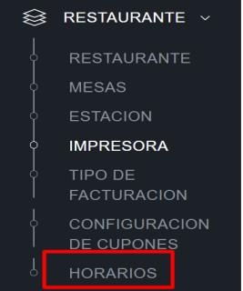
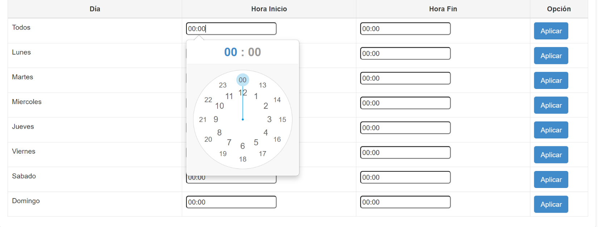
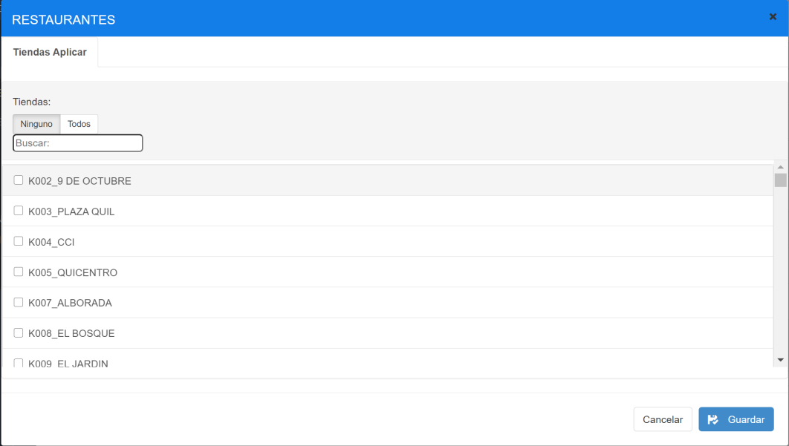
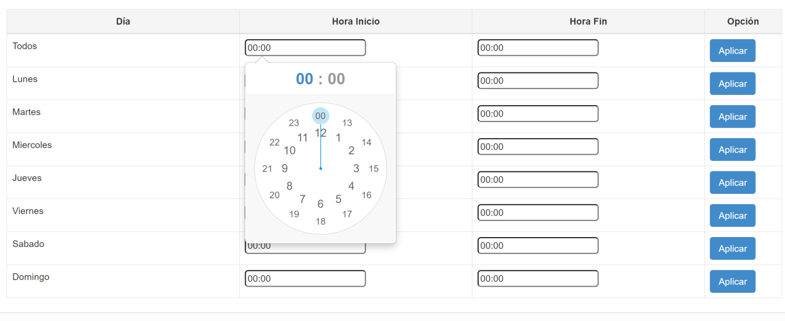
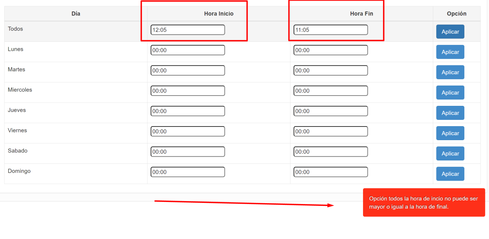
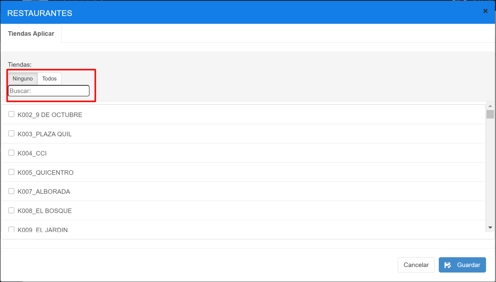
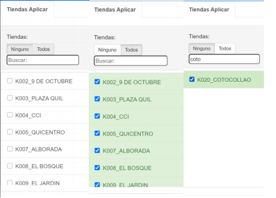
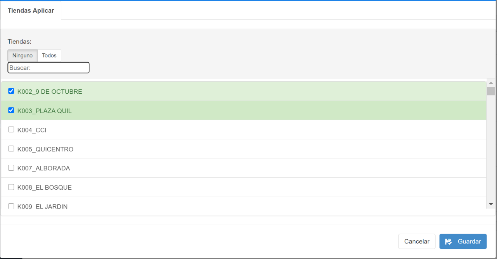
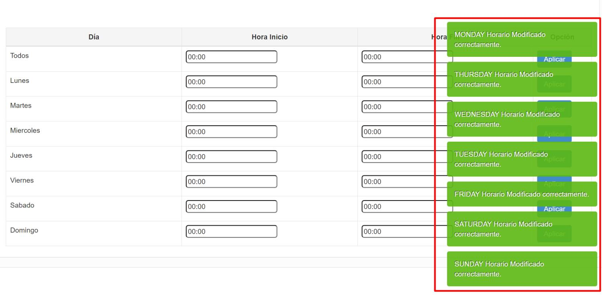

# Manual Uso Pantalla Horario

MANUAL DE USO PANTALLA HORARIOS

### 1 ANTECEDENTES

Actualmente ya existe la opción para actualizar los horarios de los restaurantes uno a uno en MAXPOINT POS18,seleccionando cada restaurante y modificándolo. Ahora se requiere una pantalla llamada HORARIOS que permita modificarlos según los restaurantes, que se requieran seleccionándolos mediante una pantalla que muestre la lista de los restaurantes en los que se quiere aplicar el cambio de horario, en caso de ser necesario sin necesidad de hacerlo restaurante por restaurante.

### 2 OBJETIVOS

- Modificar horarios de los restaurantes que se requieran desde una sola pantalla.

### 3 Datos Generales

En este manual se detalla cómo se maneja la nueva pantalla HORARIOS dentro de MAXPOINT POS18, selección de HORA INICIO, HORA FINAL y seleccionar las tiendas en las que se deben modificar los horarios según se lo requiera.

• La hora de inicio debe ser menor a la hora final.

• Al seleccionar los restaurantes a modificar los horarios y guardar los cambios se mostrará una notificación de que los cambios fueron guardados con éxito en los días estipulados, si no se guardaron los cambios mostrara un mensaje de error indicándolo.

### 4 Inició de Sesión

Ingresar al sistema de administración MaxPoint con sus respectivas credenciales, y seleccionar RESTAURANTES y dentro la opción HORARIO.

### 5 RESTAURANTES – HORARIOS

Al seleccionar HORARIOS se mostrará una pantalla general con los días y opciones para elegir la hora deseada en los
horarios a modificar.

Pantalla -HORARIOS

Para el uso de la pantalla se debe seguir los siguientes pasos y tener en consideración lo siguiente:

- Los horarios se modificarán según las horas que seleccione el usuario.
- Los días en los q se modifique el horario serán seleccionados por el usuario.
- Al dar clic sobre la caja de texto en al que se ingresaran hora final e inicial se desplegará un reloj en formato de 24 horas en el que se podrán seleccionar los tiempos que se requieran una vez seleccionados, se da clic en el botón APLICAR y se abrirá una ventana que mostrará una lista de los RESTAURANTES en lo que se puede cambiar el HORARIO, seleccionamos los RESTAURANTES necesarios y se da clic en el botón GUARDAR.

- Al dar clic en aplicar si la hora inicial es mayor a la final se mostrará un mensaje de error y se deberá corregir los valores para poder ir a la siguiente página.

### 6 Ejemplo

HORARIOS
Seleccionar HORARIOS.
Al seleccionar HORARIOS se mostrará una ventana con los días y demás opciones como hora inicio, hora final, el botón aplicar.

La opción todos aplicará la hora de inicio y fin en todos los días de la semana sin necesidad de hacerlo uno a uno.**Ingreso de HORAS.**

Al dar clic sobre la caja de texto en al que se muestran los 00:00 se desplegará un relos en formato 24 horas en el que podemos elegir las horas q necesitemos.

Una vez que se leccione la hora de inicio y de fin se dará clic en el botón APLICAR, la hora d einicio siempre debe ser menor a la hora final de lo contrario se mostrará un mensaje de error.

Una vez que se verifique que las horas estén como corresponden, se da clic en el botón APLICAR y se nos mostrará una pantalla con la lista de restaurantes en los que se puede aplicar el cambio d ehorario y solo debemos buscar el que necesitemos y selecionarlo.

Dentro de la pantalla de selecion de los restaurantes tenemos tres opciones marcar todos los restaurantes, marcar ninguno y una opción de busqueda par poder encontrar más rápido los restaurantes que necesitemos.

Al haber seleccionado los restaurante, damos clic en guardar y se nos mostrará la notificación de los días en lso que se cambió el horario coreectamente.

De querer hacerlo con los días por individual el procso es el mismo.