# Manual_ReduccionBaseDatosTiendasMaxpoint_v2021

Reducción de Base de Datos 
MAXPOINT

## 1. DATOS GENERALES

| **Proceso** | Plan de reduccion de tamaño Base de Datos |
|-------------|-------------------------------------------|
| **Sistema** | MAXPOINT                                  |

## 2. MARCO CONCEPTUAL

 El uso de SQL Express para el sistema Maxpoint (sistema de Facturación POS), tiene las siguientes características:

- Tamaño máximo de por base de datos 10GB
- Las bases se miden con data generada e índices creados 
- Archivos involucrados para el tamaño de base de datos .mdf y .ldf

## 3. PROCESO 

### 3.1. Localizar XAMPP

Detener el servicio Apache/ para cortar cualquier tipo de conexión que el sistema Web 
Maxpoint Pudiera estar usando

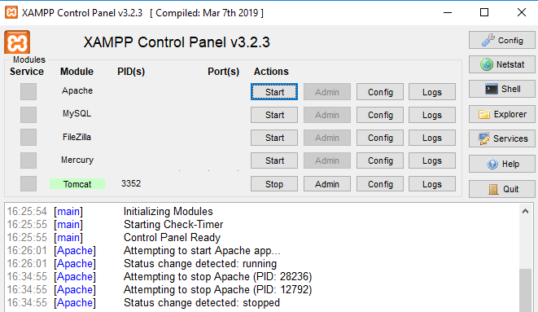

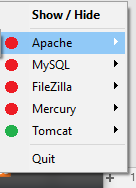

### 3.2. Crear los directorios o carpetas :

- Unidad B y L Disco

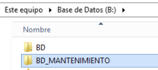 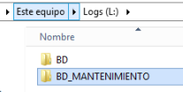

- Unidad R: ALMACENAR EL RESPALDO DE LA BASE DE TIENDA

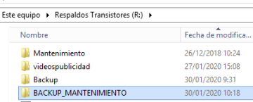

### 3.3. Obtener un respaldo de la base de Datos

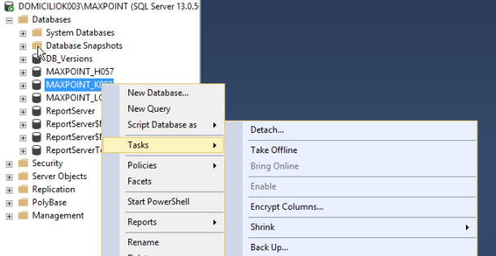

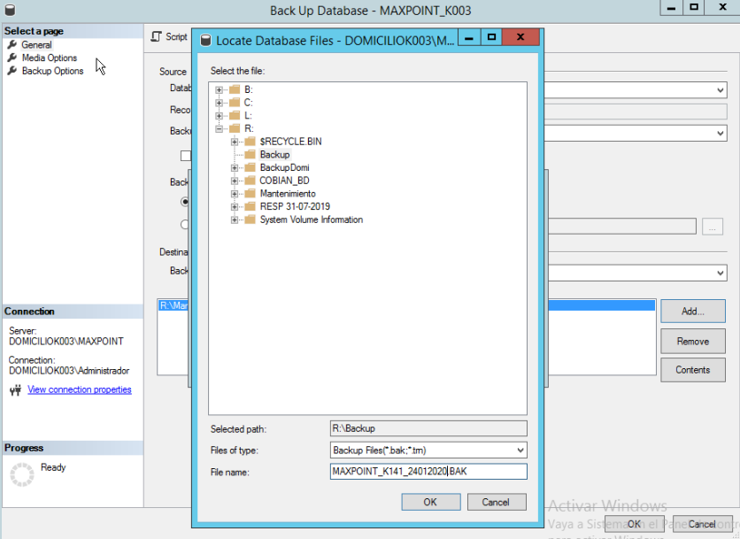
Estandar Unidad R:\ Mantenimiento
Nombre:Respaldo: Maxpoint_Tienda_FechaActual.back

### 3.4. Crear una base de Datos

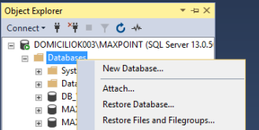

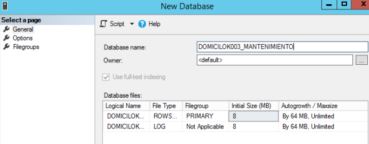
Archivos .mdf -> PARTICION B:\BD_MANTENIMIENTO \
 .ldf ->PARTICION L:\BD_MANTENIMIENTO \

 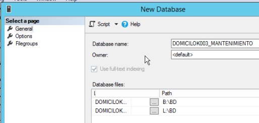

 **Crear la base usando la acción de OK**
  

  ### 3.5. Sobre la base Maxpoint_tienda_Mantenimiento Restaurar el backup obtenido
- Clic Derecho sobre la base a restaurar-> seleccionar Task->Restore
  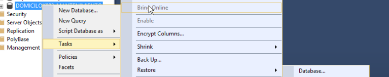

  Pantalla de Restauración de Base de Datos 
- Opción General

  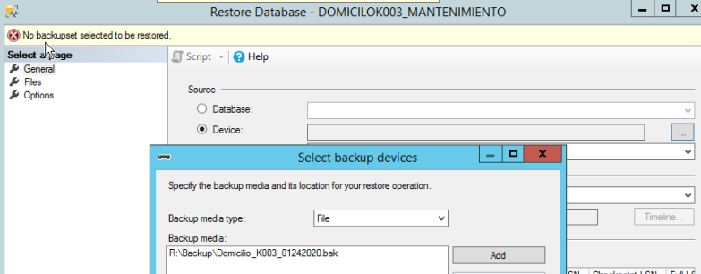

- **Opción Files** 
Validar que los Archivos .mdf y ldf se creen la ubicación con el nombre adecuado
  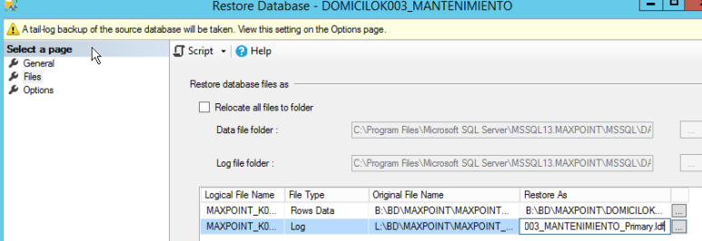

  - **Opción Options**

    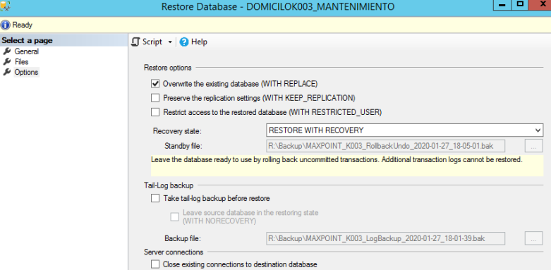

- **Regresar al paso 1**

    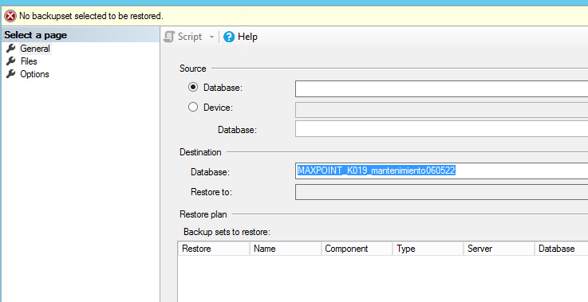

Aplicar la opción de Botón **OK**

### 3.6. Sobre la base nueva **Maxpoint_tienda_Mantenimiento**

- Ingresar Management Studio SQL ->Abrir una nueva área de consulta
- Copiar las siguientes líneas:

 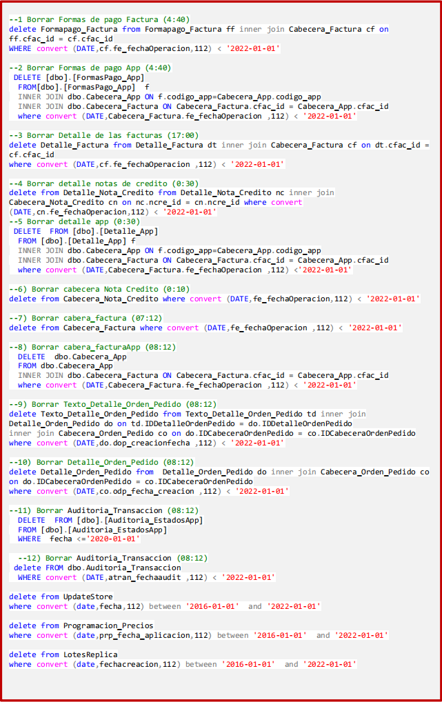

**->Ejecutar acorde el orden indicado**

### 3.7. Contraccion de Archivos de Base de datos

 

 ### 3.8. Renombrar Base de Datos

Sobre las bases de datos 
GO 
ALTER DATABASE NombreBaseActual SET SINGLE_USER WITH ROLLBACK IMMEDIATE
GO
ALTER DATABASE NombreBaseActual MODIFY NAME = NombreBaseNuevo;
GO 
ALTER DATABASE NombreBaseNuevo SET MULTI_USER
GO

**Paso1**
NombreBaseActual: **Maxpoint_tienda**
NombreBaseNuevo: : **Maxpoint_tienda_mantenimientoFechaActual** 
 
**Paso2**
NombreBaseActual: **Maxpoint_tienda_Mantenimiento** 
NombreBaseNuevo: : **Maxpoint_tienda**

**Ejemplo**

       --para base original

Use [master]
GO 
ALTER DATABASE Maxpoint_tienda SET SINGLE_USER WITH ROLLBACK IMMEDIATE
GO
ALTER DATABASE Maxpoint_tienda MODIFY NAME = maxpoint_tienda_fechacorte;
GO 
ALTER DATABASE maxpoint_tienda_fechacorte SET MULTI_USER
GO

--para base alterna
Use [master]
GO 
ALTER DATABASE Maxpoint_tienda_Mantenimiento SET SINGLE_USER WITH ROLLBACK
IMMEDIATE
GO
ALTER DATABASE Maxpoint_tienda_Mantenimiento MODIFY NAME = maxpoint_tienda;
GO 
ALTER DATABASE maxpoint_tienda SET MULTI_USER
GO

### 3.9. Cambiar ubicación de base reducida

Generar respaldo de la base que fue generada luego del mantenimiento

 

sp_helpdb [**Maxpoint_tienda**] 
ALTER DATABASE **Maxpoint_tienda** SET OFFLINE
GO

ALTER DATABASE **Maxpoint_tienda**
 MODIFY FILE ( NAME = ch_pruebas_mayo_Data, 
 FILENAME = 'B:\BD\Maxpoint\ Maxpoint_tienda.mdf'); 
GO

ALTER DATABASE ch_pruebas_mayo 
 MODIFY FILE ( NAME = ch_pruebas_mayo_Log, 
 FILENAME = 'L:\BD\Maxpoint\ Maxpoint_tienda_Log.ldf'); 
 GO 

ALTER DATABASE **Maxpoint_tienda** SET online
Ejemplo
sp_helpdb [**Maxpoint_tienda**]

 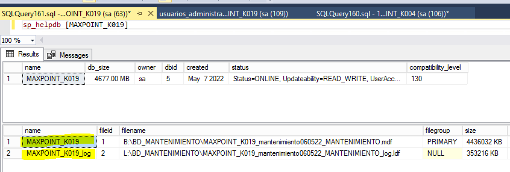

 ALTER DATABASE **Maxpoint_K019** SET OFFLINE
GO

ALTER DATABASE **Maxpoint_K019**
 MODIFY FILE ( NAME = **Maxpoint_K019**, 
 FILENAME = 'B:\BD\Maxpoint\ *Maxpoint_k019.mdf*'); 
GO

ALTER DATABASE **Maxpoint_K019**
 MODIFY FILE ( NAME = **Maxpoint_K019**_Log, 
 FILENAME = 'L:\BD\Maxpoint\ *Maxpoint_k019_Log.ldf*'); 
 GO 

ALTER DATABASE **Maxpoint_K019** SET online

### 3.10. Activar Servicio de Apache/comprobar funcionalidad con la tienda

 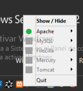

### 3.11. Pasar el backup de la base de datos que fue probado y restaurado en un archivo .rar Sitio de Ubicación

 \\192.168.100.250\g\Backup-MaxPoint\Tamanio_Bases

Ingresar a la Cadena y tienda respectivo
 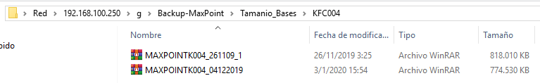

APROBACIÓN DEL INFORME

| Nombre    | Rol dentro del Proyecto | Firma |
|-----------|-------------------------|-------|
| Ana Jacho | Responsable de Proyecto |       |